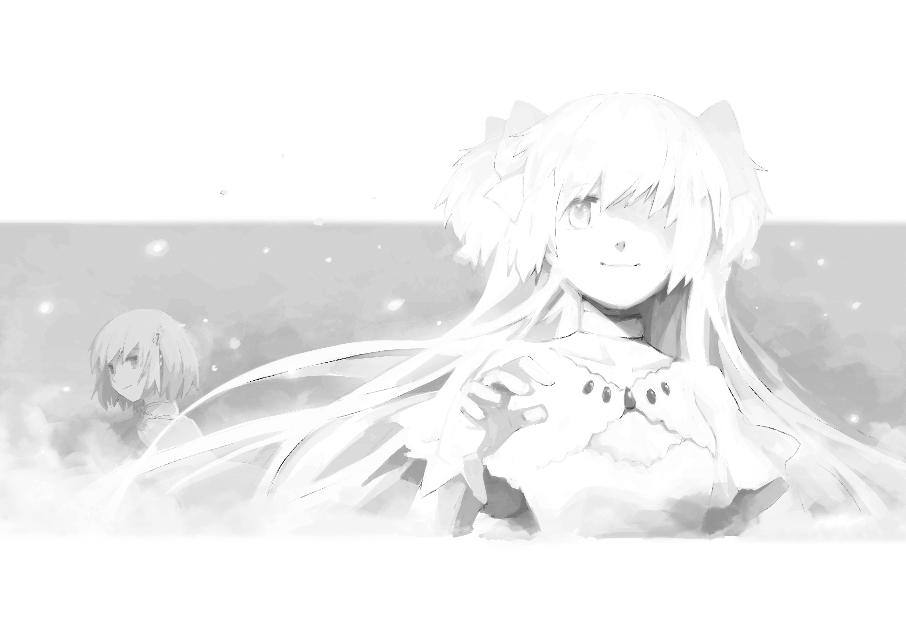
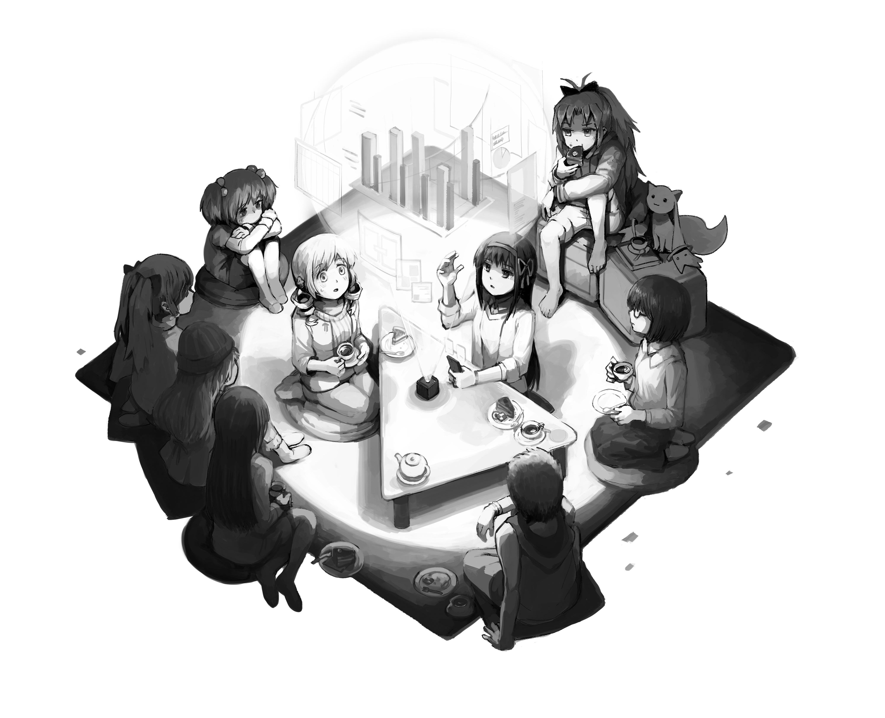
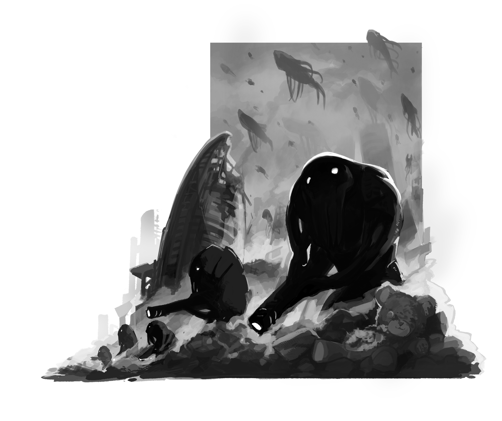

# 第三章 麻美观影记 上

在正式场合，执政体需要坚持以下立场：

1. 灵魂宝石能够引出少女灵魂的力量，但不是灵魂本身。
2. 灵魂宝石的能量消耗不会影响持有者的精神状态。
3. 为避免和以上两点造成矛盾，可以对事实进行其他的必要修改。

令人遗憾地，考虑到已经泄漏的信息量，我们预计上述方案将无法得到彻底执行。在此情况下，信息控制工作的重心将是契约年龄 (或以下) 的女孩。相关工作将交由相应的委员会负责，例如媒体真理委员会……

**——节选自《信息限制法案》**

 

尽管无数学者都为查明晓美焰的早期生活付出了巨大的努力，但它仍然是个学术界的难解之谜。在这一时期段，大规模的信息保存还没有成为惯例，且仅存的文件记录也在 22 到 23 世纪那混乱的‘统一时代’中遭到了破坏。长久以来，这种状况一直让传记作家们感到十分困扰。本文作者基于对早期遗失记录的复原，证实了晓美焰童年故居位于东京某处天主教收容设施的假说。本文的研究目的是……

**——石原友哉. 晓美焰童年故居的确切定位.《魔法少女历史期刊》**

---

当麻美走到电影院的时候，她的样子已经和刚才完全不同了。

她的伪装其实很简单。给头发下指令将发型改为自然下垂——不用亲手做头发真是爽——把灵魂宝石变形成一种比较少见的手镯形态，然后把自己的专车停在一个隐蔽地点，换乘一辆标准民用车。

要是能够套一件连帽大衣解决问题就完美了。

可惜，在人脸识别大行其道的当下，连帽大衣已经成为历史了。

所以，在走到电影院的路上，她往脸上粘了一个微型全息投影仪，借此把自己的外貌扭曲成了一个住在附近的其他人——长得有点像著名的麻美元帅，但明显不是本人。粘在手指上的另一个投影仪隐藏了花朵型的指甲纹 (另一个明显的魔法少女标志)。

很多人都知道她持有执政体颁发的个人身份伪装许可，但这并不影响这种扮装的效果。这种程度显然骗不过监控摄像头，但是用来误导路人们不经意的视线已经足够了。摄像头当然也很知趣，不会随便拆穿她。

她也考虑过，要不要选个漂亮点儿的脸，再换件衣服。她想象了一下自己身着华服从昏暗的街灯下步入灯火通明的电影院的感觉，最后还是放弃了。虽然她很希望偶尔能用 “这是麻美！” 以外的理由吸引到路人回头，但这种引人注目的行动太冒险了。

反正，这也就能满足一下自己幼稚的表现欲吧？她一辈子都没有谈过恋爱——她已经不敢计算具体的年份数字了——而且现在也不打算改变这一点。

所以她穿着和刚才完全一样的衣服进了电影院——衬衫配裙子，入时但不过分显眼。在她周围，成双成对的情侣们和成群结队的朋友们各自闲聊着，几乎每个人都穿得比她好。她有些郁闷。不无讽刺地，她穿得这么普通可能反而更加引人注目。

夜里其实很冷，她想着，查询了一下内置时计。六点半。

很久以前，在这种气温下人们会需要穿得厚一点，或者加一件外套。作为魔法少女，她总是特别留意这种事。当你发现了自己新身体的 “调节范围” 之后，很容易就会下意识地忽略掉气温的变化，然后走到哪里都穿着同一身衣服。

一提到这个她就会想起杏子和焰。由真当年的思考方式倒是更接近麻美自己，直到后来……

不过现在，每个普通人都可以同样地无视气温变化，她们也没必要顾虑这些了。虽然麻美仍然记得以前的事。

她站定脚步，欣赏着大厅里巨大的全息人像。

中间站着的是故事的主角，焰。她表情坚定，手中的弓箭燃烧着紫色的火焰。投影装置的设计使得无论你站在大厅何处，箭矢的方向总是正对着你。

在她右边的是战斗姿态的杏子，长矛摆着架势，身体半蹲，蓄势待发。作为传记作家们常常忘记的一个细节，杏子嘴里没有叼着任何食物，也没在身上揣着。

杏子背后是由真，脚边倚着大锤，仰望着虚幻的天空。她显得比其他人小一点，尽管这点年龄差距其实早就无关紧要了。

在她们上方浮着一团白色的雾气，雾里一名少女的身影若隐若现，对所有人敞开着自己的怀抱。这个细节倒是做得不错，而且放在这里也很合适，麻美心想。毕竟这是描写小焰生活的电影。就算没有别人相信她的女神，至少对她本人来说，她是真实存在的吧。

不出预料，小焰的左边是麻美本人，肩上架着一把火绳枪，身侧空中浮着另外两把。火枪瞄着虚幻的敌人，姿势显得很气派。

麻美不禁露出了微笑。在这个时代，后期的电脑特效足以把演员们的身材面貌搞得和本人一模一样，但导演总是无法克制把大家弄漂亮一点的冲动。从个人角度说，麻美记得杏子和焰从来没有把胸部搞到那么大过，不过转念一想，她觉得自己倒也没必要和这种服务观众的行为较劲。

电影业界的技术永远在更新换代。比如对于这个时代的演员来说，能够流利地使用所演角色的语言已经成了基本的职业要求 (毕竟这么做的难度已经大大降低了)。而非母语的观众则被建议使用自己的内置语言模块来进行辅助理解。当然，如果你懒得这么做，你还是可以切换到配音版，但这样做会降低影片的观感。

她努力克制住了接着欣赏自己全息影像的冲动，继续向前走去。这么做会显得可疑的。

她直接无视了 VR 区的入口。虽然作为现役军人她可以免费入场。

现实的魔法少女生活什么的，她已经体验得太多了。

她转而走进了普通的 3D 放映区。无数个放映室的入口围成了一个圆圈，中间是一个食品柜台。

食品是免费的，不过麻美没有点。她斗争着到底是要定一个单间，还是体验一次更加贴近群众的感觉,找一群人一起看。

突然，她发现自己正对面有另一位客人同样也站住了，短头发，标准的二十七岁外表，看起来也在犹豫。麻美和她对视了一眼，感觉自己或许找到可以一起看的人了。

但麻美正要开口的时候——

——另一个女孩出现在了她的身边。她看上去差不多十九岁。这也就意味着她真的就是十九岁。因为民间人的外表年龄最早也只能固化在二十岁后半左右。

“嗨，想加入我们吗，千都小姐？” 女孩友善地问。“我们的包间还有一个空位，而你看着有点寂寞，所以……”

出于礼貌，她称呼着麻美现在的脸所对应的姓氏。麻美没有戴着自己的脸，所以错了也不能怪人家。

麻美看了一眼身后招手欢迎的女生小团体，也挥手回应。这不禁让她觉得魔法少女们保持青春期 (或者幼女) 外表的习俗有点奇怪。当然，现在这个习惯可以让她们在战场上更容易辨认，同时也能减小自己的目标。但这一行为的根本目的，终究还是彰显这个群体遗世独立的特殊地位。

**永远不要忘记，没有外人可以真正理解魔法少女。**

麻美往后瞟了一眼，试图找到刚才那个短发女人，但她已经不见了。

**也许待会自己就会后悔的……** 但麻美还是点了头，“好的——”

**野田目理子**，姓名提示器告诉她。

“——野田目同学。” 她接着打完了招呼。

然后走过去加入了她们。

她心里把自己狠狠地嘲笑了一通。

我大概真的是看着有点寂寞吧，不是吗？她自嘲地想。而且我在这里装嫩的事情要是被杏子知道了的话……

她们走进了放映厅。

“你在这儿上学吗，千都小姐？” 女孩问。

麻美点了点头，尽管她并不清楚千都本人的情况。

“奇怪，我从来没有见过你。大概咱俩专业不同吧。”

系统识别到房间已满，关闭了她们身后的入口大门。她们走向自己的座位。

千都弘子是吧？麻美想着，把她伪装身份的名字印在了脑海里。毕竟待会要是一不小心露了馅儿就糟糕了。

这个时代的全息剧场其实相当的了不起，在挑战感官极限同时又不能触动官方的 VR 规制——那种服务只有在 VR 区花上一大笔费用才能享用。放映厅里使用了和入口的海报影像类似的手法，每个座位看到的都是导演指定的最佳视角。然后，作为执政体的一个小小让步，电影院可以通过 VR 接口来适当地调整观众的头部角度和眨眼时机。观众们可以选择拒绝，但导演建议不要在初次观影时这么做。

除了视觉享受之外，电影院还会向屋里输送对应的气味，向观众脑内的语音通信接口直接发送音频信号，并在必要的时候振动地面。墙上遍布的重力发生器和反重力装置随时准备着改变观众头部感知到的重力方向，但很神奇地，从没有观众因此摔过跤。

唯一的禁忌是不能用奇怪的方式玩弄观众的座椅——大家都不喜欢这样。

即便是在经济状况每况日下的现在，这个浪费资源的娱乐场所仍然力排众议地坚持着免费开放的立场。

厅里的主灯开始慢慢熄灭——这纯粹是一种怀旧主义的仪式——然后四周的墙壁上浮现出了各种画面。很快，画面浮出了墙壁的表面，在空气中凝聚成形，占据了麻美的全部视野。电影画面逐渐盖过了墙壁本身，周围的其他人，麻美自己的身体，最终甚至盖住了她自己的鼻子。她批准了放映装置对她内置音频接口的访问请求，然后管弦乐的声音马上在她的脑海里响了起来。七位身着希腊长袍的少女在她周围跳舞、嬉闹，接着她们的影像在眼前飞散，重组成了 "七美神科技" 的商标。

“x 的，每次都先要来这么一套。” 她左边有个看不见的男孩抱怨道。但另一个人让他安静了下来。

没给你放十分钟广告就不错了，麻美默默吐槽道。

技术上，隔绝掉其他观众的声音其实很容易，但设计者故意没有这么做。要是每个人都封闭在自己的空间里的话，约别人一起看电影还有什么意义呢？这种设计让你能够听到周围人的感受，比如 “噢～” 或者 “哇～”。不过超过这个长度的评论还是需要自重的。

和男孩的抱怨相反，电影很快就进入了正题——至少从麻美的过时标准来看是如此。唯一的停顿是让观众们选择是否同意电影院调整他们的头部角度。麻美选择了同意，准备按照导演选定的视角来体验这部电影。

然后麻美感到自己正在低头看着一条破旧的马路。路上铺着老式的石化沥青。马路周围的建筑显得颇为荒废。天上下着雨，她能听到雨滴打在伞面上的声音。

她听到了女人跑步的喘气声和马路上传来的脚步声。视野一边抖动一边沿路前进。麻美意识到她正在看着跑步女人本人的视野。

视线转向身后，但只能看见同一条马路延伸到远方。接着视线转而向下，看到了女人抱在怀里的东西：一个放在篮子里用布裹着的婴儿。就算在如此的混乱之中，婴儿仍然沉沉睡着，在梦里咬着自己的指头。

女人重新抬起了视线，显得有些疲累——她的速度慢了下来，而喘息声变得更加粗重。但目的地已经近在眼前了：一座天主教堂的后门。教堂倒是颇为干净气派，在周围的破旧建筑衬托之下，让人不禁眼前一亮。门牌半隐半现，只能隐约辨认出 “东京” 二字。

女人把婴儿放在了后门的台阶上。尽管刚才跑得很急，但她的动作仍然轻手轻脚，生怕碰坏了孩子。接着她拿出了一张被雨水打湿的纸条，颤抖着写下了孩子的名字。

麻美已经猜到了后面的发展，克制着自己翻白眼的冲动。

“焰。” 上面写着。

然后，她似乎犹豫了一会，在前面加上了：

“晓美。”

把纸条塞进篮子，女人抬头看着掉落的雨滴——放映厅在麻美脸上打了几个雨点作为强调——然后重新看向下面的婴儿，轻轻地把自己的伞靠在了墙上，为她挡着雨。

“对不起。” 她说。

最后，镜头切换。麻美发现自己向左看着女人的背影，隐约感到有雨点打在背上。女人呜咽着逃进了雨中。

视线重新转而向上，在篮子里看着上面为自己遮风蔽雨的那把伞。身旁发出了木门打开的吱呀声。

画面淡出。

这场景很感人，麻美想。但是编得有些过了。焰从没跟她们解释过为什么她的父母要把她扔在修道院，而且麻美觉得她自己其实也什么都不知道。这还没有考虑到父母早逝的情况，虽说焰没有这么提起过吧。

接下来的片头动画是典型的特效展示，带着观众飞过一片漆黑的太空，周围无数的画面在雾气中若隐若现：一块灵魂宝石，袭来的魔兽，焰展开白色双翼从空中跃下，麻美和杏子跟了上来，由真坐在地上吓哭了，焰在台上演说。最后，焰带着黑色扭曲的翅膀，眼中燃烧着熊熊怒火，如同雄鹰一般扑向四散逃跑的外星人坦克群。

接着，影片回顾了焰在孤儿院的童年生活，以及修道院的严苛规矩和宗教课程。童年的焰安静，内向而勤勉。她和小伙伴们玩耍，也有自己的朋友，似乎一切都和旁人一样，但仍然显得和周围的一切若即若离。

这部分大概还是符合事实的吧，麻美想，虽然很多是我们的猜测。焰从来不讲自己小时候的事，只是说自己在患病之前是个完全不同的人——但她对此有些怀疑。

“我不知道该怎么形容。” 一个修女摇头说，“但是这孩子肯定哪里有点奇怪。有时候，我觉得她好像在……等待着什么。这很可笑，对吧，但我实在找不到别的解释了。有时候，她看着窗外的样子……”

她又摇了摇头。

“而且她祈祷得那么……投入。” 她接着说，“要是换了别人，我只会纯粹地赞美这种虔诚，但她的样子……总是有点不对。”

“别怪她。” 另一个修女答道，“仰望天堂有错吗？这不就是我们所教的吗？她将来肯定是个有望的新人。”

然后，某一天，在捉迷藏的时候，她眼前一花，天旋地转，倒了下来。

同一天在医院，小焰睁大眼睛坐在床上，一时无法理解大夫在说什么。一身修道服的修女在旁边听着，明显已经有些站立不稳了。

接着是住院、服药、手术。小焰或是处于麻醉中，或是痛苦地挣扎着。修女们摇着头，念叨着也许她本不该来到这个世上的。

随着年龄的增长，她抛弃了原本的信仰，在修女来陪她祈祷时把圣经摔了出去，倒在病床上，痛哭失声。一位心理医生进来，把修女请了出去。

最后一次手术，她奇迹般地活了下来，康复出院了。而且她也已经到了要离开孤儿院的年龄。抚养她的修女们劝这位曾经的虔诚少女留在原先的教会学校，但她拒绝了，态度谦卑，却毫不动摇。修女们有些遗憾地叹着气，最后还是让步了。她们答应给焰找个寓所，给了她一份其它中学的入学表格，承诺每个月会给她汇一笔生活费，以及最后，表示希望她有一天能够回到上帝的怀抱。

出院的日子眼看着一天天临近了，焰一个人准备着，告诉自己这会是新生活的开始，已经不必再去等待什么了。

麻美悄悄点了杯冰茶，一边轻啜着，一边不无恶意地揣测是不是制作委员会里有天主教会的人。故事听起来不错，而且也大致符合麻美的记忆，但这一切都显得太过符合教会的利益了。而且，麻美想，教会孤儿院真的会做到这份上吗？有些细节很让人在意。

无论如何，焰从没有谈起过自己的出身背景，最多是简单地告诉其他人自己上过东京的教会学校。孤儿院的事是在别人追问的时候才提到的。至于焰对天主教的看法……连杏子都没敢问过。

焰转入了新的学校，然后发现自己太过乐观了。在一个人生活了这么久之后，她已经无法好好回应同学们善意的邀约，而保健委员的冷漠傲慢更是加剧了这一点。她看不懂黑板上的问题，也跟不上体育课的进度——虽然在这个时代的观众看来，体育已经是落后于时代的怪物了。总而言之，她觉得自己什么都做不好。

现在，电影终于进入了一个麻美可以直接验证内容真伪的时间带。谢天谢地，制作团队没有搞错所有的细节 (比如焰的眼镜和三股辫就做得恰到好处)。他们只是对所有的东西做了点儿艺术夸张，并且补足了一些她没有亲眼见过的内容。

而接着麻美本人就出现了。看着自己在电影里的出场镜头，麻美感觉有些微妙——她曾经通过记忆重放无数次地回味过这个场面。即便后来发生了许多许多，这一幕仍然深深地烙在了她的心里。

“就是她了吗？” 杏子的影像说着，从阴影中走了出来，身着制服。观众视角注视着杏子的背影，旁边一根立柱的投影从她的两肩之间斜切而过。杏子注视着窗外的操场。

“是的.” 电影中的麻美说着，穿过视点位置出现在观众席上的麻美面前，斜倚着窗户栏杆。

**丘比说她的潜质前所未有，** 麻美感应着。画面的焦点落在了她纹丝不动的嘴唇上——这是电影里表现念话的常见手法。

“说实话，看着可真不像。” 杏子说着，挥手撩了下头发。

“不要以貌取人，佐仓同学。” 麻美答道。“你懂的。”

“放任丘比这么做真的好吗？” 杏子说，“我已经有点同情她的处境了。”

**也许我们该劝丘比放弃契约。**

“没用的，佐仓同学，” 麻美一边说一边用一只眼瞟着杏子，“说得好像它会在这种事情上考虑我们的感受似的。”

杏子靠在了柱子上。

“我也知道，” 她忿忿地说，“就是说说而已。”

“而且我们现在确实需要人手。” 麻美说，“她看起来也是个不错的选择。”

**这不只是为了对付魔兽，也是为了让南方组侵犯我们地盘的时候能够有所顾忌。**

“这太蠢了。” 杏子啐了一口，“为什么她们就那么不合作呢？那帮狭隘的家伙！”

看着电影里自己的生活，麻美意外地觉得有点尴尬。电影拍得不错，每一个瞬间都捕捉得很到位，虽然细节上有些误差：杏子过大的胸部，还有在全玻璃结构的校舍里 (麻美明确地和编剧说明过这件事) 出现的立柱和阴影。

电影中的麻美微微笑了笑。这让现实中的麻美吓了一跳。

这可真是凑巧了。电影里麻美的反应和当时的她一模一样——而她并没有告诉过编剧这种细节。

杏子的台词让她不禁想起了她俩之间的故事。在杏子家里发生了 “那件事” 以后，麻美花了很大努力才制止了杏子过激的叛逆行为。然后又用了很久才连哄带骗地说服杏子回心转意，重新和她并肩作战。最后，在和南方组的某次 “冲突” 之后，杏子终于搬进了她家，并且重新开始上学。那时她终于意识到，杏子已经开始掩埋自己的伤口了。

**如果这样真能治愈她的伤痕就太好了。** 麻美心想。

“嘛，现在也只能这样了。” 麻美 (影像) 说，“也许以后我们能改变这一切吧。”

杏子重新转向操场。沿着她的视线可以看到在树影下面累得直喘的小焰。

“也许吧。” 她说。

“回去上课吧。” 麻美说，“我们出来这么久会惹人怀疑的。”

事实上，麻美是在上厕所的途中看到了操场上的焰，然后用念话把杏子叫过来的。不过这种细节就不必在电影里一一说明了吧。

杏子点了点头，然后她们一起走回了阴影里。

---

同一天的放学路上，电影中的焰一边走过一座桥，一边开始自怨自艾。

**我什么都做不好，** 她低着头，**我真没用！**

**为什么？为什么是我？为什么我要有心脏病？为什么世界上会有心脏病这种东西？为什么上天要这么对我？**

“我还活着干什么？” 她喊道，“如果我活着就是白费粮食的话，还不如死了的好！”

然后她看见了从桥对面走来的人影，毫无声息，犹如鬼魂。

“你是什——谁？” 她问，几乎发不出声。观众视角转到了焰本人的视点，从下方仰望着巨大的人形。

她自然没有等来魔兽的回答。只有几匹新的魔兽在它身旁的空中浮现。

焰呆立原地，不知是该和它们打个招呼还是该马上逃跑。

但是观众们自然知道。麻美周围的少男少女们情不自禁地发出了 “快跑！” 或者 “躲开啊！” 之类的喊声。

魔兽慢慢走近，焰吓得浑身发抖，观众们感同身受。

最后，三个魔兽抬起了头，光线开始在它们的顶端汇聚。焰终于缓过了神来，转身就跑。

然后赶紧收住了脚步，以免撞上身后的另一只魔兽。

接着魔兽们的光线击中了她。焰的整个世界变成了眩目的白色，耳朵里嗡嗡作响。观众们的听觉神经里如实地再现了这一点。

尽管如此，麻美还是充满期待地向前侧身。接着应该就是她本人的英雄救美……

可惜不是。

出现在小焰眼前的是一道模糊的白色人影，一个女孩，全身隐没在雾中，拥抱着观众的视点——也就是焰本人。身影带着一种奇幻的美感——特效师的技术真是不错。

观众们的视线回到了白色世界里的第三人称视点。

小焰站在那里，瞪大了双眼。

“对不起，我没办法让你活得更好一点，” 女神的声音透着空灵，“我做不到。但是我保证，将来我会补偿你的。你刚才问你人生的意义是什么。我现在可以回答你：你是我的使徒，你的命运是代替我生前的位置，守护我的牺牲所换来的这个世界。帮帮我，好吗？”

组成她的雾气开始消散。当小焰喊出 “等等！你是谁？” 的时候

——她已经消失了。

突然，世界一片嘈杂，焰——也就是观众们的视角——发现自己躺在地上，看着空中混乱的一幕。

古典风格的火绳枪在空中开火，周围的魔兽在爆炸中崩溃。在这一片混乱的中心，一红一黄两个人影来回穿梭，飞速地撕开了一个又一个魔兽的身体，只留下一片残影——这种速度下一般人应该只能看见残影吧，麻美想。

这一幕做得很精彩，但在麻美眼里毕竟比不上**真东西**。

不过她还是情不自禁地融入了气氛。尤其是当电影中的麻美喊出 “Tiro Finale!”，用大炮将最后的魔兽们一扫而空的时候，她好不容易才忍住没有跟着一起喊。

虽然喊出来可能也没有什么——很多人都这么做了，尤其是男生们。

对男生们来说，魔法少女电影属于一种背德的乐趣——这基本上就是一部动作片，但毕竟只是 “基本上”，你还是可以约女孩子出来一起看的。

现在激烈的一幕终于结束，麻美可以回顾一下她刚才看到的东西了。

虽然麻美总是旁敲侧击地想要打听小焰相信女神的理由，但她从来没有正面解释过。用她的原话说：

“反正我说了你也不信，为什么还要自作多情地解释呢？”

对于编剧写出的推测，麻美倒是并不介意。反正他们总得写点什么。

噢，马上就要到精彩的部分了。

麻美刻意地忽略了她和杏子向小焰解说魔法少女系统的那一段。还有杏子告诉焰她也有潜质的部分。这些话她早就听够了。

观众的视角再次变化。现在已经能清楚地看到小焰发型的变化了：不知为何，在见过 “女神” 之后，她的辫子散了下来。在现实中，焰从来没有解释过她换发型的原因，她们也没有问过。当然，杏子和麻美私下里都觉得新发型比原来好看不少。

电影中的小焰甚至没有注意到自己的变化。

**现在，你准备好许愿了吗？** 丘比问。这是它的首次出场。

小焰咽了口唾沫，紧张地扶了扶眼镜。

**我有迟疑的必要吗？** 她心想。当然，观众们都能听到她的心声。**我刚刚见证了神的启示。没有比这更好的指引了，不是吗？我不是一直在问自己我的人生使命是什么吗？现在我终于明白了。**

“我要守护这个世界，” 她说，声音几不可闻，但随即坚定起来，“无论发生什么，我都要守护上帝所遗弃的这个世界！”

麻美在座位上瞪大了双眼。

这些年来，麻美和杏子从没告诉过别人焰许愿的内容，这部电影自然也不例外。她们坚持让编剧自己编一个愿望，因为她们是绝对不会说出来的。

而编剧们猜得很准。

她当时就已经意识到了，这是一个相当大胆的愿望。在她认识的所有少女里面，小焰是唯一一个许下了这种规模愿望的人。

这也是麻美和杏子相信焰没有彻底消失的理由之一。她的愿望不会允许她这么做的。

在小焰手上，灵魂宝石戒指突然出现。观众们从小焰的视线注视着它。麻美下意识地惊叫——虽然她其实早该意识到的。

“这不对——” 她好不容易才刹住话头。

她忘了电影都是要通过审核的。

“怎么了，千都同学？” 旁边的女孩问道。虽然互相看不见脸，但声音的距离显示她正在转头对着麻美。放映厅不会阻止你操作自己的颈部肌肉——它也没有这个权限。它只是会在必要的时候帮你转头。不过现在的观众在看电影时通常会下意识地放松自己的颈部。

“没什么。” 麻美说，保持着面对前方的姿势，“我没事，就是有点，呃，困惑。”

戒指在焰的手掌上变成了一枚宝石，上面刻着象征她灵魂的四角星标记。

“这块宝石会引出你灵魂的力量，让你能够施展魔法。” 丘比说，“但是我得提醒你，过度使用的话你会有生命危险的。然后，悲叹立方的事就拜托她俩跟你解释了。”

**放屁。** 麻美想，然后被自己脑海里的脏字刺激到了。

虽然孵化者们都是一群擅长刻意误导他人的滑头，但它们从来不会在这种事情上有所隐瞒。它们总是说得很明白——宝石就是你的灵魂本身。而且它们也从来没有用过 “你会有生命危险” 这种模棱两可的说法，它们说的始终都是明确的 “你会死”。

当然，电影审核肯定会干掉这种内容的。至少在这部电影里，丘比的台词内容都是绝对的真实。

有时候，麻美真的很不喜欢这种 “文宣工作”。

**别激动，巴小姐。** 她心想，没必要跟娱乐业太认真。

在接下来的几幕中，她不得不时刻提醒自己这一点。编剧们着力描绘了小焰的最初几场战斗，画面十分精彩，但和麻美的记忆完全不同。首先，小焰一开始的战斗水平没有**那么**烂，而且她也没有在用自己翅膀飞的时候晕过机。还有，虽然电影夸张地描绘了小焰找到自己核心能力的过程，但现实中她其实一开始就知道那是什么。最后，她们的学校从来没有遭到过袭击，但编剧们还是加入了这个桥段：她们三人帅气地屠杀着魔兽，同时还不时地借助瘴气在同学面前隐藏自己的身份。

这不是他们的错，麻美提醒着自己。她们没有解释过这种细节，所以编剧们也只有自己随便写写。

然后是一段催泪的感情戏：电影中的麻美向另外两人倾诉自己有多么的孤独，有多么想念逝去的亲人。对现实中的麻美来说，这一段实在是尴尬了点。她很庆幸别人看不到自己的脸。

很显然，所有人都知道她当初许愿的内容。毕竟在对愿望的保密成为一种习惯之前，那就已经是人尽皆知了。麻美本人其实也没有觉得这有多么私密。

为了转移注意力，麻美回忆着焰的魔力结界。这是她的核心力量，曾经无数次地拯救了她们所有人。简而言之，焰的结界可以减缓她周围所有人的灵魂宝石污染速度。附在天赋魔力本就不错的麻美身上的话，可以让她能够随意地召唤大量的火绳枪而不必顾忌魔力消费。在以前和南方组的对战之中，这简直就是救命稻草。

伟大的愿望带来伟大的力量，她想。

最后，第四名魔法少女——沙耶加出现了。这一次，相貌上颇有些……违和。毕竟，制作团队可用的参考资料就只有杏子提供的 “不知为何还留着的” 一张老照片，再加上一些褪色了几百年的记忆重构。显然，最终效果并不是太好。

电影快速跳过了她的生活。这和主线无关，而且其实麻美和杏子都没能真正搞清楚当时发生了什么。她喜欢上了一个男孩，然后在他的某一次演奏比赛上，她透支力量和魔兽作战，结束了自己的生命。这就是她们所知的全部内容。不过在最后的几周里，杏子说她还是能感觉到沙耶加身上发生了什么事情。

荧幕中的杏子没有对沙耶加表现出任何特别的兴趣。这也是她们觉得没必要告诉编剧们的一个细节。

在这一幕的最后，沙耶加的身体消散在了空气中。

**这都能通过审核啊。** 麻美想，不过……好像确实也没什么。

然后就是 “那个事件”。

观众们转换到了小焰的视角。

她看见沙耶加的灵魂出现在了刚才身体消失的位置，向她笑了笑。在她周围，麻美、杏子和正在消散的瘴气都凝固在了空中。整个世界都显得有点模糊，如同云遮雾绕一般。

焰向她的灵魂伸出了手，接着白雾组成的少女身影在沙耶加背后现身。焰倒吸了一口冷气。

雾中的少女拉起沙耶加的手。两人相互点了点头，接着蓝发少女的灵魂就消失在了雾气中。

“我做到了。” 焰终于鼓起了说话的勇气。

白雾中的少女转过身，飘了回来。

“你是位女神，对吗？” 焰说，“请回答我！”

“谢谢。” 女神答道，飘得更近了一点，“我无法直接回报你为我所做的一切，但我可以送你一个小礼物——从前的记忆。”

焰眨了眨眼。

“什么——”

女神抚摸着她的前额。

万花筒般的景象在观众们眼前闪过。小焰在奔跑、欢笑、和朋友吃饭。明显可以看出来是另一个世界的景象，但是恰到好处的暧昧表现让人们无法分辨她具体在做些什么——毕竟，谁都不知道真相到底是怎样的。

最后，观众们的视角回到了焰的掌心，注视着上面悄然出现的红色缎带。麻美正在向同伴们解释着 “圆环之理” 的事。

焰忍不住哭了出来，其它人都看着她。

“我的女神。” 她哭道。

接着荧幕淡出。

当然，这也是编剧们的自由创作。作为主要情报来源的麻美和杏子并不知道那天到底发生了什么。唯一明确的事实就是从那天开始，焰的性格发生了巨大的转变。她开始谈论她的女神，言谈间开始时不时地冒出 “前世” 的内容……还有其它各种各样的疯狂行动。算了，反正这次的主角是她，不是麻美。

看到下一幕的开场，麻美点了点头。

镜头转向了一个十岁出头的少女，比其他的出场人物都显得小一点。在一个空旷的十字路口，她从一辆公共汽车上走了下来，表情有些局促不安。她紧紧攥着一张纸条，上面写的好像是一个地址。

由真。

她咽了口口水，然后开始沿街前行，最后来到了一栋公寓门前。按照设定，这应该是麻美以前的住处——虽说外观完全不对吧。由真开始上楼。

“你想干什么？” 画面外传来了杏子的质问声。

由真不禁哆嗦了一下。

一身红色的长枪少女在空中翻了个跟头，落在了瑟瑟发抖的由真面前，长枪指着她的脑袋。

“我们的地盘不是你想来就来的。” 身后传来了麻美的声音，“我可以把这看成是一种挑衅吗？”

“我懒得再陪你们玩了。” 杏子说，长矛前刺，把由真逼下楼梯，“告诉你的主人，别再派小女孩儿来找我们麻烦了！”

焰出现在了杏子身后。

“怎么了？” 她问，“她来这儿干什么？”

“她是南方组的。就是我们跟你说过的那个。” 杏子愤愤地说，“上次狩猎魔兽的时候袭击我们的那群家伙。”

“不是，求求你们了！” 由真在楼梯上跪了下来，哀求道，“我不是主谋！我是最小的，我不敢反抗她们的命令！”

她捂着脸，放声大哭。

“她们都死了！” 她说，在喘气的间隙说着，“我一个人根本无路可走，但我认识的魔法少女只剩下你们了！我现在连个住处都没有！”

杏子退开两步，把长矛收到一旁，表情一下子缓和了下来。

“我们得承认。” 麻美说，“以前打架的时候她的确没有那么积极。而且她还这么小……”

“要是撒谎我可饶不了你。” 杏子说。

“我没撒谎！” 由真看着杏子说。满是泪痕的脸带着祈求的眼神。

“我觉得应该给她个机会。” 焰偏了偏头说。长发随着头部的动作滑了下来。

“我觉得有点可疑。” 杏子说，“我可不会这么容易就接受一个曾经的敌人。”

“我倒是有个建议。” 麻美说。

她们转过来看着她。她向由真伸出了一只手。镜头在麻美、杏子和焰之间来回切换，表示她们之间正在用念话讨论着什么。但这次观众们没有听到会话的内容。

“你叫什么名字？” 终于，麻美开口问道。

“千——千岁由真。”

“那么千岁小姐，请把你的灵魂宝石交给我吧。”

她浑身一颤，下意识地把手上的戒指护了起来。

“为什么？我不会放弃我的魔力的！”

观众席上的麻美翻了个白眼。说是放弃魔力倒也没错……但这毕竟不是重点。审核……

“就当是个保险。” 麻美说，“如果你说的是真的，那恐怕就得马上把你们原来的地盘纳入我们的巡逻范围了。我建议咱们现在就去侦察一下。只要你没说谎，应该就不会有人来袭击我们吧。作为保险，途中我会帮你拿着灵魂宝石，在确认了情况之后再还给你。”

由真摇了摇头。

麻美的表情缓和了下来。

“再考虑一下吧。” 她说，“如果想让我们接纳你的话，你得先信任我们。我不想怀疑你，但我们需要证据。已经发生过太多事情了。”

由真环顾四周，有些不知所措。可是所有人都露出了一副微带同情，但又不容置疑的表情。虽然焰脸上同情的成分更多一点吧。

最后，她点了点头，褪下戒指交给麻美，然后所有人一起离开了公寓。

麻美点头的意思并不是在赞赏这一段的真实性。事实上，这个故事从头到尾都是瞎编的，在真实世界里完全没有发生的可能。造成这种状况的原因并不是因为缺乏信息、过度夸张、或者是为了通过审核——真正的原因是杏子、麻美和由真事先串通好，一致提供了虚假情报。

她点头是因为这个谎言已经开始向公众扩散了。

由真的真实故事其实比这精彩得多，但那还是不要让太多人知道为妙。

---

几次转场之后，电影做了一次时间切换，“十年后” 的大字出现在了她的眼前。

场景回到了麻美的房间，但陈设显得有点不同。房间的主人明显没换，不过家具的摆放和门的位置都不一样了。麻美知道，这是制作人员的一种表现手法——高中毕业几年之后，她们不得不搬了次家。

这背后自然有种种原因。一个问题是邻居们开始逐渐对麻美小姐和她奇怪的朋友们产生怀疑：高中毕业，但是没上大学、没有工作、也没有男朋友。房间一天到晚都有不同的女孩进进出出，但从来见不到她们的家人。

压垮她们的最后一根稻草是她们的隔壁邻居——一位善于照顾别人的好大婶。这天晚上，大婶到阳台上透气，然后发现隔壁的阳台上，杏子身受重伤，正被麻美抱在怀里。杏子腹部的伤口只是用缎带简单地捆了一下，还在不停地往外流血。

大婶出现的时机很是不巧——麻美刚从房顶上跳下阳台，而由真和焰也是则刚从城市的另一头狩猎返回。那时已经来不及采取什么行动了，而且第一要务毕竟还是先把杏子治好，而不是跟目击证人解释什么。

麻美仍然记得那天晚上大婶脸上的惊讶表情。但她当时的反应只是说了句 “别告诉别人”，然后就把杏子抱进了屋里。

这种情况下，大婶显然是要告诉别人的。虽然麻美特意跑过去求了她一趟，但她还是坚持着没有取消那个紧急呼叫。最后，当救急医疗队和警察赶来的时候，他们看见的是床上睡着的杏子和一旁慌张的由真，但杏子睡得很稳，身上已经没有明显的伤口了。一旁的麻美和焰则在笨拙地擦拭着地板上的血迹——她俩的魔法技能在这种清洁工作上都不怎么管用。

最后她们编了个颇为荒诞的借口，勉强混过了警察的盘问。但显然这里已经住不下去了。

焰扮作自己的母亲，在城市的另外一角租了个新房间，然后她们花了两个礼拜把所有东西搬过去——大型家具都要靠焰在深夜空运。整个过程中她们都把自己关在屋里，希望别人不要注意到她们正在快速减小自己的外表年龄。

最后某一天，她们悄然离开了原来的住所，并且在不改变身份和不离开地盘的前提下尽量清除掉了自己的一切痕迹。在进入新住处的时候，她们又变回了十来岁少女的外貌，既是为了防止被认出来，也是为了利用新邻居们的同情。

有很多事情值得怀念，但是麻美可不想再回到以前那种需要费尽心机保持秘密的日子。

当然，迫使她们搬家的还有另一个原因。而这一点也在电影里很好地表现了出来：破旧的家具，桌上的劣质红茶，以及减小的房间面积。

直说的话，就是钱的问题。她们都没有收入来源。教会在焰二十岁时断了她的生活费。麻美家人留下的钱虽然不少，但同时供养四个人也开始显得拮据。她们尝试过在商店街打打工什么的，但是她们最后还是渐渐沦落到了要靠杏子抢劫取款机来维持生活的地步。她们完全无法维持一份稳定的工作——需要不定期地离开岗位和魔兽作战，无法保证按时睡眠，外表年龄和户籍不符……

而这也正是电影中的她们所谈论的话题。

“作为最后的议程，我有个还没讲到的问题想和大家讨论一下。” 焰说，吸引了在场所有魔法少女的注意力，“未必要有具体结果，只是提供一些思路。这些天大家已经看到了彼此合作能够带来的种种好处，昨天我们也已经敲定了主要的实行细节。但我还有个大有希望的想法没来得及说——”

那是一个特殊的周末。见泷原四人组召集了市区和近郊另外五个魔法少女组合的代表，一起开会讨论合作计划。一直以来努力做出的友善姿态，基于私人关系的合作尝试，加上魔兽大爆发时的共同作战，种种因素将近十年的积累，终于让她们走到了现在这一步。

在总喜欢搅混水的南方组消失以后，见泷原地区的整体氛围变得友善了很多。

五位代表的身体年龄、发型和衣着品味各不相同，凑在一起显得颇为混乱——其中一个人居然还戴眼镜。她们和见泷原组合的另外三人挤在矮桌旁边，不无兴趣地看着墙上的投影。桌上的盘子里放着颜色诡异的饼干和巧克力蛋糕，旁边还有几杯没有碰过的茶水。焰对着墙上的幻灯片比划着，旁边是一部崭新的全息投影仪。丘比蹲在旁边的猫架子上默默看着这一切。它在会议开始的时候已经确立了自己的见证人身份。

“——也就是一起赚钱。” 焰说，一边比了个手势。墙上的影像变形重组，构成了日元符号的各种变体。一位听众情不自禁地笑了出来。

“赚钱？” 一个长发齐腰的女孩重复道。

**康弘**，麻美回忆着她的姓名。

“没错。” 焰在台上踱着步，一头长发跟着飘来飘去，“如果我们的资金能够宽裕一点的话，我前两天就不用冒险去偷投影仪了。而且我们也可以来点提拉米苏之类的，而不是吃这些鬼才知道是什么的东西。让我们面对现实吧，大家手头都挺紧的，不是吗？”

她环视周围，所有人都点了点头。这是每一名魔法少女都要面对的现实。除非你足够走运，队伍里恰好有个大小姐。

焰切到了下一张幻灯片，上面列出了魔法少女找不到正式工作的各种原因，还配有相应的搞笑图片。

“我们无法从事正经职业的根本原因就是无法向别人解释的‘紧急状况’。” 焰说，伸手指着幻灯片里的对应条目，“旷工和旷课完全是两个不同的概念。哪怕是送报纸这样的蠢事，也是一天不做就会被开除。当然，我知道大学组——”

她对着戴眼镜的女孩点了点头。**黒井**，大学组的代表。

“——自己开了一个小吃摊。但是不按时开张的话顾客们也会抱怨的，不是吗？你想买点吃的，但是每四天里就有一天，整个摊子都不见了！”

“嗯，他们总跟我们抱怨。” 她说，“我们只有靠降价来吸引客人，根本赚不了什么钱。”

“她们的想法不错。” 焰说，下意识地前倾身体，“没有老板的话，你可以任意决定自己的工作时间，但是客户们还是希望在有事的时候能够找到你。只有三个人还要狩猎魔兽的话，根本维持不下去。”

“但是新的合作计划实施以后，我们就有足够的人手了，你是这个意思吧？” 旁边的爆炸头少女说。**田中**。

“正是如此。” 焰指着幻灯片说道，“按预测的作战能力来看，我们应该可以保证随时留个‘看摊儿的’。而且我已经想到了一门比小吃摊更有前途的生意，能够发挥我们的特殊技能。”

她又换了一页。这一页的标题是 “见泷原急便”。

“考虑到我们每天的巡逻，大家反正总是要在市里跑来跑去的。” 焰说，“我们在市区的行进速度超过任何通常的交通方式，而且我们已经对见泷原的每一个阴暗角落了如指掌。在这基础上开个电话热线送送包裹，赚钱应该不成问题——我们可以做到比谁都快。也许我们还可以顺便加上跑腿服务什么的。”

所有女孩都用怀疑的眼神看着她，这也包括她的三名队友。她们之前也没有听焰说过这件事。

焰有些慌张地挥了挥手，再次换了页。这一页列出了一些财务数据。

“那个，” 她说。“我估算了一下——”

“晓美同学，现在讨论这个合适吗？” 麻美说。“我的意思是，大家跑了这么远讨论结盟的事，你居然还要忽悠别人做生意。”

说得没错。片子里甚至提到了可以利用的减税政策。

这就是小焰最可爱的地方，观众席上的麻美想到。她在这种细节问题上总是喜欢钻牛角尖。电影表现得不错。

“好吧，我承认这听起来有点扯，” 焰害羞地背过脸去，“但是我真觉得这主意行得通。”

她摆弄着头上的缎带。她一紧张就会这么做。

“嗯，我倒是觉得这听起来不错。” 黒井说，“大家面对现实吧。我们都挺缺钱的。”

大家转过来看着她。几个人若有所思地点了点头。

“而且这可是挺大的一笔钱啊！” 另一个长发女孩也在一旁帮腔，“只要这个数儿没错的话，我就可以买到一直想要的那个包包了！”

千代兴奋地抱住了自己的身体。毕竟她是这里最小的女孩 (按实际年龄算的话)。

**这在逻辑上应该是行得通的。** 丘比发出念话，第一次站出来发言，这也让几人都吃了一惊，**虽然最终成功与否还要取决于你们的执行能力，但我们对这个理念已经很感兴趣了。**

她们盯着它，一时无言。最后焰清了清嗓子，重新吸引了所有人的视线。

“总之，” 焰说着，又换了一张片子，脸上的表情混杂着刚才的害羞以及得到丘比支持带来的自信，“以上这些只是一个初步的建议。关键是，通过彼此的合作，我们可以做到各种各样类似的事情。只要我们能够找到一个切实可行的赚钱路子，我们就不必再仅仅为了果腹而染指盗窃，也不必再继续这种无业游民的生活。”

“未必一定要用我这个方案，” 她接着说，再次前倾身体，“什么都行。考虑一下吧，新的生活正在向我们招手。不用再去砸取款机的生活。谢谢大家。”

焰再次挥手，幻灯片进入了最后的黑屏。

她坐回了下面自己的位置。

杏子站起身走到刚才焰演讲的位置，看着其他人。

“我说大家，我已经厌倦了以前那种孤独作战的生活。我也厌倦了因为地盘而吵架，还有各种鸡毛蒜皮的冲突，” 杏子说，“现在正是一起改变这一切的最好时机。也许之后我们就可以给自己找点休息时间，然后买个她 x 的包包了！现在先别管小焰的疯狂计划了。我们已经谈了整整两天了！你们很快就得走了，所以会议到此结束。同意结盟的人表个态吧！”

少女们面面相觑。

“我同意，” 黒井说，“这还要问吗？能走到这一步我已经很开心了。我会加入的，而且我觉得我们组其他人也会同意的。”

“也算我一个。” 康弘说。

“要是不想加入的话我根本就不会来。” 田中说。

剩下两个人也各自表示赞同。

“那么，” 焰一边说着一边从电视机上拿下来一沓纸，“让我们举行最后的仪式吧。大家已经达成了一致，现在要把所有东西落实到一个书面协议了。刚才我已经把前两天讨论的内容总结了一份，并且打了出来。”

她把协议书放到了面前的矮桌上。

“我还是觉得没必要，” 田中说道，胳膊肘拄着膝盖，“为什么非得搞这种傻乎乎的形式主义呢？”

“我说，” 黒井答道，“这样的话，以后大家就都不能拿忘记内容当借口反悔了。我们已经讨论过了。而且丘比也觉得这是个好主意。”

“名字太土了，” 旁边的短发少女 (**高良**) 说着，一边翻看着文件，“**魔法少女行会**。我还是觉得我们应该想个更帅的名字。”

“至少贴近实际。” 焰耸了耸肩说。

她对着其中一页纸上的空白处比划了一下。

“总之，在这里签字吧，然后我出去给每人复印一份。最后再交换一下联络方式就大功告成了。下周我们可以继续讨论巡逻班次，还有悲叹立方的汇率问题什么的。”

“我再去泡点茶。” 麻美说着，拿走了桌上的茶壶。

少女们拿起笔，在最后的横线上签了字。

**每次想到这里我都觉得不可思议，** 麻美想，**我们当时真的没有意识到自己到底在干什么。**

这沓纸，包括后面的签名，现在已经放在了行会总部办公楼的真空展览箱里 (位于见泷原市)。

而见泷原急便呢？它后来成为了行会旗下最有价值的公司之一，直到在经济改革中自然解散为止。毕竟谁都很难竞争过一个偷偷用传送魔法送快递的公司。

麻美靠在座位上，一边嚼着送来的巧克力，一边看着接下来的一幕幕。行会从一个市内团体的合作协议，慢慢发展到了全县范围的正式组织。接着成立总部，把全日本的类似组织纳入伞下，然后在太平洋的两岸建立了支部。最终，几乎所有在世的魔法少女都成为了行会的一员。

在发展的每一步上，都有首席执行官晓美焰的身影。她在握手、演讲、开会。她的独创思维和领导才能支撑着行会的逐步扩张。在她身边，几乎总能找到富有人格魅力的杏子，善于沟通交涉的麻美，以及——后来才发现的——精通权谋心术的由真。

很可惜，编剧们对这段历史只能简要略过。这里面跳过了很多有趣的故事——以及数百年的时间。

不过麻美可以理解这一切。首先，这段历史充斥着阴谋权术，就算有几个小时也讲不清楚。毕竟大多数的观众其实只是来看故事和动作戏的。其次，大部分——错了——绝大部分的精彩段子都是保密的。她们三个人——麻美，杏子和由真——异口同声地拒绝了编剧们打探消息的所有企图，以至于他们根本没有得到什么值得发挥的内容。

所以这只能怪她们自己。但麻美还是觉得很可惜。也许将来某一天，她们可以公开谈论这一切吧。

---

电影即将达到高潮。

一开始是人们耳熟能详的影像记录，来自二十年前的奥罗拉开拓区，第一个遭到攻击的人类殖民地。

最初的征兆是出现在星际网络上的混乱报道：轨道上的不明飞船，空中的可疑流星，得不到回复的通信尝试。

气喘吁吁的记者们向坐在家里的观众们播着新闻。

最初的爆炸和恐慌，平民的惨叫：当时的紧急模式安装包无法给他们提供作战能力。

监视摄像头拍下的镜头：外星无人机布满天空，章鱼状的外星士兵用作战装甲的四条前足拿着激光武器，就像是恐怖片。

无人机和士兵都在随意开火破坏着四周的一切，用肆意的杀戮宣示着自己的力量。而最可怕的一点就是：这样的粗暴屠杀其实是毫无必要的。它们轨道上的飞船可以轻易地抹平地表上的一切。对于奥罗拉殖民地这种新建星球，这其实不费吹灰之力。

还有从混乱的通讯记录和烧焦的废墟中翻找出来的残破画面。

一个小女孩坐在父母的尸体旁边，抱着带有内置摄像头的泰迪熊失声痛哭，而后被一旁出现的无人机无情射杀。

本地大学的学生们，对着其他星球上的亲戚们说出自己的最后遗言，然后向着外星人进行了最后的无望冲锋，带着临时改装的车辆和机器人，匆忙生产的小型枪械，研究室里搜出的实验用品，以及必死的勇气。

所剩无几的军用船只在轨道上尝试组织撤退——然后被一艘一艘地炸成了太空碎片。

最后，没有留下哪怕一名幸存者，包括现地驻扎的魔法少女。

第二次进攻的结果也差不多。

当外星人来到阿特拉斯殖民地的时候，它们发现人类已经开始积极备战了。它们看到了轨道防御平台、城市防卫系统、带有反物质武器的商船、少量的地面驻军，全员植入了作战程序的平民们，以及可以生产武器弹药的家用合成器。

靠着现代的纳米制造技术和直通大脑皮层的学习程序，人类仅花了一周时间就完成了这一切。

但是这些都没能起到什么实质作用。

防御平台和太空船只是在外星舰队的阵列上打出了一个小坑。而驻军和平民们的努力作战也只拖延了它们几天的时间。外星人还是故意没有进行任何的轨道轰炸。

不过这次，它们开始认真地选择攻击对象，而不是随意开火了——虽然它们的行为逻辑仍然显得不可理喻。它们有时会大费周章地杀死一个婴儿但放过一旁的大人。或者杀死四人小队里面的三个人，然后放过第四个，尽管最后那个人一直在朝它们开火。没有任何人能从中找到什么规律。

这次有很多幸存者。而且不知为何，外星人放过了撤离的船只。

这就是它们的错误。

影像记录到此结束。镜头聚焦到了一个少女身上。她和另外五个人紧紧地挤在一艘难民船的货舱里。人们的神情恐怖而焦虑，有人抱着孩子，有人默默祈祷，有些人绝望地认为这艘船即将被外星舰队撕成碎片，麻木地等待着死亡的来临。

女孩紧紧地攥着手上的戒指。

她的灵魂宝石。

场景转换，麻美不禁坐了起来。“魔法少女行会：紧急全体会议” 的大字在她眼前闪现。

然后不满地哼了一声。

**好吧，我就知道他们会跳过这一段的。** 她想。

景色变换，麻美发现自己正坐在一个巨大的虚拟剧场正中，周围密密麻麻挤满了魔法少女的虚拟形象。

这也是一种技术手段。按照麻美的亲身体验，在每一名参与者自己的视角里，她都处于剧场中最好的座位上。而且实际参会的人数远大于现实中任何一座剧场的最大容量，这就是虚拟现实。行会的技术人员帮助成员们规避了执政体的相关限制。

剧场中心的舞台上装饰着行会的标志——一颗升上天空的流星。晓美焰站在主席台前，准备开始讲话。

编剧们直接跳到了结尾的大场面，略过了中间所有的重要议程。如果按顺序来的话，最开始应该是领导委员会围绕本次议题展开讨论，其他成员旁听。在 VR 场景中，委员会成员环桌而坐，其他成员的虚拟形象只在发言时才会现身。接着委员会投票决定对特殊行动决议进行全体表决，然后以 96% 的支持率高票通过。最后才是焰的总结演说。

这种民主程序是行会的骄傲。麻美和其他人都强调过无数次，要求编剧们一定要把整个过程好好表现出来。她们甚至还提供了一份完整的会议记录！

结果他们还是直接跳到了最后的演说。

麻美靠回了椅子里。算了，反正演说也还是蛮精彩的。

“少女同胞们！” 焰说道，高举双手。

“我想我不需要再重复我们今天站在这里的理由。大家应该已经看到了前方惨无人道的景象。在奥罗拉已经有五百万人遇难，而在阿特拉斯有六百万。在遇难者中，有我们之中某些人的——”

她向观众席上的一位少女点了点头。这位少女的放大形象——一个眼中含泪的赞比亚女孩——短暂地出现在了每一位观众的视野里。

“有我们的亲人、还有朋友。五百位魔法少女同胞也直接牺牲在了这两场战斗里。那群外星人——”

她重重拍了下桌子。

“那群外星人以为它们可以随意屠杀无辜的平民，然后嘲笑我们的无能！它们还当人类是可以随意捏死的蚂蚁。天知道它们到底为什么要这么做。”

她微微低头，停顿了一会。

“这也理所当然，不是吗？大家都应该看过情报部门的报告。和它们相比，地球军简直就是个笑话。我们的主力装备还是电磁炮，只有在能源充足的时候才用得起它们那样的激光武器。它们连单兵装甲都配有防御立场，而我们甚至没有搞清楚那东西的运作原理。它们的无人机更智能化，隐形更完善，装甲更坚固，飞船更快。不但如此，在现有的动员能力下，我们甚至连兵力上也处于劣势。如果就靠那群可怜虫来保护我们，那你的星球在外星人面前还能坚持几天？就是地球本土又能如何？”

她停顿了一下，给观众留出时间宣泄她们的不满。焰的口才是有魔力的，麻美想，而且这很可能并不是一种修辞。在这几个世纪里，焰的演讲能力早已达到了匪夷所思的程度。

焰张开双臂。

“我们做出了表决，” 她说，“而且也获得了孵化者的支持。哪怕要放弃我们现有的舒适生活，将自身的存在暴露于光天化日之下，我们也绝不会再容忍章鱼们的胡作非为！我们将誓死战斗，既是为了自己的安全，也是为了拯救无辜的生命。而且，现在我们已经很清楚，哪里才是最需要的地方了，”

她再次停顿了一下。

“波江座 ε 星，” 她说。“一周之内。”

她向观众们点头示意。这一次，人们的视线落在了刚才难民船里的那位少女身上。

阿梅利亚・吉欧瓦尼，麻美回忆着。

“我们的一位读心者很幸运地得到了这个情报。” 焰继续说道，“我们已经确信，它们的下一个目标会是新雅典，属于波江座 ε 星的行星系统。现在军方也知道了：我们的特工人员篡改了他们的模拟结果。袭击地点离地球这么近，那群章鱼们大概是存心想要威慑我们吧。但是它们的企图必将失败！”

她用力一挥手，脸上浮现出愤怒的神色。

“我们将会前往新雅典，打退它们侵略的脚步。我们的力量将铺满大地、天空和宇宙。它们自以为了解战争——但它们怎么比得上为战斗而生的我们！我们复仇的怒火将永不停息，直到把每一颗星球都染成它们鲜血的颜色！”

台下的欢呼声震耳欲聋，如怒涛一般扫过了观众席上的麻美。也许是错觉，但她好像听见一旁的观众也在跟着起哄。

良久，欢呼落下，焰继续着她的演说。

“新雅典有一亿人口。这是目前为止它们胆敢侵犯的最大星球。按照以往经验判断，它们将会投入一百万左右的地面部队，以及大约五十艘飞船。我们不会指望人类军队发挥什么作用。”

“按照刚刚的决议，我会带领所有志愿人员亲自前往作战。行会将会放弃保密原则，调集一切可用船只，尽可能地保证参战人数。我们会优先挑选来自轨道移民区或者宇宙空间站的女孩们，以及有太空作战经验的人。但是我们不会考虑仍有亲属在世的成员。”

她的声音渐渐平静下来。

“根据预测，我们能够派出的总人数在十万左右。兵力对比是一比十。我很清楚大家以往狩猎魔兽的惯例是一比二十五，但这次的敌人可不是魔兽。要是可能的话，我很想再多带点人，但我们这样已经太过冒险了：十万人将近占据了我们成员总数的百分之三。我希望这次参战的每一个人都能先考虑好将要面对的危险。”

“交给我们吧！” 台下有人喊道。

“没错！” 另一个人重复着。

各种表态声汇聚起来，丝毫不亚于刚才的欢呼声。

“好的。” 焰说着，视线飘向天空。

她点了点头。

“我们出发吧。” 她说。

画面在掌声中淡出。
