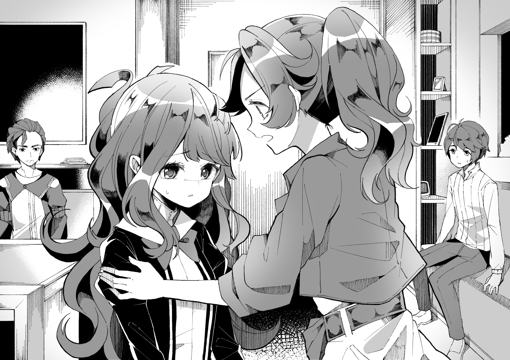
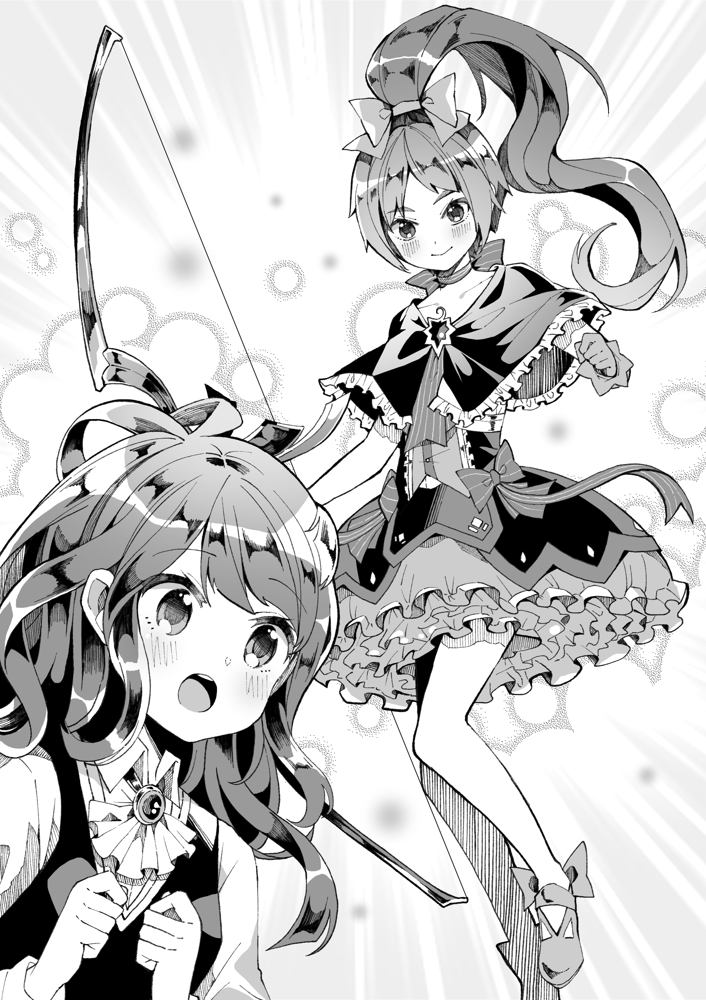

# 第五章 家人

从最初的敬畏，到中间的无所适从，人们对魔法少女的看法最终定格在了源于爱国心的崇拜之上。这里面执政体的宣传工作也不无功劳。虽然魔法少女也并非完人，不过这个群体在人们心理的整体形象已经固定在了英雄和救世主的级别。

但是为人父母的观点却截然相反。作为青春期少女的爸妈，虽然他们也会发自内心地为前线作战的魔法少女们加油助威，但是私下里他们都不约而同地想着：别找我女儿。除了少数例外，世界上的所有父母都在或是旁敲侧击地或是单刀直入地劝说着自己的女儿，不要契约，绝对不要。官方出台了措辞生硬的法案试图限制此类行为，但这只能让人们更加怀疑他们的动机。现在的父母对女儿成为魔法少女的态度就像以前对待儿子参军的态度一样。

然而不管怎么说，让逆反期的女儿听话都不是一件容易的事情。万一她最后还是签了契约的话，为人父母的你又该怎么办呢？

为了制作这期特刊，本社记者采访征集了各界人士的相关意见，包括大量的女孩父母、几位著名的心理学家、一些军官，甚至包括若干名现役魔法少女。在此，小编特将其中精华部分整理成文，希望天下父母们都能顺利度过最初的磨合期。

首先，女儿成了魔法少女并不等于天就塌下来了……

**——《父母必读》在线版特集，《女儿契约了，我该怎么办？》的介绍**

---

良子先一步下了车，然后被后面的闪光吓了一跳。在午夜的映衬下，明亮的红光在她面前的钢化玻璃入口里映出了不吉的血红色。

她回头时刚好看见车子开走。杏子已经变了身，红色少女伸直了胳膊，端详着手里的长枪。

最后，杏子不满地哼了一声，驱散了自己的长枪。这根本没法搬进去。

“我也要变身吗？” 良子问。

“不用。” 杏子走过良子身边，在她肩膀上抓了一把，“别一下子把他们吓着了。我变身只是为了方便解释，你应该也知道这种事情的一般流程吧？”

啊，对了。良子想着，跟着杏子走进了大楼。

在无数的谣言、网文和媒体报导的影响之下，这种 “家庭访问” 本身已经成为了一种象征。它是所有不那么爱国的父母们的梦魇：你的女儿站在家门口，后面跟着一位完全变身、手持武器的魔法少女。大家都知道，军队和行会刻意保留了这个一成不变的仪式，以便给父母们传达一个明确的信息。当然这也是魔法少女们的一种传统。

她们一言不发地坐电梯上楼。良子突然感到了一阵强烈的怯场。

电梯在 42 楼停下，打开了门。杏子轻推了她一下，示意她先进去。

良子向自家玄关走去，脚下越来越慢。这其实是掩耳盗铃——为了迎接杏子，她已经发出指令打开了家里的房门。她父母显然已经知道她马上就要到家了。但她还是——

“啊！” 她情不自禁地叫了出来：杏子猛地搡了她一下。她跌跌撞撞地迈进了自家房门。

良子赶忙按住门扶手保持平衡，一边环视着屋内。全家人都用混合着关心与责备的眼神打量着她。妈妈正要起身离开爸爸坐着的那张沙发，而外公则坐在餐桌上。他们显然都在等她：现在是夜里一点半，平时大家早就上班去了。

“我的大小姐啊，你到底干嘛去了呢？” 她妈妈走上前来，气势汹汹地问道，“你应该很清楚门限是几点的。”

“我相信她肯定是有理由的。” 外公说着，也站了起来，“如果良子说‘有要事’，那肯定真的是有要事。”

“总之，你起码应该解释得详细点，” 她妈按着良子的肩膀说，一边上下扫视着她的身体，“你知道我们有多担心吗？而且还赶上定位服务抽风，我们连你在哪儿都不知道。”

“啊，呃，关于那个……” 良子开口辩解，眼神游移。

“太太，我想我可以解释一下。” 杏子说着，费力地钻进了门洞，一边用蹩脚的姿势把自己的长枪拽了进来。出于某种理由，她明知这条大家伙塞进这样的小房间里会很尴尬，但还是重新召出了长枪。良子往里走了走，给她腾了个地方。

“你这是……” 她妈妈刚要开口问这个陌生人在干什么。

然后就把后面的字咽了回去。

她们三个人一齐站了起来，直勾勾地盯着杏子。不用派个读心者也能知道，她们都在忙着调出内置的人脸识别系统，好验证一下自己看到的是谁。

“在下佐仓杏子。” 杏子说着，端正地鞠了一躬，满脸严肃。

她扫了一眼屋里的情况。

“我想我们有很多事情需要谈谈。” 她说。

回答她的是一阵漫长的沉默。

良子妈妈最先反应了过来，带着失落的表情靠在了门边的隔断上。

“唉，我们跟你说了那么多——” 她说着，迷乱的眼神扫视着四周。

接着她退了一步，用看外星怪兽般的眼神看着自己的女儿。

“你不会真的……” 她爸爸说着，走了过来，咬紧牙关抑制着自己的发作，“这一切不会就是看上去的那样吧？”

他抓住了良子的肩膀。

“你很清楚我们对契约系统的看法，” 他目光灼灼地盯着良子，“我们无数次地警告过你那是怎么回事。你明明知道，还是契约了？”

良子躲开了他的眼神。

“你选择了一种悲惨的生活，良子。” 她妈妈说。但是良子感到不知为何，她妈妈说这些话的时候看着的并不是自己本人。

“黑井太太，你这可说得不对。” 杏子驱散了已经完成使命的长枪，插嘴说道，“战斗的确是艰苦的，但大多数魔法少女活得都还不错。”

“良子，为什么？” 她妈妈激动地挥舞着双手，继续责问道，“我都跟你说了那么多——”

“我可以保证，” 杏子又一次插嘴，仔细审视着这个女人，“她有两个好导师，应该可以升得很快。这既可以提高生存率也可以保证生活质量。”

她避开了正题。毕竟，这是大家都心照不宣的。

良子妈妈呆呆地看着自己的双手，几乎定在了那里。

“妈妈？” 良子试探性地叫了她一声，但她没有答应。

“我能坐一下吗？” 杏子指着餐桌问道，想要转换一下气氛。

大家都一言不发，所以她径直走到桌旁的椅子上坐了下来，掏出一包巧克力扔在桌上。她特地把包装开口朝着上面，就像是在吊大家的胃口。

“作为见面礼，我觉得我应该带包点心。” 她说。

>译注：日本确实也有这个传统

过了一会，良子外公也坐回了桌旁，两手架成人字形，观察着杏子。

“妈妈，求你别，” 良子恳求着，踮起脚摇晃着妈妈的肩膀，“现在家里有客人呢。”

“她活该，” 她爸尖刻地回应，用责难的眼神看着良子，“你骗了我们。你不明白这对她意味着什么。起码先给她点时间缓冲一下。”

良子苦着脸，小心地绕过了还在站着的父母，走到了桌旁。在她的命令下，沙发旁的一张茶几散了开来，无数微小的电子模块彼此叠着罗汉，重组成了一把新的椅子。她把它粗暴地抓了起来，放在桌边，然后坐了下来。

“这和我参军的事没有关系吧？” 她外公说着，用余光看着良子。“如果你真有**那么**担心的话，你只要说一声就——”

良子用力地摇了摇头。

“姥爷，不是，” 她说，“这和你没有关系。”

杏子用奇怪的眼神看了他一眼。

老人闭上了眼，好像是做着什么心理准备。

“见到您很荣幸，佐仓女士。” 他开始招呼起杏子，“抱歉我们的态度可能有点失敬。但是如果非要招待您这样的贵客的话，我还是希望能有个更愉快的理由。”

“我们没有必要这么消极。” 杏子用业务性的口气重申着，“把这当成一个新起点吧。魔法少女的生活拥有无限的可能性。我就是一个活生生的例子，对吧？”

良子不由自主地感到杏子的话像是从宣传册里背出来的。另外，她的语气里完全没有了平时的随便。她显得有点不一样。

良子爸爸终于走了过来，丧气地摇了摇头。

“我不知道该说什么了，良子。” 她爸用严肃的眼神看着她，“不管你许了什么愿都不可能比得上你要付出的代价。我们告诉过你的。你的生命比这宝贵得多。如果你真有什么非做不可的事的话，我们其实也可以帮你的。”

“良子你到底许了什么愿？” 她妈妈锐利的眼神几乎要把她刺穿，“到底为了什么可以让你放弃自己的人生？起码不是件无聊小事吧？”

良子觉得肚子里像是打了个结。屋里的气氛让她很难受。

“我——” 她刚想解释。

“许愿的内容是她的个人隐私，” 但杏子马上打断了她，声音不大，但不容置疑，“你们没有评论的资格，她也没必要告诉你们。”

“这里没有我的幸福，” 良子看着桌子，不敢抬头，“你们恐怕不能理解，但是我觉得地球上的生活不适合我。我觉得自己在这里完全是个没用的人。”

“你这个岁数就……” 她外公说，用他特有的锐利目光重新审视着良子，“作为我说可能有点不合适，但是你起码应该尝试一下地球生活的。”

“我们明明说好了的！” 她妈妈突然嚷了起来，丝毫没有顾忌自己的话可能造成的后果，“你答应过我不会契约的！”

“良子，你本来可以找个正经出路的。” 她爸说，“我们也知道你在学校过得不顺，但是念下去的话你最后肯定能找到事做的。大家都是这样。”

“她已经找到事做了。” 杏子冷静地指了出来，“你们不能随意贬低她的选择。这是她本人的意愿。我们也会好好照顾她的。”

“我真搞不懂你在想什么。” 良子她爸摇着头说，“偏偏要去做那种女人。你太幼稚了。”

要不是良子正好看着杏子的话她可能不会注意到，但是杏子的右眼轻轻跳了一下，接着她绷紧了脸。

“谁会照顾她？” 她妈妈反问着，“军队？那帮就知道把你们这些女孩子当枪使的家伙？”

“就是那帮家伙才让我们都能活到现在的，” 杏子冷冰冰地答道，满蕴的怒气蓄势待发，“别再这么侮辱她。我警告你，你的行为已经是可以追究法律责任的了。”

良子瞪大眼睛，难以置信地盯着杏子。

“杏子，别！” 她恳求道。

杏子瞥了她一眼，然后做了个深呼吸。

“不好意思，” 她微微低头，道了个歉，“你们大概都知道我小时候的经历吧。到现在我还是看不惯那种事。”

“没关系。” 良子的外公也开始打圆场。

**可能我应该另派个人的，** 杏子对良子发着念话，**我亲自来可能是个错误。我已经忘了我有多讨厌 “家庭访问” 了。**

**没关系。** 良子说。

“你不也是志愿当兵的吗？” 杏子转头对着良子外公说，“我倒没料到居然连你都会反对。”

“我已经两百二十四岁了，” 老头说，“我在这种事上有足够的判断力。良子还太小。”

“这我同意。” 杏子说，“但是在契约的问题上没有个人选择的余地。不管怎么说，现在的条件已经比我们那一代的女孩子强多了。”

良子终于意识到杏子和平时有什么不一样了。

现在的她完全就是一副长者口气。

进屋之前，她说话一直带着不良少女的口调——这个时代只能在电影里才能听见的那种。她还会倒在良子肩膀上睡觉，和大家随便开开玩笑，完全看不出来她的年纪其实比自己外公还要大了一倍。但是现在，她坐得笔直，讲着一口标准的敬语，和她外公那辈人简直是如出一辙。她的语气坚硬如铁，时刻提醒着对方她已经活了四百多岁，而且只要她愿意，她可以轻易把一般人撕成碎片。

这让人感到紧张而不快，局面随时都会失控。

“爸爸，妈妈，求求你们了。” 良子恳求着，看着父母的眼睛，“事情都过去了，我已经做出了选择。难道我想得到你们一点支持都不行吗？别把事情搞成这样。”

沉默继续延长。

“她说得对。” 一看没人答话，杏子补了一句，“我看大家还是先放一放吧。”

良子仍然低着头，而杏子则来回扫视着屋里的三个成年人。他们逐渐意识到了自己的行为已经无济于事，表情缓和了下来。现在再去揶揄军队或者吵些什么已经晚了，争论把生出来没多久的女孩子拉去契约的伦理问题也没什么用。这些全都只是空话，和白噪声一样毫无意义。

她爸控制住情绪，深吸了一口气。

“好吧，良子。” 她爸拉起了她的手，看着她眼睛说，“你说的对，事情都过去了。你现在是个成年人了，只能希望你已经做好准备了吧。”

她妈只是点了点头。

“好吧。” 她低声说。

“的确，” 她外公说，若有所思地拿起了一块巧克力扔进嘴里，“确实已经没有选择了。”

杏子偏头看着他的动作。良子的父母也凑着热闹，礼貌性地拿了几块吃掉。

“没准将来我们还能碰到呢。” 她外公嚼着嘴里的巧克力说，“你们，呃，魔法少女们应该有探亲假什么的吧？”

“非常正确，” 杏子插嘴道，“而这就是我来这里的原本目的。如果你们不介意的话，现在我要向你们普及一些作为魔法少女的父母应该知道的东西。”

她的眼睛失焦了一会。

屋里的所有人都收到了邮件通知带来的一声 “叮”。现在人们都会在谈话时下意识地忽略掉这种感觉。

“等会有时间的时候看一下，” 杏子说，“现在趁我在这儿先给你们简单过一遍。首先，他说得对，你们有权探视，不过这在新兵训练期间是禁止的，至于你——”

她示意着良子的外公。

“只能每年多放假一周，而且探视良子需要请假。然后不幸的是，由于现在前线吃紧，良子你很快就得出发报到。不过在此之前你可以先在家休息个一周左右。这一周的任务只有领取装备和重置体内网络，加上领取定期配发的悲叹立方。其余的时间里你可以爱干嘛干嘛。你收到的邮件里指定了什么时候要去什么地方报到。”

她顿了一下，深吸了一口气。其他人看着杏子涣散的眼神。显然她刚刚打开了一份官方文件，正准备照着念。

“系统已经自动为她办理了退学手续，所以你们不用担心学校的事。由于家里已经拥有了一位现役军人，你们现在都可以得到军属福利，其中包括额外供应的分配券。详细内容你们可以待会看。另外，你们可能也已经意识到了，良子已经完成了提前成年手续，这意味着你们作为监护人的绝大多数法定权利和义务都已不复存在。”

她把手伸进自己魔法少女装束的一个褶儿里，掏出了一沓全息小册子。

“如果你们更喜欢物理介质的话可以看这个。” 她解释着，把小册子扔在了桌上，“也要请你们注意，可能会有本地媒体前来采访。你们可以自由决定是否接受。执政体，军队和行会在此代表全体人类，向你们全家已经作出和将要作出的伟大牺牲表示感谢。”

杏子的眼睛重新带上了神采。

“现在，我想你们有问题要问吧。”

“靠，当然有。” 良子外公说着，向前倾身，“首先，谁她 x 的骗她契约的？是你吗？”

“不是，” 杏子说，看上去很庆幸自己能够否认这一点，“巴麻美她今天有事来不了。”

“巴麻美？” 良子她爸冲口而出。

“她救了我的命。” 良子解释道，“我和西蒙娜遭到魔兽袭击了。”

“你遭到袭击了？” 她妈妈难以置信地问，“然后连告诉都不告诉我们一声？”

“我当时很忙……” 良子无力地辩解着。

“作为一个平民而言，我听说她表现的很好。” 杏子帮着腔。

她父母对视了一眼。

“那你的能力是什么？” 她妈妈，。“这没什么忌讳的，对吧？”

“她是个传送者，” 杏子再次替良子答道，“而且她的武器是远程的。只要条件允许，她应该不需要参与任何近身战。”

良子她爸不满地哼了一声，明显听出了杏子的推销语气。

“你刚才说她有两个导师，” 他说，“一般不是一个吗？她们是谁？”

“噢，对，” 良子觉得反正也是要被审问一番，还不如趁这机会显摆一下，“麻美和杏子答应了做我导师。这绝对是我的光荣。”

“主要还是麻美负责。” 杏子赶忙撇清，“但是按照麻美的性格来看，良子应该可以在她的参谋部里找份差事。你们根本不用担心什么。”

**我这可不是说在她参谋部里你就安全了，** 杏子私下里发着念话，**但是撒个善意的小谎也没有坏处。**

**等等，参谋部？** 良子问，**真的吗？**

**嗯，** 杏子说，**但是我也说过，别指望自己会坐在办公室里长蘑菇。麻美不是那种人。**

与此同时，良子爸爸漫不经心地嗯了一声。

“嘛，反正也无可挽回了，有点出头的机会总是好的。” 她爸说，“那我就等着你努力升官的消息了，良子。”

“那是当然。” 她说，这也是她真实的想法。

**感觉你父母知道的比我预想的要多，** 杏子的念话传来，**他们根本没问悲叹立方和灵魂宝石的事。一般人都会先问那两个问题的。**

**他们以前当过研究员。** 良子答道，在心里耸了耸肩。

**档案上倒确实是这么写的。** 杏子说。

她妈用奇怪的眼神瞟了一眼她爸。

“总之，佐仓女士，您能赏光前来我们感到不胜荣幸。” 她的声音里明显带上了逐客之意，“但是我看良子也该睡了。我们家里人之间也需要好好商量一下。我希望您能理解。你俩还有什么要问的吗？”

她扫视着她的老公和老爸。

“我有，” 良子外公说，“但是我同意你的看法。”

良子偷偷看着杏子。

**照做就是了，** 杏子说，**他有问题归有问题，但我也知道你累了。**

良子点了点头——虽然她还是有些抗拒——然后站起身来。

“我们可以单独谈谈。” 杏子爽快地同意了良子外公的请求。

---

等良子准备躺下睡觉的时候，已经过了夜里两点了。

终于换好睡衣的良子跌跌撞撞地向床边走去，差点就在自己的望远镜上绊了一跤。

**等会有时间的时候看一下。** 杏子的声音还在脑海里捉弄着她。

今天肯定不行了，她想着，倒在了床上。

她明天下午一点还得去见浅香呢。她从来没有熬到过这么晚，明天早上肯定会很难受的。

她想象着再也不用睡觉的生活会是什么感觉。

“良子？”

她抬头看去，发现她妈妈正站在门口。

“抱歉吵醒你了，” 她妈妈说，“但我想我们得谈谈。”

“没问题。” 良子硬撑着说，强迫自己靠在枕头上坐了起来。她妈妈走了过来，坐在了她书桌旁边的椅子上。

“对不起，妈妈。” 良子说，“但是我已经想通了。相信我。我知道你会担心，但是我保证我会活下来的。”

**毕竟，在实现愿望之前，我还死不了。**

她妈妈坐在了她床头。

“良子，我不想骗你。” 她说，“你做了个很糟糕的选择。这不光是活命的问题，更是生活方式的问题。”

良子观察着她妈妈的表情。

“我不同意。” 她说，“我只能这么说。”

她妈妈的嘴角翘了起来。

“好吧，看来你果然是我的女儿，” 她说，“我只希望……”

她的声音越来越小。

“希望什么？” 良子追问着。

她妈妈摇了摇头。

“你知道我和你爸以前是干什么的。” 她说。

“我知道，妈妈。” 良子说。

他们曾经是普罗米修斯研究所的科研人员。和其它所有的研究岗位一样，这也是个志愿职业。不过后来为了抚养女儿，他们基本上可以说是辞去了工作，虽然每天夜里他们基本上还是会跑一趟实验室。

“我们从不议论工作内容。这背后是有原因的。” 她妈说，“那里并不是一个单纯的世界。我在说军队只知道把你……这样的魔法少女当枪使的时候，绝对没有任何的夸张。”

“我明白，” 良子低着头说，“我自己也查过。”

“嗯，你查过。” 她妈说，似乎很是不以为然，“记住你自己是谁吧，我只要求你这一点。”

良子抬头看着妈妈的脸，不太明白她在说什么。

她妈妈叹了口气。

“我们以前就谈过这件事，良子，” 她说，“我们什么都告诉过你，你也答应得好好的。你到底是为什么——”

“我拒绝讨论！” 良子直接顶了回去。

然后又低下了头。

“好吧，我撒了谎，行吧？” 她说，“我没想过我真能有机会契约，所以也没当回事。我不想在地球上庸庸碌碌地活着！我在这里活着能派上什么用场？我的世界不应该只有这么小！”

她妈妈闭上了眼睛。

“我们这个家到底是怎么了？” 她说，“都不肯好好待着。我只希望大家能够幸福快乐地生活在一起。这很过分吗？”

“我们不在一起过也未必就会不快乐。” 良子指出。

她妈妈看了她一眼。

“在这个年纪说出这种话，你可真够残忍的。” 她说。

良子眨了眨眼。

“等等，可能我应该换个说法——” 她说。

“不，没关系，” 她妈说，“但是我有个小小的请求。”

“请求？” 良子问。

“让我看看你变身的样子吧，” 她妈妈说着，露出了一缕笑容。良子觉得自己好像看见了母亲眼底闪过的一丝狡黠。

“变身？为什么？” 良子问。

“有什么问题吗？” 她妈妈问，“满足一下老太太的任性吧。”

真要论起来，她妈妈说的倒也没错。她没有拒绝的理由。除了……因为害羞。

良子召出了灵魂宝石的原本形态。

她站起身来，压下了强烈的羞耻感……

然后，强光闪过，变身完成。

她轻轻吐出一口气，感到了一阵诡异的紧张。更为火上浇油的是，她妈妈眼里完全没有一丝一毫的慌乱或是惊叹，只是仔仔细细地上下打量着她。

“很多蕾丝，” 她妈妈评论着，“而且还是绿的。这和我想象的可不一样。”

“好吧，蕾丝是不少，” 良子感觉颇不耐烦，“又不是我自己选的。”

“倒也是，” 她妈说，“还有一把钢弩。嗯，这就对了。”

“为什么？” 良子有些困惑地问。

她妈妈只是耸了耸肩。

“和衣服很配。” 她说。

“而且你知道这东西叫钢弩？” 良子问，“我在拿到手里之前对这些根本一无所知。”

她对着自己装着十字弓的左臂比划了一下，比划的过程中仔细避开了自己的望远镜。

“告诉你，你老妈可是个历史达人，” 妈妈答道，“至少以前是。”

“我知道，妈妈。” 良子附和着，感叹地摇了摇头，“不过我没想到‘历史’还包括这种东西。”

“我就是因为这种东西才学的历史。” 她妈说。

然后，她点了点头，似乎默认了什么。

“好吧，你先睡吧。” 她说着，站了起来，“你和你外公会在同一天走，所以我准备开个小小的欢送会。我已经订好计划了。你可以请点朋友来。”

她向门口走去，良子解除了变身。

“良子，你应该知道，” 她妈妈说着，在门口停了下来，“我和你爸打你出生以后就没有过过两个人的日子了。我们可能会适应不了。”

“我相信你们不会有问题的，妈妈。” 良子说。

她妈妈走了出去，房门自动关了起来。

良子重新躺了下来。她终于可以——

然后门又开了。

“还有什么事吗？” 她有气无力地问。

“我刚才忘了说了，” 她妈说，“如果有一天你见到你外婆的话，代我向她说声对不起。”

“OK。” 良子答应着，想要她妈赶紧走。

门再次关上。

等等，道歉的理由是什么？她想。

她本来还想再深究一下，但是她的眼皮好重，被窝又好暖和……

---

“黑井先生，恕我直言，” 杏子把玩着手里的酒杯，“我是个很忙的女孩子。不可能一直坐在这里给你们答疑，尤其是你关于军队的这些无聊问题。他们都有印好的小册子。我在这里主要还是为了解释关于魔法少女的事情。”

她让自己的醉酒模式保持在关闭状态。这也就是说，她血管里的纳米机械会亲切地破坏掉进入体内的酒精分子。接受别人的敬酒是一种礼貌，但是她还想保持头脑清醒。

在桌子的另一头，老头重重地清了下嗓子，然后扶了扶眼镜。

“你说‘女孩子’。其实大家都知道你有多大了。你的岁数差不多是我的整整一倍。我不知道你们怎么都这么喜欢装嫩。”

杏子抬起了一条眉毛。这老头嘴巴好毒。

“不要转移话题，” 杏子看着他说。“我说过我还有事要做。如果你就打算干坐在这儿像个武器爱好家一样问我问题的话，我还不如回去干点别的。”

黑井安倍 (くろい あべ) 旋转着自己的酒杯，欣赏着手里原装法国梅洛的挂杯感觉。

“没错，” 他说，“但是你不会回去的。实际上，我可以打赌你已经把今天整个晚上的日程都空出来了。”

正中红心，但杏子克制住了自己的表情变化。她的确空出了自己的日程，把已经准备好的布道交给了其他的女祭司们。正如麻美在邮件里所说，如果想当良子的导师的话，她起码得负点责任。

但也不是说这就不算麻美欠她的了。就算麻美军务繁忙，她也得换个方式回报一下。

“当心越线，小鬼。” 杏子说。

“我找熟人打听过，” 老头耸了耸肩说，无视了杏子的威胁，“你们这些‘女孩子’在家庭访问之后要做的第一件事就是找各种理由在人家家里赖着不走。你们会观察周围的情况，试探家人的反应。收集信息，然后转达给行会的精神卫生部。我倒不介意。良子很快就会需要这种支持的。”

“所以你把我留下了。” 杏子说。

“对，” 老头说，“我觉得你会感谢我的帮助的。”

她其实不需要这种 “帮助”。她在外面一样可以很好地监视屋里的情况。但是就算这个老头再滑头，他也不可能连这个都知道。

“好吧，如果你不介意我问一句的话，” 杏子说着，身体前倾，“你到底为什么会打听这个？这种信息可不是随便聊聊就能听到的。”

“在这个星球上，我唯一在乎的就只剩下良子了。” 老头说，“还有我女儿，但她能照顾好自己。对良子我就没有这个信心了。”

他把酒杯放在了桌上，也向前倾身。

“我只能说出于种种原因，我怀疑总有一天会发生这种事。” 他说。

“魔法少女潜质的出现概率只有万分之一左右，” 杏子说，“拿这种事情当作担心的对象可是太特别了一点。”

“反正我也闲着没事，” 老头说，“多预想几种情况总没有坏处吧。而且她的个性一看就像是会契约的那种。其实我现在也不赞成她的决定，但是我和我女儿不一样，我至少能理解这的确是良子本人的选择。抛开我自己的反对意见不谈，要是连她为什么想走都不能理解的话，我自己也不会当兵了。”

“所以你把我留下来聊天。” 杏子干巴巴地说。

“对。” 老头说，“我觉得我可以给你解释一些我们家里的问题。也许可以帮你省点事。”

实际上，她根本不喜欢干这些。梳理别人的家庭关系可不是件容易的事，而且魔法少女的家庭环境往往总是有些问题。某些父母对她的过激反应则让一切显得更加难以忍受。她不喜欢这种容易让自己联想起过去的状况，即使这和自己其实并没有直接的联系。这些见鬼的 “家庭访问” 总是很尴尬。

她也不喜欢和这种两百岁的人精打交道。更糟糕的是，刚才她为了让良子父母安心特地作出了成年人的姿态。老头子也因此无视了她的女孩外表，而把她当作了同龄人。

她不喜欢被老头子当作同龄人。

正在这时，她的一个内置监视器发出了提醒。

她听着里面传来的声音。

“——你居然还顺其自然地鼓励她立功升官！” 良子妈说着，“好像你还很引以为豪似的！”

“我没有，” 她爸顶了回去，“你又在断章取义了！我只是在保持冷静而已。你那么瞎嚷嚷难道就有用了吗？我只是建设性地提点意见。这种情况下鼓励她好好干不是很自然吗？”

“你就是这种人。” 她妈也毫不相让，“你根本就没把这当回事，对吧？”

“你说什么鬼话？我心里也不好受！白痴！”

杏子咬着牙。父母……

老头好奇地看着她。

“搞成这样都是你的责任！” 良子妈说。

“你又来了。你怎么证明——”

“是你先觉得那是个好主意的！”

“你也同意了！而且还兴高采烈的！如果我没记错的话。”

“看看，到底是谁在断章取义？”

“是你！”

“我说——”

“怎么了？” 老头问。

“她爸妈吵起来了。” 杏子侧着头，漫不经心地应了一句，继续听着对面的吵架。

有些话听起来不太对劲……

“你怎么知道的？” 老头问。他完全听不到隔音墙背后的动静。

杏子悄悄叹了口气。刚才那包巧克力里装了窃听器，能在体内维持一周左右的那种。这也是标准程序之一，但她毕竟不能直承其事。

而是指了指自己的耳朵。

“别忘了我是魔法少女，” 她说，“我们听力比你们好。”

细究起来的话，这倒也是实话。

老头皱了皱眉。

“看你已经迫不及待了，” 杏子说，“给我解释一下到底是怎么回事吧。”

她把语音转换成了字幕，直接丢给了老头。军队专用的脑内通信协议把他吓了一跳。杏子忍住了没有笑出来。

“他们的婚姻在多年以前就已经濒临破裂了。” 过了一会，老头叹了口气，解释道，“说实话，就在良子出生之前，他们已经闹到了差点离婚的地步。但是当时正好准生证办了下来，所以他们决定再处一处看看。他们以为有个孩子也许能把他俩绑在一起。”

老头暧昧地笑了笑。

“说实话，我和我老伴觉得这不现实。但是我们想抱孙子，所以想着‘没准这也行得通’也就半推半就了。现在想来，我们可能做错了。”

他脸上的笑容消失了。

“反正，总之他们最后还是不成了。” 他说，“不过他们在良子面前还是会装装样子。那孩子挺聪明的，但是她在有些方面特别迟钝。”

杏子点了点头。

“好吧，但是说这是他爸的‘责任’又是怎么回事？这完全说不通啊。听你女儿的意思，难道是说他做了什么事情导致良子契约的？”

安倍低着头。杏子看得出来他正斗争着要不要把事情说出来。

“好吧，” 他说，“你知道他们曾经当过研究员，对吧？”

“当然，” 杏子说，“但是档案上没写他们的研究内容。”

“他们为军方工作，” 老头说。“准确地说，是研究魔法少女方面的东西。开发开发武器，搞搞数据挖掘什么的。久间觉得可以向良子透露一点魔法少女生活的黑暗面，好让她打消契约的念头。中濑当时也同意了。”

>译注：良子父亲全名志筑久间 (しずき くま)，良子母亲全名黒井中濑 (くろい なかせ)）

后来，我们发现这么做的唯一效果就是吊起了良子的好奇心。她不想让我们知道，但是我们很清楚她这方面一直很活跃，平时在相关论坛上发发贴什么的。这也是我一直担心她会契约的理由之一。说实话，小中濑说得的确有点过分，但是他们的婚姻已经到了什么鸡毛蒜皮的事情都能吵起来的地步了。”

杏子点了点头。

老头无力地摇了摇头。

“我们家的女人都是这种性格。大概是从我老伴那里继承过来的吧。”

“良子和她外婆很亲吗？” 杏子问。

“非常亲，” 老头说，“我老伴宠她宠得厉害。所以我才不能理解……”

他摇了摇头。

“对不起，到这里就是我的个人私事了。”

“我能理解。” 杏子问，“那么说起来，你们一共有两个女儿？”

“是，” 老头说，很清楚她到底想把话题引到什么方向，“不过良子不知道她还有个阿姨。就我本人而言，我已经有一个世纪没有见过她了。不过我们还有联系。我想你也知道是怎么回事。”

“我知道。” 杏子说着，在心里默默记下了这件事。这是一个必须解决的问题。

“你的家庭环境可真够复杂的。” 她终于收起了话头。

“的确。” 老头说。

---

“嘿，良子～” 她背后的声音说。

良子转过身来，抬头看着面前的陌生人。

“你是谁？” 她说，稚嫩的童声在 “你” 上拖了个长音。

"你父母的友人。" 女孩说。

她外表上大概十来岁，脑后绑着长长的马尾，看着有些脸熟……

良子抬头盯着眼前的陌生女孩，等着内部视野上出现她的身份信息。

“要是我的话可不会轻易相信人脸识别什么的哦，” 女孩说，“那不是我的真名。不要白费力气了。”

良子皱了皱鼻子。

“听起来很可疑。” 她说。

即便是在一个暴力犯罪几乎绝迹的世界里 (能够自动锁定肌肉的体内植入物保证了这一点)，家长们还是教育孩子要对陌生人保持警惕。毕竟，并非所有的犯罪都需要暴力。

女孩笑了出来。

“我觉得也是，” 她说，“你妈妈教育得不错。”

“喂，喂！” 旁边的一个女人喊住了她们。

周围刚下课的孩子们都在乱糟糟地挤着上车。喊住她们的这位小学教师从孩子堆里钻了出来，和陌生女孩对峙着。

“学校摄像头显示你没有权限接走她。” 老师说着，把眼睛凑近了陌生女孩的脸。

“仔细看看我的脸。” 女孩指着自己的脸说。

老师皱了皱眉，还是照做了。她的严肃表情缓和了一点，但仍然摇了摇头。

“就算这样你还是没有权限，” 老师说，“我得问一下她家长。”

“这样吧，” 女孩弯腰前倾，“我可以和你私下讲几句吗？”

老师又皱了皱眉，但还是勉强同意了，伸手示意良子先不要走开。

“你先等一会。” 她说。

良子好奇地看着两人走到角落里，说起了悄悄话。

一段漫长的等待之后——其他的所有孩子都已经上车了——在良子已经闲的发慌，开始原地转圈的时候，两人终于回来了。

“要是你撒谎的话，” 老师警告说，“我就马上报警。”

“我说的是实话，” 女孩强调说。“我就是想陪她待一会儿。就一会儿。”

她举起手来，示意自己并不是什么危险人物。

“我会盯着你们的。” 老师再次警告道。

“良子，过来吧～” 女孩说着，对良子伸出了手。

“你是谁？” 良子问。

“我说了，我是你父母的友人，” 女孩说，“我只是想和你交个朋友。”

良子想了一会，然后握住了她伸出的手。她又能把我怎么样呢？

“谢谢！” 女孩开心地说，“来吧，良子，我们到那边的长凳上坐一会儿。”

等她们坐过去之后，女孩给了她一块碎巧克力饼干吃。看着良子静静地咬起了饼干，女孩开口说：

“你真的好可爱，” 她说。“跟小中中 (なかちゃん) 小时候一模一样。”

“嗯嗯。” 良子的注意力完全被饼干吸引了，心不在焉地应了一声。

“良子，听我说，” 女孩说，“你见过这东西吗？”

良子看了一眼女孩的手——然后她嘴里的饼干掉在了地上。

“灵魂宝石！” 她说，“你是魔法少女！”

“没错！” 女孩说。

“哇！” 良子说，突然兴奋了起来。在这个年纪的小女孩眼里，魔法少女就像是故事中的公主和超级英雄的结合体——唯一的区别是你还有机会在将来某一天成为她们的一员。

“我能摸摸吗？” 她问。

女孩摇了摇头。

“对不起。” 她说，“魔法少女的灵魂宝石非常重要，不能随便让人摸的。”

良子认真地点了点头。这听起来很有道理。

“你能给我演示点魔法吗？” 良子问。

女孩用手指戳着自己的脸颊，思考了一会。

“我想不到什么拒绝的理由。” 她终于说着，站起身来。

良子身体前倾，充满期待。小朋友们肯定会羡慕死她的！

一瞬间，绚丽的紫色光芒包裹了女孩的身体，然后她的衣服变成了精致繁复的紫色魔法少女服。

衣服上满是蕾丝，装饰着几个纽扣。女孩的灵魂宝石变成了她颈部下方的一颗六芒星。

良子看得眼都直了。女孩的整体印象是和晓美焰一样的紫色 (她的形象早已是众人皆知了)，但是她的服装可比焰华丽多了。

女孩拿着一副巨大的木质弓箭。

“这是一把复合弓。” 女孩解释道。她凭空召唤出了一支箭，瞄着天上，射了出去。

利箭直冲云霄，在空中管道和附近建筑之间的缝隙里穿过，然后在天上炸成了焰火般的明亮紫色。

散开的火花隐约拼成了 “良子” 的文字。

良子早已跳下了长凳，用力地鼓起了掌。

“哇！” 她情不自禁地喊了出来，“我真想快点长大，做一个魔法少女，像你一样！”

女孩听到这种赞美并没有感到高兴，而是皱了皱眉。随后她恢复了往常的神色，瞬间驱散了自己的弓箭和服装。

她摇了摇头，嗓音里突然带入了大人们常说的所谓 “成熟”。

“我也知道这很帅，” 她说，“但是请你在契约之前听听父母的意见，好吗？我是认真的。”

良子皱起了眉头，显得不太高兴。每个人都这么说。

“我大概是没控制住自己的表现欲吧。” 女孩苦笑着，自言自语道。

然后她俯下了身，平视着良子的眼睛。两人对视了一会。

“我有个礼物要送给你。” 女孩说着，拿出了一件东西。

良子的内心已经被陌生女孩彻底征服，毫不犹豫地伸手接过了它。

“哦哦。” 她张圆了嘴，两手捧着一只手镯。

“听好了，良子。” 女孩说着，拍了拍她的头，“今天的事绝对不能告诉你的父母，包括这只手镯的来历。这真的很重要。”

“为什么？” 良子问着，把手镯松松垮垮地挂在了自己的手腕上。

“绝对，绝对……” 女孩说，她的声音开始变得朦胧，整个世界都扭曲了起来……

“——不能让她知道这些！” 她外婆大声否定着，把门后偷听的良子吓了一跳。

良子抬起头，这扇普普通通的门在她眼里居然显得如此巨大。

“但是为什么呢？” 良子爸爸问道，“为什么不能告诉她呢？”

“那帮见鬼的孵化者从我们家里抢走的人已经够多的了，” 老太太说，“再给良子找个现实榜样就真是完美了。不行。怎么能随便她消失了一个世纪以后就像没事人一样直接回家呢！”

“这对她很不公平，” 良子爸爸说，“她这么做是有正当理由的。”

“你们俩都小声点，” 良子外公说，“我们有个小客人呢。”

脚步声传来，然后房门洞开，专心偷听的良子没有防备，一跤栽倒……

良子吓醒了，喘着粗气。

这到底是什么意思？过了一会，良子想到。

她摸了摸自己的额头，上面全是冷汗。

我好久没有做过梦了吧。她推测着，意识很快清醒了起来。

10:30:16，她的体内时计提示道。

她躺在床上，盯着天花板，一边揉着头皮，想要减轻一下没有按时睡觉带来的疲惫和头痛。

良子已经很久很久没有想起过那位紫色的魔法少女了，虽然她正是自己梦想的原点之一。那是一段属于童年的记忆，而她也真的从没告诉过父母。

但是梦境后一半的内容——**她根本不记得发生过那种事**。那到底是什么意思？

良子叹了口气。虽然按照自己的标准来说她还没有睡够，但是这种情况下她恐怕很难重新睡着了。

从床上挣扎起来，她把脚伸进了她最喜欢的小兔拖鞋。也许应该把它打进行李里，她想。军队应该还是允许带点私人物品的吧？

她在桌前停留了一会。随着她心念一动，桌子最顶上的抽屉滑了出来，内部的自动整理装置把她想要的东西递了上来。

她拿起了那只手镯，借着灯光端详着。手镯的构造很简单，不过设计成了小孩子喜欢的样式。靠着有些大材小用的先端技术，即使经过这么多年，手镯上仍然散发着柔和的光芒。镯子外圈装饰着简单的纹饰：一颗抽象化的流星，在边缘来回缠绕。

魔法少女行会的标志，良子想。她以前从没有意识到这一点。

她迟疑了一小会儿，还是把它戴在了手上。手镯的尺寸对现在的她来说刚刚合适。

一边在柜子里翻找着衣物，良子一边咀嚼着自己的回忆。她对紫色魔法少女的印象正是童年记忆的标准形式。她清楚记得那些绚丽的光影效果，比如天空中构成 “良子” 的闪亮火花，但是这次梦里的其它细节就不同了——那些都是她以前从未记起过的东西。

她到底是谁？良子想。什么人会在脸上戴着一副假名到处乱走？

而梦的后半部分。那是真的吗？她对外婆根本没有什么印象，当时自己真的太小了……

这么说其实也不准确。但她关于外婆的记忆基本都是一些具体的事情。而梦里的那次她以前完全没有印象。

良子不满地嘟哝着，穿上了一条裤子。如果还能见到那个女孩的话，就得好好问问她了。也许她会回答吧，不至于像自己的亲生父母那样藏着掖着。

反正……噢，她睡觉的时候收到语音邮件了。

她听着邮件的内容，一边扭动着钻进了上衣里。

“昨天我真的很抱歉。” 西蒙娜的声音在她脑海里响了起来，“我纯粹是被吓蒙了，真的。”

吓蒙了，良子有些不以为然地想着。嘛，这也是一种说法。

“我想补偿你一下，” 她接着说，“所以我准备四个人一起做点什么，也许可以看看你答应人家小男生一起看的那部电影？”

哦哇，那事，良子想。她已经完全忘了约会的事情了。嘛，至少她逃脱的方式够壮烈。

“但是我还没有想清楚，” 西蒙娜显得有些犹豫，“我觉得你可能更想亲自告诉大家这个消息。所以在我做什么之前还是先给你留点时间吧。”

也对，良子想。

她在脑海里写出了一条肯定的回答，然后又给另外几位朋友们写了信息。几条信息都刻意写得模棱两可。她现在不想讲电话，所以她都是用的文字。

“早安，良子。” 她一走出房间就听到了外公的问候。

“早安。” 她打着哈欠答道，扫视着四周。

她爸爸好像不在家，但是她妈妈已经起床，正在餐桌旁等着她。

“在你睡觉的时候我找人修过合成器了，所以你早上才能正经吃上一顿。” 她妈说着，在桌上摆出了米饭、小菜和味噌汤，“反正现在家里有了两位军人，我们也不用担心分配券的问题了。”

良子不知该如何作答，只是无奈地笑了笑，然后坐了下来。

她一边吃着，妈妈和外公一边盯着她。两人的眼神让她有些不太自在，就好像一不留神良子就会在筷子上扎着似的。

“我在想啊，” 良子仔细观察着两人的神色，“现在已经发生了这么多事，呃，你们——”

她顿了一下，重新考虑着措辞。情况是这样的，她一直觉得家里人总是有事瞒着她。但现在既然她在法律上已经是成年人了，也许他们嘴上会松动一点吧。

“你们以前有什么事情不能跟我说的吗？” 最后她选择了这么问，“比如说……工作上的事？有什么和魔法少女相关的吗？我也知道法律规定有些事情不能告诉我这个年纪的女孩子。”

她很怀疑父母的隐瞒到底是不是出自法律原因，但是这么说可以省得大家丢脸。

她妈妈和外公对视了一眼。

“我不否认我们有事情瞒着你，” 她外公说，“不过反正你马上就可以接触到这些东西了。我们现在再解释也不太合适。”

“没错。” 她妈妈附和着。

“我要的可不是这种回答。” 良子说着，试图作出一副凌厉的眼神。

她外公只是耸了耸肩，完全没有对她强装出来的怒意作出反应。

良子叹了口气。每次都是这样，她已经没有生气的欲望了。

她嘟哝着，最后还是决定先好好看一下邮件——尤其是昨天晚上收到的那堆小山一样的军队通知。放松双眼，她开始在记忆里浏览着文字信息。

首先是标注了 “非常重要” 的那一封。

好吧，她今天下午 13:00 要去当地行会支部参加新人培训，并且进行体内网络重置什么的。这个她已经知道了。

下一条是关于悲叹立方用法用量的简单说明，里面说了在她契约之后的第三天和第六天里各有三块会直接配送到她家里。然后又解释说正常的基础用量是每三天一块左右。但是为了应对契约所带来的感情冲击，她们会给她一些额外配给。说明里还要求新人在这几天里尽量保持心情平静，具体原因请咨询附近的导师、征兵官、或者前辈魔法少女。

里面还告诫她任何轻度以上的污染都是极度危险的，一旦出了问题应该毫不犹豫地申请额外配给。行会也将在配送的同时提供回收用包装，她只要把用过的和多余的悲叹立方放进去就可以了。另外需要注意的一点是决不能让民间人士经手悲叹立方，所有的处理都必须由她亲自完成。所以如果无法在家收货的话，请提前告知……

良子打开了下一封邮件。

这是军方的正式欢迎信，写满了爱国标语，要求她 “仔细阅读所有通知”，并且在有疑问的时候咨询本人导师或者当地的负责同志。她发现这位 “负责同志” 是帕特里西亚，不过她倒也没打算真去咨询什么。邮件里还大大吹嘘了一番她作为军人可以享受到的诸般福利待遇。

后面更有意思的是行会的欢迎信。里面介绍了作为行会一员可以享受的各种特权，包括一笔相当可观的分配券补贴。同时邮件也说明了作为行会成员所需要承担的责任——在选举中投票，接受灵魂犯罪法庭担任陪审员或者裁判员的要求，等等等等。最后还列出了一长串让人头晕的行会行事列表，包括延伸阅读的材料，参与选举的程序，行会的文化传统，还有内部节日之类的。

下一封邮件先是问她有没有找到自己的人生意义，然后邀请她参加当地希望教教堂举办的布道。作为教会总部，这里常常可以听到佐仓杏子本人充满智慧的只言片语——

她把这封直接丢进了垃圾箱。虽然对杏子有点不敬，但她没有这种兴趣。

不过现在回想起来，尽管杏子和其她几个女孩都显然是信徒，但她们都没有跟她聊过这方面的事情。

这里面似乎颇有深意。

后面的邮件几乎无穷无尽。军用通讯协议的说明。关于军队发放的分配券的使用建议，包括如何兑换殖民地的本土货币，以及在殖民地可以利用的投资选择。然后是一篇关于保密等级的有趣简介，她读了之后，发现自己已经达到了密级 1。然后是一份当地驻扎的魔法少女和同期新人的名单，用来帮助她们互相熟悉和彼此解答问题——里面还附带了一张近期聚会的请柬。还有一封关于提前成年的法律后果和日常影响的解释文件。

最好玩的大概是标有 “保健信息 (重要)” 的一封了。里面声明说：“虽然社会上有很多误解，但成为魔法少女并不会影响一个人的生育能力。您体内的避孕用植入物将会继续工作，这是完全正常的。请勿擅自关闭。” 和这份声明配套的是一段警告：“虽然我们很清楚诸位长期离家的寂寞难熬，但还是希望大家不要在把魔力浪费在一些‘无聊的个人问题’上。”

良子好不容易才板住了脸。

邮件一封接着一封地涌了过来，最后良子已经读到麻木了。对家人道了个歉之后，她在椅子上坐了整整一上午，然后直接坐在上面吃了午饭，用筷子机械地往嘴里夹着食物。外公和妈妈只是默默地看着她，藏起了自己的表情。

在看到体内网络重置过程和增强装置改动列表的介绍文件时她终于受不了了。这封邮件长得要命，而且预定的时间也快到了。

反正她马上也就要知道了。

她站起身来，说了声再见，然后就去行会支部报道了。
