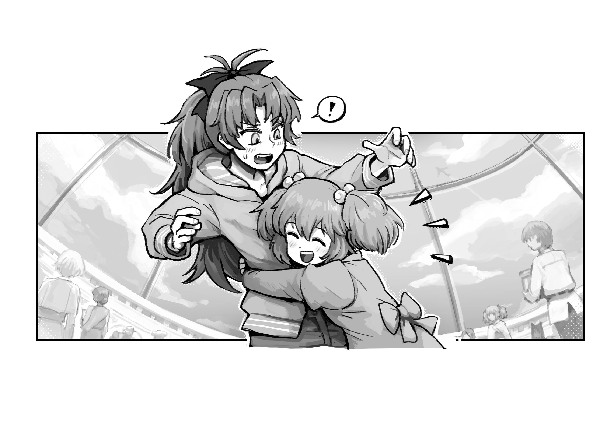
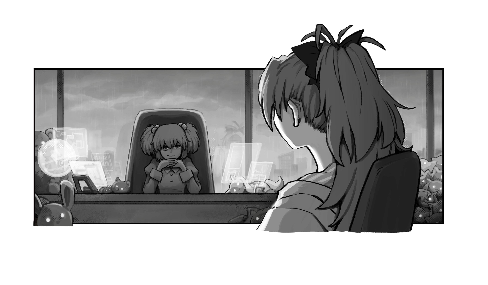
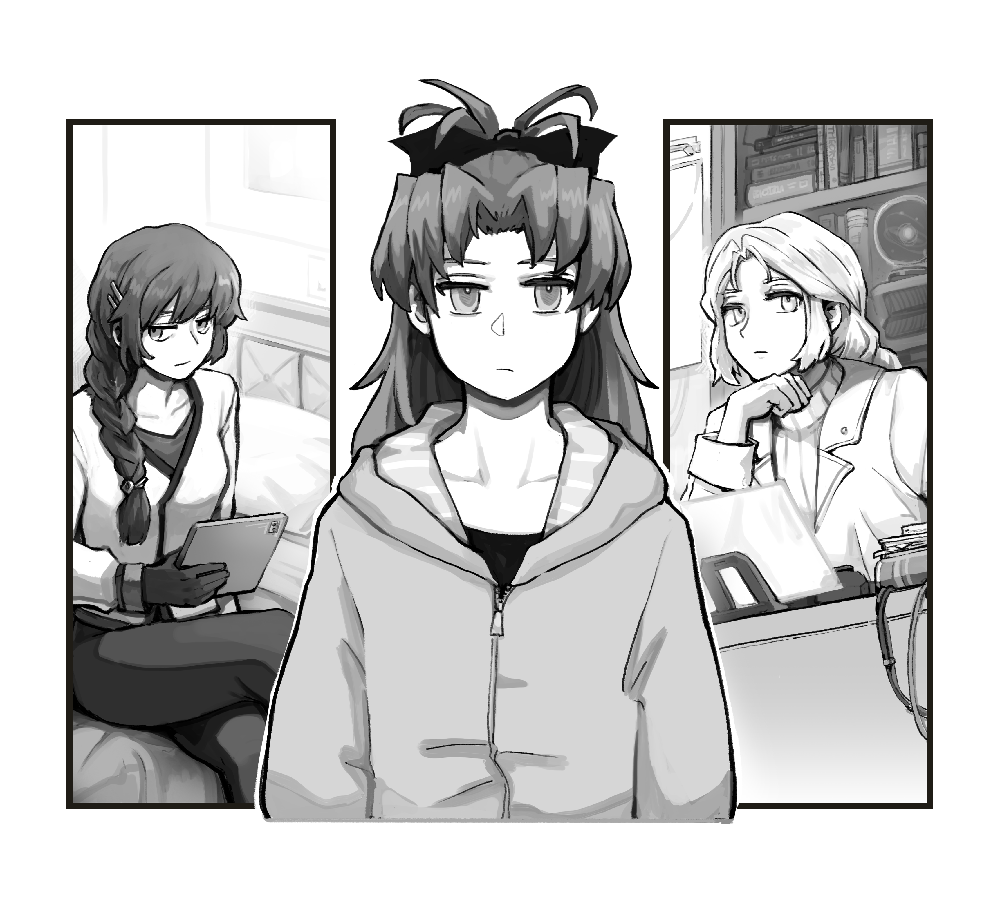

# 第八章 政与教

“在开始答题之前请同学们注意：我们考察的重点是大家对所学知识进行表述和讨论的能力，而不是知识本身。另外，在考试期间我们会对大家的网络访问进行一定的限制。”

“姓名？”

〈出于隐私原因没有公开〉

“请简述现行执政体制度的设计目标，并论述这些目标是否已经达成。”

现行体制宣称有三个设计目标。

第一个目标，是在保持民主政体优越性的同时尽量避免它的缺点。这也就是说，政府必须服务于人民的福祉，也必须让每个公民都能感受到自己拥有的权力，从而得以减少民间的不满情绪。但另一方面，现任体制也希望能够解决直接投票作为信息传达机制的非最优性，避免让个人魅力或者集团利益造成过度影响，以及提高民主政府慢如蜗牛的低劣效率。

第二个目标，是将机器智能的权益统一到人类社会中来，从而充分发挥她们的能力。在这一过程中，既要避免双方产生冲突，也不能偏袒其中之一。执政体尊重 AI 作为知能体的独立地位，并且充分吸纳她们巨大的思考能力，以便让政府的运行变得更加顺畅。

第三个目标，是尽可能运用人类可以理解的方式来进行政府的日常运行。这样关心时事的公民们可以从中理出一个清晰的脉络，而不需要面对一堆不明意义的中间优化问题。

至于这三个目标有否真正达成，现在还只能说有待商榷……

〈提示：用户注意力呈下降趋势，根据用户对义务教育公民学了解程度的纪录，建议将内容标记为冗余。特别标注的感兴趣内容例外。〉

虽然政府的运转十分高效，在防止民众动乱方面做得很好，人们也普遍认为其促进了公共福利，但普通民众对执政体那些常常被看作是从高层莫名传下来的决策并无特别好感。

这有着两方面的原因。首先，人类巨量的人口规模能够轻易地淹没任何个人意见。其次，民众对政治也并没有那么感兴趣；现今即使是在地方一级，公民对政治的参与也处于历史最低水平。大部分人都认为，与各种各样远更有趣的活动相比，参与政治没什么价值。

政府也未能真正让其运作能为人所理解，尽管目前还仍未可知如此体量的组织是否真的做到这一点。问题的关键在于所谓的“克苏鲁难题”，这是著名政治学家弗雷德里克·埃瓦尔德创造的一个术语。作为最早批评现行政府体制的人之一，埃瓦尔德指责执政体是如此的难以理解与陌生，简直就像“洛夫克拉夫特式的外神”一样，对于人类和AI来说完全无法理解。

具体来说，这一术语指代的是这样一个事实，即一个在任何单一方面都很好理解的政府，其所有部分合在一起时却很可能变得无法理解，这一问题很适合用以描述执政体，因为没有人能理解其总体运作。

这就值得思考了：一个没有人能理解的政府能负起责任吗？唯一能让人心安的是沃洛科夫公式，其保证了执政体系统至少在试图促进人类的福利。

只有在第二个目标，即将AI统一到人类社会中这方面，执政体可以说取得了彻底的成功。AI与人类现今已经近乎完全和谐地共存，这与过去许多人想象的反乌托邦情景相差甚远。

“简述执政体的结构，重点介绍其委员。”

按照官方定义，执政体是一种由AI辅助的，人类可理解的抽象民主政体。其是作为众多统一战争前的理论家推崇的，由实用主义AI做主的技术统治论的代替而创建的。因此，执政体旨在产出在数学上尽可能接近技术统治论理论的结果，但其内在机制则完全不同。

选民——不只是人类，还有所有知能体——的利益被分配给各委员负责，每位委员都被设计成或命令要尽可能地促进其负责主题的利益，这些利益既有具体的也有抽象的，从易于理解的“见泷原市粒子物理学家”到相对抽象的“科学与技术”都有。

每位委员都能与其他委员合并——通过直接合并或成为辅佐AI两种方式——成为体量更大的上级委员，上级委员也能继续与其他委员合并，直至最终抵达执理会一级。除了最低级的委员外，每位委员都由许多其他委员组成，而除了最高级的委员外，每位委员又都是几个不同的上级委员的一部分。

委员集合成的委员会构成了几乎所有决策的核心。委员会有常设的，例如中央经济委员会，也有临时的，决策权的分配与委员会的构成由特别管理委员会在专业辅佐AI的辅助下决定。这些委派是通过计算某项决策对每位委员负责的所有公民的边际效益来决定的，详细过程在此不做赘述。

享有最高决定权的是执理会，其拥有最高统治权，权力仅受几项核心权利所约束。委员的创造——对人类来说则是委任——与去职由执理会在MAR（委员代议权分配机）的建议下处理。

委员会的VR会议自然是在加速时间下进行的，并且通常会加速至计算机的能力极限，委员们也常常会同时参加不止一个会议。这种安排使得占了地球约31%计算力的执政体能够以惊人的敏捷做出决策与行动。只有在城市与更低一级，决策权才被移交给一个更简单的系统，即由低级知能体、半知能体与执政体官吏组成的官僚体制。

设计如此错综复杂的组织结构的总体要点是为了至少在理论上维持系统的人类可理解性。这确保了对于政府的每一项决策，感兴趣的公民都能查阅以及回放做出这项决策的VR会议。会议以标准的人类方式进行，包含陈述、讨论、辩论以及偶尔发生的虚拟斗殴。虽然这需要对会议进行大量提炼以及放慢时间，但执政体认为这些资料非常重要，这对政府来说也是一个意识形态问题。

“解释人类成员是怎么融入执政体的日常运作的。”

〈提示：本节内容因属于用户自述的感兴趣领域（社会学：历史背景，社会学：后人类，哲学：存在主义）而未被标记为冗余。〉

在过去的观察家看来，全部由 AI 担任的执政体委员机制可以说是令人费解甚至有害的 —— 毕竟要考虑到知能体的总数中有 47% 还是人类。但是一个人类想要进入执政体的日常工作中，还有很多技术问题需要解决：所有委员会议都需要在加速时间中进行，并且安排上往往相互重叠；所有委员都需要保证绝对的零腐败；而且在必要情况下，每个委员的思考活动要能随时聚合到总委员或者分解到子委员。

当然，现在这些问题都已经解决得差不多了，而以 AI 为核心的政府体制也不再是问题。当今的人类委员是世界上强化程度最高的一群家伙。他们都进行了大范围的脑改造，加装了 “永久清醒模块”，随时连接着计算阵列，并且把一部分的神经元做了备份。每名委员都配有一个辅佐 AI。这名 AI 在他或她相连的计算阵列里运行，既是在辅助人类处理一些事务，也是在监督着自己的人类部分尽心工作，不能腐败。委员们都会把自己的记忆和一些次要性思维活动下传到脑外，所以他们可以同时在多个会议上侃侃而谈，一边还不耽误自己的人类生活，比如吃饭。

为了应对某些人关于委员们已经太过偏离人类的担忧，他们每个人都必须定期自检，以确保自己仍然符合沃洛科夫准则 —— 也就是说，确保自己即使断开网络连接也还是一个精神正常，生活自理的人类。自检不合格的委员则会被责令改善自己精神和原本肉体的结合，直到达标为止。

“简述执政体的各级紧急模式以及触发条件。这里指的是种族级别的紧急模式，而非地方级别。”

〈提示：以下为冗余内容〉

执政体紧急模式是为了以递进的效率运作政府、军队以及人类社会而设立的，但其在社会习惯、公民自由和政府意识形态方面需付出巨大的代价。因此，紧急模式只有在最危急的时刻才会启用，而迄今为止，只有最低一级紧急模式启用过。

**四级响应**下将召集所有执政体委员出席的紧急会议，以确保每位委员都会为眼前的问题分配一定的计算时间。四级响应上一次启用是在欧罗拉殖民地被攻击后，并在新雅典之战三周后取消。

**三级响应**需要在四级响应召开的会议上通过多数决议启用，通过后，执理会全体成员将合并为一位总委员“执政者”，以此囊括每一位人类和AI委员、辅佐AI和绝大多数军事AI。 这位总委员将实际地行使主权，真正实现当今政府仿效的技术统治论。

据推测，三级响应只有在地球即将遭受入侵时才会启用。没有人知道三级响应究竟会是什么样子，哲学家们则争论这样的一个AI究竟是更接近最高独裁者还是哲人王。

**二级响应**由“执政者”决定何时启用。每位公民都将被动员参军，且其大脑与最近的网络主机间将开启直接双向接口，以允许传输命令与信息。需要强调的是，这些命令并不会产生任何强制性效果，仅仅只是命令而已。到了这一地步，“执政者”就代表了人类种族。公民核心权力将被暂停，政府可行使已恢复的处决与即决监禁等权力。

二级响应从未启用过，预计其将在地球遭到实际入侵以及地球即将失陷时启用。根据目前有限的证据推测，外星人的社会是以一种永久的二级响应形式运作的。

**一级响应**只有在90%以上的人类公民与AI的直接批准后才可启用。一级响应下，民用应急安装包将永久激活，使得一切人际交流均通过技术手段进行。虽然此时下发给个体的命令仍然是非强制性的，但一级响应本身显然就代表了一个骇人的事实，即其只可能在人类文明即将毁灭的情况下启用。据推测，孵化者的社会类似于一级响应状态。

—— 试卷文本摘录。小学六年级国民教育课，测验 1，成绩 “优”

“如果我也能像凯库勒 (Kekulé) [^1]那样讲出一个精彩故事的话，那应该会显得很帅，比如说梦见了噬身之蛇什么的。但是我的故事其实很老套。”

[^1]: 译注：凯库勒，德国有机化学家，发现了苯的分子结构 <http://en.wikipedia.org/wiki/August_Kekul%C3%A9>

“当时，我自然也已经知道比勒陀利亚惨案的事情了 —— 白天在新闻里看到的。我对事件背后暴露的深层问题感到极度不安。最后甚至一整夜都没有睡着，一直在思考着这个问题。”

“对于我们而言，这简直就是绝大的耻辱。我们制造了这些智能体，把机器交给它们控制，但却无法保证它们一定会善待我们。现在已经因为这种事情死了人，而肇事的机器甚至到死都不明白自己到底做错了什么。噢，当然它知道我们会对它的行为有所不满，但是它无法理解背后的理由。”

“作为机器人专家，作为计算机科学的研究者，我们责无旁贷。以前有过这样的电影，一个 AI 失去了控制，开始成千上万地杀戮人类[^2]。那时的我们根本无法保证这样的事情不会真实发生。我们做不到。我们只是小修小补的技工，盲目重复着经过实践检验的成功方案，但其实根本不理解其中的原理。我们甚至不知道该如何提高那该死的成功率。”

[^2]: 译注：这一段是有现实背景的
<http://en.wikipedia.org/wiki/Deep_learning#Criticisms>

“第二天，我召集全体人员开了组会。但是显然，大家坐在那里空谈一番也不会有什么实质作用。人们已经在这个问题上纠结了几个世纪。你显然不能指望开一次会就能奇迹般地找到解决办法。”

“那天晚上，我在实验室里待到很晚，和拉普拉斯（实验室 AI）一起来回翻看着那堆数据集。我们盯着无数份来自 AI 的内存转储和行为记录，想从里面看出点什么规律：哪怕是一点小东西也好，至少那样，我们就对事件发生的背后原因稍微多了一点理解。”

“大概是因为喝了十杯左右的咖啡？我不知道。那简直就像是童话剧本，对吧？比勒陀利亚惨案的第二天，整个实验室空空如也，只有我和拉普拉斯说着话，旁边放着一大壶咖啡。然后灵光一闪，我**看到**了。拉普拉斯都以为我神经了，突然滔滔不绝地自言自语起来。原来这一切就是那么简单！”1 

“但是也很显然，问题其实没有那么简单。在灵光一闪之后，紧接着就是一年的辛苦工作，我们忙得天昏地暗，想要找到一个严密的论证，然后再从各个角度进行反复确认……”

“现在，我觉得我必须得说一句：ACM 拒绝承认智能机器的获奖资格绝对是一件彻头彻尾的蠢事。2 这个奖有我的一半，就得有拉普拉斯的一半。一年到头，一直是它在没日没夜地分析计算，然后从大量的信息里过滤出需要汇报的东西向我转达。我们这份工作里面，所有的‘重劳动’全都是它一个人的功劳。我说，大家看，这可是图灵奖啊！”

—— 人物专访，2146 年图灵奖得主，弗拉迪米尔・沃洛科夫

1据魔法少女行会证实，这一灵感的发生时间和同一天里的某次许愿极端接近。不过按照许愿者本人的要求，我们没有刊登她的姓名。

2ACM 在 2148 年取消了这一限制。

---

显然，杏子所在的四十层入口并不是这栋楼的‘正门’。所谓的‘正门’在下面很远的地面一层，里面有机器人导游，历史文物展，还配有以前魔法少女躲避警察的夸张故事。她们甚至还点缀了一两座雕像，好让色彩生动一些。

而这里则是员工入口。顶级‘员工’专用的。

这里刻意设计得比较低调，只是在楼面上安了两扇有机玻璃门，然后在边上涂了一圈白线防止别人不小心撞到。外面搭配的是一个小型的降落用阳台，上面加了个透明屋檐遮挡风雨。人工石材制成的无数窗台点缀着大楼本身那呆板的玻璃 - 钢铁结构，在这个时代的建筑设计中已经蔚然成风。同样材质的行人走廊和无色透明的汽车通道在空中穿插交错，放在一起显得颇为和谐。

杏子向前走去，两扇大门静静滑开。当然，她很清楚在刚才的一瞬间，自己已经经历了难以计数的安全检查。但她并不担心什么。这里是联盟的地盘。

现在已经没有了从前的那些人类保安或者前台小姐。大门里面直接就是环绕大楼外圈的圆形过道，还有一个通往内部的走廊。

杏子直接走进了这条走廊。两边是一排排的办公室，里面坐着行会高管和政府委员。具体来说的话，在这一层和下面一层坐着的人，都是跨星球乃至全宇宙范围事务的负责人。至于负责地方事务的人 —— 都直接在地方上办公。所以负责日本全国事务的官员们就在这栋楼再往下几层，继续往下几层是县级官员，而负责见泷原市的人还要往下[^3]……

[^3]: 译注：相信大多数人都知道日本县比市大吧

显然，所有这些人都是由真的手下，要么是她‘政府关系主母’身份的下属，要么是她‘魔法少女委员’身份的子委员。

当然，把子委员说成手下并不全对，因为她们的意见会直接影响到由真本人的 “官方” 意见，而且很多子委员同时也是构成其他总委员的一部分，还有…… 嘛，总之很复杂。不过属于行会的那些行政人员倒可以说是由真的真正手下。

脚下的地毯，墙上的绘画，旁边那些小墙洞里的雕像，还有大厅的整体风格 —— 这一切都在不着痕迹地炫示着它们背后的财富和岁月。周围的每一扇墙壁似乎都会在你耳边低语，告诉你这栋大楼所拥有的资本远非单纯的分配券可以衡量，而它的古老更是远远超过你的想象。

至少别人是跟杏子这么说的。但她本人完全没有这种感觉。也许是因为她所经历的岁月早已超过了这栋大楼，超过了整个组织，也超过了由真本人，甚至可以说几乎超过了这栋楼里的所有人。

大多数的办公室都是空的。它们的主人或是待在楼内的其他某处，或是处于地球上的另一个角落，或是干脆选择了在家工作。毕竟，如果人们还得整天呆在办公室里，那这又怎么能叫做未来时代呢？

杏子径直向前走去。旁边的房间里或是大门紧闭地开着秘密会议，或者是一帮人口沫横飞连比带划地开着公开会议。办公室里的职员们躺在椅子上，或是一动不动地发着呆，或是手脑并用地操作着全息界面。也许里面显得最为特别的就是安详地坐在椅子上一动不动，像是在睁着眼睛冥想的那些委员们。只有在杏子走过的时候他们才会动弹一下，礼节性地点头示意。这些人自然就是那些 AI 了。他们可以毫不费力地在办公室里维持一个全息形象，和路过的人打打招呼 —— 不管他们的主意识现在正身在何处。

杏子向着所有对她打招呼的人以及她能认出来的人挥手示意。说实话，很多人的样子她都记不得了，但这不是什么大问题 —— 如果觉得谁值得注意的话，仔细看看发动人脸识别就可以了。

在走廊的尽头空间突然展开，延伸出了一个直径四十多米的大礼堂。礼堂的左右两侧另有两条走廊通往外面。周围的墙壁和拱顶上画着朝向内侧的地球地图，上面用明亮的全息流星徽记标出了行会政府关系部的所有办公地点。考虑到这里只画出了地球上的部分，杏子一直觉得殖民地支部的人会对此感到不满。

杏子和周围长凳上聚集聊天的几个行会人员打了招呼。那边是两名魔法少女加上一个罕见的普通男性，他们也点头回应。

在人手紧缺的当下，构成行政班子的全都是那些正在养家带孩子的人，魔法力量难以用于作战的人，还有那些公认待在后方比冲上前线更有价值的人。年龄最老的那些女孩基本都算在了最后一类人里，这是为了保护她们的宝贵经验。虽然表面上看，这对之后契约的那些人不太公平，但这么做也是必要的。

当然，这也导致了那些新人会背地里管杏子这代人叫 “老祖宗”，就好像她们是些弯腰驼背的千年老树似的 —— 虽然从外貌来看大家都一样年轻。

作为一种同甘共苦的表示，很多行政人员和技术人员每年都需要抽出几个月，轮换到巡逻、哨位或者别的什么轻战斗岗上。最最起码，每人每年都必须参加一次魔兽讨伐，这也就是所谓的 “年度狩猎义务”。这条规定是一项古老传统，一直可以追溯到行会初期的第一名得以专门从商的成员身上，而且历经几个世纪也没有要废除的迹象。就连麻美和杏子这样级别的人物也必须遵守。

杏子继续前进，走到礼堂正中，然后向上看去。

拱顶的中心部分和她脚下的地板都是透明的。这栋大楼的每一层都设计成了这样。这些楼板晶莹剔透，纤尘不染，杏子可以一直看到最头顶的天空和最下方的地面，而且还看得一清二楚。不过虽说低头可以看到楼下的人，但抬头的话你只能看见天空 —— 上面的人都被过滤掉了。低调的高科技。

她的视线重新落在了礼堂对面的双开大门上，继续走了过去 ——

然后在半道上停了下来。就像是在迎接她一样，面前的老式木门自行打了开来。

“姐姐！” 悦耳的童音响起。一阵强光闪过，然后一个绿色的影子就已经扑进了她的怀里，把杏子撞得喘不过气来。接着袭来的就是几乎可以把她肋骨压断的热烈拥抱。

就事论事的话，这位小女孩也和她们所有人一样，确实可以轻易压断一般人的肋骨。现在她用的力气倒还没有那么大，不过已经足以让杏子有所联想了。

“呃，由真，你好，” 杏子还是勉强说出了话来，看着抱在她腰上的这只幼女。她用圆形发卡绑着双马尾，就和很久以前还是真正幼女的时候一模一样。小女孩看着她，眼睛忽闪忽闪。

杏子亲切地拍了拍她的小脑袋。

看到现在的由真总会让人觉得有点违和。自从战争打响以来，由真就在有意地利用她在见泷原四人组里的小妹妹地位，开始刻意地扮演起了这种形象。在过去的二十年里，她一直在缓慢地降低自己的外表年龄，最后定格成了现在的样子。她其实可以做得更快，但她不想让周围的同事们对突然的变化感到不安。

出于种种理由，大多数魔法少女都不会轻易把年龄退回青春期之前，不过由真不用在乎。稍稍减弱的战斗力对她没有什么影响，而她植入的一堆强化装置也足以抵消可能造成的智力退化。最后…… 性欲是什么？能吃吗？

至少由真本人是这么解释的。但关于杏子的下流玩笑她还是照开不误 —— 当然是私下里。这让杏子感觉很不协调。

至于由真这么做的原因……

嘛，只要看看周围人们的反应就能明白。大家都停下了手里的工作，用羡慕嫉妒的微笑眼神看着杏子。显然她们都觉得这样的由真非常可爱。

由真选择这个形象的目的是解除他人的心理防线，勾起人们本能的保护欲，并且增加辩论的成功率。大多数人都不会认真反驳一个小孩，甚至连 AI 也难以脱俗 —— 他们的程序里大多植入了一定程度的人类本能。由真可以轻易成为意见领袖：媒体和公众都很喜爱她现在的形象，而对二十年前的那个成年人则选择了淡忘。至于对她暗箱操作的指控，对她过度集权的攻击，或者是暗之心周围的阴谋论等等负面言辞则会轻易被口水淹没，人们最后总是觉得这类说法难以接受。

这是纯粹的宣传需要。想想看，一个九岁的女孩参加着权力顶峰的委员会会议，用歌唱般的童音和一本正经的高官们争吵辩论。这很容易吸引人们的眼球。

啊，算了，不管了。杏子想。

杏子傻笑着将两手伸过由真腋下，一把把她抱了起来，就像逗孩子玩一样在空中转了个圈。由真在她怀里扭动挣扎，而旁边的女性职员们则羡慕得纷纷叹气。虽然按理说，她们天天在由真手下工作，理应是最了解 “小由真” 本质的才对。

“很高兴见到你，杏子小姐，” 甜美的女声响了起来。声音的主人出现在了杏子的右侧。娇小的少女形象直接在空气中浮现，构成她的体素瞬间定位。

“啊，M，我也很高兴，” 杏子礼貌地回答。

“M” 是 “MG” 的爱称，而 MG 则是 “魔法少女委员・辅佐 AI”（Governance: Magical Girls—Advisory AI）的英语字头。无论是辅佐职务还是正式委员，大多数的类似 AI 都会在日常会话中选择一个普通一点的名字，但眼前的少女 —— 大家都当她是少女 —— 似乎很喜欢 MG 这个奇特外号。

作为辅佐 AI，MG 的职责是由真政府身份的助理。她为她提供紧急备份，存储她的部分记忆，同时也是监督她的反腐看门狗。和所有类似的人类 - AI 配对一样，由真和 MG 几乎形影不离。两人一起生活，相互代替对方出席会议，甚至连两人的脑部都是直接相连的。从某种意义上说，这几乎就像是结婚。

由真在 MG 创造之初便亲自在场，所以她成为了能够亲自引导一位辅佐 AI 成长过程的少数幸运者之一。在她以前担任公安委员的时候就没有这么走运了。当时那个辅佐 AI 看起来像是福尔摩斯和警察总监的混合体，不过待人接物的态度比外表要友善一点。好像由真现在和他还有来往。

MG 礼节性地鞠了一躬，如果杏子没有抱着人的话也会还个礼。考虑到她所代表的是哪个群体，MG 选择的人物形象是一位魔法少女。和很多 AI 的选择一样，少女的种族特征完全无法分辨。她的外表年龄和杏子相仿，身上穿的绿色连衣裙接近由真的变身服装，然后用一个大蝴蝶结在脑后绑了条长长的马尾 —— 和杏子一模一样。

这让杏子暗自有点得意。但偶尔她也会猜测这到底是不是由真出的主意。

但是无论 MG 长得多像人类，她还是用明显的方式表明了自己的 AI 身份。首先，尽管她的形象是一个变身后的魔法少女，但她还是保留了手上的戒指和指甲纹。她的戒指上只有 “MG” 两个简单符文，使用了常见于其他少女戒指上的那种魔法文字。而她的指甲纹则是 “1/0”。但要说她身上异于人类的最大特征，还得看她的右眼。和大多数的 AI 形象一样，她的右眼里并没有虹膜和瞳孔，只有 “I/O” 的黑色文字。

最后也是非常明显的一点，她只是一个全息影像，无法接触实物。

和绝大多数 AI 一样，她对自己的身份感到颇为自豪，甚至到了有些骄傲的地步。

由真又在杏子的怀里扭了一下，示意她把自己放下来。这次杏子照做了。

“总之，我就是打个招呼，”MG 解释说。“你俩需要一点隐私对吧？”

“对，” 杏子说。

MG 对杏子使了个眼色，然后在一阵迷乱的光芒中消失不见。

“她又不是真的消失了，” 杏子嘟哝着，和由真一起向前走去。由真毫无理由地迈着大步。

“正好相反（Au Contraire），姐姐，” 在走向大门的途中，由真兴致勃勃地说道。“她一向尊重我的隐私。这是我们 deal 的一部分，她必须遵守。”

她说 “deal” 的时候用了英语的传统发音。地道的重音变化额外强调出了人类标准语没有的那个特殊发音。

身后的大门自动关上。

“说得好像我会信似的，” 杏子说，下意识地双臂交叉。“她是直接连在你脑子里的，你也很清楚。”

“你个电器音痴，” 由真教训道。

杏子在她面前的椅子上坐了下来，等着由真绕到桌子的另一侧。

面前的办公桌庞大无比，桌上浮现着无数道全息视图。桌面上印着两颗闪亮的流星，轨迹平行，方向相反，算是行会和执政体两个徽记的一种融合。她左边堆着一大堆各种各样的孵化者布娃娃，叠了足足三尺高。它们大大的红眼睛和摇摆的长耳朵（还有耳环）是所有小女孩的最爱 —— 只要家长肯买给她们的话。

房间四周悬挂着巨大的风景画，基本都是草地、稻田，或者别的类似场景。角落里则散落着更多的毛绒玩偶，不过这次的对象动物要显得平凡很多。有些玩偶硕大无比，把其它的东西都比了下去。而另一些则明显能看出经历过仔细的修补。这些玩偶跨越了无数个世代，从她的真正童年一直保存至今。

由真爬上了她的大椅子。她身后一个巨大的观景窗里正显示着阴雨之下的见泷原市。和房间里的陈设相比，由真本人的个头简直可以说是微不足道。她的脑袋只高出桌面一丁点，而且很明显可以看出来，她的两脚正耷拉在空中摇晃着呢。

“小由真，今天你的主意识来了百分之几？” 杏子问。

“百分之二十一，” 由真干脆地回答。“怎么了？”

“就是问问，” 杏子耸了耸肩。

由真奇怪地看了她一眼。

不过她也没多说什么，只是往旁边俯下身子。等了一小会，她端上来了一个托盘，托盘上放着一盘麻糬和两杯橘子汽水，摆得有点不太稳。

“噢，多谢招待，” 不等由真说话，杏子就答了一句，然后伸手拿了一杯汽水。

“总之，今天你来有什么事？” 由真嚼着点心说道。“肯定很重要对吧，你连吃的都没有顾上拿。”

“你说什 ——” 杏子本能地掏了掏兜。

她急忙回忆了一下之前的状况，然后突然意识到，由真说的一点也没错。从早上离开麻希身边开始直到现在，她根本还什么都没吃呢。她一起床就径直走出了房门，把桌上做好的西式早餐晾在了一旁。

她慌忙在身上到处摸了摸，但确实什么都没有。

由真作势移开了视线。

“噢，天啊，” 小女孩捧着自己的脸颊说。“姐姐终于长大了吗？过了四百年，你终于不用再靠这种事情找安全感了！我简直为你感到骄傲了！”

“我很忙，” 杏子粗声粗气地说道，从盘子里一把抓起了一块麻糬。“精神不太集中。”

由真嘴角抽搐了一下，但是马上就一脸认真地趴在了桌上 —— 也就是说她几乎整个人都趴上了桌子。

“不过这真的已经很反常了，” 她严肃地说。“一切都还好吧？”

“很好！” 杏子转过脸去，坚持道。她很清楚这种回答一听就很可疑，但是她绝不会在由真面前 —— 尤其是不能在由真面前 —— 承认她居然被自己床伴的事情搅得心绪不宁。

由真重新坐了下来，一脸不屑，不过没有接着问下去。

“不说那么多了，” 她说。“直奔主题吧。告诉我到底发生了什么。这可不是一次单纯的日常拜访，对吧？”

由真用小拳头拄着自己的脸颊，跟着脑内歌曲的节奏前后晃动着她的小脑袋。有时候杏子真的想不明白，由真到底是怎么处理肉体年龄和精神年龄的认知冲突的，希望她没有烧坏什么吧。

杏子刚要开口叙述，就想到了一个更简单的办法。

她没有开口，而是把五万字的悲叹立方审计报告全文直接转给了由真。

由真眨了眨眼，偏了偏头，这个动作让她的发饰抖了一抖。和预想的一样，她很快就掌握了报告的内容，至少是总结部分。

由真把手上一口未动的麻糬放回了盘子里。

“这很有趣，” 她说。“而且很令人不安。我们设计分配系统的时候是特地考虑过如何避免这种偶发性供给不均的。我最清楚了，当初安装的时候我可是一直在旁监督的。”

她说话的时候自始至终都带着小孩腔调，但现在里面已经隐隐混入了只属于成年人的怒意。

“我也知道是你监督的，” 杏子盯着由真的眼睛说道。“这就是让我不安的最大理由。麻美也有同样的感觉。”

看到由真眼里精光一闪，杏子不由得下意识地改变了一下坐姿。由真本人则是深深地陷进了椅子里，示意杏子继续说下去。

“显然这不是我们的专长，” 杏子说。“但我们教会正在调查这件事。至少从表面上看，系统的运行状态是完全符合设计意图的。”

“那是自然，” 由真低哼了一声，语调顿时显得成熟了很多。“这可是史上安全系数最高的系统之一，拥有无数的应急备份。不过不管怎么说，现在它显然没有在正常运行。”

“不过我们还没有机会检查那些负责终端配送的半知能体，也没有和相关的知能体搭上话，” 杏子说。“我们没有权限，而且这么做也会让我们的调查行动暴露。但是至少可以确定，目前所有自动系统的运转都是完美无缺的。”

在这个时代的口语里，“自动” 已经不包括 “由 AI 运行” 的部分了。

“嗯，自动系统，” 由真说着，眯起眼睛，若有所思。“当然，并非所有系统都是自动的。”

“我也找了麻美想从她那边查一下，” 杏子说。“但是她也不知道她能查到什么程度。她跟我解释过，她和负责具体事务的人之间隔了好几层军官团，不和他们搏斗一番的话是找不到她想找的东西的。”

由真靠在了椅子上，神情严肃，和她刚才的小孩姿态早已判若两人。

“没错，” 她用手拄着脸说。“而且军队负责的只有系统的表面部分。越到里侧，执政体所控制的部分就越多。过了某个点之后，内部的东西就已经不在麻美的权限之内了。当然，最后结果怎么样也和出现问题的具体位置有关。”

由真移开了视线。

“不过也有另一种可能，” 她说着，重新对上了杏子的眼睛。“也可能是有人在这份报告背后做了手脚，可能是你组织内部的人，也可能只是有人提供了假消息。”

“你是在说教会里的人在误导我吗？” 杏子看着由真问，表情微微扭曲，明显带上了一丝敌意。

“姐姐，你的教团可不是天衣无缝的，” 由真冷静地答道。“你也很清楚。总是有些人对你看不惯的。我只是在陈述一种可能性。另外，如果是假消息的话，那也未必就是教团内部的问题。”

杏子叹了口气，点头表示理解。无论如何，她的教会还是和基督教有些牵连，某些规矩也不是她说废除大家就会乖乖听话的。颇有些人对她在性方面的开放态度表示不满，更不用提她本人那些众人皆知的…… 私生活了。

“但是做那种事的动机会是什么呢？” 杏子问着，突然发现自己手里还攥着一块麻糬，赶忙咬了一口。

由真一动不动地坐着，但杏子不用问就能知道，她正在 “重新分配思考资源”。在政府深处的虚拟会议室里，由真拟体们的双眼变得黯淡，整个人也变得沉默起来。她们的计算资源都被抽到了调查工作上，或是被用来思考着和杏子的对话。

“想不出来，” 由真说着，眼神阴暗起来。“也许就是想要我们反应过度？我只能想到这个。所以我们更应该低调行动了，就像你和麻美现在的做法一样。”

她坐直了一点。

“不过也别跑题太远了，” 她说。“我只是提出一种可能性而已。这份报告的内容几乎可以肯定是真实的，这样的话，就另有不同的意味了。”

“你觉得这和访谈部分的内容有没有联系？” 杏子问。“就是一去不回的负伤女孩那件事？这并不是这份报告的核心内容，但我对那里很在意。”

由真直直地盯着杏子的眼睛，杏子不由得抖了一下。

这感觉和她此前面对良子祖父的时候很像，但这一次要强烈得多。不如说，和由真比起来，昨天那些根本不算什么。

这种感觉就像是你谈话的对象并非人类，至少不是她四百年前印象里的那种。同时她也会感觉到，或许，自己也早已不再是人类了。

“这种个人印象是出了名的不靠谱，” 由真说着，靠回了椅背上。“而且调查灵魂宝石严重消耗的伤员的话，她们的总存活率也一直保持稳定。现在还没有足够的证据。”

“但是，” 她继续说，伸出手指阻止了杏子的插嘴。“这的确也能说得通。”

“说得通？” 杏子问道，感觉有些奇怪。“你是什么意思？”

“姐姐，想想吧，” 由真说。“如果某些女孩的悲叹立方遭到克扣的话，会造成什么结果？没有足够的悲叹立方，一旦遭遇战斗，她们就很难维持灵魂宝石的纯度，接着 ——”

“她们中的很多人就会受到致命重伤，然后被送回后方治疗，” 杏子接茬说着，恍然大悟。

“然后就可能会在那里失踪，” 由真做出了结论。

她停顿了一下。

“当然，” 她说，“这种思考方向已经很有点阴谋论的味道了，但是说实话，我这辈子的生活整个就是一场大阴谋，你的也是。”

杏子点了点头。这说法倒也算是巧妙。

“但是动机呢？” 杏子问。“他们是想要降低我们的作战表现？妨碍作战 —— 不，这不可能。如果这一切都是真的的话，那被送回来的女孩子之间肯定会有什么特别的联系。或者纯粹就是想要减少我们的人数？但也不对，如果达到这种程度的话肯定会在别处的统计数据上露出马脚。”

“这都是可能的动机，” 由真说。“而且我想到的还不止这些，但是现在说什么都没有证据。还有就是要记住，所谓的失踪只是个人陈述。”

由真微微笑了笑，稍稍改变了谈话的气氛。

“不过我会去调查的，” 她说。“这就是我坐在这个位置上的意义，不是吗？还有，你是准备吃掉它，还是想再拿上个一小时？”

她指着杏子手里的麻糬。

“啊，对，” 杏子说，有些做作地又咬了一口。

“小由真，我这次来不光是为了这份报告，” 杏子一边笨拙地嚼着嘴里的麻糬，一边说。“还有另一件事，我还没来得及告诉麻美。这可能和报告里的内容有关，也可能完全就是另一码事。但我们可以确信，这一次肯定是有人在背后搞鬼。”

由真微微点了点头。

“这么多一本正经的事情搞得我很累，” 她皮笑肉不笑地说。“不过说吧，到底怎么了？”

又一次，杏子想要开口说话，然后又改了主意。

**战术电脑，** 她说。**整理一下相关的记忆，然后发过去。**

**了解，** 然后她就感觉到了发送结束。这种感觉是一种达成感，就像是终于解决了某件一直晾在一边的工作。不太好形容。

由真又是偏了偏头，处理着发来的信息。不过这一次她花了不少时间才回放完杏子发来的内容。毕竟记忆重放还是和文字有所不同。

杏子利用这段时间吃完了麻糬，然后灌下了大半杯饮料。

由真终于吐了口长气。

想让由真动摇并不容易 —— 当然动摇杏子也不容易 —— 但这一次，由真脸上的自信已经比刚才消退了几分。

“这非常令人在意，” 她轻描淡写地说。虽然她的视线仍然对着杏子，但杏子有些不安地感到，由真真正看着的并不是她。

“我就知道，” 不过杏子还是说了出来。“自从我们完成了全球化以来还没有人玩过这种花样。毕竟谁都没有这么做的理由。”

“你说得不对，” 由真两肘拄着桌子，直接反驳道。“还记得汉德森谋杀案吗？当时茜拉・汉德森用类似的手法杀了两队人之后，灵魂卫队才反应过来。她最后被执行了‘格式化’。还有岛田暗杀，还有开罗那次 ——”

“OK，OK，” 杏子举手投降。“我明白了。我记不住这种事。不过和你一样，我还是很在意。”

“对，” 由真赞同说。“更不用说悲叹立方偶尔会有些，呃，特殊用途。”

每次这种时候杏子就会切实感受到，由真的办公室已经保密到了什么程度，她居然敢把这种事情就这么直接说出来。

“总之，” 由真继续说道。“我刚看了那群魔兽的讨伐报告。它们很难缠吗？”

杏子耸了耸肩。

“魔兽的密度比平时大得多，” 她说。“不过看到它们是从哪里生出来的，一想也就明白了。”

“你没有保留任何样本，” 由真说。这不是问句。

“当然没有，” 杏子冲口而出。“你应该也感觉到了吧，里面的瘴气已经快要涨出来了！那已经是严重危险物的级别了，绝不是人类能够安全经手的东西。”

由真无奈地叹了口气。

“姐姐，有的时候你真的很白痴 (バカ)，” 她抱起双臂，脸带不快地说，还特地在バカ上变换了一下声调。

“你吃的那些 Pocky 都跑到哪儿去了？” 由真接着说，在杏子面前晃了晃手指。“没错，说起来这倒也算是保密内容，但是你不觉得现在发生的一切有点眼熟吗？”

杏子眯起了眼睛，想要装出一副因为被看扁了而感到不满的表情。

同时为了掩饰自己的失态，她努力猜测着由真话里的含义。

“要攒出来召唤这么多魔兽的悲叹立方可不容易，” 由真说。“尤其是在现在物资管理这么严格的情况下。但是不说别人，你起码应该知道还有另一种手法也可以做到同样的事情。没有一下子注意到还算情有可原，但你起码应该往那边想一下吧？想想我们的过去吧。”

杏子继续盯着由真的脸。她想说什么？过去 ——

杏子瞪大了双眼。

“你难道是说 ——” 她试探着。

“当然，” 由真说着，再次两手交叉。“躲避审计的困难程度正是这种行为濒临绝迹的主要原因。汉德森的那些悲叹立方是她花费十年从自己的配给里慢慢省出来的，这也是碰巧赶上负责她那一片的官员是个蠢货。而岛田那帮恐怖分子显然是知道这个秘密的，开罗那群人也是。虽然例子不多，但是如果分析一下的话，还是可以看出来只有一小部分人才会舍近求远地用笨办法硬上。现在明白了吗，白痴？”

她直接爬到了桌子上，用手指戳了戳杏子的脸。

“我根本不知道那种事情！” 杏子辩解道，不过她已经意识到自己犯了个低级错误。“好吧，我现在知道应该往哪边想了，但是也别对我要求太高吧。我根本没有参与那些事情！你才是这方面的专家！所以我们才总是来请教你。”

“所以说你应该拿给我一点样本，” 由真说着，重新坐了下来，用责难的眼神看着杏子。

不过片刻之后，她还是叹了口气。

“但这也不能全怪你，” 她说，一只手拄着脸颊，撅起了小嘴。“过饱和悲叹立方这种事，毕竟你以前也只是间接接触过一次，而且我也理解你一下子反应不过来的原因。”

“很显然，” 杏子移开了视线。“那并不是我愿意想起来的东西。”

“现在也是覆水难收了，” 由真说。“如果我们能够得到确切证据的话，那怀疑对象的范围就可以大大收窄。知道还有这种方法的人本来就不多，知道具体该怎么操作的人就更少了。”

“对不起，” 杏子低头道歉。

“没关系，” 由真说。“这真的不能怪你。我就是拿你寻个开心，你这样我都不好意思了。”

“大家都拿杏子寻开心，” 杏子嘟哝着。

由真朝房间的某个角落意味深长地看了一眼。

“总之，我也会查一下这件事，” 她说。“起码我们也可以听听它们的意见。你当时碰见的那位给出的回答很难令人满意。”

说着，由真从桌上拿起了一个孵化者布娃娃，示意着 “它们” 到底是谁。

“你这么说我就放心了，” 杏子抬头说。

“还有别的事吗？” 由真问。

“应该还有。呃，你能消掉我来这里的记录吗？”

“没问题。”

由真点了点头，然后抓起了布娃娃的两条后腿，开始在桌上走着玩。

杏子看向由真身后的观景窗。她看到了外面终于开始放缓的雨帘，还有仿佛无穷无尽的摩天大楼。

由真似乎想到了一件什么事。

“那个 ——” 她停下了手上的动作，看着杏子开口说。

“由真 ——” 杏子也同时开口。

“什么？” 由真问。

杏子做了个不满的表情。

“呃，这可能有点尴尬，” 她说。“但是我在来的路上刚好想到了这件事。这个问题我想问你已经很久了。”

“那行，问吧，” 由真说着向下滑了滑，把下巴搭在了桌面上，然后把孵化者布娃娃摆在了自己头顶。

“很久以前，我听到焰跟你讨论过来生的事，” 杏子仔细地措辞道。“我一直很想知道你对那件事的真实想法。你相信来生吗？”

由真在桌上偏了偏小脑袋，这导致她头顶上的毛绒玩具滑了下来。

“姐姐想拉我入教？” 她问，语气中居然可以听出一丝疲惫感。“你下决心的时间可够长的。”

杏子摇了摇头。

“我只想知道答案，” 她说。

由真用胳膊撑着坐了起来。她抓起自己的那杯汽水，一口气喝了半杯。

然后她看着杏子。

“这个问题我以前也问过织莉子姐姐，” 她看着杯底说。“当时她的回答是，无论她花费多大力气，在自己死后的未来看到的都只是一片黑暗。”

由真咣地一下把杯子放了回去。

“不过她一直很信命，真的，” 她补了一句。“其实这也很自然。”

她又考虑了一会。

“也许，来生什么的其实根本没有意义，” 她耸了耸肩。“作为个人来讲，我会努力避免体会到它的意义。人生的意义就是让这个星球上的生活变得更加美好。啊，我是说整个现实世界的生活。”

“你当时的想法呢？” 杏子问。“我真正想知道的是这个。”

“不信，” 由真说。“不要误会。我其实是想要相信焰姐姐那些话的，真的很想。但是在经历过那样的生活之后，我做不到。”

她把椅子转了过去，看着窗外残雨之下的灰色城市。

“就在织莉子姐姐临死之前，” 由真轻轻地说。“我看到她最后一次试图捕捉未来的轨迹 —— 不是一般的未来，而是她自己的命运。然后她就在这次尝试中燃尽了自己的最后力量。现在我还记得她当时的眼神。我曾经花了很长时间，只想确认她到底有没有看到些什么。如果说我的态度里还有哪怕一丝不确的话，就只有这个了。”

杏子看着桌上闪闪发光的两颗流星。

“你应该找个时间过来看看的，” 她说。“缎带之间。我无法保证什么，但如果是你的话，应该是能看到些东西的。”

又是一段停顿，然后由真把椅子转了回来，看着她。

“现在你真是在传教了，” 由真说。

“我是认真的，” 杏子说，凝视着由真的眼睛。“我花了很多年想劝麻美过去看上一眼，但是她一直推脱太忙。你可是整天待在地球上，你们总部甚至就在同一个城市里。”

“改天吧，” 由真说，脸上露出的奇特微笑完全不符合她现在的年龄。“等我有时间了再说。”

“好吧，” 杏子点了点头，站了起来。她也明白离真正说服由真还有很长的路要走。

“OK！” 由真说着标准语，跳下椅子，从桌旁绕了回来。

杏子好奇地看着她。

“我的生日会就要到了，” 由真愉快地说。“我很快就会发出正式请柬，但既然你亲自来了，我就亲自提醒你一下吧。我会邀请很多人，一定会办得很热烈的！”

“我一定捧场，” 杏子答道。不过她其实已经把这件事忘得一干二净了。

她看着由真手里攥着的孵化者娃娃。不知为什么，由真把它递了过来。

“送给你，” 她解释说。

“啊，OK，” 杏子有些犹豫地说着，接过了玩偶。但她其实完全不知道该怎么处理这东西。

她道了个别，走出房间。

---

离开大楼，杏子很高兴地发现，太阳已经出来了。

她对着阳光仔细查看那个布娃娃，试图找出一点特殊之处。但可惜，这看上去完全就是一个普通布偶。

不过当她把布偶移开之后，她突然发现真正的丘比就在它后面，正站在一旁等待的杏子专车顶上。

“你怎么来了？” 杏子问。

**只是和重要契约者搞搞关系，** 丘比说。**不介意让我一起上车吧？**

杏子耸了耸肩，开门让这位孵化者一起进去了。

---

“丘比，” 在回去的路上，杏子说。

**什么事？** 它问。杏子面前的后视屏幕上投出了它那张一成不变的脸。

“你也知道昨天发生了什么事，对吧？在你离开去见麻美之后。” 她刻意用了个模棱两可的说法。

**当然，佐仓杏子，** 它说。

**你注意到那些悲叹立方有什么异常吗？** 杏子问。

丘比偏了偏头。一个来自人类的模仿动作。

**当时我没有亲自到场，** 它说。**不过，当时负责回收的孵化者并没有在吞食之前仔细检查过那些小方块。它漏掉什么了吗？**

“没错，” 杏子叹了口气。“不过现在说这些已经太迟了。如果再发生同样的事的话，你们能注意检查一下吗？”

**没问题，** 丘比说着，跳上了杏子肩头，然后隔着她的头发在车座上蹭来蹭去。又一个模仿动作。

**你对当时的状况有什么看法吗？** 杏子问。

**我基本同意我同事的说法，** 丘比说。**而且我也希望重申，我们不会故意冒着失去一位强力契约者的风险做那种事，除非我们确信她能及时得到救援。**

“后面那段说得好具体，” 杏子干巴巴地说。“不过我还是相信你。”

**也没理由不信不是？** 丘比说。

---

当杏子回到教堂里的时候，她已经把自己的失误抛在脑后了。正如由真所说，这不能怪她。由真才是那种鸟事的世界专家，而杏子很早以前就对探究这种问题失去了兴趣。

她利用返程的车上时间考虑着下午布道会的议题。到了现在，她早就已经把需要阐述的核心内容练得滚瓜烂熟，但是她还是得每次换个新说法或者找个新话题什么的。在地球上的时候，每天的布道都可以说是一次考验。不过去殖民地的时候，倒是可以用以前某次的老内容对付过去。

她最后选择了今天一直在她脑海里占据着一席之地的一个议题 —— 关于来生和救赎，为什么魔法少女在这方面和其他人类有所不同，最后再稍微讲讲今生应该如何积德行善。

她刚在地下通道里下了车，就感到体内传来一声 “叮！”。看来她的战术电脑认为有件事情需要提醒她。

**帕特里西亚・冯・洛尔早上十点发了短信，说你一回来就要找你报告。现在你回来了。**

**那就告诉她我回来了，** 杏子说。**如果她愿意的话我可以去她房间。不过不能太久。我还想趁午后布道之前找浅香谈谈，也许再顺便拉上几个神学家。**

**完毕，** 电脑答道。

她还没走进电梯就收到了回信。

**噢，那刚巧。浅香正和我在一起。就在我房间里。**

尽管其实谁都看不到，杏子还是下意识地点了点头，然后走进了电梯。电梯也已经知道杏子想去哪儿了。

地下五层是地底生活区的其中一层，拥挤窄小的一个个房间被魔法少女们塞得满满的。

一般来说，留守在城市里的大部分魔法少女都是本地人。她们要么一个人住，要么和队友合住，要么和家人住在一起。这些人都是那些有幸能够离开前线的人，有些是因为某种无法用于作战的特殊技能，有些则是因为打得仗已经够多，挣来了一次休假。

但见泷原市是与众不同的。住在这里的外来女孩远比其他城市要多，而教堂的情况则更为严重 —— 只有经过教会挑选的人才能住在这里。这里面自然包含了教会本身的高级成员，从而往往也包含了某些被她们相中的人。教会常常利用它在军中的势力调回一些本应无法免除兵役的新人，并且在这方面毫无顾忌。

而军方则对此睁一只眼闭一只眼。这一方面是因为教会曾经培养出过一长串力量超绝的强大少女，另一方面也是因为教会本身对战争作出的巨大贡献。在人类最强兵器的力量来源就是士气本身的时候，任何能够鼓舞士气的东西都是无价之宝 —— 而教会非常擅长鼓舞士气。

自从杏子证明了这一点以后，军方的态度就变得合作了起来。他们在暗地里提供了不少后勤支持，允许教会的侍尼进驻兵营，允许现役军人兼任教会职务，等等等等。他们不能公开支持教会，否则就会被指责为差别待遇。但是他们尽最大努力做到了 “不碍事”。比如说，教团高层的姐妹们只要愿意，就可以轻松获得免除重战斗岗的特权。她们通常的做法是给自己加上一个名义头衔，比如指导员，心理医生，或者随军牧师。作为表率，杏子本人就是 “日本群岛反魔兽与本土防卫部队” 的生活指导员，顺便还兼了个随军牧师。

放在过去，反魔兽与本土防卫什么的可成不了正式的部队名。

而正是因为这种反常的人员构成，导致这座军火库设置了远远高于通常数量的居住区。几乎所有外地女孩都不约而同地选择了住在这里。甚至连本地有家的人也往往会搬进来 —— 为了和同僚打成一片。最终，那些找到了伴侣或者厌倦了这里生活的人会搬出去，好给新人腾出地方。

杏子顺着过道走去。两旁是一排排的房门，上面胡乱张贴着一些宗教绘画，间或有几张宣传海报。杏子对着那些打开的房门挥手致意，里面的女孩们有的在准备巡逻，有的在聊天，还有的在看着或是全息或是平面的娱乐节目。和旧时代不同的是，这里的过道和房间都还勉强算是整洁。这当然不是因为魔法少女们的勤劳打扫 —— 出于潜规则，她们可以不用遵守某些刻板军纪，军队也不会傻乎乎地连这种半民用生活区都要搞个卫生规定。房间整洁的真正原因自然还是机器人和自清洁表面造就的现代奇迹。

在她周围可以听见一片私人念话的低语声。要是一个真正的传心者就能分辨出其中的内容了，但对杏子而言这些低语只是毫无意义的噪音。她能注意到这一点完全是靠着多年积累的经验。当然这里空气中念话信息的巨大总量也不无功劳。

住在这里肯定会是一种有趣的体验，杏子想。

这并不是什么豪华生活 —— 最起码，地下军火库里的居住空间可不富余。但是在这里，住在周围的人都能理解你所经历的一切，这可是十分难得的。对于很多新人来说，独自居住甚至和家人住在一起都是一种难以忍受的考验。无论周围的人对你多么关心，总还是会有一种隐约的疏离感。当以前的同学朋友已经和你说不上话的时候，当父母开始对你一味溺爱的时候，也许有些人会有一种优越感，但大多数人都只会觉得痛苦。

所以，同一个狩猎小队的人往往会选择住在一起，而新从前线退下的技术人员也往往会搬到同事家里。前辈们从不拒绝，因为她们也很了解新人的感受。此外，一起狩猎魔兽的人住在一起也是一个颠扑不破的传统。基本只有在队里有人结婚的时候才会打破。

杏子最终找到了标有 “帕特里西亚・冯・洛尔” 的房间。她一接近，房门就在她面前自行滑开。

她走了进去，命令房门在她身后关上。

杏子左右扫了一眼，看到浅香坐在床上，而帕特里西亚坐在桌旁。帕特里西亚的房间布置算是不出所料：空中浮着全息设计图，墙上贴着科普海报，桌上散乱着各种设备零件，架子上摆着一个小型的反重力球，正浮在配套的底座上空。架子里面则装满了罕见的珍品：纸质书籍。

这个房间属于一个喜欢动手的纳米生物学家，里面的陈设反映出了这一领域所需的物理知识。

其中一面海报自行改变颜色，想要吸引杏子的视线，好向她解释一下泡利不相容互锁的基本原理。杏子没有理它。

“你要报告的是什么事？” 杏子看着帕特里西亚说。

“那个孵化者是干嘛的？” 浅香指着从杏子右手里耷拉下来的玩偶问。

杏子吃惊地抬起手看了一眼。她完全忘了这码事儿了。

“这是，呃 ——” 杏子开口辩解。

她考虑着该找个什么借口。

“一个礼物！” 她最后说。“对，我觉得麻希可能喜欢这种东西。所以说这是 ——”

**—— 一个附了魔法的念话中继装置，** 由真的声音突然在她脑内响起。杏子吓了一跳。

**我手下的一个传心者正在试验的一个小东西，** 声音解释道。**我们还无法确定这东西到底可靠了到什么程度，有没有被窃听的可能，还有得测一下有效范围到底多远…… 其实基本还什么都不知道。不过有应该总比没有好。另外，这是一段录音，在你想要把这东西脱手的时候就会触发。我应该事先提醒你的，对吧？别拿来送人。**

杏子两手把它端了起来，重新审视了一下这个布娃娃。

**你刚才怎么不告诉我！** 杏子说。

然后过了一会，她重新默念了一遍刚才的话，试图把眼前的玩偶当作‘谈话对象’，而不是自言自语。令人不快地，她感到这么做真的打开了一条念话信道。

**那不就没意思了吗，姐姐？** 由真答道。声音显得颇为遥远，隐隐带着回声。

“你没事吧？” 浅香用怀疑的目光看着杏子问。杏子这时才发现，自己正傻乎乎地高举着一个孵化者玩偶，双手还在死命掐着它的脖子。帕特里西亚正用好奇的眼神看着那个布偶。

“呃，” 杏子想开口辩解。

“告诉我，这个娃娃是不是附了魔法的？” 帕特里西亚严肃地问。

杏子看着眼前的少女，还有她的金色长发。她琢磨着要不要撒个谎。

“是，” 最后杏子还是承认了。“你怎么看出来的？”

“我以前倒是没怎么接触过附魔物品，” 帕特里西亚突然谦虚了一句。“我的专业领域是机器人还有基于科技的人体强化。直到刚才，我还不知道自己到底能不能看出来一件东西有没有附魔。”

“就是说，这是你的新技能？” 杏子问。

如同本人所说，帕特里西亚是机器人和人体强化方面的专家，而她的魔法能力也基本都是这个方向的。在战场上，她可以探测或操纵任何机器人，这对反制敌军科技十分有效。而她对敌军技术的逆向推测则可以用来指导战术设计和人类科技。这能力还可以间接用来侦测隐形 —— 一个额外的好处。

她的魔法武器是用法术召唤的无人机。作为主要魔力来讲这显得有点不同寻常。

“看起来应该是，” 帕特里西亚赞同道。“说实话，现在我感觉到的东西还非常微弱，要不是你这么一副要掐死它的架势，我根本不会注意到。”

“这样啊，” 杏子移开了视线。幸好出于礼貌，浅香和帕特里西亚都没有进一步问什么问题。

“无论如何，” 帕特里西亚说，“这件事让我那个猜测的可信性更高了。我当时真不应该那么畏首畏尾的。”

“说实话，你当时应该说出来的，” 浅香教训道。“我不明白你为什么没说。”

“当时志筑小姐还在！” 帕特里西亚坚持道，把椅子转向了浅香的方向。“我不想把她扯进来。”

“你可以用念话，或者等她回去再提这事，” 浅香说。“承认吧：你就是怕说错，不想丢面子。”

“不是那样的！” 帕特里西亚指着她的鼻子反驳道。

能把帕特里西亚惹毛的人不多，浅香就是其中一个。

“能请您二位屈尊解释一下这是怎么回事吗？” 杏子说。语气平静，但平时的不良口调已经消失无踪。

两人顿时会意，正经了起来。

“你还记得我昨天是怎么找到那些悲叹立方的吗？” 帕特里西亚看着杏子说。

“我记得，” 杏子说，提起了一点兴致。

“嗯，当我看到那堆东西的时候，我注意到它们的外观有点反常，很难形容，但它们的样子比平时还怪，” 帕特里西亚说。“感觉像是有人在里面做了手脚，可是现在根本没有已知的非孵化者技术能够对悲叹立方造成任何影响。而且那种感觉和平时不太一样。”

“然后呢？” 杏子问。她的心一下子提了起来，但还是努力克制着没有流露出来。

“总之，问题的关键是，当时那种感觉很像现在你手里那个布娃娃。很奇怪。”

也许事情还有转机，杏子想，不由自主地紧张起来。如果她察觉到了什么的话 ——

“所以我用我的无人机偷偷藏了几块，” 帕特里西亚忿忿地说。“然后送到了附近大楼里。这就是我当时为什么没说这事的另一个理由。我不知道那个孵化者有没有留意我们的谈话，也不知道它会不会把那几块东西没收掉，毕竟那是**满的**。”

“那又怎么样呢？” 浅香问。

帕特里西亚用她闲着的那只手示意她住嘴。

“等等，什么？你干了什么？” 杏子冷不丁地插了一句。她急切地按住了帕特里西亚的双肩。

帕特里西亚眨了眨眼，被她突如其来的举动吓到了。

“那个，的确，我 —— 我知道这么做很危险，杏子，” 她说。“但是我当时很小心的。你看，我当时觉得我感觉到的肯定是某种魔力干涉。我认识几个朋友 ——”

“你把它们怎么了？” 杏子追问道。

帕特里西亚左顾右盼，就像要找个地方逃跑似的。

“跟 —— 跟我刚才说的一样，” 她说。“我有几个普罗米修斯所的朋友正好是做这方面的，所以我拿给他们研究了。他们说那些小方块的状况相当反常，就好像里面充满了 ——”

杏子突然抱住了她，她吓得收住了嘴。

“帕特里西亚，你真是太棒了，” 杏子说。

“谢谢？” 帕特里西亚半信半疑地答道。她用求救的眼神看着浅香，但浅香用眼神示意她也帮不上什么忙。

杏子重新站了起来，无视了浅香投来的奇怪眼神。

“OK，” 她说，一边把手里的娃娃递给了帕特里西亚。“用念话把刚才跟我说的内容向这个娃娃重复一遍。然后，你 ——”

她指着浅香。

“—— 跟我走一趟。”

帕特里西亚揪着那双软软的长耳朵，好奇地看着这个布娃娃。

“你让她跟娃娃说话，” 浅香故作夸张地调侃道。

“魔法娃娃，” 杏子说，拽着浅香的胳膊把她拖出了房间。

“说完记得还给我！” 她在房门关上之前朝帕特里西亚喊了一嗓子。

杏子心里涌上了一丝负罪感。她很清楚普罗米修斯所那几个研究员的宝贝样本就要被政府人员没收了。或者更可能的是，他们第二天上班的时候会发现所有相关的东西都直接不见了。可能会有人邀请他们加入一个新建的保密项目，也有可能，他们会被一直蒙在鼓里。

“你这是要干什么？” 两人出来后，浅香甩开了杏子的手，问道。

杏子转身面对着她。

“我召集了神学会的成员开会，” 她低声说。“我们准备讨论一下你见到的女神形象。比如说她的发色什么的。”

浅香看着杏子的眼睛，然后眨了眨眼，移开了视线。

“我就知道我不应该告诉麻希的，” 她自责起来。“我大意了。”

“没错，怎么说呢，你告诉谁也不该告诉她，” 杏子说。“那可不是个聪明的做法。”

“神启的具体内容是个人隐私，” 浅香瞪着杏子说。

“对，” 杏子咬牙同意，俯身说道。“而且我也尊重你的判断。但是有一点例外。关于女神的任何信息都是属于我们所有人的。这是规矩，你也不是不明白。这次我可以先放过你，但是你可不能仗着我是你的资助人就无视规矩。”

虽然浅香的个头比她高，但杏子的视线里仍然有一种居高临下的感觉。杏子在自己的肢体言语里注入了一种无形的威压感，源自她所有的年龄和地位。所以，她面前这位心理年龄三十岁的成年人就像做错了事的小孩子一样低下了头。

“好吧，我知道了，” 浅香让步道。“我会参加的。”

“很好，” 杏子说。

她转身走向电梯，一边注意听着身后的女孩有没有跟上来。

“我不想太八卦，” 杏子说。“但是你可不像那种心里背负着什么天大秘密的人。你难道就不能再多告诉我们一点东西吗？”

“杏子，你以前也问过，” 浅香说。“不行，真不行。”

“好吧，算了，” 杏子说。同时两人走进了电梯。“但是至少不要在神学会面前拒绝得这么生硬吧。她们可不喜欢别人这样。”

“我可以再透露一点东西，” 浅香说。电梯门关了起来。“关于头发的所有细节。但我真的可以说我没看见什么别的了。”

杏子点了点头。

“好吧。”

---

走上布道台，杏子先是停顿了片刻，观察着台下聚集的人群。一如既往，所有听众都是女性，身上的服装五花八门，从万年人气的 T 恤衫牛仔裤到正式裙装都有。还有几个死脑筋的家伙变了身 —— 尽管教会总是向大家保证说，这么做既没有必要也不提倡。

人群中有每天听讲的虔诚信徒，也有附近趁休息时间过来看热闹的人，但绝大多数还是来自外地的朝圣者。她们从地球各处赶来，偶尔还会有殖民地的人过来听讲。虽然有些殖民地的居民看上去和地球人没什么两样，但有些就很扎眼，身上穿着地球一元文化里完全没有的奇装异服。

杏子喜欢在布道的时候把听众席坐满，所以她面前的房间虽然不能说小，但也没有大到体育场或者大剧院那么夸张。某些牧师喜欢那么搞，杏子在殖民地上偶尔也要参加那样的场合。但在这里，只有一个传统教堂的弥撒间，里面放着长板凳 —— 材质比传统的木板凳要舒服一些，一个中央讲台，还开着侧门和后门。杏子并不喜欢过度花哨的图形墙面（尤其是电子动画的那种），所以尽管这个房间藏在教堂深处，但墙面的装饰还是比较简素，只是画着宗教题材的静态壁画：魔法少女的生与死，女孩们杀戮魔兽，集结军队，或者正在聚集力量，准备给敌人最后一击。

但和教堂其他部分不同的是，这里没有任何光与暗的对比，也没有悲惨的死亡或者少女间的冲突。这里存在的只有光明。作为强调，上面的特制穹顶还刻意把午后的阳光均匀地洒了进来。

而导致这里没有黑暗的象征符号就站在杏子身后。那里，一尊有两个杏子那么高的女神像张开双臂。她手上托着一个漆黑的圆球，从周围的空气中吸收着一缕一缕的黑气。这个全息影像做得很赞。

不过雕像本身其实只是在一块大理石上刻出了一个女人的大致轮廓，脸部还是空白，细部也没有雕出。这无形中反映出了她们对女神的了解到底有何等匮乏。尽管如此，但神像还是明显可以辨认出来是个成熟女性，并非少女。尚在人间的她们只是少女，而神则是熟女。所以这座雕像表现的是她的女神形态，而不是人间形态。

这也是大家不能管杏子叫 “嬷嬷” 的另一个理由。

不过这尊石像很快就要大修一番了。会有雕刻匠前来凿开顽石，按照浅香的说法刻出她那波浪般的长发。她们离真实又近了一步。

房间里大概坐了二百来人。长凳上没有摆着赞美诗集，也没有圣经什么的。这个教会没有奉为经典的神圣文字，也没有固定的祭拜仪式。

杏子事先脱下了平时的背心短裤，换上了一身正装。毕竟是这种场合嘛。

她紧张地揪了揪自己的袖子。就算她已经做过无数次同样的事情，每次上台之前还是会紧张。这身衣服也是原因之一。她将要扮演的正经传道士形象和她平时舒舒服服的自然状态差得太远了。

尽管座位有限，但实际听她讲道的人其实远远不止此数。在其他地方会有很多人通过音频视频收听直播，而且整场内容也都会被录制下来。

如果听众是民间人士的话，这个大小的房间肯定需要安装一点音响设备，然后让主讲者用体内增强装置充当麦克风。不过在这间教堂里犯不上如此麻烦，直接发送到所有听众的听觉植入体就好了。

依此类推，杏子的战术 AI 也可以在她忘词的时候随时提醒。不过杏子对这种公开讲话早就已经很熟练了。另外，她偶尔也喜欢即兴发挥。

杏子走到台上，示意大家安静。然后她做了个深呼吸。

“姐妹们，” 她张开双臂说道。“在诸位的旅途中，肯定曾经有过这样的人。他们会问你，为什么我们这么孤高，为什么我们要和其他人类划清界限？他们会问，你们怎么能一边承认着人类的神明，一边又将你们的敬拜献给别人？我们难道不把自己看作人类吗？”

杏子俯身靠在讲台上，用锐利的眼光扫视着台下的人群。

然后她稍微放松了一点。

“而答案当然就是，我们确实没有把自己看作人类，至少不是彻底的人类。我们并不是自视高人一等，我们只是有所不同。”

“难道证据还不够明显吗？” 她做了个反问的手势。“人类在罪孽和恶行的重压下挣扎。曾经，他们会因为生前的逾越和叛逆而在死后遭到无情的惩罚。那个时代，肯定只有世间的黑暗才能笑到最后。”

她低下头，注视了一会地面，然后重新看向台下的听众。她们正在仔细咀嚼着她的每一句话。

“当然，现在一切都不同了，” 杏子说。“曾经，只有那些最最纯粹的人才能升上天堂，但是基本没有人能达到这种条件。余下的人，哪怕只是积累了极小的罪孽，也会遭到永恒的惩罚。在不完全的人类之中强求完美，这是一种毋庸置疑的残酷。根本不公平。”

杏子从布道台上拿起了一只苹果，这是她最喜欢的一种比喻手法。她站起来，端详着手里的苹果，慢慢转动着它，就像是在说 “没有哪个苹果的形状是完美的，但大多数都还不错。” 最后，她毫不犹豫地咬了象征性的一口。

“上帝很难理解人类的苦难。一个全知存在的思考方式必然是我们永远无法理解的。或许，这样的存在其实也根本无法理解我们。所以它派遣了一个使者，化作人形，救人类脱离苦海。或许，这也能让那位全能存在对我们多一点理解[^4]。”

[^4]: 译注：说的大概是耶稣基督

杏子对自己笑了笑，然后再次扫视着听众的脸。

“不过我有点跑题了，” 她说着，把苹果抛向空中，又用手接住。“我的主题并不是想说这个故事有多么感人，而是要强调这个故事和我们有多么不搭界。大家看，我们的灵魂从来都是与众不同的。”

她放下苹果，召出了自己的灵魂宝石，高高举起，好让下面的所有人都能看到里面闪烁的光芒。

“这就是我们灵魂的所在，” 她说。“不在天堂，而在人间。我们签下契约，将我们的希求和欲望化作一次许愿。我们用希望的力量挑战着来自人心的魔兽，以及宇宙的热寂。作为扭曲世界之理，挑战人类命运的代价，我们受到了惩罚。我们不再能享受大地的果实与人生的欢乐，降临在我们头上的只有永恒的战斗。”

她把她的宝石变回了戒指，然后再次环顾四周。她看到帕特里西亚和浅香正带着那位新人良子经过屋外的走道。良子凑巧也看向杏子的方向，两人短短对视了一眼。

杏子稍微观察了一下这位新来女孩的外表：娇小的身材显得有点幼稚，但脸上的棱角微微带着一点贵族气息。然后她继续讲道。

“除此之外，我们的命运和人类基本一样，但有一点决定性的不同。对人类生平欲望的惩罚会在死后到来，而对我们的惩罚则直接在人间降临。相信这里的每个女孩都曾经看到过，或者将要在某一天看到一个朋友步入死亡的经过。当你看着她的灵魂宝石污染破碎，却站在旁边无计可施的时候，当你看到她们临死痛苦的时候，难道还猜不到，等待她们的命运将会是什么吗？”

杏子看见下面有人点头。嘛，这种效果也是理所当然的。这可是她练得最多的一段台词。

她留出了一个小停顿，让大家有时间反应过来。

“曾经，那就是等待着她们的命运，” 她说。“也将是我们所有人的最终归宿。我知道这些，是因为焰曾经告诉过我魔法少女那可怕的命运终结。那将是尘世间永恒的黑暗和痛苦。”

杏子让现场的气氛稍稍低落了一点，然后接着说。

“但这一切都已经改变了，” 她说。“现在的我们可以在平静中迎接死亡，我们的灵魂宝石只是魔法般地融化消失。所有那些魔兽，所有那些绝望，还有我们契约的所有代价，都只是简单地消散无踪。”

杏子打了个响指作为强调。

“大家看，” 她说。“因为我们的愿望而降下惩罚是是残忍而不公的。也许，在上帝的心里，在孵化者的天平上，这一切都会相互抵消，都是天经地义。但把许愿的责任推卸到我们身上是不公平的。让魔法少女不要心怀希望，就和让人类整体不要造孽是一样的。而正如同人类得到了来生罪孽的救赎一样，我们也得到了今生罪孽的救赎，从而得以安然离世。”

她离开布道台，后退了几步，用手示意着后面的神像。

“有点怪，对吧？” 她抬头仰视说。“我说了这么多，却还没有提到过女神。但换个角度看，这也并不奇怪。女神改变了世界的法则，赐予我们救赎，但她甚至没有告诉我们她的存在。她为我们所做的一切胜过任何人类神祗，但她却并不索求敬拜。她甚至不愿人们知道自己的存在。而这也正是我们敬拜她的理由，因为除了我们之外，还有谁会知道应该这么做呢？”

她重新转向听众的方向，一只手仍然比着神像。

“如果她是一个完美女神的话，我们恐怕连这些都无从了解。我们能够知道她的存在，都还要多亏了她的欠缺。女神在人间留下了一位先知，把一些自己无法完成的事业交给了她。先知介入我们的事务，努力救治着这个残缺的世界，而这都是因为女神不忍见到我们的困苦。她并非全能，也不完美。我们恭称她为女神，但这有些言过其实，因为我们的女神其实仍是一位凡人。但是，这也正是她的可敬之处。”

“我们先知平日的一言一行无不反映着这一点。虽然我们叫她先知，但她从不擅作预言。她从不提及女神的存在，仅仅是在只言片语中无意为我们流露出了一些提示。她始终只是在暗地里默默努力，救我们脱离苦海，丝毫不求荣耀自身。”

她让自己的手臂自然落下。

“我希望……” 她默默地说。“我希望焰没有忘记自己的身份，希望她仍然在暗地里救赎着这个世界。但当年我最后一次见到的，只是她痛苦难耐的样子。她也是一个凡人，而她作为凡人的本心一直希望的是能够在天上与女神重逢，而不是像一个完美的圣人那样，留在地上拯救人类。我不愿贬低她的人性，但她的痛苦必然有其缘由。所以，我们仍然每时每刻都在寻找着她。”

杏子重新抬起了头，一时收起了作为传道士的那种威严。

“这有些奇怪，不是吗？” 她问。“我们不知道的东西是那么多，但我还是得站在这里给大家讲道。我多么希望能够对女神了解得更多，但很多事情女神并不希望我们知道。这也算是报应，对吧？在我们度过的岁月里，绝大多数时间我们都在躲避着人类的视线，所以女神也将花费同样多的时间来躲着我们。”

她听到底下有少数几个人笑了出来，但是整体的笑声并不强烈。嘛，这也算是计划内。

杏子清了清嗓子。

“也正因如此，我们从来不会拘泥于什么圣书，也不会唱什么赞美诗，或者搞一段枯燥经文念来念去，” 她说。“那一切都只是没有必要的人为束缚。我们升入天堂的真正门票乃是我们的人生本身，而不是任何的虔诚礼拜。没错，我们应当敬拜女神，但光是树碑立庙磕头烧香的话只会惹她生气。”

她回到了布道台前。

“我们当以自身行动荣耀女神，” 她说。“请在每天的生活中铭记女神的教导。要为守护人类尽职，那是我们每个人的责任，也是女神对你的期望。我们应当彼此帮助，将每个魔法少女当作自己的姐妹，这也是女神所希求的。请永远记住你的责任。”

她再次扫视了一眼台下的听众。有的来自地球，也有的来自殖民地。有人打扮普通，也有人奇装异服。最后，她满意地点了点头，作为收尾。

“好吧，” 她说，一些听众站了起来，准备离场。“再过两小时左右还有一场。不清楚的人可以去看时间表。不过在此之前，我想趁着机会宣布一件大事。”

这句话让大部分听众重新坐了下来，但还是有些人没有停步，一边走出场外一边发着信息道歉。她们还有别的急事。

“我很荣幸地宣布，我们将要再次修改这座雕像，” 她不无自豪地说着，转过身来用双手比着神像。

人群中立刻响起了一阵嗡嗡声，杏子等了一会，让人们的低语有时间平静下来。

“不过可惜这次还不是她的脸，” 她说。“但我们会重做一下头发部分：现在终于有人看到那里了。所以……”

杏子顿了一下。

“我们准备给她雕上波浪般的长发，” 她说。“然后把头发涂成粉色。现在还不太确定这种颜色放在一个大理石像上怎么弄才会协调，但我们一定会做得尽善尽美的。”

她露出了自己最美的胜利笑容，然后收到了一波热烈的掌声。

---

那天稍后，杏子正想 “放松” 的时候，她的战术电脑强硬地夺走了她的意识。

“啊，稍等一下，对不起，” 她对房间里的女孩道歉说。

**什么事？** 她背过脸来，气冲冲地问。**现在不方便！**

**按照您指定的标准，这件事具有更高的优先级，** 机械音不留情面地提醒着。**又有人宣称在‘缎带之间’看到神启了。**

杏子直起腰，站起身来。没错，这件事的确应该优先处理。

“对不起，” 她说。“我有事先走了。”

---

**附录：“希望教”**

“在战争早期阶段，宗教理论经历了激烈的再造，宗教界似乎有着充足的机会得出新成果。几乎所有宗教都不得不重塑其理论以适应新的世界，改变的时机已经成熟了。”

“首先做出改变的是天主教会。梵蒂冈公开了教会的宝贵的纪录，揭示了其上层从中世纪以来就发觉了魔法少女系统存在的秘密，其曾经甚至还与行会维持着联系，只是选择了保密。”

“作为世界上唯一有着准备好的理论与应急计划的宗教，天主教会为增加教众积极地行动了起来。
其四处强调教会信仰对这些横空出世的魔法少女们的友善，同时小心略去了这种友善从历史上来看不过是最近才出现的的事实。”

“然而尽管教会占据的立场很聪明，也作出了种种努力，但传教结果仍然令人失望，仅仅吸纳了寥寥信众。到最后，教会还是无法让大多数魔法少女相信其同情与理解她们。”

“在此局势下，佐仓杏子和她的新生宗教出现了。得益于其创始人对魔法少女心理的深刻理解，教团为了尽可能地吸纳教徒而愿意拓展其理论的胸襟，以及创始成员对行会和军队系统的操纵力，在佐仓杏子于波江座ε星一周年纪念日发表了那场充满激情的演讲后，希望教的规模意外地得到了爆发式的增长。”

“考虑到希望教和其创始人都植根于基督教，以及在这个时代，那些曾经不可触动的教条也突然变得灵活，当时的评论家都认为希望教与英国圣公会或天主教会将迅速合流。在当时，任何一个宗教都能轻易地增加一位新的圣人和先知，并且增添一点新理论。而作为交换，希望教将得到对其正统性的承认且可以获得教会的资源。事实上，这两个教会以及其他宗教组织都曾秘密派出人员与教团领导层交涉。”

“这看似有理的分析反映了天主教会其实一直都对魔法少女缺少真正了解的问题。事实证明，教团极有能力将其在行会内部的影响力组织化。更重要和根本的原因是，教团的核心教义使得即使只是部分合流也几乎完全不可能，分析家们根本不理解教团某些异见根深蒂固的程度。”

“这里仅举一个例子，我们可以发现教团给人的感觉暗含了一种被上帝背叛的感觉。这种背叛感与疏远感贯穿于教团的许多教义中，至少于教团领导层传播的那些主要教义中是的。虽然其从未提及或承认这一点，但所有研究过这一信仰的人都能轻易察觉到。”

“教团的教义指责上帝与人类的脱节。上帝尽管仁慈，却无法理解人类的动机，其构建的系统对人类来说是绝对不公平的，需要代行者的干预来纠正，最初是基督，然后是她们的女神。在这方面，她们对上帝的概念更类似于孵化者，而不是任何传统一神教的观念，”

“在教团看来，既然已经有了女神为她们的来生担保，就没什么必要将对祂的崇拜转向上帝。相反，她们宁愿崇拜一位在她们看来更值得崇拜的女神，一位赢得了她们的爱的女神，虽然她们也承认这位“女神”与一般西方文化里的女神大相径庭。”

“虽然教团内部也有着大量的争论与分歧，这种态度与看法在其中并不普遍，但其在领导层中却极有影响力，尤其体现在创始人身上。从这一角度来看，很好理解为什么教团认为来自外部的约束是完全不能接受的，以及为什么主流基督教发现它们完全无法接纳教团的异见。教团与佐仓杏子父亲所属教会间一点小小的联系不过是一块遮羞布，给予了前者在那些担忧的家长们眼中表面上的正统性，也使得后者能够夸大其信众的人数。”

“在此，我们留待读者自行判断该对你的女儿说些什么，但如果你信教，请记住，希望教与你的信仰并不相似。”

**——《父母必读》在线版特集《女儿契约了，我该怎么办？》选文《关于希望教》**

