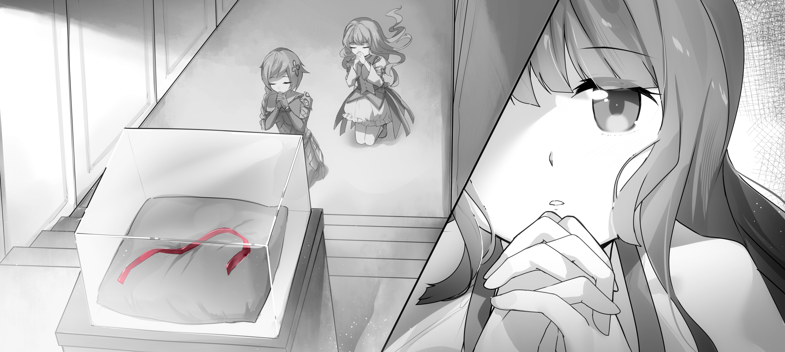
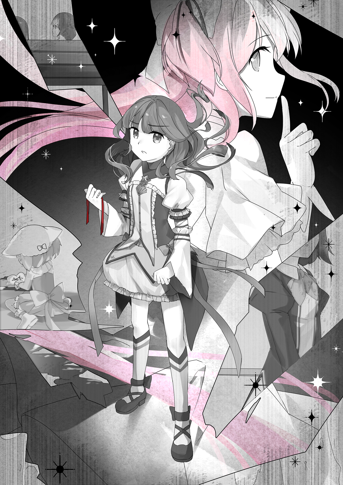

# 第九章 回声

“军用增强套装中最为人所知的一个组成部分就是‘永久清醒模块’，不过出于制造成本和社会影响等多种原因，这东西其实还没有太普及。它的功能和名称大致相符，安装后可以将通常用于免除睡眠的激素补剂和纳米机械替换为一个自给自足的独立系统。该系统可以稳定人体各类昼夜节律，并且完成所有必要的神经系统维护工作。

‘再也不睡觉！’

虽然这句设计口号相当流行，甚至成为了很多军人和魔法少女的口头禅，但是这个模块其实并不会阻止所有形式的睡眠。虽然它确实可以让你夜里不再犯困，但是作为用户而言，累了想要眯一觉的话还是没问题的。不得不承认，这样的小睡还是有一些益处的，所以趁休息时间打着瞌睡的士兵们也就成了一种常见景象。安装前后唯一的真正区别是睡觉将不再是生活必须，而且如果你打开一个内部开关的话，你甚至不再会有想睡的欲望。

该模块的受众人群罹患精神分裂的比例较之常人略有偏高，学界仍在针对这一现象展开研究。目前的观测结果显示，这一现象的成因应该以心理问题为主：连续清醒时间过长似乎会对某些人的精神状态产生不良影响。而且如果不考虑连续两个月以上没有睡觉的案例的话，精神疾病的发病率在统计意义上就并没有显著提高。这一研究结果是针对少数民间受众进行的，因为非用户的对照组比较好找。

总之，在这个问题上给您女儿的建议很简单：和军队手册说的一样，不管困不困，能睡还得睡。”

**— 摘自《您的超人女儿》，刊于《父母必读》在线版特集《女儿契约了，我该怎么办？》**

“所谓的‘神之缎带’是希望教最为重要的，也是唯一一件的圣遗物。按照晓美焰的说法，这条缎带是女神本人的恩赐。它现在放置在见泷原市教会总堂的一个超材料展柜里供人们瞻仰，但只对魔法少女开放。教团科学家声称，尽管无法观测到任何明显的附魔痕迹，但这条几个世纪前的普通布料上完全没有显示出任何老化的痕迹。其他科学家将信将疑，但教团从来不允许他们研究这一圣物。

在教团内部，人们相信神之缎带能给一少部分幸运儿带来神启。显然，很多少女（包括佐仓杏子本人）都号称见到过这样的神启，但她们的人数和瞻仰过缎带的总人数相比就显得微不足道了。有些自称见过神启的少女曾经志愿接受过研究者的检查，但是她们所有的体内记录都空空如也，甚至连大脑植入芯片的记忆跟踪都没有留下任何与神启有关的痕迹，唯一的迹象只有略微升高的呼吸和心率。〈哪怕是她们战术电脑的‘过脑不忘’模块里都没有留下什么记录。尽管如此，她们仍然坚称自己记得神启的内容。行会的共感者表示她们并没有表现出说谎的迹象，但同时共感者也无法看到神启的内容，这种现象十分反常。〉

所以这些自称神启的真实性相当值得怀疑。

〈尽管确实存在一些根据所谓的神启内容成功预测未来的案例，类似预测的失败案例也比比皆是。教团成员把这一切都解释成她们努力回避厄运的成果。但即便这是确有其事，也能找到一种更加简单的解释。魔法少女史上散布着无数的预言能力者，而且依然在世的魔法少女中也有很多人曾经亲眼见过这样的人。所谓的神启可能只是预知能力的灵光一闪，少女们在宗教热忱的巅峰中偶然触及了这种人们所知甚少的罕见力量。〉

〈不过，一个令人费解的现象是从信息时代早期开始，纯预知能力的魔法少女就好像从历史里消失了一样。之后也没有任何人在契约后得到过这种力量。〉”

**——“神之缎带”，信息百科条目详细版。括号内的文字需要密级 1 以上才能看到。**

---

告诉汽车自己要去附近的行会支部之后，良子发现自己先是被拉进了地下通道，不得不看着车内的星空图案发呆，然后又从地表钻了出来，最后在一座老式天主教堂一般的建筑面前减速停下。教堂正面装饰了大量的彩色玻璃，而玻璃上的图案明显不是‘传统内容’。

见鬼了？她想。

“汽车，” 她说。“我说了要去附近的魔法少女行会支部，也就是行会路研究所区军火库。我已经把移动路线转给你了。”

除了基本命令以外，民用机器不会接受直接来自大脑植入芯片的思维指令。

“这就是您要去的地方，” 汽车答道，声音明快。“见泷原市 03 区本土防卫部队军火库。这里的地面部分同时也被用作一处宗教设施。具体说的话，是属于希望教的。”

汽车说到这里停了一停。

“这种疑惑也是很普遍的。如果您需要我可以提供更多 ——”

“不必了，” 良子说。“是我不对，让我下车吧。”

她走上人行道，无奈地摇了摇头。玻璃图案的象征意义十分明显：在漫天流星的背景下，身穿盔甲的少女们挥剑砍着看不见的敌人。如果仔细看的话，还可以看到上面镶了一块灵魂宝石。

不管我愿不愿意，恐怕都得进去了，她皱了皱眉。所以她们是认真要拉我入教的啊。

她走上台阶，和两个明显不够契约年龄的小女孩一瞬间四目相对。她们赶紧心虚地移开了视线，但是一等到良子好像不再注意她们的时候，两人又开始接着盯着她看。良子很好奇，小女孩的父母们到底知不知道她们跑到这种地方来玩儿了。

她查询了一下内置时计。一点整，刚刚好。

混在前来上班的一群侍尼里，她走近拱形的大门。浅香和帕特里西亚从她右手边的立柱后面走了过来，三人互相打了个招呼。

“恕我失礼，” 良子决定有话直说。“我可没有加入教团的打算。”

帕特里西亚和浅香对视了一眼，然后笑了出来。

“嘛，我不否认我们确实有这个心思，” 她说。“但这并不是约你今天来的原因。不管怎么说，这里毕竟也是一个人手齐全的军用行会支部兼军火库。甚至说是同类建筑里面最大的之一也不为过。教堂部分不大，所以在地表看来这里没什么气势。但是这儿的地下部分可是庞大无比，一直连到了整个城市的地底要塞。来吧，赶紧把说好了的升级做完吧。”

说罢，帕特里西亚示意良子跟她过来。她们经过了教堂正厅，听到杏子在里面鼓吹着 “命运和人类” 什么的。在走过旁边过道的时候，她和杏子一瞬间四目相对。

接着三人走进电梯，下到了地下四层。

**B4，医务中心，** 正当她有点晕头转向的时候，电梯就对她如此感应道，这让她微微一惊。她以前坐过的电梯要么出声说话，要么保持沉默，从来不会像这样对大脑直接通讯。

走出电梯之后，良子看到外面是一个气闸，不禁微微觉得有些诧异。

气闸外面的走廊设计很特别：所有房间的墙壁都是完全透明，房门也是一样。她们不在乎隐私吗？

打包机器人在地板上爬来爬去。她可以感知到，它们正在搬运的货物是悲叹立方。

最后她学着另外两人的样子，原地立正，目光平视前方。

然后就这么呆站着。

“现在是要 ——” 她刚开口。

然后就一下子跳了起来：剧烈的灼烧感一下子侵袭了她的全身肌肤。

“哎呦！” 她叫道。“哎呦，哎呦，哎呦！”

一边连连跳脚，良子一边想着自己的惨叫声比平时说话娘气好多。她看着另外两人，发现她们仍然在那里站得笔直，但脸上已经笑了出来。

“这见鬼的 ——” 她又想开口，但灼烧感一下子停止了。

“—— 是怎么回事！” 她还是问了出来。终于感到一切结束，她声音里不由自主打了个颤。

“紫外线杀菌，” 帕特里西亚转身看着她，憋住了笑，一板一眼地解释道。“换了以前，这种强度的辐射足以让人严重晒伤，而且基本所有医护人员都会得黑色素瘤。但有了医学永生模块之后这种问题就大大减少了。细菌感染可以轻易地杀死一个弥留之际的重伤女孩，但消毒对于工作人员只是略有不适。两者孰轻孰重就不言而喻了。最后一点是个人建议：立正不动的话消毒过程会快一点。”

“为什么事先不告诉我？” 良子好不容易从牙缝里挤出话来，两手还在抽搐。她利用刚才的时间查了一下 “晒伤” 是怎么回事，免得还要自讨没趣地问人。

“这是个传统，” 浅香说着，咧嘴大笑。“新人往往稍微疼一点就受不了了，所以我们会录个羞羞视频。相信我，你表现得算是不错了。”

在气闸外面围观的几个医护人员也笑了笑，比了个大拇指，然后回去干活了。

“如果我没记错的话，” 帕特里西亚说。“你第一次的时候还不是吓得逃跑，把门都搞坏了？”

浅香瞪了她一眼。

“不是所有人都有你那种定力的，” 她嘟哝着。“总之，还有第二步。要我们真想欺负你的话就不会提醒你这个了。”

“第二步？” 良子难以置信地问。

“别怕，” 帕特里西亚说。“也没那么糟糕。就是会有些微型机器人帮你刮掉皮屑而已。这可以减少空气中的颗粒物含量。没那么尴尬。”

“微型机器人？” 良子重复着这个词。

她感到有什么东西落在了自己头上。刚想开口问，她就发现几只小虫子一样的机器人如法炮制地落在了帕特里西亚头上。感到脚踝一阵痒痒，她往下一看，发现还有一只正在她脚上转圈，一边用肚皮在她的皮肤上蹭来蹭去。

“这不太舒服啊，” 她一边咬着牙，一边谨慎地表述着自己的意见。

“别担心，” 帕特里西亚充满怜爱地说。“它们很友好的，不会随便就往你衣服底下钻。军队里的高科技比民间多得多，你得适应。再说了，我还挺喜欢这些小家伙的。”

良子确信，自己的表情正在无声地呐喊着 “她疯了吗？”。

浅香看见了她这副样子，然后用手指比了比自己的头，就像是在说 “没错”。

“我想这也说得过去，” 浅香说，想要做出一副一本正经的表情，不过不太成功 —— 她鼻子上正趴着一只大虫子。“对自己的主要武器产生感情是一件很正常的事。比如说，我就挺喜欢匕首的。”

良子看见帕特里西亚翻了个白眼。

“而且我们为什么要来医院呢？” 良子稍微改变了一下话题。她努力无视了正在往她脸上爬的那只机器人。

“我们需要在这里重置你的体内网格，” 帕特里西亚解释说。“然后往你的血液里注射几类新的纳米装置，再加上一些植入芯片组装元件什么的。这都是新兵入伍的正常手续，你没看过通知邮件吗？”

“内容太多了，” 良子抱怨说。

她背后一绺绺的头发像触手一般来回游移，一边给那些虫子机器人腾着地方，一边努力维持着她设定的发型。当然，另外两人也是一样。

“我说，我一直觉得他们应该先做脑内信息灌注的，” 浅香说。“让十来岁的孩子看完那种东西根本就是扯。连成年人都够呛呢。”

“嘛，体内重置可以改善信息灌注的效率，” 帕特里西亚扁了扁嘴，反驳道。

“但重置之前又不是不能做，” 浅香说。“谁会在乎弄得稍微慢一点呢？至少不用像现在这样搞得一头雾水。”

“你可以跟负责军队手续的 AI 说说，” 帕特里西亚耸了耸肩。“我又不管这个。”

良子发现身上的小机器人开始收工了。它们从她身上跳了下来，然后径直在地板上爬走了。过了一小会，气闸发出了 “叮！” 的一声，然后她们面前的闸门滑了开来。

跟合成器做完菜的声音完全一样，良子刻意在心里幽了一默，想要缓解自己的紧张。

“他妈的，我觉得自己像个傻子，” 抱怨声从拐角处出现的自走担架上传来。担架上的魔法少女穿着万年蓝色的病号服，一条腿扭成了令人不忍直视的奇特角度，上面敷着一层纳米凝胶（既有自己分泌的也有后来涂上去的）。她手里拿着几块悲叹立方，正在吸着戒指里的黑气。

她旁边陪着一个成年外表的护工，还有两位满脸担忧的少女。良子下意识地扫视着她们的手，发现两名少女戴着灵魂戒指，但是护工没戴。她在两名少女手上也看到了指甲纹。

“你这种程度的伤号我们三天两头就会碰到一个，” 护工安慰着。“不出一个钟头你就能活蹦乱跳的了。”

“我不能找个治疗法师解决问题吗？” 少女抱怨道。

“对于骨折这样的小伤，医学手段比魔法效率更高。只要不是很急的话，” 护工耐心地解释着。“这可以省点悲叹立方。”

说着，她们消失在了在下一个拐角之后。良子，浅香还有帕特里西亚礼貌地让到一边，给她们让了个道。

她们把她带到了一间只有一把椅子的诊室。她们一接近，房门就自行打开，然后墙壁变得不再透明，解除了她关于隐私的担忧。

良子揣摩着接下来的步骤，坐到了椅子上，把头塞进了两片夹板的中间。板子感觉不太舒服，像是拘束具一样。她忽然觉得自己有点无助。

帕特里西亚走向墙上的一处豁口。豁口里正往外面的一个托盘上吐着一包一包的东西。托盘旁边一个玻璃瓶里装满了暗红色的棒棒糖。

“放松点，” 浅香居高临下地对她说。“帕特里西亚可是受过训练的专家。”

“不，我不是，” 话题的主角心不在焉地答道，一边用手里的微针注射器从某个密封口袋里吸了一管性状可疑的蓝色液体，然后打到了一个连着奇特手持设备的试管里。“我从来没有受过训练。我靠许愿跳过了很多东西。”

“我就是想让她放松一下，” 浅香说。

“没关系，” 良子说。“能力来自魔法的话还是蛮有说服力的。起码她不会捅篓子…… 吧。”

帕特里西亚用胜利的眼光看了浅香一眼，然后继续鼓捣起了椅子上附带的控制台。

“好了，你以前做过体内网格重置吗？” 浅香靠在墙上问。

良子摇了摇头。

“从我记事起就没做过，” 她说。

“你确定？” 帕特里西亚瞥了她一眼，一边问一边操作着另一把注射器。“这很重要。就算你做的是违法改造，也最好说出来。我们不会告诉别人的。”

“我怎么可能平白无故地做那种事？” 良子问。

“有些人会通过网格改造来支持自己的爱好，” 浅香耸了耸肩说。“比如登山家搞几块壁虎皮肤什么的。也有一些违法改造可以绕过政府的虚拟现实规制。在游戏玩家圈子里有一整群人都这么做，甚至已经形成了一种亚文化。只要不惹出什么大事，政府就会睁一只眼闭一只眼。”

“啊，” 良子赞同着。“我想起来以前好像看到过这种内容。不过我想这种人一般签不上契约的吧。”

“你面前就是一位活生生的例子，” 帕特里西亚指着浅香说。“就请她本人来告诉你，她有没有做过违法改造吧。”

浅香又瞪了她一眼。

“她应该很清楚，那种事情参军后就不算什么了。”

“这可不一定，” 帕特里西亚没有放过她。“虚拟世界里也有很多军队不喜欢看到的‘可能性’哦。”

浅香眯起了眼睛。

“我到底为什么选择和你共事来着？” 她抱怨道。

帕特里西亚咧嘴一笑。

“当然是被本小姐的美貌打动了啊，” 她一脸坏笑，作势捂上了脸。浅香晃了晃拳头以示威胁。

“所以你以前是职业玩家？” 良子问。

“嗯，对，” 浅香说。“其实现在也在玩。但当时那就是我和朋友们生活的全部。我都觉得自己找到人生的方向了。”

良子点了点头。这个社会并不强求每个人都必须从事生产性的劳动。只要你找到自己真正喜欢的事，就可以离开学校了。当然，这么做的话你很难得到基本配给以外的任何收入，而且大多数父母也不会赞同这样的人生选择。

“其实也没那么糟糕，” 浅香大概是猜到了她在想些什么，解释说。“如果你水平够高的话，甚至会有别人专门前来观战。顶级玩家还能拿到娱乐人士特别奖金。收入其实比你想象的要好。”

“所以你许的愿是 ——” 良子刚要开口，就赶紧咬住自己的舌头，但已经迟了。

“对不起，” 她赶忙补救道。“我不是故意的。”

浅香满不在乎地哼了一声。

“小妞，” 她语气里倒是没什么恶意。“别怕，我不怪你。但这种反应是对的。我也不会再多说了。”

良子这时才意识到，刚才帕特里西亚始终没有说话。她转头一看 —— 但是没有成功。她忘了自己的头部已经被固定在了椅子上，所以动作的结果只是转过了眼睛，然后把脑袋挤到了夹板上。

浅香也随着她的视线看了过去。

帕特里西亚正盯着手里的方形设备，微微皱眉，若有所思。

“出了什么问题吗？” 浅香问。“为什么还没好？”

“她的基因组合超过了通用流程的五倍标准差[^1]安全范围，” 帕特里西亚明显有些心不在焉，木然地回答着。“大概在六倍的地方。偏离到这种程度就很难得到精确的数字了。”

[^1]: 译注：关于标准差，可以参照 <http://en.wikipedia.org/wiki/Normal_distribution#Standard_deviation_and_tolerance_intervals)>

“也就是说……” 浅香一边应着声，一边挥手想要把她从沉思中唤醒。

“我必须得做一点调整了，” 帕特里西亚说。“别担心，不会有什么影响的，就是要花点时间。我刚把你的情况提交给了负责基因分析的 AI 们。马上就该出结果了。”

也许她是想安慰良子，但用这种毫无起伏的平板语气说出来可不会有什么好效果。

“啊，算了，” 浅香打着圆场，重新看向良子。“六倍。这大概意味着你相当特别吧。”

“大概是十亿人一遇的，” 良子刚刚用内部计算器算了一下，有些难以置信地说。

这时旁边噼里啪啦地一阵乱响，又有好几包液体落在了托盘上，颜色比刚才更加诡异。帕特里西亚把所有东西一把抓了过来，然后一包一包地打进了手中的设备里。浅香和良子不由得静了下来。

最后帕特里西亚抬起头来，向她们示意已经准备好了。不过她看上去还是有点心不在焉。

“那好，你知道这种事情一般是什么感觉吗？” 浅香问着，对良子俯下身子，递了一支棒棒糖给她。

“不知道，” 良子想要点头，但是没有成功，只好这么回了一句。“棒棒糖是干什么的？”

“一看就是从没去过电影院的 VR 区，我明白了，” 浅香说。“相信我。这东西很管用。”

良子把糖块塞进了嘴里，然后马上就被一股味道冲得想要把它拽出来。

桂皮[^2]，她想。而且很重口。

[^2]: 译注：一种类似甘草或大料的甜味调料。没吃过的同学们可以想象一下直接嚼到大料的感觉

帕特里西亚走了过来，眼神看上去清醒了很多。刚才让她分神的事情应该已经解决了。

“你脑后有一个接口用的导管，” 帕特里西亚说着，把手里的设备连到了椅子表面的端口上。“它会自动对准你脑干里的植入装置，然后开启通讯。到时候会出现一个授权提示。你给了椅子访问权限之后才能继续。”

“OK，” 良子说。

“在整个过程中会分几次注射纳米装置，” 帕特里西亚接着说。“要从你脖子后面插个微型针头进去。不会疼，但是保险起见还是通知你一下吧。你的主要感觉将会重置，而且在初始阶段视觉肯定会失效。到时候你会失去对外界的感知，中间还会有一段时间丧失意识。噢，你以前连 VR 影院都没去过，对吧？”

“没有，” 良子说。“太贵了。”

她紧张地笑了笑。

主要感觉重置，她想。视觉失效，丧失意识。听起来可真不舒服……

“那你大概会有点难以适应，” 浅香说。“可能趁你睡着的时候做会好受一点，但那样的话新的植入装置就无法正常调整了。”

“啊，道听途说，道听途说，” 看到帕特里西亚对着她意味深长地笑了一下，浅香赶忙补救着。

“明白了，” 良子说。

“那你准备好了？” 帕特里西亚问。

“大概吧，” 她不置可否地答道。

“那就开始吧，” 帕特里西亚说。

良子隐约感到了内部通讯的开始，有点像是给汽车发指令的感觉，然后 ——

**收到内部网格的管理员访问请求，** 从她思维的最深处传来了这样的声音。**来源持有合法的数字签名。是否允许访问？**

良子深吸了一口气。

**允许，** 她答道。

整个世界都消失了。

**怎么了 ——** 良子努力压制着内心升起的恐慌。她什么都看不到，什么都听不到，也什么都碰不到。

但是她突然闻到了…… 桂皮味，然后就像心里一块石头落了地一样，情绪稳定了下来。

**嗅觉是最为原始的感觉之一，** 她脑海里一个女声解释道。**而且是脑部集成最深的，有一条专用的神经通路。没事的，一切正常。**

突然，她所有的感官都回来了。她发现自己正躺在床上，看着面前空中最佳视距上的透明显示屏，背景是令人心旷神怡的山间风景。她试着动了动，然后发现自己一动也动不了。但出乎意料地，她并没有因此感到恐慌，而是觉得很舒服。

她怀疑自己被灌了不少药。

屏幕上显示着两个标记。左边是赫菲斯托斯纳米技术的闪电铁锤，右边是柯罗诺斯生物技术的破碎时计。

接着标记淡出，视野右侧出现了一整排的进度条，还有一个显示操作记录的文本框。文本框最上面写着一行：“最小化感知接口。抱歉有些单调，亲♥”

行尾还加了个小心心。设计者的品味可真是有点独特。

“总之，” 文字继续出现。“我们马上就要升级您的体内系统了！难道这不是一件高兴事儿吗？让我们来看着右边的安装进度吧！在左边，我们会给您播放您身上最新改进的图解。请稍候……”

然后：

开始升级到军用增强套餐...

魔法少女发行版，版本 3.5

正在处理触发器[^3]...

[^3]: 译注：用过 Linux 的同志看到 Processing Triggers 应该会亲切吧

检测到五倍标准差基因组，需要特别处理。请稍候...

...

...

处理完毕。进入第一阶段。

屏幕左边用友善的图解说明着第一阶段需要进行的内容，主要是卸载不再需要的限制装置和植入物，尤其是在魔法少女身上容易发生故障的那些。画面的主角是良子本人的身体图解，在需要卸载的部位打了好几个大叉，上面延伸来出几条细线指向旁边密密麻麻看不清楚的说明文字。这幅图画得好精细。

她们没必要连这种部位都画得分毫不差吧…… 她看着其中一个大叉想道。接着画面放大，显示出她心脏附近的支撑网络已被加入降解队列。旁边还解释说实验表明，该装置对魔法少女的作战表现并无帮助，只是单纯在浪费能量。

正在卸载民用紧急安全套餐主控系统...

正在卸载民用访问限制，请等待授权。

授权已确认。

正在卸载虚拟现实限制...

正在卸载心灵通讯限制...

正在卸载感知推送分区...

正在移除心肺支撑系统...

正在移除肌肉增强装置...

正在移除冗余的免疫辅助系统...

正在移除冗余的抗毒素系统...

正在标记需要自我销毁的失效纳米机械群...

正在标记需要降解的旧植入芯片...

正在重新配置其余植入芯片...

第一阶段完毕。开始第二阶段。

这一次出现的图示向她解释道，现在将要为她安装一些结构较为简单的植入芯片，都是已经在魔法少女身上证实有效的。这次图上并没有向她解释什么技术细节，而是用一系列的幻灯片向她宣传着她的 “新身体”。上面用明快的语言解释着军用强化骨骼可以减少 30% 的骨折，即使对魔法少女的强悍身体也是一样。柯罗诺斯全视眼则能让她的可见光波段扩展到低频紫外区和高频红外区，从而提高作战时的观察力。她也可以随时切换到纯红外视觉，不过出于某些技术原因，红外模式下无法运用普通视觉。

以前良子一直不明白为什么有那么多媒体人都喜欢说，现在的人类其实已经变成了一群机器人，或者半机器人。现在她算是明白了。

但她仍然可以闻到那股桂皮味儿。

正在注射新的纳米机械群。请等待循环系统定位完成...

正在准备将强化骨骼升级到军用等级...

正在准备对纳米电极阵列进行快速扩张...

正在准备对眼部增强系统进行波段增广...

正在将主通讯节点权限提升至密级 1...

正在准备扩充通讯节点...

正在安装指挥与控制协议...

正在重置鼻腔上皮组织...

正在进行听觉增强芯片植入...

正在进行必要的脊椎调整...

正在进行脑部结构分析以确定植入芯片位置。最多可能需要两分钟...

良子继续盯着这块虚拟屏幕 —— 她也没有别的事情可做。她一向对自己未来世界的居民身份感觉良好，但是现在她也觉得这一长串东西有些让人不太自在。而且，如果她没有理解错误的话，她需要接受的改造工作还不到标准步兵的一半，主要还是因为大部分的改造对魔法少女没用。

完成。正在注射营养补充血清...

**植入芯片即将开始组装。请注意，根据个人情况，芯片组装和功能建立大概需要 2 小时到 1 周才能完成。**

最后一行搞得很亮，而且良子发现自己的视线被强制移到了那里。

第二阶段完成。进入第三阶段...

这一阶段的主要作用是安装她的 “作战助手”。根据画面上的说明，它将作为助手和顾问为她提供帮助，无论作战内外。它可以帮她整理邮件，提供建议，进行战术分析，并且辅助通讯。这一款里还包含 “过脑不忘” 功能，确保她随时可以访问到自己的所有记忆，但又不至于被随时涌起的无意义联想打断思路。

正在安装脊椎节点作战助手 1.8 版...

正在注射 EFA 纳米机械群...

正在注射高热量营养血清...

正在进行中等精度中枢神经布线。这将会花费一小时，在此过程中您将陷入昏迷。正在抑制思维活动...

噢，来了，良子想。我恐怕得做好 ——

完成。

—— 心理准备。

等等，什么？完成？

正在重设中枢神经植入芯片...

她继续盯着屏幕 —— 当然她还是没有别的选择。已经过了一小时了吗？肯定是...

第三阶段完成。战术助手将在大约 5 小时之内激活。开始第四阶段...

第四阶段安装的植入芯片将使她不再需要睡眠。

正在安装永久清醒模块...

正在注射纳米机械群。请等待循环系统定位完成...

正在注射临时激素稳定剂...

正在调整分泌腺体...

正在将纳米神经电极配置为长期调节模式...

正在安装昼夜节律同步程序...

第四阶段完成。请注意在接下来的几天之内，您可能会感受到眩晕，疲劳或者其它类似倒时差的症状。这些症状会逐渐消失。

安装完成，系统即将重启。在此期间所有感官将停止工作，5...4...3——

良子咬紧牙关，然后惊讶地发现自己居然可以咬牙。

——2...1...

她终于惊醒，一边喘着粗气。嘴里掉下来的棒棒糖现在只剩下了一根光秃秃的棍子。她猛地从椅子上坐起，然后急忙环顾四周，发现帕特里西亚和浅香就站在边上看着她，好像觉得挺有意思的。

良子摸了摸自己的脸。

“一共用了多久？” 她看着帕特里西亚问。

“两小时，” 对方答道。“你的时间感也被调整过了。”

“明白了，” 良子说着，从椅子上站了起来。

“现在轮到我来表现一番了，” 浅香比划着说。“跟我来。去武器库。”

良子赶忙走了过去，但帕特里西亚并没有跟上，而是继续操作着那把椅子。良子疑惑地看了她一眼。

“啊，不用管我，” 帕特里西亚说。“我还有些事情要处理。抱歉。”

良子点了点头，跟着浅香出了大门。墙壁重又变回透明。

“别告诉她我跟你说了这些。今天肯定是有什么东西吓到她了，” 在走向气闸的途中，浅香说。

“什么意思？” 良子问。

“她今天可没有什么‘事情要处理’，” 浅香意味深长地看了她一眼。“她早上明明还跟我保证说整个过程都会陪着你，但现在却突然说什么‘噢糟了，我忘了一些什么什么事情了，得马上处理’。相信我。我能看得出来。”

良子思考着其中的意味。

“这和我有关吗？” 她问道，一边走进了气闸。

“或许吧，” 浅香说。“毕竟今天也没出过什么别的事情。”

在电梯门直接打开的时候良子小吃了一惊：这次可没有把她全身烧一遍再放虫子咬。

对了，我们现在是出去而不是进来。她想。

帕特里西亚到底是在担心什么呢，过了一会她才再次想到。这时电梯已经到达地下十层，打开了门。

她举起手臂审视了一番，就好像这样能看出来毛病似的。

她说过只要调整一下就能一切正常，良子想。但是我的紧张可不会减少啊。

不过毕竟都一个世纪没有出现过植入芯片故障了。现在的技术应该已经万无一失了吧？

“这两天碰到的新东西有点太多了，” 她说着，有些紧张地对浅香笑了笑。两人正在走过一条走廊，两侧全是呆板的金属大门。“现在那些植入装置已经在我体内开始生长了吧？”

“没错，” 浅香答到。“你很快就会感到效果的。”

良子想了想。

所以我应该可以……

她心念刚刚一动，东西就已经发了出去。

“你收到了吗？” 良子问。

“嗯，” 浅香说。“一段记忆录像，对吧？”

“没错，” 良子说。“是我很久以前遇到过的一位少女。我当时的记忆可能不太清楚，但你可以试试对她用人脸识别。”

“为什么？” 浅香问。“我是说，我也未必认识 ——”

但她一瞬间就顿住了话头。

“怎么了？” 良子问。

但浅香只是愣愣地站在那里，表情混杂着惊讶和不解。但是良子刚要张嘴问 ——

浅香就突然说了句 “我们到了”，然后就大步流星地向前走去。同时前方远处的一扇大门自行打开。

门里是一间仓库，浅香走了进去，脚下半点也没有放慢。良子有些不知所措，只得跟了上去 —— 然后就被吓了一跳：里面整排整排的架子上放着武器，堆了足足五十尺高。不仔细看根本连对面墙壁都看不到。

“这里不是前线星球，” 浅香解释道，举起双手比划着仓库里的内容。“所以武器库里储备不多。不过倒是有几样好东西。”

“储备不多，” 良子重复道。

“然后作为一名魔法少女，” 浅香继续解释，“你在这里想拿走什么都行，而且随时都可以来拿。当然，有些很贵的东西除外。大规模杀伤性武器也不会发给你。但是普通军火库里会有的东西你想要什么都是没问题的。” 说着，她咧嘴一笑，从架子上抓下来一把手枪，伸手递给良子。

良子接了过来，掂着它的分量。她不得不承认自己现在相当紧张。她以前从没碰过武器。

“这是一把 SW-155 军官手枪，” 浅香说道。脸上的笑容让良子觉得她恐怕很喜欢谈论武器。“只要是和外星人作战的时候，你都必须随身带上一把。也许和其它东西比起来这玩意儿很不起眼，但这可是目前最尖端的武器之一。”

她停顿了一下。

“以后有时间的话，你最好去地下八层的射击场好好练一练，” 她说。“我其实挺想给你演示一下的，但这东西功能太多了。首先，和其它军用武器一样，持枪者没有人类 DNA 就发射不了。但更重要的是，这东西发射的可不是单纯的子弹。只要在里面塞上几个泛用弹夹，你就可以通过意识接口或者手动操作来自由控制发射的内容，比如震荡手雷，闪光弹，反装甲导弹，小型机器人，各种波段的激光，等等等等。这可是最新型。”

“关键问题是，作为一名魔法少女也是一名军官，这东西是你的最后手段。在你陷入困境的时候，它应该可以做到任何事情帮你解围。其它武器可不是这样的 —— 这种做法相当浪费能源，根本不能持久。希望你永远都不要用到它才好。”

“不过要记住，” 她说。“这东西的能力也是有限度的。如果你想打一发反装甲导弹的话，你得先塞进去好几个弹夹才行。所以我们建议你至少要随身带上六个。总之，这些都可以派送到家。除非你非要捧着这么一大摞东西回去。”

良子点了点头，在心里提醒自己，等会要确认一下怎么选择 “派送到家”。

模仿着以前电影里看过的样子，良子对着枪管里好奇地看了一眼。她完全不知道自己在做什么。到底会不会有人来训练她？

“浅香小姐，为什么要岔开话题？” 趁着自己还没有彻底忘记刚才的事，她问道。“关于那位少女的。”

她觉得这种情况只能单刀直入。

浅香稍微收起了一点笑容。

“给我变个身，” 她说。

“为什么？” 良子问。

**我还要好好考虑考虑，** 浅香感应道。**我有点混乱。但变身是正事。**

良子还是听话变了身。一时现出的明亮绿光把周围的武器架照得有点诡异。

“浅香小姐，” 她说，不知该感到生气还是该感到困惑。

**先给我点时间，** 浅香说。

“脱下你的宝石护甲，” 浅香说。

“我的什么？” 良子眨了眨眼，问道。

“你的灵魂宝石护甲。杏子应该给了你一个。只有你本人才能脱下来。”

“噢，那个啊，” 她感到有些意外。

良子其实早就忘了那东西了。她摸着自己的脖子根，想要把那片透明护甲抠下来。但出乎预料的是，那东西很容易就自行脱落，重新变回了球形。自己这两天一直戴着那玩意儿？就算变成戒指的时候也是？

“好了，” 浅香说。“你可以留着那块作为备用。我想现在杏子肯定已经搞到新的了。”

她往前靠了靠，从牛仔裤的口袋里掏出了一把东西。

“伸出手来，” 她命令道。

良子照做了，然后浅香往她手上扔了…… 几块和她灵魂宝石完全一样的复制品。每一块都和真品一样，一下一下地闪着亮光。

但是不知怎么…… 良子感觉它们里面都是 “空的”。

“这是什么？” 良子一边问着，一边拿起一块仔细端详了起来。

“杏子昨天把样式发过来了，” 浅香答道，又拿出了一把，加上刚才的一共有六个之多。“实验表明，几乎在我们所有的传感器上，灵魂宝石看起来都只是正在发光的普通宝石。没错，我们能够轻易看出区别，而且无论距离多近传感器都无法分辨它们的构成物质。但是大多数情况下这些东西都是完美的假目标。外星人根本不知道该打那一块。”

“好厉害，” 良子赞叹道。

“试试吧，” 浅香说。“拿到脖子那里丢下来，相信我。”

良子想要照做，但是在站着的时候从脖子往下 “丢” 东西是一件很困难的事情。所以她只是往后一仰，松开了手，以便让它们掉进她变身服装胸部的 V 字开叉里。或者 —— 她不无尴尬地想到 —— 也可能会因为接不住而掉到地上。毕竟她的身材可算不上好，虽然她朋友总是会说些好话来安慰她。有时她甚至感觉连自己的变身服装都在努力隐藏这一点，比如那些衬托胸部的……

不过和她担心的相反，那几块宝石并没有径直落下，而是长出了几条小腿在她身上四散爬开，倒是很像刚才气闸的虫子机器人。它们最后停在了各个关键部位 —— 双手手背，小臂，肚脐，还有背部正中。最后一只钻进了她头发里。

她意识到这些都是放置灵魂宝石的合理位置。

“什么事情都要扯上机器虫子吗？” 她问。“这种感觉可不太舒服。”

浅香耸了耸肩。

“这就是现实。总之，它们不能像真宝石那样随意变形，所以你解除变身的时候它们会尝试集合到你的口袋里什么的。它们很聪明。你只有在和外星人作战时才需要戴上它们，所以平时可以摘下来。不过总之……”

她转身对着一排放满手枪的架子，然后上面的一个抽屉滑了开来，里面装着一大摞形状相同的小塑料片。塑料片呈五角星形，上面画着几不可辨的电路板。其中一片稍微透着一点红色。

然后良子发现抽屉前方的微型屏幕上正写着她自己的名字，刚才怎么没注意到？

“都是量身定做的，” 浅香解释说。“这些东西本身已经太过复杂，无法再加上爬行功能，所以你得自己粘上。不过只要粘一次。”

她向前走了一步，把这些小片片拿了起来，粗略地贴到了伪装宝石的位置。它们稍稍调整了一下，然后自动粘到了宝石上。

良子举起了自己的右手（里面仍然握着手枪），看着伪装宝石闪烁的光芒。电路板的隐约图案微微扭曲着宝石的绿光。

“这些是什么？” 她问着，把手枪放回了架子上。她已经忘记自己手里还拿着这东西了。

“单兵防护系统，” 浅香说。“其实它主要的保护目标还是真正的灵魂宝石。不过如果要做几个假目标的话，起码要做得像一些，所以它们也可以沾光蹭到一点。”

说着浅香把手伸向了最后一片，那片有点发红的。

“而这就是里面最核心的部分，” 她把那一片举了起来。“为你真正的灵魂宝石准备的。虽然并不起眼，但这可比另外那几片厉害多了。它可以承受大多数小型武器的正面攻击，甚至可以通过自我牺牲来挡住一次外星坦克的主炮。当然，你最好还是不要让它们一直对着你打。”

“过会儿我能拿一份详细说明吗？” 良子已经觉得有点记不住了，问道。

“嗯，” 浅香说着，弯腰把最后一片粘了上去。“而且会直接送到你的大脑皮层里。不过我现在还是先跟你解释一遍比较好。我也知道这种说教很不爽，但是真的，这些都是你必须要了解的。”

良子点了点头。

“总之，” 浅香继续说。“尽快拿到全套的灵魂宝石防护系统是每个人的头等大事。毕竟宝石才是你的本体。现在你应该知道这个了吧？杏子说过你懂得还不少。”

“嗯，” 良子点头同意。

浅香重新站了起来。最后一片的红色逐渐消退，然后一下子，所有的宝石都一起消失了，无论真假。

“哇，” 良子惊叹道。

“好了。所有这些合起来才是全套的单兵防护系统，” 浅香说教道。“为了欺骗外星人，它们会为所有假目标提供一定的隐形和防护，但是如果火力太猛的话，它们就会改为集中防护主宝石。它们会偏转光线武器，并且用内置的微型激光击落射来的流弹。它们会自行发电，只要有一点点太阳就能持续运转。不过如果需要在黑暗环境下长期战斗的话，我们也会给你配个充电器。”

良子盯着自己的手，想要找到那块宝石，但怎么都看不见。不过用另一只手一摸的话，发现还是能摸到的。

“很酷，对吧？” 浅香反问道。“不过外星人探测隐形很有一手，所以我们也没指望这会管用。假宝石就是在此之上用来尽量误导敌人的。主宝石上的光敏传感器会随时跟踪你的亮度。最开始，所有假宝石会一起变暗。不过一旦你魔力消耗太多，所有宝石就会进入随机亮度模式，好让敌人难以确定你的魔力残量。当然，你本人还是会有本能的感觉。你的队友和附近的人类士兵则可以通过指挥控制系统得到这一信息。当然，你最好还是和队友随时保持念话交流。毕竟外星人的通讯干扰也很有一套。”

“他们考虑的可真不少，” 良子说着，已经深深折服了。

“没错，” 浅香说。“军队研究所花了八年才设计出来这东西，要是不做到这种程度的话我们肯定跟他们没完。以前我们只能自己安一个硬壳，然后在身上粘一些假宝石。麻烦得要死，但是不这么做就会被狙击手干掉 —— 外星人很快就发现了灵魂宝石的作用。不过现在也还是有改进的余地：整个系统还是相当笨重，而且真宝石上没有长腿，我理解做到这一点有些困难，但是……”

她的声音越来越小。

“我明白了，” 看着浅香发了好一会呆之后，良子提醒道。

“那好吧，” 浅香摇了摇头说。“变回来吧。”

良子照做了。

她刚变回来，身上散布的假宝石就解除了隐形，连着塑料状外壳一起站了起来，然后一顿乱爬，钻进了良子的裤子口袋里。

“挺方便对吧？如果找不到口袋的话它们就会粘到你身上或者衣服上，” 浅香说。“帕特里西亚觉得它们很可爱。她觉得这类机器人都很可爱。所以我们都觉得她不太正常。总之，这些就得让你随身带着了。应该不太沉。”

良子突然想到了一件事，看着自己的灵魂戒指。上面的主防护片正在努力扭曲变形，试图贴到戒指上。最后它终于变了过来，良子感觉戒指整个大了一圈。

“其实那些科学家都对这一点感到十分诧异，” 浅香说。“他们本来以为粘上的防护片应该会留在灵魂宝石的原来位置，所以在本来的设计中你需要自己把它从脖子上揭下来。魔法的力量还是很奇妙的。”

良子摸着自己的戒指，陷入了沉思。

现在连一般大众都觉得自己生活的已经是未来世界，但她在这里看到的东西足以把她的所有朋友们吓到目瞪口呆。就算她说这些都是魔法，估计也能唬住她们。

如果连拥有这些的军队都在外星人面前感到望尘莫及，那么外星人的科技到底已经发展到了何种程度？

“还有什么要给我看的吗？” 良子问。

“我很想拉你在这里待一整天，” 浅香说着，从旁边看了她一眼。“但说实话，该知道的你已经都知道了，所以你也不用再听我说教了。接下来是最后一件装备。”

她转身对着另一个架子。良子突然发现，自始至终她们都没有进入离门二十尺以外的地方。所有标准装备都放在了门口。这也很有道理……

浅香递来的东西看起来像是一个黑包，硬质外壳显得挺结实。

“这是……” 良子问。

“一个背包。” 浅香说。“用来装东西的。严格来说这是标准装备的一部分，但是大多数女孩子都不喜欢背。”

“噢，” 良子说。“看了那么多东西之后，最后这件还真是…… 实在。”

“我还没说完，” 浅香笑着说。“它可以自动递给你东西。看我的。”

她把包背了起来，然后背过了一只手。过了一会，背包外壳错动着打开了一个小口，然后从里面丢出来一个圆筒。浅香灵巧地接住了它，拿了起来。

“这只是一个演示物体，” 她说着，把那东西重新摁到了背包上。背包自动打开了一个小口，把它吸了进去。“不过你应该明白了吧。这东西平常是用来放弹药包或者悲叹立方的。如果真是十万火急的话，里面还可以伸出来一个机械手帮你把悲叹立方按在宝石上，不过那东西有点累赘。”

“这可真…… 有用，” 良子说。

“上面还有一个单兵隐形装置，” 浅香说。

“噢，” 良子无可无不可地应了一声。

“反正也没什么用，” 浅香接着说。“持续时间很短，而且大多数的外星坦克和大一点的无人机都能探测到你，所以基本上从来不用。不过有一个总没坏处。比一般步兵的装备还是强多了。”

“总之，我只是给你演示一下，” 说完，她把背包扔回了筐里。“没有必要现在就拿回家。”

“好吧，” 良子答应着。

她拄着脸想了想。

“接下来去哪儿？” 她问。

“今天已经完事了，” 浅香说。“不过作为个人建议，赶紧和你的私人心理医生约个时间，要不然好时段就被人抢光了。你必须去一次和她认识一下，不过最好还是不要落到再去第二次的地步。”

“心理医生？” 良子问。“为什么？这是规定吗？”

“嗯，邮件里写了，” 浅香说。“现在，如果你不介意的话，让我带你转转吧。”

---

“我想问个有点私人的问题……” 良子说。

“嗯？”

两人正在浅香的房间里（位于地下五层）稍事休息。浅香靠在自己的床上，而良子坐在了旁边的金属椅子上。屋里相当窄小，比良子自己的房间有过之而无不及。她猜测大概是地下空间很难扩张吧。

“教团到底有什么吸引你的地方？” 良子指着屋里的各种宗教饰品问道。桌上摆着一个晓美焰手办和一个许愿的魔法少女像，而墙上则贴着两幅画，一幅是白翼的焰在空中飞翔的情景，另一幅则是雾中若隐若现的女神。最后还贴了一个教会标记：一个象征化的灵魂宝石，正向周围的一圈小方块里释放污染。

“我是说，你看起来不像是会喜欢这些东西的人，” 她解释道。

浅香微微一笑，目光低垂。

“没错，” 她说。“我不是。”

她想了想。

“这不太容易解释，” 她说。“可能有一部分原因是我想找到点人生意义。你应该能理解吧？我许愿得到了自己想要的东西，但之后我却发现，自己并不知道应该如何适应新的生活。那时的我只能随波逐流。”

她又思考了一会。

“我有个朋友 —— 和你一样，是个新兵。她的灵魂迷失在了绝望里，却始终都不理解背后的原因。她咽气之前的最后一句话是‘为什么？’ 我希望现在的我能够回答这个问题。”

“我明白了，” 良子别过了视线说。她没有料到会得到这么一个回答。

“不，你不明白，” 浅香说着，颇有深意地笑了笑。“不过没关系。这种东西最好还是不要明白。而且这也不是全部的原因。我可不是会为了自我感觉好一点就信教的人。”

她重新俯下视线。

“怎么说呢，后面的行程就取消了吧，” 她挥了挥手说。“军火库很重要，但到处乱转只是浪费时间而已。我还有一件更重要的东西要给你看。你马上就会明白的。”

她停顿了一下。

“你听说过‘神之缎带’吗？” 她问。

---

不出所料，在瞻仰 “女神恩赐的缎带” 之前需要先排一个很长很长的队。让队伍变长的一个重要原因是一次最多进去三个人，不过每人五分钟的严格限制倒也让前进的速度加快了不少。

这是一种相当新奇的体验。毕竟，现在很少有值得排队等待的东西了。商店里的东西要么是免费的，要么会在你出门的时候自动扣掉分配券。星港的安检则由密布的机器人和扫描探头自动完成，没有固定的安检口。不过学校里有些热门课程还是需要排排队的。

良子利用排队的时间看了看邮件 —— 好多啊。接着她在信息百科上看了几篇文章，同时也用一只耳朵听着周围女孩的闲聊。从周围人群的谈话内容听来，这里并没有太过浓重的宗教气息。相反，房间的氛围非常随意，而大多数人的态度与其说是前来朝圣的信徒，还不如说是修学旅行的女中学生。

不过这里的环境自然另当别论。整座房间巨大而幽深，高高的拱顶和大量的彩色玻璃让朝圣者能够充分感受到自己的渺小。侧面墙上画的满是魔法少女。右边的少女们光辉四射，高歌猛进，将一切敌人打倒在地。而左边的少女们摇摇欲坠，垂垂将死，身影一个个濒临消散。

在房间的对侧只有三幅壁画，包围着放缎带的台座。缎带本身放在玻璃展柜里，从这个距离上基本看不到。但这几幅巨型壁画可是无法视而不见的。

右边是白色羽翼的焰，紫色光环闪耀生辉，眼神宁静。左边是黑色羽翼的焰，黑色污秽汹涌翻腾，眼神疯狂。而正中则是白雾遮掩下的女神，双手张开，拥抱着下面的一切。

这都说明了一件事 —— 教团不缺钱。

当然，如果仔细看的话，屋里这群女孩子还是颇有一些奇特之处的。比如，这群人里民族人种的多样性是极为反常的，就算在出国旅行易如反掌的当下也是如此。如果再看得仔细一点的话，你还能注意到这群人都戴着各式各样的灵魂戒指，还有配套的指甲纹。

而就算是再粗枝大叶的人也会注意到队伍前面站着的两个门卫 —— 都是变身之后全副武装的魔法少女。你也不会错过她们之间每隔十分钟发出一次的闪光。那就像是空气本身发着荧光一样。良子怀疑那是个防御力场。

不过防御力场可是很昂贵的，一般只有在主力战舰上才能看到。

而只有瞎子才会错过走向台座的少女们发出的变身光芒。这是教团的规矩。

不过力场闪光的样子让良子觉得有些奇怪。颜色很红，非常红，红到反常。每次闪光时间太短，不可能看得仔细，不过良子还是觉得不太对劲。

“你也看到力场了，对吧？” 浅香注意到良子正盯着那块看似空无一物的区域，问道。

“噢，对，” 良子有些惊讶地说。“所以那真是一个力场？”

“没错，” 浅香说。“然后如果你觉得奇怪的话，那种反常的红色是高频红外，一般情况下不会在视野里发生闪烁。嗯，她们肯定改进过增强手术了。当时我的眼部装置可是花了十四小时才搞好。”

良子花了点时间接受现实。

“不过别的东西看起来还是一样，” 她一边说，一边好奇地环视着周围的其他女孩，旁边的神像，还有墙上的画。仔细一看的话，彩色玻璃的样子已经显得稍微有点不同了。

“这很复杂，” 浅香说。“除非是红外紫外强度很大，否则你一般不会单独注意到它们的存在。不过这已经足以让你在大多数物体上分辨出来更多细节。效果很轻微。不过如果出去的时候还有太阳的话，那感觉可是很独特的。你会习惯的。大家现在都不太在乎这些了。”

“对夜视有帮助吗？” 良子冲口而出。

“可惜，基本没有，” 浅香说。“光谱不够宽。夜视的时候需要切换到纯红外，这也是那个模式的设计目的。而且作为魔法少女，其实你也用不着。”

“为什么？” 良子问。

“昨天晚上你不是和我们一起吗？” 浅香说。“你没注意到你在那些阴暗的小巷里看得有多清楚吗？成为魔法少女有很多好处，超强夜视力就是其中之一。而且，我们还有 ——”

她停顿了一下，思考着措辞。

“可以说是某种直觉吧，” 她说。“某种可以感知电磁波频谱的第六感。帕特里西亚可以解释得更好，不过这就是我们要你注重战斗直觉的一个原因。她们会在训练的时候教你这些东西。太空部队在这方面教得更多一些。”

“我能检测一下哪些新的植入装置已经启用了吗？” 良子问着，仍然在好奇地四处扫视。“你也知道，之后我可能就想不起来了。”

“民间人一般只能在紧急模式才能使用自检功能，” 浅香耐心地解释道。“我们可以随时做，不过这功能只有等战术电脑开始运行之后才能用。你不会错过这个的：开启的时候有提示。当然，帕特里西亚来解释的话 ——”

“浅香你居然在传教？” 帕特里西亚说到就到，在一旁向两人问道。“我真服了你了。我还不知道你也会来这一手。”

她指着面前的宗教圣物。她们终于来到队伍靠前的位置了。

良子仔细观察着面前的展开。她其实也对前来此处的理由颇为好奇，但浅香始终没有给过她一个正面解释，只是坚持要她一定得来。给她看一条宗教圣物到底能有什么意义呢？这应该不是一次单纯的传教行为…… 对吧？

浅香作势苦着脸。

“她会失望的，你也明白吧，” 帕特里西亚泼着冷水。“大多数时候 —— 对于绝大多数人来说 —— 它都只是一条普通的缎带。”

“嘛，也不能这么说，” 浅香当面反驳。

“我只是陪陪她们，” 接着帕特里西亚对排在三人身后的那个女孩道歉说 —— 她刚要开口谴责帕特里西亚的插队行为。“我不参拜的。”

“据说它会带来神启？” 良子问道，引用着她刚才看过的导游册。

“很少，” 帕特里西亚说。“只是偶尔有那么一次，所以大家才会接着来。而且启示本身也相当有趣，我是说它们从来不会出现在记忆跟踪或者芯片日志里这一点很有趣。如果没有那些人的叙述的话，简直就像从未发生过一样。”

“作为教徒而言你说得还真不留情面，” 良子指出。

“我只是在描述事实，” 帕特里西亚说着，举手投降。“我个人相信神启是真的，但我只是想要指出里面的可疑之处。”

“我可是看见了死去的朋友，” 浅香颇有怒意地说。

两人转身看着她。她直直迎上了两人的视线，神情肃穆。

“我也只能说这些，” 她收住话头，明显已经在努力控制着自己的表情。

“她永远只说这么点，” 帕特里西亚评论道，无视了浅香明显的不满语气。

她看着良子。

“我几乎是一契约就入教了，但我直到现在还没有从那玩意里面看到过任何东西，” 她说。“我基本可以保证你也看不到。然后你就会觉得我们都是一帮狂信的疯子了。”

帕特里西亚耸了耸肩。

“没错，我们会积极招揽新人入教，” 她说。“但我们只会对心理记录显示容易接受的人做这些。对于你这样的女孩，我们一般会先放着不管的。毕竟等你经历过一些东西之后再来传教才更容易成功。”

队伍前进了五尺左右，三人跟了上去。她们现在已经到了排头，正对着两名门卫。良子有些害怕，不太敢走进两人之间。

“这种传教策略可够…… 冷血的，” 良子说。

“没错，” 帕特里西亚说。

她微微一笑。

“不过也是。我可能太悲观了。也许你这样的女孩可以看到点什么吧，就像浅香那样。”

**我不知道她为什么带我来这儿，** 良子用私人念话对帕特里西亚说。**她原本只是带我转转，然后我问了几个问题，她就突然把我拽到这儿来了。**

她停顿了一下，思考着措辞。

**我以为这会有什么特别的含义，但如果是你说的那样的话，这里也并没有那么重要。**

**没错，的确有点奇怪，** 帕特里西亚说。**和我说的一样，对大多数的新人我们根本不会上门传教，放到浅香身上就更反常了。但反正马上就要知道了。她肯定有自己的理由，我敢保证。**

浅香不满地看了两人一眼，就像是在说 “我知道你俩在我背后说悄悄话”。

**你们认识很久了吗？** 良子问。

**一契约就认识了，** 帕特里西亚说。**我们是同一批入伍的。更重要的是，我们是同一个受训小队的。2446 年春季，火星训练场 λ-δ 组。如果你想查可以查查。你也分到那里的可能性大概是五五开，另一半应该是去新雅典。**

**我明白了，** 良子说。其实在帕特里西亚说起之前，她就已经知道了训练场的事。为此她还稍稍得意了一下。那可真是查了不少东西才看到的。

**她总是嘲笑我加入这种奇怪教团的事情，** 帕特里西亚说。**至少是在她看到神启之前。她对神启内容闭口不谈让我很不自在。毕竟爱丽丝也是我的朋友啊！但我也不会太逼她。毕竟这对她来说很…… 私人。**

良子点了点头，然后才想起来自己应该用念话的。

浅香清了清嗓子。

“到我们了，” 她比划着两名门卫之间的空档说。

“我就是陪她们排排队，” 帕特里西亚不失时宜地解释着，退到了一旁。

“去出口等着，” 门卫指着背后的一个角落说。

良子不由自主地感到，这名门卫头上那顶装饰繁复、金光闪闪的大帽子在作战的时候肯定是个大累赘。不过话说回来，她们所有人的变身服装都很难说得上朴素。

出于好奇，她扫描了一下门卫的脸。

**读心者。**

良子的嘴角抽搐了一下。

“我还挺喜欢这顶帽子的，谢谢夸奖，” 门卫说着，偏头朝良子一笑。“下次碰到我们这种人的时候不要胡思乱想哦。”

“啊，一定，” 良子尴尬地说。

在她身边，浅香做了个深呼吸，然后变了身。戒指上展出一圈圈的光环，然后在右前臂上凝聚成了一颗圆形宝石。腰间则出现了一对带着刀鞘的匕首。

良子识相地照做了。

“你们可以进去了，” 门卫回到了正式的站姿，说道。

旁边的空气微微一闪。良子在通过力场的时候还是不禁有一点担心，但显然什么事情也没有发生。

**我好久没来过这里了，** 浅香说着走上前去。**在第一次看到神启之后我来过很多次，但是神启再也没有出现。后来我就不来了。**

**浅香小姐，这是怎么回事？** 良子做着最后的询问努力。**为什么搞得这么神秘？**

浅香又只是摇了摇头。

**你知道我在想什么吗？** 浅香说着，在台座前跪了下来，开始默祷。**至今没有任何人说见到过女神的脸。说真的，连见到女神本人，在种类繁多的神启中都是极端罕见的，哪怕只是匆匆一瞥也好。只有很少几个人见过女神，但从没看到过脸。就连杏子本人都没能见到女神的样子。我们也从来没能劝麻美过来过。只有焰才知道……**

良子也学样照做，跪了下来。不过和浅香不同，她抬头朝展柜里的缎带看了一眼。

设计这里的建筑师绝对不是吃闲饭的。旁边彩色玻璃墙透出的阳光给整块区域蒙上了一层诡异的光影。而对良子而言，几层从未见过的光谱更是加剧了这种效果 —— 至少她本人是这么觉得的。在她所站的位置看来，面前的台座右侧一片光明，但左侧却显得有些阴暗。

至于躺在小枕头上的神之缎带本身看上去…… 就仅仅是一条拉直的缎带。也许唯一的出奇之处就是它看起来很新，上面完全没有留下岁月的痕迹。不过这并不是什么足以令人叹为观止的事情。

**浅香，你到底想告诉我什么？** 良子问。但是浅香只是闭着眼睛，深深地沉浸在了祈祷之中。至少良子认为那是祈祷。

良子只好也闭上了自己的眼睛，一边猜测着这一切是否另有深意，一边等待五分钟时限经过。

等啊。

等啊。

她皱了皱眉，试图检查一下自己的内置时计，但只是感到一种…… 空白。她完全不知道现在几点了。

她猛然睁开双眼，有些慌张地环视四周。

房间里空无一人。

她想要站起来。

面前突然出现了一个红色人影，同时背景变成了一排排老式的教堂板凳。人影是一个小孩子，几乎完全透明，样子有点眼熟 ——

紧接着是一阵晕眩。整个世界开始旋转，她感到自己开始坠落……

再次睁开自己并未闭上的双眼，良子发现自己正在盯着手里的缎带。就是那条神之缎带。

突然她明白了。

这是神启。自己居然真的看到了。

她抬起头。

她正处于一条小巷之中，但周围并不是她所熟悉的那种城市风景。地面上颇有些瓦砾，而且铺马路的黑色物质她也从未见过。

这是过去？她想。

在她面前，她看到一名少女躺在地上，另一个女孩正伏在她身上嚎啕大哭。两人都是魔法少女。躺着那人的一身白裙上已经满是鲜血，旁边落着一顶走了形的帽子，手里还握着灵魂宝石的破碎残骸。

良子小心地上前两步，不知是否该和那位大哭的少女打声招呼。她外表很小 —— 但良子很清楚这对魔法少女而言毫无意义 —— 而且穿着一身绿衣服。在她身旁的地上倒放着一把巨大的权杖，很大，简直可以说是大锤 ——

良子瞪大了双眼，终于认出了眼前女孩的身份。

但是完全不对啊！她想到。

然后停下脚步，突然意识到自己已经来到了两人位置的正前方。她屏住呼吸，生怕被抬头看见。

接着由真抬起头，良子吓了一个踉跄。

“对不起，” 她语无伦次地说着，下意识地倒退两步。“我 —— 我 ——”

然后停了下来。由真的视线直直穿过了她的身体，她看不见她。

良子转身看向后面。

魔兽的巨大身影正俯瞰着小巷的入口。

“我是个怪物，” 由真说，稚嫩的童声带着动摇。不知为何，良子感到，这个由真的外表年龄就是她的实际年龄 —— 一个小孩子。

良子再次看向由真。尽管魔兽的威胁迫在眉睫，但还是有某种直觉迫使她转回身来。

“她们说得一点没错，” 面前的小女孩低声重复着。“我也是一个和她们一模一样的怪物。如果是这样的话，那我还有什么资格活下去？”

良子张嘴想要说些什么，但是看到再次抬起头的由真，她就说不出话来了。

她的灵魂宝石里翻涌着黑暗，而脸上的神情则已是彻底的疯狂。

由真的权杖突然消失，然后重新出现在了她的手里。带着一脸扭曲的狂笑，小女孩径直扑向了良子，甚至以她变身后的反射神经都没来得及作出反应。

但良子只是感到一阵劲风，接着她发现由真径直穿过了自己的身体，扑向了身后的魔兽。她本人并不在那里真实存在，只是一个幻影的观察者。

而就在这时，她注意到了眼角里有什么东西动了一下。

良子低头看着地上死去的少女。她的尸体…… 动了一下？

她不敢肯定，但内心深处有些不安地感到，不知通过何种方式，那位死去的少女正在注视着她。

她不由自主地倒退了一步，但是没能踩到实地，而是脚下一空，重新坠入了虚空之中 ——

—— 然后她再次睁开双眼。不知为何，她感到自己正在一边哭嚎，一边仰头看着两个男人无动于衷的双眼。两人的身影显得异乎寻常地巨大，穿着医院制服的死板蓝色。身影显得有些扭曲，就像是透过玻璃看到的一样。

她抬起双手，然后感到了一阵阻力。她正全身浸泡在某种液体之中，而且向前伸手就能碰到玻璃。那真的是玻璃，或者是塑料也说不定。她现在身处的地方应该是一个容器。而自己的双手动转不灵，形状也感觉有些奇怪。

接着液体开始排出，她沉了下去……

她被眼前突然出现的亮光晃到，一时间有点缓不过神来，连忙用力眨了眨眼。

“—— 而且这位可不是一般的转校生！” 左边传来一个声音。她立刻认出了，不知为何，这居然是自己学校的班主任。“大家可能已经猜到了，她是来自国外的交换生。来，给大家介绍一下吧！”

面对着面前学生们的期待眼神，她羞得像是肚子里打了个结。这是她学校教室的朝会，但自己却是老师正要介绍的外国交换生？她显然不能直接说自己叫 “志筑良子”。那么 ——

她的嘴唇自行张开，然后她终于意识到自己并不能控制现在的身体。

“我是西蒙娜・德尔・马戈（Simona Del Mago），” 她微鞠一躬，说着良子第一次见到西蒙娜时听到的那种微有口音的日语。“请多多关照。啊，对了，为免误解，西蒙娜是我的名字。德尔・马戈是我的姓。”

接着她视线一转，直接对上了台下良子本人的眼睛。那个坐在第三排，紧靠西蒙娜本人的空座之前的女孩的眼睛。

如果良子能够打颤或倒吸冷气的话，她肯定已经这么做了。

带着令人不安的游离感，她继续看着西蒙娜的视野。志筑良子在座位上紧张地扭动了一下，四处张望着，想要确认一下交换生紧紧盯着的是不是自己后面的其他人。

但答案是否定的。西蒙娜盯着的正是她本人。她正目不转睛地看着眼前女孩 —— 也就是良子本人 —— 的长发。留得太长了吗？良子想，朋友们说得对，我看起来确实像个小孩。

这一幕是西蒙娜转学当天的完整重现。但女神给她看这个干什么？

看着眼前的良子重新转回视线，有些困惑地偏着头，整个世界开始淡出。同学们，墙壁，一切都消失在了白色的海洋中……

当她再次睁开眼睛的时候 —— 这次她也很确信自己刚才没有主动闭眼 —— 她发现自己已经进入了一片纯白的世界。四周空无一物，只在面前有一座孤零零的公园长凳，上面两个女孩正不知说着什么。

过了一会儿，她才认出来其中一人是年轻时代的浅香，而另外一人则是个外国人，一看就像是会取名叫 “爱丽丝” 的那种。

她想要走上前去，但发现自己做不到。她被定住了。

“爱丽丝” 突然伸手指向了什么东西，浅香随之看去，然后瞪大了眼睛，从椅子上摔下来，跪在了地上。

她朋友催促她赶紧起来。终于，她站了起来，不过仍然微微躬着身。

良子感到自己的头部转了过去，然后看见了让浅香产生如此反应的原因。

一个白色的身影，形状是成年女性，但不知为何仍然给人一种少女的感觉。她穿着一身长裙，随风舞动。若隐若现的曳地长发在身后摆动，微微透出一点…… 粉色？

良子再一次认出了自己面前的人物。那是教堂玻璃拼绘的原型，也是那位没人见过的神秘女性。没错，良子现在也看不见她的样子。

身影对浅香说了些什么，她目瞪口呆地点了点头，再次微微躬身。

接着人影往旁边一指，浅香跟着看去。在那个方向的远处投出了一名紫色魔法少女的影像，正在拉弓向天。良子一眼就认了出来，那就是她记忆里面的那个迷之少女。

过了一会儿，影像消失，另外两位女孩也随之而去，只留下那个白色身影，转过身来 ——

然后看着良子。突然，良子发现女神的样子已经毫无遮掩地出现在了自己面前，她那奇特的粉发，一身白袍，领口的宝石，金色的双眼，还有那呼之欲出的熟悉面容。

**我让她保持沉默，等着再次给她看那个影像的人，** 声音在良子的心头回荡，感觉莫名地亲切。**她做得很好。现在你来了，请不要告诉任何人，你看到我了。**

女神伸出一根包裹在手套下的手指，比了个噤声的手势，然后朝她使了个眼色。良子感到自己再次坠落……

**真该死，我很清楚你们也在遭受攻击！** 杏子的声音在良子脑海里猛然震响，把她吓了一跳。

良子正站在一片毫无遮掩的小树丛里，靠近悬崖边缘，脚下是愤怒的涛声。周围站满了类似姿势的魔法少女。她可以听见隐约传来的爆炸声，还有一种奇怪的摩擦音。

在她头顶和周围的地上是难以计数的微型机器人。连着几个大型的一起，它们不约而同地朝她们身后飞去，飞向爆炸声传来的方向。

她抬头看去，发现旁边一个女孩浑身紧绷，似乎正在和什么东西努力搏斗。另外一些人正拿悲叹立方紧紧地摁在她手里的宝石上。然后良子才注意到了头顶那些雨点般袭来的炮弹和光束，它们全都在最后一刻被某种隐形的结界弹了开来。

弹雨越来越密，旁边那个女孩咬牙坚持着。

接着，良子转向右面，看见了神情严肃的杏子。

**这和我们的情况根本没法比！所有人都在挨子弹！** 杏子发着念话。她的神经明显已经绷到了紧张的边缘，以至于连念话通信都漏给了附近的人听到。**有人把我们的位置透给他们了，而且他们手上有他们不该有的武器！我不在乎你们在干什么，我们需要接应！机器人部队损失很快！这次登陆计划已经完蛋了！快他妈的给我回来！以前没参加过被打退的行动吗？**

**接应来了！** 附近有人喊道。

她们一起看向下方，良子也随之看去，虽然她完全不知道其他人到底在看什么。

在脚下的海里，整整一个潜艇舰队浮了出来。其中几艘正对海底看不见的敌人开着火，但大多数都把炮口对准了天上。炮门上的水滴四散爆开，就像被某种力量驱散了一样。

然后它们同时开火。

**撤！快撤！** 杏子下令，站起身来，催促其他人跟上。

悬崖上下顿时充满了跳落的少女们。她们用各种各样的能力帮自己和队友缓解着落地的冲击，冲向潜艇，看样子大概是接应撤退的部队。

良子周围的女孩向前冲去，她也一起跟上，一时搞不清楚自己还应该做些什么。

她感到一阵奇怪的冲动想要扭头，所以她照做了。

杏子仍然站在那里，同时用念话和声音喊着‘走，快走！’催促着大家前进。

然后一声爆炸，在她的位置绽开了一个火球。

“杏子！” 良子不禁喊道。虽然她心里其实很清楚，某种意义上这一切都没有真正发生，只是某种预言。

她传送上前，在残缺的尸体旁蹲了下来。杏子的整个上半身都不见了。

她们头顶的护盾依然完好无损，但悬崖边缘却缺了一角。也就是说，击中杏子的并不是敌军炮火，而是底下潜艇误射的流弹。

**那群白痴！** 麻希尖叫着出现在了良子旁边。**她的宝石呢？没事吧？潜艇炮弹应该打不穿防护系统 ——**

**我找不到，** 良子答道。**她的灵魂宝石向来是贴在胸口的，所以……**

“不！不！” 麻希吼道，眼泪夺眶而出。“我感应不到了！她死了！我不信！”

“你确定吗？” 良子大声说，生怕麻希听不进去。“你怎么 ——”

一阵低落的情绪扩散开来。即便是在撤退的混乱中，周围的女孩们也还是意识到了，刚才到底发生了什么。

“为什么要派我们来这儿的？” 麻希吼道。“我要干掉那帮杂种！他们一定得死，给他们报信的家伙也是。无论天涯海角我都要找到他们，然后把他们干掉。我，我 ——”

她已经说不出话来，颤抖着站起身，手上现出了双股剑。

“我还没有 ——” 她说着，把一声抽泣咽了下去。

她开始前进，背对着悬崖，向着敌人走去。良子终于注意到了麻希灵魂宝石深处涌出的那片黑暗，在十字形的蓝色宝石中隐隐流动。

“你不能去，” 浅香说，从破开的紫色气泡里出现在了她们身边。

她们还没来得及反驳，就被再次出现的气泡裹了起来。浅香正要开始传送，带着她们，周围几个其他女孩 —— 还有那具已经不成人形的尸体 —— 离开这个危险之地。

**帮我控制住她，** 浅香对其他几人说道。**必要的时候可以抢走她的宝石。现在由我指挥。**

麻希徒劳地砍着气泡的内侧，在紫色的液体上造成了一阵波纹。满腔怒火的她一边抽泣，一边在周围按住她的女孩手下有一搭没一搭地挣扎着。

浅香的眼神里透着寒意，但明显这只是强装出来的表象。她现在保持冷静全都是为了她们。

**要哭待会哭，** 她说。**对不起。真的…… 对不起。**

良子向前走去，然后又传来了那种下坠感。这次不知怎么，她感到神启已经结束了。

---

她睁开眼睛，喘着粗气。身旁的浅香转身看了过来。

良子查询了一下内置时计。时间和刚才没有任何变化。

“你看见什么了，对吧？” 浅香说。这并不是一个真正的疑问句。低语声已经在后面排队的人群中传了开来。

良子点了点头，说不出话来。

---

克莱丽丝・凡・罗萨姆看着良子颤抖着起身，被旁边的浅香搀扶着。她站在房间角落，并不十分显眼，所以没有多少人注意到她。

“真的出现了，” 帕特里西亚在她身旁说。刚才两人迎面碰上的时候打了个招呼。这是个纯粹的巧合。

“不过我倒没有自己想的那么惊讶，” 帕特里西亚摇了摇头。

“有什么理由吗？” 克莱丽丝问。

帕特里西亚又摇了摇头，不过这一次是在表示拒绝。

“也许以后会告诉你，” 她说。“首先，我不知道我应不应该跟你说这事。其次，我自己也得先考虑考虑，然后给杏子报告了再说。而且说起来，可能我其实也没有乱说的权限。”

“如果你这么说就算了，” 克莱丽丝答道。

“而且，你会出现在这里本身就可以当作神启出现的理由了，” 帕特里西亚说。“这难道是……？”

“如果我想夸大其词的话，我会说历史的浪潮又在前进了，” 她说，31 岁的成熟身体在这里显得有点另类。“肯定有什么大事要发生了。我刚才在奇怪，为什么我的灵魂宝石会要求我回到见泷原来。我本来可以远程参加神学会讨论的。”

她抬起一只手，看着自己的戒指，还有指甲上的齿轮徽记。

“等会再见，” 帕特里西亚说着，挥了挥手，重新走向台座边。

“再见，” 克莱丽丝说。

她稍稍逗留了一会，然后看见丘比在缎带展柜上突然现身。它没有理会周围发出疑问的人群，只是像睡觉一样趴在了展柜顶上，然后再次消失。

克莱丽丝转过身去，走向一旁的侧门。她不用继续待在这里了。

她手上的灵魂戒指光芒闪烁。该去幼发拉底前线了。
