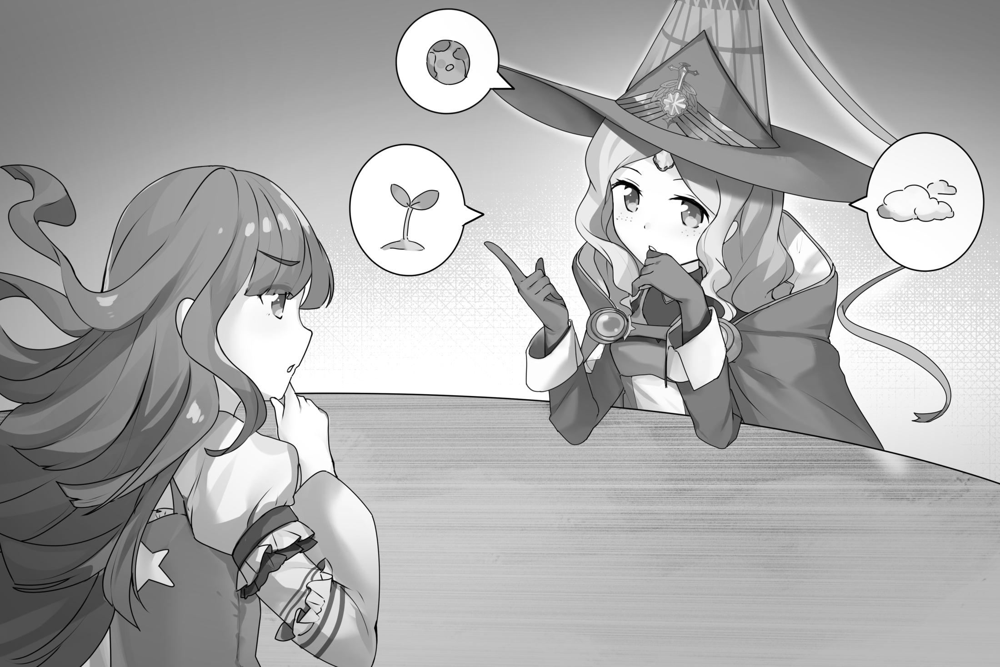

# 第十章 准将

“军训开始的初次离家总是令人揪心的。新晋魔法少女们不得不告别家人，离开朋友，在不足一周的短短时间里交待好自己的一切。在这一周里，她们还需要参加一次草草组织的入职培训，并且和导师见个面。而最后，她们通常会和家人一起吃个送行饭。这种草率的告别方式既是紧迫战况下的一种必需，也是为了让亲人们能够下决心和女儿道别。毕竟，她可能再也不会回来，即便回来，也一定和从前判若两人了。”

……

“在战争早期那些绝望的岁月里，军队和行会把手上的所有女孩都派去了前线，刚契约的新人甚至训练个两三天就直接上了战场。人们尽着一切可能想要减缓地盘沦陷的速度，以及随之而来的巨大伤亡。灭绝的恐怖回荡在决策者的心头。他们都明白，外星帝国的全貌并非他们的草草侦查所能掌握，它们很可能只需调配资源集中兵力就能轻易摧毁人类的防线。在这种恐慌的气氛下，政府甚至越过了历史悠久的社会常识和道德底线，默许了这种和娃娃兵毫无二致的行为，甚至唯恐征发得不够及时。人力资源 AI 则预测出了荒谬绝伦的魔法少女需求人数，而为了满足这一要求，人们就顺理成章地把所有能找到的魔法少女派了上去。”

“最终，外星人没能扩大它们的最初战果。后来人类也发现，虽然挑起战争的是它们的偷袭和屠杀，但其实当时的外星人也没有彻底做好动员工作，就准备仓促而言和人类半斤八两。战争中期这一观点则得到了进一步的证实。外星人多次尝试通过决定性的攻击来直接赢得战争，但最后似乎总是差了那么一点点。”

“随着危机感的减退，政府和军队逐渐放缓了战争早期的严酷政策。虽然兵力仍然紧缺，但从契约到参战的时间还是增加了，训练期间也相应延长。而人们同时也立了一条规矩，让十三岁以下的契约者从此可以不必参战。虽然来自行会的压力，还有代表未成年人和家长利益的政府团体都在推动这些改变，但背后起了最大作用的还是一些实际考虑。毕竟，从容参战的人士气更高，而训练充分的年长女孩则有更好的战斗表现。当迫在眉睫的危机已经结束，军队就有了余力来进行一些长线考虑。他们转而注重提升部队质量，而不再只是把每个人急急忙忙地丢进战场。”

“但对于行会和执政体的很多成员来说，这些让步还是远远不够的。她们从情感、伦理还有实际需要等多种角度提出质疑，声称当前的训练系统是不人道的。考虑到魔法少女的稀有性，她们也提议将参战年龄提高到二十岁，这样至少可以提高存活率和部队质量。这些质疑很难反驳，但紧急征兵法案在这种状况下依然存留至今。从中不难看出前线对施法者的渴求已经到了何种地步。”

“在本土星球和内地的发展中星球，外星飞船突然出现的直接威胁已经基本解除，民间意见已经开始一边倒地支持征兵法案的人道化。几乎每次开会的时候国防委员都会遭到长篇大论的说教，要求军队加快征兵法案的放缓进程，甚至连代表军方的一些子委员和高级军官都在公开支持。看起来，如果欧夫拉塔危机能够顺利解决的话，事情就该有所进展了。”

“唯一能让人产生相反联想的就是参谋部的态度。尽管鄂温马克元帅和巴元帅一贯都是行会利益的坚定支持者，但在这个问题上，参谋部始终都是保持沉默。很多人认为，这意味着战争的状况并没有人们想象的那么顺利。”

**—— 在线文章 “关于战争政策的争议”，克利夫顿・百利**

下面〈〉中的文字需要拥有相应阅览等级才能看到。圈内的数字代表所需的密级。

和很多其他部门一样，心理卫生部（MHD）诞生于行会中前期的正规化与官僚化时期。虽然有人会说这东西早就该搞一个了，但其实该部门只是在内部法庭成立之后才得以组建。而内部法庭则是灵魂卫队发展过程的衍生物：随着战斗力的不断提升，她们活捉的 “犯罪” 少女越来越多，而被迫杀掉的越来越少。

随着内部法庭将越来越多的犯人判为监禁而非死刑，秘密关押这些超级少女的困难和花费让刚刚站稳脚跟的行会开始捉襟见肘。其中最严重的则是悲叹立方的消耗。一下子，如何改造那些曾经公认无可救药的家伙就成了一个热门话题。其中很多人〈都是饱受创伤被逼疯的，〉①处境确也令人同情，而她们的罪行至少在理论上也是可以原谅的。毕竟真正的冷血杀人犯〈两手沾了太多血腥，纵然神智失常也已无法原谅，所以〉①都被判了死刑〈，用特制大锤执行〉①。

〈同时，保护性拘束 —— 俗称 “做朋友”—— 带来的资源消耗也已不可小视。虽然相比长期监禁来说仍是九牛一毛，而且这一措施早已广为人知，但这毕竟也代表了行会系统里客观存在的另一种需求。〉①

最初的改造尝试都是头痛医头，脚痛医脚。依靠的基本都是从前的朋友和战友，拉上个读心者，或者从外面找几个心理咨询师 —— 还要依靠说服、收买或者威胁之类的手段让她们闭嘴。很快，人们就意识到了光这样是不够的。所以离第一位内部法官就任只有一年，领导委员会就投票设立了一个新部门 —— 按她们美化过的说法 ——“用于治疗和帮助那些因健康问题不能作战的少女，并且保护新契约者健康成长”。

虽然最初大家都觉得团队内部的事务遭到了官僚组织的横加干涉，上面的第二个功能最终还是成为了心理卫生部的主要任务。这个由读心者，共感者和心理学家组成的部门一次又一次地证明了自己的价值，预测出了无数次的精神崩溃，并且同样无数次地防患于未然。最终，每个新人在报到时去心理卫生部进行的初次评估成为了传统，乃至法律。这一习惯一直延续至今。

她们最初相当注重患者隐私，不会过分深入。但是，在和灵魂卫队〈、暗之心〉③还有无数饱受创伤的〈疯狂〉①犯人的交流中，这一组织的内部文化开始改变，变得强硬起来。很快心理卫生部就开始利用她们的内部资源，尤其是读心者，在行会内部建立了一整套监控网络〈，名义上是为了在绝望发生前防患于未然〉①。随着时间的推移，她们的工作能力日臻完善，开始将职责拓展到其他领域，比如为行会成员提供普通的医疗服务。据估算，在行会刚刚完成全球化那一时期，心理卫生部每年可以为整个组织节约数百万颗悲叹立方和将近二十万亿美元的经费（2100 年币值）。

〈上述的监控能力和部门成员的心理学专长也导致她们后来和灵魂卫队〈以及暗之心〉③走得很近，很多人都认为这对部门的中立性颇有损害。〉②

心理卫生部的特殊地位让它成为了行会最强大的部门之一。她们会利用无孔不入的监控网络获取情报，然后透过从前病人的关系施加影响。不过事实证明，心理卫生部在患者资料的保密上做得还是相当到位的。她们会不厌其烦地将需要保密的个人信息和不需保密，但仍有价值的信息区分开来。〈这一原则在历史上只违背过屈指可数的几次，每次都有至关重要的理由。某几次背后甚至有着暗之心的身影。另外还要注意，该部的隐私保护原则只对行会会员有效。〉④

〈心理卫生部还扮演了一个不大为人所知的角色，也就是‘人类行为学官方顾问’。她们会在孵化者有所要求时提供相关的咨询服务。毕竟，让孵化者对人类多一些了解总是件好事，尤其是当它们在策划些什么的时候。不过心理卫生部也有自己的判断，有时会选择拒绝回答，或者先行请示上级。〉③

〈也许心理卫生部最黑暗的侧面就是它在‘格式化’中所起的作用。这个名词指的是借助一个或多个强大读心者的力量，清除某个人记忆（比如受创记忆之类）的过程。这个手术的对象仅限于最最疯狂的那些女孩，或者最见不得光的暗之心行动。每次使用都必须经过秘密行动子委会的亲自批准。也许这里不应该讨论该手术的非医疗用途。但我们还是要注意到，心理卫生部之所以能让每个病人都能成功重返社会，无一失败，其中的关键正是格式化手术的医疗用途。〉④

尽管心理卫生部的影响力很大，但她们的不干涉原则也是出了名的。只有在她们认为某个问题对全体魔法少女的心理健康至关重要时才会施加自己的影响。对于其他问题，她们都坚定地置身事外。

心理卫生部成立不到五年之后，行会就取消了监禁这一惩罚措施，原因是关押魔法少女的现实难度。犯罪的女孩们要么被送去心理治疗，要么会受到一些其他惩罚，比如罚款，比如在条件恶劣的地区强制服役，或者对于最严重的那些，有限度地减少悲叹立方的供应。而自从战争开始之后，死刑就已经在执政体的干涉下逐渐废止。〈不过其实只要罪行足够变态，政府在大多数情况下还是会睁一眼闭一眼。还好，自从统一战争结束，这种情况就已经很少见了。〉③

**— 节选于 “魔法少女：她们的世界和历史”，作者朱利安・布拉迪修**

---

“你确定我死了？” 杏子用人类标准语问道。她的语气显得异常愉快，但还是隐隐含着不容反驳的威势。

良子当时的感觉就像是被十二双牢牢盯着自己的眼睛同时解剖检查一样。

“很难分辨。” 良子低头看着自己的手说。“我基本什么也感觉不到，而且我恐怕也控制不了自己的行动。”

她重新抬起了头，看着半圆型桌子对面坐着的那排少女。详细描述的话，圆型一侧坐了十二个人，都在紧盯着她。而她和浅香则坐在了平的一侧，无法同时看到对面所有人。浅香是被良子硬拽过来的。出于好奇，良子决定同意和神学会的人见面，但她可不想被那帮人生吞活剥，她们多半都是有经验的审问官。

大多数的参会者都是作为虚拟形象出现。全息投影的年轻女性和女孩们从看不见的杯子里喝着水，或是把胳膊肘靠在了看不见的桌子上。手臂插入现实木桌的部分隐约有些闪烁不定。

和教团总部某些装潢华丽的大厅不同，这里没有任何玻璃，只是一个灯光昏暗的木质房间。唯一的装饰就是对面墙壁上面镶嵌的宝石：一块巨大的粉色星光蓝宝石（合成的）镶在了中间，周围是一圈类似质地的黑色小宝石。。

**别被气氛传染了，** 浅香悄悄说着念话，甚至连看都没看良子一眼。**记住，这是先征得了你同意的。你不是教团成员。她们可管不着你。**

“但是，” 过了一会，良子接着说道。“神启里的浅香好像非常确信她死了。那个，呃，之后过来的岸田さん也是一样。她们好像连检查都没检查。”

良子发现说标准语的感觉挺糟糕的。对她而言，这只是一种在课堂上偶尔练习或者会在网上看到的语言。她听到的看到的都已相当不少，但她刚刚才意识到，自己从没有**说过**这门语言。脑子里的语言模块的确有用，但还是会偶尔出现不太标准的地方。比如，她对在不认识的人名字后面加上敬语已经习以为常，这种正式场合尤为如此。所以她在 “岸田” 后面磕巴了一下，把日语敬语加了进去，而标准语是没有敬语的。而雪上加霜的是，她还得临时查一下麻希的姓氏，因为她刚刚发现自己以前根本没有注意过这个，也没有别人告诉过她。

她开始有点了解西蒙娜不远万里前来日本的感觉了。现在她常常会想起那个女孩的事，毕竟她也在神启里出现了一次。前面是奇特容器那段，后面是见到，见到 ——

见到什么？女神？也不可能是别人了。面前的诡异教团居然说对了一件事，这让她很不自在。她 ——

不，她现在根本没法考虑。一下子根本没法接受这么多东西。她只能先等一会。现在，她必须把精力集中到更现实的事情上。

“如果她们都这么感觉的话，那她肯定是死了 —— 那个，当然是在神启里，” 紧挨着杏子右面的双马尾少女说。良子的内部视野给她的标记是 “田中唯，行会创始成员”。

“总之，这个问题其实问得也有点怪，” 她总结道。和大多数其他人不同，她是本人前来。

“我只是想确认一下，” 杏子转头看着唯说。“现在的志筑可是个新人：她不会辨别真正的死亡。”

她重新看向良子。

“给你讲解一下的话，” 她说。“你其实可以通过感应灵魂宝石来确认。一个重伤女孩的灵魂宝石会输出巨大的能量试图弥补伤口，除非和身体的链接已经切断了。这不能说万无一失，不过一般来说也算够准了。”

“很多东西都有点不协调，” 良子正右方的女孩 —— 米娜・蒙塔吉尼 —— 摇头说，落下的长发遮住了眼睛。“杏子为什么要指挥一场登陆作战？为什么连她都要上战场？”

“我偶尔还是会上前线的，” 杏子干巴巴地说。

“但很少会是这种理由，” 蒙塔吉尼说。

“也许是一种象征手法什么的，” 良子想了想说。

“不大可能，” 杏子立刻答道。“女神很少有使用象征手法的记录。她好像不太喜欢那种东西。”

“噢，” 良子出声应道。

“不管怎么说，” 蒙塔吉尼接茬说。“你感觉有任何象征性的内容吗？回忆一下。”

良子听话地回忆了一遍。有些部分有点像，但是目前讨论的那一部分，也是她唯一说出来的那一部分，感觉很是直来直去。

“恐怕没有，” 她说。

“还有另一个问题，” 浅香突然插嘴，让良子吃了一惊。“因为结界没有受损，良子说杏子看上去像是被潜艇误射的电磁炮干掉的。但是那种程度的冲击力应该还不够击碎灵魂宝石。起码在戴着防护的时候不够。宝石护甲的设计目的就是为了防止这种事情。”

“可能之前已经受损了，” 其中一位神学家说。“她看着像是刚刚大战过一场吗？”

良子又回忆了一下神启的内容。

“不像，” 她说。“起码我看不到任何受伤的迹象。她的灵魂宝石看着也没问题。所有的伪装宝石都是亮的。”

“就算受损过也会马上换一个的，” 浅香说。“一位中将不可能连宝石都不掩护一下就在战场上走来走去。”

“对了，我刚想起来，” 良子打断了她。“岸田，她 —— 她在神启里也说过潜艇炮弹应该打不碎灵魂宝石。她也说了护甲什么的。我还以为她只是拒绝接受现实，但现在看来她说得可能是对的。”

“战斗中确实也会发生一些怪事，” 蒙塔吉尼说。“不过我不是在否定你们哪一位的看法。这值得思考一下。”

“这些关于我死法的讨论让我觉得很不舒服，” 杏子说道，看起来对这个话题有些不太自在。“不过我想我总得面对这个问题的。爆炸有多大？”

良子再次回忆起了神启的内容。那撕碎她和杏子脚下崖壁的爆炸，地面的碎片在她周围飞过，就算在增强过的五感下也几不可辨，还有那四散的身体碎块 —— 嗯？

“我不确定该怎么描述，” 良子说。“她当时站在悬崖边上，而且她也是唯一的死者。但我想爆炸应该很强大。它直接把她旁边的悬崖炸得粉碎，还有，呃，那个 ——”

她咽了口口水。她必须说出来。

“那个，现在回忆一下的话，的确有点奇怪。那大概可以说是…… 直接蒸发了杏子的上半身。下半身能保住，我想可能是被地面挡住了。因为我觉得那次攻击好像是有一定角度的。大概是那样吧。最让我印象深刻的是，我感觉自己根本没见到有什么，呃，**其它部位**飞出去。”

神学家们彼此对视，也间或打量着杏子。杏子本人被这么一说，自然是显得相当难受。还有几个人直直盯着良子。

“电磁炮的炮弹做不到这一点，” 浅香说着，摇了摇头，马尾随之晃动。“除非是重炮用的那种，但那就会连周围的人也一起干掉。炮弹的动能会在撞到悬崖的时候就释放掉。唯一可能造成那种斜切一刀的感觉的，只可能是弹速超过了冲击波的传播速度。比起别的来说，这种伤害形式更像是一束高能激光。”

她用询问的眼神看着良子。

“我没有看到那样的东西，” 良子说。

“激光未必都能看到，” 杏子有些好为人师地解释道，顺便教她点儿东西。“你能看到作战激光的唯一原因是我们会在旁边加上一束可见光谱激光，好让大家看到自己打到了哪里。在太空里就根本没用，而且特种兵也喜欢把可见光关掉。”

良子仔细回忆着。

“那我就不知道了，” 她最后说。“可能吧。”

一段漫长的沉默。与会者们相互对视，想要看看是不是还有人想问其它问题。

“如果没有别的了，” 良子左侧的一个全息影像说，“我还有最后一个问题。”

这是 “克莱丽丝・凡・罗萨姆，历史学家”。这一发现给良子脸上带来了一丝惊喜。从某种意义上说，克莱丽丝也算是个名人，不过可能只有良子才会热衷于此吧。良子埋怨着自己为什么没有一开始就注意到她的脸。

良子期待地看着这位脸长雀斑，母性微露的女人。从姿势看来，可能现在她人正坐在汽车里。不过这也不好分辨。

“知道是哪个星球吗？” 她问。“有任何值得注意的地方吗？天上有两个太阳或者紫色海洋之类的？植物呢？气温呢？”

过了一会，良子摇了摇头。

“说实话，看起来很像地球。我没太注意温度。树看着像地球的树，海是暗蓝色的，我 ——”

良子顿了一下，然后仔细想了想。

“其实，我觉得天空比这里黑一些。大概？”

“地球植物，” 另一个女孩，玛丽亚・柯蒂斯，说道。“但显然不是地球。不过很像地球。听起来像是某个第二波殖民星球，因为植物都是进口的。但我们恐怕很难判断气候改造到底是早期还是晚期。我们也不知道那里到殖民地的距离。”

“总之，目前还没有足以采取行动的情报，” 浅香评论说。

“对，” 杏子淡淡地说。

然后清了清嗓子。

“我想今天会议的核心结论是，某位佐仓杏子需要避开涉及潜艇的登陆作战，” 杏子干巴巴地说。“尤其是处在某个第二波星球上的时候。都说到这个地步了，我想她应该也不会不听劝吧。”

有几个人笑了出来。

“这很常见吗？” 良子说。“我的意思是，关于未来的预言，还有对相关人员的警示？”

“比你想象的多，” 克莱丽丝说。“但比我们希望的少。”

良子猜度着话中的含义。

“我们的首要目标，” 杏子解释着，作出了一副说教语气，“是推测女神的意图。一般而言，看到神启的人能够分辨神启的内容是否应该告诉别人。然后要做的就是判断我们到底需不需要改变未来。当里面涉及到教外人士的时候，让她们相信我们的警告可能很难，所以我们会操纵一些其它因素。不过如我所言，这一次，我们倒是不用花太大力气说服对方。”

“也许吧，” 克莱丽丝意味深长地说。

大家看着她，但她没有进一步说下去。

“关于这次神启，还有其它部分想跟我们说吗？” 田中唯问道。“这是你的私人事务，所以我就是问问，但还是考虑考虑吧。每一点都可能会有重要意义的。”

良子摇了摇头。她已经下决心不想把其余部分说出来了。

“有任何关于女神的内容吗？” 柯蒂斯问。“当然，我们对这个还是很感兴趣的。”

“没有，” 良子撒谎说，一边确保着不要在脸上露出痕迹。

“有兴趣加入我们教会吗？” 蒙塔吉尼问着，俯过身来，意外地显得颇为积极。“神启肯定已经让你看到我们信仰的真实性了吧？”

“啊，我会，呃，考虑一下，” 良子说，她确实也就是这么打算的。她绝对没有打算加入教团，但她还根本没来得及考虑过神启的内容，也没法下什么决定。从神启结束到神学会的人过来问她要不要加入紧急会议，前后只隔了十分钟不到。

“慢慢考虑吧，” 蒙塔吉尼说着，躺回了椅子上，神色显得有点失望。

“她是我徒弟，” 杏子看着她说。“不用着急。她该下决定的时候会下的。不要强迫。不过虽然这么说，如果你关于教会有什么问题我倒还是很乐意解答的。”

最后一句是对良子说的。

“我会，呃，考虑一下，” 良子重复道。

杏子闭上眼睛，像是在思考着什么。

“好吧，” 她猛地睁眼，说。“你们俩可以走了，我们会私下里继续讨论。”

浅香站起身来，走向了背后的房门。过了一会，良子也跟了上去。

“你发现田中小姐是读心者了吗？” 门一关上，浅香就这么问了一句。她观察着良子的反应。

良子睁大了双眼。

“没有，” 她说。“我忘查了。”

“任何有魔法少女参与的审讯或问话都会有读心者在场，” 浅香说。“绝无例外。在这里，因为神学会的成员里就有两位，所以她们一般不用特地从外面请人。而读心者在这里起到的作用也尤为重要，因为她们会努力想要把你关于神启的那些记忆都挤出来。至今她们得到的东西最多也只有模糊的残片，但毕竟还是值得一试。”

“为什么没有提前告诉我？” 良子问。两人沿着大厅走向了教会正门。

“如果我觉得有必要的话，我就说了，” 浅香说。“反正你也不知道该怎么应付，只会徒增紧张，搞得更加生硬。”

“但是 ——” 良子说。

“而且如果你真是隐瞒了，比如说，女神的事情之类的话，” 浅香说。“那就不用担心了。田中唯是一个有趣的人。她永远会在这个问题上给你打掩护，因为一般来说，这也是女神本人的请求。”

良子咬着嘴唇。很明显，浅香大概知道事情的原委。但是严格说来，要是跟浅香说了什么的话，其实也算对那位粉白女神请求的一种违背。

良子双手抱头。神？预言？她现在的唯一结论就是，她所见到的存在是抱有善意的。不知怎么，她就是确信这一点。现在真的应该入教了吗？

她从沉思中惊醒，发现浅香正在看着她，似乎觉得很有意思。

“我知道你很想赶快回家，” 浅香说。两人从前门出来，走入了夕阳的余辉中。“但还是先跟我散个步吧。我有些事情想跟你说。”

良子点了点头。

---

她们走到了大楼的反面，一条马路将教堂和对面的两座研究中心隔了开来，两人走进了路边的行人通道。一路上，浅香带着宽慰的笑容，看着良子在残存的阳光下努力眨巴着眼睛。良子已经顾不上抗议了。这种正常感让人很难接受：所有东西看着都变了样，所有颜色上都增加了难以辨识的浓淡变化，但这一切看着却并不奇怪。

两人在隔壁大楼的阴影里停了下来（至少是在这个点钟里最接近阴影的地方）。“事实上，”，浅香说。“虽然受体可能已经启动了，但是大多数神经系统还得再过一周才能连好。植入芯片正在试图通过额外计算来修正这一点，但是现在，你只能看到你大脑所能接受的那些变化。当然，还有一部分的固有变化是来自晶状体的改造，而非其它。”

良子瞥了她一眼。看来她对自己表情掩饰得不好。所以浅香又加了句：

“没错，我也明白。帕特里西亚才是科学家。我知道这些都是因为我自己也经历过，带我的人当时是这么说的。而且，反正还有教程指导我们应该跟新兵说什么。”

她靠在了大楼的石纹贴面上，环抱着双臂。

“不知道北村小姐现在怎么样了，” 她说着，看着周围高不见顶的大楼，还有那些纵横交错的空中通道和行人走廊。有些直接通到了大楼里，还有些则开在了阳台上，目的都是一样。在慢慢变暗的傍晚天空之下，所有这一切都被阳光染成了金色。

“听说她刚提了上校，” 浅香说。“不过可笑吧，我现在官儿比她大了。”

良子不由得抬起了眉毛，而浅香则毫不退让地迎上了良子的人脸扫描。

“准将，” 浅香说，重复着良子明显会看到的内容。“我其实应该劝你养成习惯，对每个看到的人进行一下完全扫描的，不过现在这已经没有意义了。只要你的战术电脑一启动，它就会帮你搞定的。应该快了 —— 它的自组装过程很快，不过也是靠了安全套餐打下的基础。”

“你不是一个传送者？” 良子问。“我还在看 —— 结界能力？”

“很复杂，” 浅香说。“传送算是刚练出来的。不过……”

她的声音越来越低。

良子走了过来，和她一起靠在了墙面上。一辆汽车在身边飞驰而过。

北村小姐，无论说的是谁，起码不像她以为的那样，是浅香的导师。实际上，浅香的导师栏里谁也没列。她对此有些好奇。

“我敢打赌，你肯定正在想，” 浅香说，“我到底还待在这里干什么呢。我没有任何足以脱离前线的特殊专长，在教会行会里也没有太高的地位。像我这么个小将军多半还是得去哪儿打个仗，对吧？就像所有其他人一样……”

良子耸了耸肩。

“你说的话有一半我都听不懂，” 她说，“因为没查过。我还没来得及连这种事情都要八卦一番。一直都忙着学别的去了。我想我大概是把你当成了某种…… 专业新兵训练员？”

浅香微微一笑。

“差不多，” 她说。“这就是我现在工作的大部分内容。还有，我其实也在指挥这里驻扎的快速反应部队，并且负责指派巡逻。我也会在业余时间写一点战略分析报告什么的。我们会努力让休假中的女孩们能够放松下来，但这并不是总能做到。不过有些从战斗岗上轮换下来的女孩会加入这里保持状态，所以我们的大部分人员就有了着落，心理卫生部其实也认为这能帮助一部分人保持精神稳定。我们队里的人大多数都是二线女孩，或者 —— 这是个肮脏的秘密 —— 因为精神原因被从前线撤下来，但是心理医生认为可以通过打魔兽好转的人。你也知道，可以给攻击欲望和愤怒感情提供出口，但是周围死人的危险要小上很多很多……”

她叹了口气，然后把抱起的双臂放了下来。

“算了，我还是不擅长这个，我就直说吧。我留在这里完全是女神的请求。入教也是。本来看完神启之后，我就已经恢复到可以重返前线的程度了，但我最后还是靠拉关系勉强留了下来。当时既要说服她们，又要保持女神的秘密，总之相当困难，但我还是做到了。”

“然后我给你看了记忆里那个女孩的影像，那就是你所等待的东西，对吧？” 良子看着她的脸，问道。不知何时，浅香早已闭上了双眼。

“没错，” 浅香说着，睁开眼睛看着她。“女神让我等着给我看那个影像的人。我没料到会是你。对了，她到底是谁？该死的人脸扫描居然跟我说影像过于模糊，无法辨认。”

“我不知道，” 良子说。“这也是我来问你的理由。我以为你能告诉我怎么才能找到她，或者至少告诉我应该如何是好。”

“你当时就没查一下吗？” 浅香带着疑惑的表情问道。“还是你索性就忘了？”

“比那复杂得多，” 良子说。“她告诉我查了也没用，反正结果会是错的。我当时根本不知道这东西的结果还能是错的。”

“嗯，” 浅香哼了出来，低头思考着。

良子等了一会。

“我听说过这种东西，” 浅香终于说道，把手从下巴上拿了下来。“不过只是传闻。显然，我本人可没有体验过。按照官方说法，人脸扫描是万无一失的。但是私下里谁知道暗之心在干些什么？我的权限还不够接触这些。很少有人有这种权限。”

“我也听说过暗之心，” 良子评论道。“秘密行动，特务部队，诸如此类。有很多关于她们的阴谋论说法。”

“她们也没那么坏，” 浅香说。“至少现在没有了。按照传闻的说法，以前她们什么烂事都会掺一脚。暗杀，政变 —— 就像你说的，已经到了阴谋论的范畴。不过现在已经不大需要这种事情了。这场战争是一场面对面的较量，还没有谁对外星人能够了解到足以使用‘高级战术’的程度 —— 我们连应该暗杀谁都搞不清楚。不过也不是没有人尝试。比如特种兵突击什么的。”

浅香停了停，像是在考虑着什么该说什么不该说。

“虽然这么说。但其实我也看不到太多，” 她说。“跟刚才说的一样，没有权限。政府有很多对内的监控行为。现在这些要是落入了暗之心手里的话，我可一点都不会奇怪。如果你见到的那个女孩真是她们一员的话……”

她又停了停，然后总结道：

“总之，要是我起码会小心点。底下可能有很多见不得人的事情。她可能在跟踪异见人士什么的。你恐怕不会想要搅和进去。”

良子严肃地点了点头。她觉得浅香知道的其实比她说出来的要多。然后她笑了笑。

“反正，自从我长大之后就再也没见过她了，” 良子说。“那段记忆就是最后。没准一辈子我也不会再遇上这个人了。”

“看情况吧，” 浅香说。“还有我是不是应该提醒你，我刚才可没有提到我在等待某个影像什么的哦。”

良子把眼神转向了一旁。

“那个 ——” 她说。

“不，什么都别说了，” 浅香挥了挥手，有些不以为然地说。“没有必要。”

良子说到半截就卡住了，直愣愣地盯着她。

浅香正在摩挲着自己上衣的领口部位，那是军服上放置将官领章的地方。

“可笑的是，我这个准将头衔还从没用过呢，” 她说。“我是在返回地球的路上升的官，算是那块儿勋章的附赠吧。晓美焰勋章，授予‘从看似无望的战况中成功胜出的人’。你能相信她们拿她的名字做勋章吗？我每次想到的时候都觉得好笑。”

她看着地面，明显陷入了某种回忆之中。

良子也在看着地面。她想问，但不知为何，她觉得这可能不会是一个好话题。

“介意告诉我，你是怎么挣到勋章的吗？” 她终于还是选择问了出来。

“说实话，我介意，” 浅香直接顶了回来，甚至没有看她一眼。

良子正想着应该如何回话，但浅香却又来了一句：

“噢，去他的吧。你可能还是应该听一下的。如果我连女神计划里的人物都不能信任，那我又能信任谁呢？”

“你其实不必 ——” 良子刚开口，浅香就已转过身来，用表情让她闭了嘴。也就是说，她现在已经没有客套的兴趣了。

“我就长话短说吧，反正那些细节对你也没有意义，” 浅香再次躲开了视线，说道。“而且你以后也可以查到大部分的事情经过。我要告诉你的是，当时是靠着我的指挥赢了那场战斗。在我以上的指挥系统已经全数阵亡了。是我救了那个殖民地。”

她做了个深呼吸。

“而取胜的方法是把我最好的朋友派去送死，” 她已经几乎是在低吼。“在最后一刻来临之前，我甚至没能跟她说上话，也没看到她的人。我们之间的最后一次联系是我脑子里发出来的电子命令，还是通过指挥接口中转的。没有声音，甚至没有文字。我当时根本没有这个时间。”

良子尴尬地把视线转向一旁，尽管浅香甚至都没有在看着她。

“爱丽丝？” 她问。

“没错，” 浅香答道。

“对不起，” 良子说。

“之后我彻底垮了，” 浅香没有正面回应良子的道歉，只是继续说道。“颁奖典礼提拔命令什么的我已经几乎没有印象了。我 ——”

她停了一下。

“我跟你说过我是个游戏玩家，对吧？在契约之前，我对这种事情曾经相当投入。在其中一个游戏上，我已经几乎到达了职业水平。这还是很不容易的，你得想到那帮玩家平均年龄多老。二线玩家，我只要稍微再加把劲儿的话……”

她右手指天，虚握了一下，做了个强调。

然后她转身面对着良子，看着她的眼睛。

“但在游戏以外，我过得始终都很不快乐，” 她说。“在人类心理多样性的可接受范围里，我只能勉强算是沾了个边儿。所以我许了愿，想要知道在外面的世界里获得成功的方法，就像我在游戏里做到的一样。”

她重新转向一旁。

“许愿的结果非常有效，” 她说。“你现在看不出来我曾经是个社会弃儿，对吧？但在爱丽丝死后，这一切突然都显得那么一文不值。她们在我受勋经历的官方说明里没有提到，作战记录里也没有写，但是在听到她阵亡消息的一瞬间，我就崩溃了。它 —— 我的灵魂宝石 ——”

浅香瞥了良子一眼，表情一时有些捉摸不透。

“总之，那是心理卫生部的事情，” 她接着说。“她们有的是方法对付这种崩溃女孩。”

“她们会拿走灵魂宝石，” 良子瞪大了双眼，若有所悟地说。“原来是这样，那就说得通了。我一直不懂你在神启里为什么要那么说，拿走麻希的灵魂宝石什么的，但现在想来 ——”

“我那么说了？” 浅香问。

“对。”

浅香微微一笑。

“嘛，那也做得没错，” 她说。“总之，我被她们打发去‘治疗式休假’了，也就是说被要求滚蛋回家，先把自己的心情整理好，中间整天都会有心理卫生部的专业人士盯着你。那段时间很难受。我重新一头扎进了游戏里，玩的甚至都不是以前那种竞技性的东西。偶尔还会打打兴奋剂什么的。然后我在某个殖民地转了一圈，植了个违法 VR 芯片。就和帕特里西亚说的一样：有些事情可以做到，但政府永远不会批准。比如说，VR 芯片的某些变种可以让你忘掉自己身在何处。对你而言，虚拟世界就成为了全部的现实，而在那里，你可以没有任何过去。”

她的语气平铺直叙，但内容却是令人发指，甚至连良子都不由得倒退了一步。但紧接着她就慢慢理解了其中的含义，强迫自己重新立定。

“然后我和父母一起住了一段时间，” 浅香说。“现在想来，我真是对他们做了很过分的事情，但是当时……”

她耸了耸肩。

“我已经完全麻木，管不过来了。我大夫就是这么说的。最终，她建议我到处走走看看，呼吸点新鲜空气，甚至还推荐了一个地点。之后想来，她应该是和帕特里西亚谈过，大概是觉得一起训练的队友会有所帮助吧。毕竟我也是在那里遇到的爱丽丝。”

“所以我来到了这里，最后还是听她们的劝，瞻仰了一次缎带。我在神启中见到了爱丽丝和那位女神。之后就不言自明了。”

良子看着自己的双手，然后重新看向浅香。

“所以那根缎带……” 她开口说。

“救了我，没错，” 浅香替她说完。“基本可以这么说。”

浅香微微俯身，按住了良子娇小的肩膀。

“说出来之后感觉意外地畅快，” 她说。“我不知道为什么我会突然想告诉你。也许我的怀疑是对的，这一切都是女神的旨意。我从没想过我预言的终点居然会是你。”

她靠了回去，然后想了想。

“我想如果说我的故事有什么重点的话，就是说绝望对每个人都是必将到来的。你周围的那些女孩，那些好几百岁看上去坚不可摧的人，她们都在某时某地有过类似这样的经历。每一次都足以击垮她们。但她们都没有垮下来，而当你的那一天来到的时候，你也不应该垮下来。”

趁良子还在消化刚才的内容，浅香最后一次转过身去。

“我想你要能入教的话，应该会不错吧，” 浅香说道，就像是刻意在收拢话题。“我觉得告诉你是我的义务，不过教会的确没有那么糟糕。而且我好久没和妈妈聊过了，可能应该打个电话……”

“我希望我永远不要看到有朋友在面前死去，” 最后良子说。“或者任何其他人死去。”

浅香用一只眼睛回头瞥了她一下。

“好吧，不过别忘了，你签的可就是这种契约啊。”

---

“普罗米修斯和宙斯，是吗，” 在和浅香一起走回教堂的途中，良子说道。

她说的自然是教团总部一侧的那两栋研究大楼。她们刚刚还在其中一栋的墙面上靠着呢。

稀稀拉拉的路灯和头顶大楼里漏出的灯光照亮了周围的黑暗。在这么低的地方，星星是基本看不见的，月亮多半也会被四周的某一栋摩天大楼挡住。头顶上川流不息的车辆都是没有开灯的：电子控制系统让视线变得毫无必要。在地表道路行驶的时候之所以开灯，完全是为了方便行人看到。不过实际上就算不开，它们也从不会撞到人。

两人从人行道里出来，回到了教堂门口。地表道路在这里突然进入了一个很陡的上坡。不过看起来，大部分的车辆都会在上去之前选择拐弯钻进地道，或是爬上空中通道。

“嗯，” 浅香应了一声，没有多说什么。

“我父母都在普罗米修斯所上班，” 良子说。“嘛，至少夜里去那儿上班。他们白天都待在家里。”

“那么他们是研究军方项目的了？” 浅香明知故问，打量着良子。“大部分跟我们魔法少女有关的技术都是那两栋楼里出来的。宝石护甲就是普罗米修斯所研制的。这些大楼都是为我们服务的。不过你恐怕也没必要听我说这些吧。”

“有时候我想知道，我父母具体是做什么项目的，” 良子仰视着高耸入云的大楼外墙，说道。“他们总是含含糊糊的。”

“听起来很正常，” 浅香说。“大部分的工作至少都是对一般人保密的。信息限制法案什么的。然后是那些真正保密的东西，比如暗之心的项目之类。那种东西根本就不是你我这种人所能知道的。”

浅香想了想。

“说起来的话，我还真没听说过宙斯大楼到底是干嘛的呢。大体的事情应该都差不多，但我还从没见他们出过什么具体产品。”

“肯定都是保密的，” 良子刚刚上网查了一下，说道。“我在网上什么都找不到。”

浅香点了点头。

“那就对了。”

良子的视野里突然闪现出一些线条，但立刻又消失了。她本能地眨了眨眼。

“怎么 ——” 她刚开口。

**作战助手已经安装完成，** 她脑海里响起了一个机械音，同时视野右下角不碍事的地方出现了同样的字幕。

**我已经准备好进行激活和初期设置了，** 声音继续说道。**你可以现在开始，或者推迟到任意时间。**

浅香好奇地看着她。

“好像作战助手已经启动了，” 良子说，一边考虑着自己现在应该怎么办。

浅香点了点头。

“也差不多了。这东西自己就会指导你完成激活的。”

“OK，” 良子说。

“我们差不多也到了，” 浅香说，向良子挥手告别，示意她不用再跟上来了。“不用再送我了。在这里叫个车，直接回家吧，天色已经很晚了。今天夜里可以好好调教一下作战助手。毕竟，现在谁还需要睡觉呢？”

没 —— 没错，良子想。她刚刚发现自己还在下意识地想要回家睡觉。

“就是说我不能住在这里了吗？” 良子问。

浅香停下脚步，转过身来。

“陪陪父母吧，” 她劝道，声音里透出了一点难以捉摸的东西。“我看过报告了：你和他们关系还不错。相信我，这么做是没错的。毕竟，那也是我们给你留出这一周的本意。”

良子微微睁大了眼睛，然后点了点头，目送着浅香走上 “教堂” 的台阶。

“等等！” 她说，在最后关头突然想到了一件事情。

浅香停下脚步，回头看着她。

“如果你已经不再需要等待什么了的话，那你接下来要去做什么呢？” 良子问。

浅香脸上慢慢绽开了笑容。

“侍奉女神的这段时间治愈了我的心灵，” 她说。“我已经没有留下来的理由了。我可不是那种能够眼睁睁看着别人出生入死，自己却什么都不做的人。我会回到前线，顺便看看我的新军衔有没有什么附带好处。以前听说过，好像会有额外的植入芯片什么的。”

她停了停。

“我应该会再拉拉关系，跟杏子聊聊，设法在麻美那儿搞个位置，” 浅香说。“对职业发展很有利，尤其是麻美现在又升了官。没准你完成训练之后我们还有机会见面呢。现在你该回家了。以后见。”

说完，她再次转身离开。良子眨巴着眼睛，有些不解。

“升了官？” 良子问。

“自己查一下！” 浅香挥着手说，没有转身，也没有停下脚步。“或者算了。也没什么关系。反正马上就会被大肆报道的。嗯，而且等你一设置完战术助手，没准它就会告诉你呢。”

“啊，那就再见了，” 迟疑了一番后，良子答道。她回应着浅香的挥手，虽然明知对方看不到。

在她身后，一辆汽车减速停下，车门自行打开。

---

**她状况不错，麻美。说实话，要是没有悲叹立方那件事的话，我根本就没什么可说的。**

杏子的声音在麻美的耳朵里 —— 或者说，听觉神经里 —— 响起。她正乘坐着巡洋舰‘讨债日’号，躺在自己舱室里的椅子上。麻美选择了尽早赴任，趁着会议之后还在和鄂温马克说话的当口，她就已经申请了这个航班座位。

大部分的星际飞船都很愿意接受命名委员会推荐的名字，其来源通常会是某个地球城市，著名科学家，或者是历史上的将军。而其他飞船则会做出一些更有创意的选择。

军用 AI 是一群很有意思的家伙。对于是否应该创造这种不畏死亡，好战嗜杀的智慧生命，现在还有很多伦理争议。这不是因为害怕她们反噬其主：理论上这是不可能的。在和很多这样的 AI 聊过之后，就连麻美也不得不接受了这一点。真正重要的是这个问题：如果你清楚地知道自己只有一个设计目的，而你生命中的全部满足也都来源于此的时候，你会做何感想？

当然，比起把民用 AI 征发到军事岗位上来讲，这种做法还是明显更加符合道义的，也更有效率。上面那个问题其实还有一个更加广义的版本，对所有拥有单一设计目的的 AI 都能适用 —— 把一个智慧生命束缚在对单一事物的热爱上，这么做真的公平吗？但是另一方面，你又怎么能采用一个明知不会喜欢也不会擅长自己工作的设计方案？

当一个民用 AI 的工作岗位变得不再必要之后，她就可以退休到一个独立 AI 池里了。大部分这样的 AI 都会选择接受人们推荐的程序修改，从而更好地适应没有特定目的的生活。但是，她们之间，大多数的 AI 还是会对缺乏生活目标感到有所不安。很多 AI 最后形成的兴趣爱好也和退休前的工作内容十分类似。退休过程对 AI 来说是一个巨大的精神考验。也有很多后援团体和 AI 心理学家会专门帮助她们度过难关。麻美从前根本想象不到还会有这样的职业。

她从监视屏幕里看着远处负责护卫的巡防舰，在无灯的宇宙中很难看得清楚。她自己的旗舰朱可夫号则已从长江战区出发，正准备和她在目的地碰头。让他飞过来再接她再飞过去就太折腾了。

**那么，你对这些悲叹立方的事情有什么看法？** 杏子继续说道。**你还没回答我的问题呢。**

**显然，这很令人不安，** 麻美答道，一边又给自己倒了杯茶。**已经好久没见过这种处理过的悲叹立方了。而且我也看不出来志筑小姐在这里有什么重要性。**

**我也查过她的背景了，** 麻美说。**她家系里面的契约者简直星罗棋布。你知道吗？她和小黑井有血缘关系，还有志筑家族。另外两个家族也不是什么小角色。她长这么大还没有被卷进那些该死的大家族里，简直可以说是不可思议。**

**她双亲都是行会科学家，** 杏子说。**而且他们好像根本不愿意她签契约。虽说这些都记在档案里了，但他们家里好像还有更多不为人知的事情。也许和这个有关。**

**嗯，** 麻美一边应着，皱起眉头，喝了口茶。**总之，回到正题。我想说的是，如果认为有某个家族参与其事也能说得通。不过感觉还是不太对劲。她们的竞争意识确实有点过火，但是以前还从没有人做过这种事情。**

**也许吧，** 杏子说。**你也很清楚我对她们是什么看法。**

**没错，没错，你一直不喜欢志筑家族，我很明白，** 麻美说。**但是不管你对她们有什么看法，她们家族确实还是出过很多不错的魔法少女的。最初的时候也给我们投了不少钱。**

过去种下的恶果啊，麻美自言自语道。

**我说的不是这种事！** 杏子说。**我早就想开了。我只是看不惯这种家族什么的而已。**

**无论你喜不喜欢，这东西都会一直存在了，** 麻美说。**而且可能也算有用。我不是说现在就要这么做，不过过段时间我们也许应该把这件事情告诉小黑井，再加上几个志筑家族的人。我相信她们应该不会放过针对她们有望后代的刺杀行动吧。**

**要是实在没有办法的话，也许可以考虑一下，** 杏子哼道。

接着是一段漫长的沉默。

**总之，还有一些事情得告诉你，** 杏子说。**由真稍微调查了一下她那个朋友，西蒙娜・德尔・马戈。她的档案里有些奇怪之处。她是个国际交换生，经常换地方。总之看起来，有一次她提出入学申请的时候在父母栏里使用了不同的名字。两个都是完全不同的人。由真还在查。可能是个罕见的系统错误什么的。**

**嗯，** 麻美想。**我完全看不出来这有什么意义。**

**我也是。另一个问题是，帕特里西亚跟我聊过了。她说在她给良子做增强手术的时候发现了…… 呃，她基因组里的异常情况。她说里面有两处基因突变是从没在任何记录里出现过的。可能只是偶然，但是她似乎对此相当在意。我把数据发给由真研究了，因为帕特里西亚估计不会有这个时间。**

**所以我们查到的每件事情都有异常之处，** 麻美说。**大概吧。这和一切毫无异常的效果是一样的。起码在一个方向能有个准信儿也好。**

**你觉得现在适合让灵魂卫队介入吗？** 杏子说。

**还不到时候，** 麻美说。**让由真先查一查。还有，呃，我自己的调查也在进行。**

**我也是同样感觉，** 杏子说。**还有那个神启对我的信心也是个小打击。**

**我对所谓 “神启” 的看法早就很明确了，** 麻美干巴巴地说。

**我也理解，** 杏子说。**不过我还是觉得你哪天应该过来看看。**

她们已经因为同样内容吵过无数次，以至于现在两句话就能解决战斗了。

杏子在心里叹了口气，还给麻美发了过去。麻美也不难猜到杏子感到失落的原因。

**总之，关于帕特里西亚，我还有最后一件事情要说。**

**没错，你那份调动申请，** 麻美说。**你有几个朋友想要进入我的参谋部。浅香小姐的经历很不错，而且心理卫生部也保证说她已经完全康复了，但是另外两个…… 一个科学家，还有你的新玩物。我说佐仓同志，我可不能把这些位置像糖块一样胡乱送人。这可是人命关天的啊。**

**她可不是什么玩物，** 杏子哼了一声。**我说，我不喜欢总是拿战友感情说事，但是浅香，帕特里西亚和麻希她们一直都是一个部队的。不应该拆散她们。没错，没错，我明白，她已经升到了将军，不应该还讲这些。但这些也是很重要的，不对吗？你以为我喜欢这样？浅香这么做有她的理由，但是我也劝过另外两个人。她们想要陪她一起，麻希更是说她想回去履行她的职责。爱国精神啊。我不想强迫她们留下，毕竟这是她们自己的选择，但是那孩子……**

**连情侣吵架的内容都说出来就让我更没信心了，** 麻美干巴巴地说。

杏子又叹了口气。

**我说，我知道我不太擅长表达，但她们的能力都还不错，不会让你失望的。你可以把她们配给浅香。将官是可以自由选择助手的，不是吗？**

**这可以算作正式的个人推荐吗，佐仓同志？** 麻美严肃地问道。

杏子最后又叹了口气。

**没错，可以算。**

**那好吧，** 麻美说。**批准调动，出了事情你可要负责。**

**当了元帅之后你可真是够死板的，** 杏子抱怨说。

麻美笑了出来，不过她很清楚杏子看不到。

**这是一项严肃的工作，** 她说，没有在连接中流露出哪怕一丝开玩笑的意思。**没别的事情了吗，佐仓同志？我很想多聊一会儿，但我还有别的事情要处理。我总是很忙，你也知道的。**

**嗯，我说完了，** 杏子说。**以后再聊。**

**再见。**

之后，麻美往窗外瞥了一眼，看着外面经过电脑过滤的星空。超光速旅行真是奇妙啊。

---

在回家的路上，良子花了很长时间，仔细地又把神启的内容过了一遍，一边琢磨着女神到底想要她做什么。关于未来的那一部分看起来相当直白：给杏子一个预警，让她能够活下去。关于浅香的那一部分也很清楚，就是和她解释一下以前发生的事情。

但是其余部分呢？教堂里的红色人影和伏地大哭的由真？为什么要给她再看一遍西蒙娜转学的那一天？那个液体容器又是什么？这一切都是那么的令人头晕。

她完全不明白。
