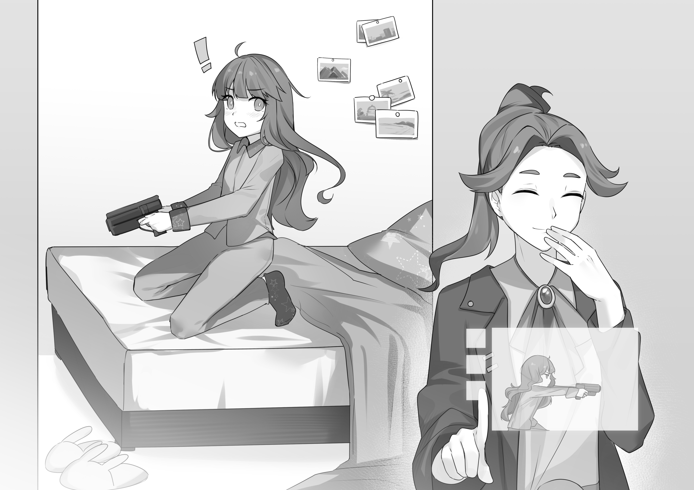

# 第十一章 以往生活的残骸

脊椎节点作战助手，通常称为战术电脑（TacComp），属于自组装神经接口植入体的第三代，专为军方人士设计，同时可以用作主计算节点，个人助手，以及作战顾问，在战场上和日常生活中均可使用。在作战时，它可以帮助控制武器、护甲、战斗车辆、乃至无人机，可以提高战场观察力，提供战斗建议和情报分析，协调其它体内增强装置帮助射击瞄准，也可以转发命令。在作战之外，它可以协助处理下传的思维任务，在有所需要时帮助查询信息，并且辅助宿主作出决策。它也会做一些秘书类的工作，比如帮助安排时间，整理邮件，并且在一定范围内对不太重要的邮件进行自动回复。它的评级是三级半知能体。

作战助手直接安装在脊椎上，位于腹部中间，会挤占一部分原本属于胸椎和腰椎的位置。它担当了很多其它装置的主要收发节点，包括对外通讯装置，神经植入体阵列，还有电路接口装置。因此，从作战助手外部会延伸出一套复杂的光纤网络，椎管上下都有相应的布线，还有一些延伸到椎管以外。这是一般步兵体内最为昂贵的增强装置，足足占据了装备预算的三分之一。

和其它很多类似产品不同，这套昂贵的装备在魔法少女身上既不会出现故障，也不会失去效果，所以它的安装相当普遍，甚至都在圈子里形成了一种文化。作为行会协议的一部分，装置的开发工作由执政体和行会同时监管，而行会有权审查最终设计方案，并且负责属下成员身上的具体安装。制定这一制度的主要目的是为了保证作战助手只效忠于宿主本人，而不是执政体或者行会。这是伦理委员会所提出的要求之一。

关于作战助手的研发工作一直没有间断，每个月都会有升级版本发布，还有少量发放的实战内测版。最新的 1.8 版升级包基本只有简单的性能提升和一些维护性修改，属于在全军推广第二版之前的准备工作。大家对第二版期待已久，它刚刚通过了实战内测，已经开始在高级军官之间发布使用了。

**开发历史**

开发作战助手的初衷来自于统一战争早期‘联合阵线’一方的实战经验。阵线不惜代价地追求精良装备和优质军队，但这带来了一个预料之外的副作用：事实证明，士兵们根本达不到操作装备所需的思考能力，同时也会被反馈过来的大量信息搞得头晕脑胀。雪片般飞来的作战统计一致证实，尽管火力本身有所增加，但作战资源的浪费也越来越严重了。虽然植入体的工作效率和机械装备的自动化程度都在不断提高，但很快人们就意识到，要达到最佳的作战效果，一个高度微缩的计算植入体是必不可少的。

担当研发工作的是康弘财阀——后来人们才知道那其实是行会的下属企业。最初的研发工作延续了整整十年之久，相关设施经常遭到袭击，而且屡次发生的人体实验事故也造成了一些不好的争议。但是，特种部队的使用意见和后来实战测试的统计结果都表示，安装助手之后的作战表现是有着质的提升的。因此，紧急防务评议会始终坚定地支持着这一项目，而 1.0 版——当时称作 SNTA——也赶在埃尔·德拉德[^1]战役之前投入了战场。在统一战争结束时，版本已经进入了 1.2。此后的研发工作一直陷入停滞，直到接触战争爆发之后才再次启动。

[^1]: 译注：埃尔·德拉德(El Dorado) 即“黄金国”。见<https://en.wikipedia.org/wiki/El_Dorado>

**安全套餐**

民用紧急安全套餐其实是一个减少了功能，平时处于休眠状态的作战助手。作为标准套餐的一部分，这一装置在所有公民的体内都有植入，只有少数的宗教性反对者属于例外。所安装的处理能力和通讯带宽都预留了很大余量，以便在提供了必要资源后能够迅速改装成完整版。

**第二版**

第二版对计算核心进行了彻底的重新设计，从而绕开了一些公认难以解决的算法问题。开发者承认了，第二版的很多设计思想都来自于对外星人尸体的研究工作，但不太清楚里面有没有直接应用来自于逆向工程的技术。

作战助手第二版的处理内核是现存计算设备中生物集成性最高的，其中应用了很多的神经元编程模式，旨在充分利用宿主体内原有的细胞资源。公开的细节不多，但人们相信，这将是第一个在非原生位置主动培养神经细胞的装置，而这种培养的质和量都是前所未有的。”

伦理委员会召开过几次围绕着第二版作战助手的秘密会议，这引发了关于这一装置内在原理的各种猜测。接受了先期安装的参谋部成员和高级军官们拒绝评论，不过反正等到安装普及之后就不可能再这样继续保密了。

新版没有做过知能体评级。

**——脊椎节点作战助手，信息百科，低技术性，中等详细版**

一定要记住，您的女儿现在很强壮。壮得像恶鬼一样。可以随意提起床铺扔过来那种壮。她的本能可以很好地隐藏这一点——否则保密工作也无法持续那么多年了。但是一旦出现情感波动，这种力量也是完全可能流露到外表的。以前也发生过一些不幸的事故。

不过换个说法，只要她在家，这种力量在帮忙某些家务时还是相当有用的，虽然她在家的时候不会太多吧。

**——“看得见的超能力”。摘自《父母必读》在线版特集《女儿契约了，我该怎么办？》**

---

虽然浅香似乎说得很麻烦，但她配置战术电脑的过程其实相当顺利，并没有花掉太多时间。基本只需要设定一些个人选项。良子不喜欢自己脑子里有别人说话，所以她把通讯方式设定成了 “尽量无缝”，虽然她还是搞不清楚这具体是个什么意思。她也选择了自己主动查询的时候提供语音回答。当然，战术电脑也提示说，在很多场合下无缝通讯是不现实的，弹出可视菜单又会分散注意力——比如战斗中。不过它也说了下一版正在解决这个问题。

她没有改掉默认的 “机械音” 设置。这里的选择异常丰富，从 “俄罗斯口音的女声” 到 “萨姆萨拉口音性别模糊”。但她最后觉得反正没有理由偏爱其中哪个，而且默认的机械音也有不错的区分度。此外，如果要天天忍受一个脑内声音的话，机械模拟人声感情时的微妙失误就显得难以接受了。还是单纯的机械音实在。

出于好奇，她问了一下到底有多少人选择了默认设置。答案是 92%。

有些意外地，在克服了调头寻找声源的最初冲动之后，在脑海里聆听一个机械的思考其实也很容易习惯。她只要当作是在听电话就好了——显然，现在的电话都是直接连到听觉神经的。

晚饭后，她花几个小时把所有的东西过了一遍，折腾了一会菜单背景，听了一段语音功能介绍，等等等等。看着推荐设置的列表，她开始还觉得设计者的品味真是不错。但稍加询问之后，她才得知初始选项是根据一开始对她进行的人格扫描决定的。

她对关于过脑不忘的性能描述感到颇感神奇，所以尝试了一下，结果五分钟前看到的画面直接叠在了当前的视野上，把她搞得晕头转向。提示说闭眼的时候她真应该乖乖听话的。

然后她的 “战术电脑” 亲切地补充说，做梦的内容一般是不会保存的。当然，如果她在一两个小时以内提出请求的话也可以另存一下。

良子揣测着它这些无关痛痒的细节说明背后是否另有深意，但她想了一会就放弃了。

就跟浅香预测的一样，一完成初始设置它就通知说，巴麻美元帅马上就要调任一个新设立的职位上了。新职位叫做幼发拉底特殊战域长官，今天午夜正式生效。

**幼发拉底区？** 良子想。**已经打了几年消耗战的那个地方？**

**没错，** 电脑答道。**那里的军队投放数量是目前最多的。现在属于她的这些指挥权本来都是为总参谋长保留的。**

**就是说责任很大了？** 良子想。**如果我没理解错的话，她现在就是仅次于鄂温马克的二号人物了。**

**责任绝对是重大的，** 电脑回答。**形式上，她的军阶并没有提升，但她在指挥级别列表里的位置确实已经升到全军第二位了。不过我没有能力推测这是不是就等于第二位的实际权力。解答这个问题需要分析人物关系，或者查阅一些你没有权限看到的文件。**

**你觉得这对我会有什么影响？** 良子想要测试一下战术电脑的极限。

**魔法少女导师的指挥级别和本人未来的战斗表现、升职概率和存活率都具有统计意义上的正相关性。但是，考虑到选择效应，从这个事实很难推断出任何真正的因果关系，也没有人做过相关的实证研究。从其他角度的分析要么需要我现在并不具备的能力，要么需要查阅一些——**

**行了，** 良子想。**你不擅长这种八卦对吧？**

**很遗憾，本型号的作战助手系统没有足够能力在提供标准功能的同时提供相关的闲聊。但是，你也许愿意了解，目前正在实战测试的第二版在这方面超越了人们的预期，而且升级工作已经在超进度进行。很可能在十四个月之内就会发放到低阶军官手里。**

**好吧，算了，** 良子暂时放下了这个问题。**另一件事，浅香小姐好像说过，应该选一个心理医生了。所以，呃，我不太清楚我应该怎么做——**

**我已经把所有候选人列了一个名单，** 机器答道。**想到你大概会这么问，我已经向心理卫生部申请了这么个名单。就算浅香小姐没说我也会提到这件事的。候选人的参考准则是预期的契合度，再加上擅长处理你现在这种适应过程的一些专家。**

**我明白了，** 良子答道。名单直接出现在了她的视野里，还配有小字写的简历和小照片。她浏览着名单，整个列表自行上下滚动，让她不用动眼睛就能在视野中心看到正在关注的那个人。一共有八个医生可以选。

**你有什么意见吗？** 她心不在焉地问。

**没有，** 机器答道。**我只能指出以往记录证明心理卫生部的推荐是很有道理的。如果需要的话我可以让她们进一步缩减人数。**

**不用了，** 良子说，快速阅览者每个人的简介。**我自己会做决定的。**

她看了一会，靠在了床头的墙上，问道。

**为什么这帮人的专长都是 “家族矛盾” 或者 “单亲家庭”？** 良子问。**这不符合我的情况啊。**

**刚契约的这段时间是对家庭关系的一个严峻考验，** 战术电脑说。**这往往是一段充满冲突的时期。**

**嗯，总之，我不觉得这会是什么大问题，** 良子说。

**为了免得你漏看，** 机器说，**我想先跟你提一下名单里排在第二的这位敦子大夫。她的另一个专长是高龄人士，因此她也成了佐仓杏子、巴麻美、千岁由真和晓美焰的专属医生，当然晓美焰那里只是一个名义。她手下的病人基本都是些身居高位的人，你能选到她可是相当难得的。**

**我还以为你不能做推荐的呢，** 良子说。

**这不是推荐，** 它答道。**只是列举事实。**

**但我听起来就像是在推荐，** 良子说。**哪怕这不是你的原本意图。她的介绍看着也不错，就这样吧。**

她发出了一阵代表思维命令的集中意志。

**好的，** 机器说。**我建议你约在四天后的四点。**

**那个时段是空着的没错吗？** 良子问。

**是的。要不我根本就不会提出来。你和她的时间表我都检查过了。帮你安排时间是我的职责之一，不过现在你倒也没有太多必须参加的活动。**

**噢，对，** 良子觉得自己问了个蠢问题。

**另外，你把我设置成了尽可能保持沉默，但你今天花了很多时间跟我说话，这已经超过了大多数新契约者的正常水平。你确定要保留这个设置吗？**

**看情况吧，** 良子说。

**好的。**

她继续消磨着时间，决定先查一查幼发拉底前线的资料。她觉得这些东西应该很快就会用到，而且自己平时也挺喜欢看这类文章的。和以往不同，这次她已经有了军人身份和保密等级，所能看到的东西也比以前的网络八卦要确切多了。

和大家暗中怀疑的一样，战况远比公众所知的要坏。

当然了，什么时候不是呢？她干巴巴地想。

以前她不知道，那里的船坞已经遭受了那么严重的压力，也不知道地面上的战斗已经波及到了主要城市。地面战斗的存在不可能完全掩盖，但真实的战斗规模要远比新闻里报出的那些小规模偷袭严重得多。高空轨道也不像政府号称的那样绝对安全。不过，战线的确已经稳定下来了——至少这一点是真的，虽然稳定下来的位置并没有他们所说的那么靠前。整体的战舰产量已经大幅下降，而剩余的产能也理所当然地全部投进了本地的防御。总而言之，战略价值的损失已经相当令人担忧，至少内部报道都是这个说法。

战况严重的星球往往会变得音讯不通，那里的居民也自然会有各种更加迫切的问题需要面对，不会还有精力逃避政府的超光速通讯监管发什么报道。这么看来，一切其实都和从前很像，人们的信息来源只有记者，执政体，还有口头传闻。当然，要在地球上出了类似的事情可就藏不住了。

看着看着，她还是想起来查询了一下内置时计，结果发现已经晚上十一点半了，也就是说，她已经彻底忘记了时间。虽说这其实也没什么关系，不过发现有生以来一直提醒着自己注意时间的那种疲惫感，那种渴求睡眠的困倦已经消失，她还是感到颇为震惊。一下子多了这么多时间，她一时感到有些无所适从。

正在她刚要面对哲学危机的时候，房门滑开，她外公走了进来。

“你爸妈都请好假了，” 他说。“我们觉得今晚应该带你出去转转。毕竟，那个，现在再谈门禁什么的也没有意义了。就当是庆祝成年了吧。我觉得跟爸妈出门在这种场合其实未必合适，不过……”

“我很愿意去，” 没等他发问，良子就答道。

终于有了事情做，她感到很高兴，从床上跳了下来，跟着老头走出房门，看到父母已经在起居室等着她了。

然后她才有时间揣测他们到底要带她去什么地方。莫非是…… 酒吧？不会吧？庆祝成人什么的到底是什么意思？

“我们到底要去哪儿？” 她突然感到有点紧张，问了出来。

“放松，” 她妈妈大概是猜到了她在想什么，说道。“就是去一趟平时总吃的那家饭馆。”

“噢，” 良子放下心来答道。这种 “夜生活” 听起来好像也没那么有趣。

---

在这个时代，“饭馆” 的意思只是 “有擅长手工烹调的厨师的地方”。

他们坐了一辆四座车，她妈妈大概是铁了心要跟她聊点什么，而她爸爸始终一言不发，像是在想什么心事。偷瞄着妈妈背后灯火通明的城市夜景，良子突然意识到，这是他们已经久违的一次全家外出。上次是什么时候了？两年前？三年前？

这毫无来由地让她感到有些不安。

作为这次的主角，点菜的权利全部交给了良子，所以她点了自己一直最爱吃的奶油炖菜，再加上一些平时吃不到的油炸食品——主要是因为她外公不爱吃。但直到点完单她才想到，和她一样，外公也要在六天之后开赴前线了。她觉得自己自私得有点过分，想要道歉，但外公并没有介意，只是指出毕竟她才是那个当兵的**孩子**。

半夜三更吃东西感觉有些古怪，但只要肚子里还能盛下，其实也就无所谓了。多余的热量都会被你的植入体悄悄弄走，至少在学校里是这么教的。而且，良子觉得她体内那些新植入体可能也的确需要补一补。

但是，尽管如此，奶油炖菜的味道还是显得很怪，甚至到了难以下咽的地步。

“怎么了，良子？” 看着她努力抑制着脸上的抽搐，她妈问道。

“我有点——呃” 她犹豫着要不要说出来。

然后皱了皱眉，觉得还是说吧。

“味道和以前不一样了，” 她说。“应该不是饭馆的问题。大概是植入体吧。我能…… 尝出母牛的体味。不知道还能怎么解释。我正在努力习惯。”

“味觉失调，” 她爸心不在焉地评论着。“这是一种植入体磨合早期的常见症状。过段时间就好了。”

几人看着他，微微有些诧异。整顿饭他都显得心不在焉，好像一直在担心着什么。良子很清楚自己已经给他增加了很多的无谓担忧，所以也没敢问。

“那就对了，” 良子有些紧张地说。“你们想听听植入体的事吗？我知道你们比大多数家长懂得都要多，不过我觉得……”

“当然，” 她妈说着，喝了口汤。“说实话，我想大多数女孩子都不会一回家就把自己关在屋里。我是说，我知道我们没有表示出足够的好奇，但我们肯定还是想要听听自己的女儿是怎么把整个身体重新配置了一遍的。”

“啊，对，” 良子几乎马上就要道起歉来，不过还是忍住了。她有时候确实会有点特别，他们也知道。

“这种话题和我也是不无关系的，” 她外公指出，一边微微转身面对着她。“我还在看他们发的那些小册子，不过我觉得，听你亲口说出来会更有意义。”

良子若有所思地点了点头，现在连她爸都凑过来听她说话了。

靠着自己脊椎上的那部新电脑的不时提词，她尽量简洁地做了一番说明，最后用战术电脑的事情作为收尾。她一边列着所有改动的流水帐，一边强调着她觉得应该属于魔法少女特有的部分，比如已经卸载的心肺支撑系统。她很确信对于魔法少女以外的军人，这部分肯定需要进一步增强，而不是卸载。

整个过程中，他们都听得很认真，但只有她外公会提问题。她父母只是静静地点着头。她觉得自己应该能够猜到这是怎么回事。

“我一直很好奇脑子里装个那种战术电脑会是什么感觉，” 听完之后，他爸偏着头说。“我整天都和实验室里的 AI 说话，但这到底还是有点不一样。毕竟他们都没有读过我的记忆。”

“噢，我晚上一直在摆弄那个，” 良子说着，也算是解释了自己关在屋里都做了些什么。“现在看来还不坏。其实它已经帮了我不少忙了。”

“你应该庆幸行会和政府打了个平手，只能当真听从伦理委员会的意见，” 她妈两手交握，阴沉地说。“要不然我决不会对这种鸟东西有一丝一毫的信任。”

良子点头同意。她的战术电脑一开始就告诉过她这回事，就像是在做什么保证一样。

“总之，今天出了这种味觉问题可能会有点扫兴，” 她妈重新坐直，说道。“我点了酒。”

良子愣了几秒钟，等着妈妈解释为什么自己的味觉会扫了谁的酒兴，然后才意识到是怎么回事。

“你是说你给**我**点了酒？” 她问。

“也没关系不是吗？” 她爸耸了耸肩说。“你已经是个成年人了：起码国家是这么说的。反正我们也管不着你了。”

“在我那时候，” 她外公说着，抬起筷子指着其余三人，“未成年人是不准饮酒的。那时候可没有醉酒模式或者血内降解之类的牛逼功能。你只能自己喝的时候注意点，并且看住孩子。”

“爸，没错，我们都知道。” 良子妈妈打着哈哈，好不容易才藏起了语气里的无聊感觉。

出于公序良俗的考虑，现在大多数家庭仍然不会让小孩喝酒，不过反正这也没什么意义。虽然小孩喝酒不违法，但他们是不能开启醉酒模式的。也就是说，酒精分子基本上一进入血液就会分解成水和二氧化碳，散发的热量被体内吸收。

酒端了上来。良子盯着眼前的调味清酒有些发怔。好像还是苹果味的。

她举起杯子想要先尝一口，但爸爸伸出了一根手指。

“开启醉酒模式。” 他说，“这是你刚刚得到的权利。”

良子环视四周寻求帮助，然后发现外公的眼神颇为不以为然，而妈妈好像还觉得这一切颇为有趣。

不管别人怎么说，她以前一直不太喜欢酒精的味道，但是……

“好像…… 还不坏。” 她说着，不无惊讶地看着自己的酒杯。

“你确定这不是，呃，味觉失调造成的？” 她外公问。

“不知道。” 承认着事实，她又喝了一口。

这时甜点也端了上来，然后她们安静地吃起了配有柑橘酒的茶杯蛋糕。一边吃着，良子一边回忆着这一天的经过。对于独占了本应属于她和外公两个人的午夜聚餐，她还是感到有点愧疚。她必须回报他一下，记得他以前说过……

“今晚想去军火库转转吗？” 她有些冲动地脱口而出，感到额头的血管开始跳动。“我想我也许可以带你们一起进去，应该会，呃，很有意思的。就当是家族探视什么的。”

她父母对视了一眼，低声同意，甚至没有问 “军火库” 在什么地方。不知为何，她并没有感到奇怪。

“我很想去。” 过了一会，她外公也赞同道。

良子揉着自己的额头。这种头痛到底是酒精的效果，还是别的什么？这是她有生以来的第一个不眠之夜，而且据说适应期里也偶尔会有类似时差的感觉。应该是那个吧。

她暗自摇了摇头。暂时先忍着吧。

过了一会，几人走出饭店，进入了十五楼的空中走道。深深吸了一口外面清冷的新鲜空气，良子踉跄了几步，然后决定还是放弃算了，重新关闭了醉酒模式。

没过几秒，头痛就缓和了下来，她安心地叹了口气。

**我再也不喝了。**

然后，头脑一清醒下来，她就想到：

等等，军火库，我——我到底应该怎么把他们弄进去？我有这个权限吗？

她赶紧给浅香发邮件，问了一下这个问题。

浅香几乎立刻就回了个电话。良子一边选择了接听，一边感叹着现在这个过程可比以前流畅多了。以前她使用的民用通讯被刻意地搞成了怀旧的形式，加入了额外的延迟，做了个视觉界面，甚至在等待对方接听的过程中还会响起嘀嘀的噪音。能够体现当代技术的地方少得可怜：只有睡觉时自动拒接之类的小东西。

但现在的军用界面完全没有这些乱七八糟的，在战术电脑的引导下，整个流程完全是思维控制的，感觉就像身体的固有机能一样。

她们先是相互打了个招呼。

**总之，** 浅香终于说道。**关于你说的那件事情——进还是能进去的，但说实话也没有太多东西可看。他们不能进教堂，因为那里是魔法少女限定的。你不住在这儿，所以你也进不去住宿区——你恐怕也不会想带他们看那里吧。医院就更是闲人免进了。不过，呃，我们还是有个访客区的。里面有一些全息展板，还有个机器人导游。那里总还算是值得一去的。**

**关于什么的展板？** 良子一边答话，一边挥手阻止了身边母亲的提问，然后把手放在耳边，做出了那个 “我在打电话” 的传统手势。

**关于魔法少女系统的。你也知道，灵魂宝石，悲叹立方——都是介绍给他们也没有问题的事情。大部分父母都喜欢看那种东西，但我不了解你家人的情况。恐怕——**

**没错，他们不会喜欢的，** 良子说。

**我就知道。噢，不过也没关系，他们都有密级二的权限。那样的话，应该就有几个地方是他们也可以进去的了。**

**密级二？比我还高！** 良子大吃了一惊。

**你居然不知道？没错，你的家庭状况还是蛮有意思的。这些都写在你自己档案里了，有时间真应该好好看一下。**

**或许吧。**

**我说，呃，既然他们都有权限的话，我应该可以带他们稍微转转。也许可以带你去一趟靶场。那里应该挺酷的对吧？看女儿打枪什么的。不过访客必须有人陪同，我又很忙，所以不能待太久。**

良子转过身来，看着全家人的期待眼神，然后叹了口气。

**算了，什么都行。我其实已经答应他们了。**

**我明白了。**

**当时我可能喝多了。虽然我自己也不太确定。**

线路的另一端传来了一阵笑声。有趣的是，笑这个动作是一种纯粹的身体反应，标准的思维通讯无法产生同样效果。因此，系统的做法是直接录下声音发过来——要不然对话就会显得有些尴尬了。

**没关系，没关系，这也是常事了。不知为什么，大家都喜欢这么做。总之，一会儿见。**

**一会儿见。**

---

良子按照刚刚的示范摆出了一副射击姿势，用手里的 SW-155 军官手枪瞄着远处的圆形标靶。

“那个，呃，接下来还有什么指导吗？” 她问。

她本以为浅香会站在她身边，手把手地纠正一下姿势什么的。但浅香只是站在一旁看着她，一脸事不关己的样子。她的父母站在浅香身后，看起来很不自在。

“没有，” 浅香说。“接下来都靠你自己了，还有你的植入体。”

良子紧张地笑了笑。手枪已经设置成了高射速、长射程、反步兵模式，并且已经装满了弹药。标靶就在她面前五十米。现在已经没什么退缩的余地，只能硬着头皮上了。

她不知道自己在害怕什么，但整个过程意外地还算顺利。“啪，啪” 的电子音间隔均匀地响了十响，双手清晰地感受着每一下的后座力，但还是勉强压住了上抬的枪口。她以前听说过，足以伤害外星人护盾的武器后座力就连全副动力装甲的大兵都难以承受：那些东西的弹速几乎已经相当于狙击装备，后座力自然也是相当猛烈的。

每次击中标靶的时候就会出现一次力场护盾的闪光，把子弹直接气化掉。她觉得这挺有道理。要是没有这个，对面的墙上肯定早就惨不忍睹了。

最近她稍微研究过一下陆军武器。受到光学散射的影响，以激光为主的定向能武器需要投入相当大的能源才能伤害到远距离上的目标，这就对它们的应用造成了相当严重的限制。不过如果攻击时间可以拉长，或者目标的运动速度实在太快的话，它们倒是一种不错的选择。定住不动的一束激光所传递的能量比什么连射子弹都要来得高，同时激光武器也可以轻易击落射来的敌人实弹，自身又不会被其他武器抵消。此外，距离越近，射击平台的机动性越低，能源问题也就越不重要。

因此，激光主要都被用来攻击笨重目标、当作定点防御、作为近战武器、或是用在命中率至关重要的场合。

这些激光武器构成了小规模个人防弹系统、反导系统、防空武器和反炮兵系统的主要部分，也成为了中小型机器人的主力武器。在大部分的坦克和大一点的飞机上，它们也常常被当作主炮使用，甚至还有专门发射激光的平射火炮。现在每个步兵班都会带上一台破碎者反装甲激光炮，他们的突击步枪上面都配有激光 “刺刀”，而狙击手们则会另带一套激光装备，只为了在必要的时候能够打个两三发。

当然，造成这一切的根本限制还是能源问题，所以那些防弹系统很快就会耗尽能量，而那些重型或远程的激光武器都只能发射有限几次，只有固定炮台是个例外。所以，除了最为廉价的小型机器人之外，大家往往都会另配一把电磁炮，或者来点导弹什么的当作备用武器。比如坦克上的第二主炮，比如飞机上的进攻武器，比如中型机器人上的近战装备。

而外星人的能源技术则比人类高超很多，所以它们的情况完全相反。外星坦克从来都懒得搞个第二火炮什么的，而它们的实弹武器则被保留到了效果最大的场合——压制火力，间接炮火，惯性轨道轰炸，防空导弹，还有超远程狙击。

至于太空作战——就完全是另一码事了。

“平均误差：5.2 厘米，” 打完枪之后，一个声音开始向观众报告。“平均偏转：逆时针 0.27 弧度。标准差：3.6 厘米，0.24 弧度。”

尖端科技打造的子弹本身就带有简单的制导功能，但也就只能纠正一点小小的偏差。就个人而言，她觉得这个成绩也算是不错了，但她还是觉得手里的枪一直在往左上方跑。

她父母鼓了鼓掌，而她外公则抬起了一条眉毛，似乎也觉得成绩惊人，但浅香还是一副不为所动的样子。

“抱歉说实话，” 她说，“但这个成绩其实很烂，基本只能说是你那些增强装置的功劳。看我的吧。”

然后浅香拿起了枪，熟练地重新装弹，打出了一份让良子无地自容的成绩：

“平均误差：0.6 厘米。平均偏转：逆时针 0.02 弧度。标准差：0.2 厘米，0.05 弧度。”

“那种往上跑的感觉真的很难克服，” 浅香把枪还给了她，说道。“我们的臂力其实是足够的，但你会本能地避免用力。我希望你能记住：我的水平也不算太好。我们最好的狙击手可以打中几公里之外的飞虫，而外星狙击手还要厉害。要是没有防弹系统的话，步兵生活的恐怖将会是难以想象的。不过我们还算走运，对付狙击子弹或者激光之类的东西，我们还有宝石护甲帮着扛血。绝对不要忘了戴哦。”

良子听到 “扛血” 的时候不禁眨了眨眼，不过还是点头称是。

“啊，呃，能换我吗？” 她外公在一旁伸出手来，有些尴尬地问道。“我也想试试。”

浅香马上摇了摇头。

“你会骨折的，” 她说。“就是，呃，普通士兵也能得到肌肉骨骼方面的强化。你得等那个好了再说。如果你想打枪的话，市里也有面向一般爱好者的民用射击场。”

“换一个激光模式呢？” 良子在旁建议道。“后座力会小得多。”

“可以说基本没有什么后座力，” 浅香说。“我想应该没问题吧。你可真会侃价。”

良子笑了笑，但她的笑容很快就变成了无地自容：为数不多的几发激光都在老头手上远远飞出了靶外。在浅香的安慰笑容面前，他只得尴尬地笑了笑。

浅香提议她父母也来试试，但他们都谢绝了。

几人又待了一会，良子自己继续练枪，而她外公则有一搭没一搭地和浅香聊着步兵武器的事情。

他一定也在紧张吧，良子想。

显然，对他来说，这些武器的重要性要远远超过自己这边。

最后，浅香小心地四下一看，然后就拉着外公溜出去看武器库了，扔下良子一个人带着自己父母游览其它设施——模拟作战室，魔法研究区，还有对练区。

虽然良子很想多看看 “魔法研究” 到底是怎么回事，但他们还是把大多数时间都花在了最后的对练区里。三人一边观看一场在巨大圆形擂台上举行的练习战，一边和台下的另一位观众聊了起来。她叫理沙·弗劳莱斯，还蛮能说的。

看起来，她们手上拿的并非真实武器，只是擂台模拟出来的全息影像，无法造成实际的伤害。那些过于危险的魔法也是如此，不过其它小魔法就不在限制之列了。考虑到练习战的性质，这种限制还是蛮重要的。

良子一家三口看着两名女孩上场。一人手里拿着长矛，而对手用的则是双股剑。规则很简单：先造成足以令对方战斗不能的（虚拟）伤害的人算赢。禁止使用可能造成残疾的魔法攻击。灵魂宝石则放在了场外的桌上，不过仍在足以控制身体的范围之内。

虽然擂台很大——按植入体估计有 50 米见方——良子一开始还是有些好奇，到底怎么才能把两位魔法少女圈在里面，不让伤害波及到外面的东西——比如观众。不过比赛开始之后她就得到了答案：闪烁的红外光显示，擂台的四周和上下都已经被防御力场围了起来。

场上打得相当激烈：双剑少女是个念动力者，而对方则可以用长矛召唤出悬浮在空中的锁链。

可惜，这样的比赛无法模拟武器伤害。早期人们试图通过增强装置锁住被全息武器碰到的肌肉。但是看起来，她们的肉体会直接忽略那些电子信号，用魔力维持着肌肉的运作。

“也许这种信号也被当作实际伤害了，” 理沙说。“总而言之，这可能也算是一种好事，不过练习战的真实性就大大下降了。”

她快速扫了良子一眼。

“传送者，对吧？” 红发女孩说。“我是个共感者，不过也稍微会点念力。可惜，这种擂台只对特定能力的女孩子有用。相信你也看出来这东西对你我没什么意义了吧。不过看还是蛮好看的，而且有时候也会带来一些启迪。很多东西在模拟战斗里根本表现不出来。很高兴认识你，志筑小姐。”

女孩微微鞠躬，然后伸出了一只手。良子迟疑了一下，还是握了回来。

“也很高兴认识你，呃，弗劳莱斯小姐。”

良子一直搞不太清楚说日语的时候应该怎么处理外国人名。毕竟‘理沙’才是名字部分……

“也很高兴认识你们，” 女孩说着，向良子的父母鞠了一躬，打了个正式的招呼。“能带他俩混进来还是很值得佩服的，但既然这是你们的第一次，我想我有义务提醒一下，这种比试有时候相当血腥。我们已经不是人类了，至少在作战的时候不是。提醒你们注意一下，有时候力场也会被打坏的。”

“我们懂的，” 良子妈妈看着面前女孩的雀斑和卷毛回答说。不知道为什么，但良子总是觉得母亲回答的语气有点怪，简直像是不耐烦一样。

作为知识，他们都知道这是怎么回事，良子本人甚至还打过魔兽，但这并不等价于充分的心理准备。

良子的视线几乎跟不上两人的动作，每次某一方带着足以令常人骨断筋折的力量撞到力场上面的时候，她也会不由自主地跟着一颤。长矛女孩如同疾风骤雨一般召唤着锁链，在擂台上来回穿梭，把对方的活动范围挤得越来越小。那位念动力者只得一边依靠念力和剑砍的组合弹开锁链，一边召出一个剑阵阻挡长矛，同时试图在锁链中砍出一条道路来拉近两人的距离。长矛女孩的刺击和锁链挥打直如行云流水，死死地压住了对方，眼看就要成功捆住她的身体了。

良子朝自己右边扫了一眼，看见她爸僵坐在椅子上，死死地握着把手，显然已经在努力克制自己的呼救本能了。每一下足以杀死普通人类的攻击都让他浑身一抖。

但很奇怪地，她妈倒是相当平静。

“在我看来完全就是一团模糊，” 她妈说。“不过你能跟上，对吧？”

“她显然能跟上，” 她爸说。“你看。”

他指着仍在观战的理沙。虽然他指着的应该是理沙的眼睛，但良子并没有看出什么异常，只不过是转得快了一点。

她有些困惑地回头看着自己父母。

“良子，她的眼睛——” 她妈妈解释道。“——这种转速在我们看来已经糊成一片了，根本看不到瞳孔。说实话，这还挺碜人的。”

“普通步兵也能得到一定的身体强化，” 她爸摇着头说。“但和这根本不能比。”

“看你档案应该是个新人，” 理沙显然听见了三人的谈话，转头看着他们。“你父母怎么会知道这么多？”

女孩看起来只是好奇，但她的问题就像是另有深意一样。

良子半开玩笑地做了个害羞的手势。

“都是科学家，” 她说。

“我明白了，” 理沙答道。

台上胜负已分。念力少女总算抓住机会，把一条锁链弹到了对方的胳膊上，缠住了她握矛的那只手。长矛女孩立刻驱散了自己的锁链，但这段时间已经足以让对方发出一道强大念力，砰地一声把她压到了对面墙上，连带着一大捆锁链。没等她缓过神来，对方就已经扑到面前，交错双剑径直砍过了她的脖子（当然是虚拟的）。

力场关闭，两人一同跌到了地板上。双剑女孩立刻捂住了一只肩膀，而她的对手则挣扎着坐了起来，明显很疼的样子。几个人冲上来扶住了她们，然后两人拿起自己的灵魂宝石比了个姿势——表示相互尊重？抑或是战友情谊？

“过个一小时就没事了，” 理沙不无安慰地说。良子父母点了点头，明显想要说服自己相信理沙的话。良子本人也没有好到哪里去。

“这可没有提高我对你职业选择的信心，良子，” 妈妈看着她说。

---

一晚上她学到了不少东西。比如，因为她们的魔法都是超越物理定律的，所以根本不可能进行物理仿真。恰恰相反，模拟作战都是根据实际施法的过程记录来进行的。所以，在模拟战里无法做出你原先没有做过的事情，也无法尝试你不知到自己能否做到的东西。因此，参与作战模拟的人员都会被事先告知，不要让模拟战斗限制了自己的想象力，免得对魔力发展造成不良影响。

在出来的路上他们和外公重新会合了，然后她妈妈无视了良子的害羞，提议她变身让大家都看看。良子跑到一个没人的角落里变了身，然后捂着脸跑了回来。她爸爸和外公对视一眼，强忍住了混杂着赞叹和好笑的复杂表情。大概是因为那些装饰过度的纽扣吧，还有领口，还有手腕上的褶边。男人就是不能理解这些啊。

她试图声称服装的设计和自己无关，但大家似乎都对此不屑一顾。然后帮倒忙的知识就突然涌进了她的大脑——行会关于变身服装的理论是，它的确会反映持有者的人格，在某些罕见情况下还会跟着变化。另外起作用的就是某种集体无意识，还有一点点的遗传效果。她一时感到有点困惑，然后才意识到，这些都是战术电脑 “无缝集成” 到自己脑子里的信息。再然后她就觉得不爽了：这都不是她想听的内容。

最后她才意识到，她妈妈特地等到往外走的时候才做出了这个提议，以便躲开闲杂人等的视线。她感到有些愧疚，刚才不该埋怨她的。

这时外公突然提议，要和她去星港旁边的那个地方最后看一场日出，就他们两个人。那是她遭到魔兽袭击的地方，但她现在不想提起这件事。如果再有什么袭击的话，她自己应该也能搞定吧，最起码带着外公逃走应该不成问题。

至少她是这么希望的。再次想起那堆悲叹立方的事情，她不禁有些紧张。但她可不是会因为这种愚蠢的恐惧感就退缩的人。

“你认识的那位司朗小姐还挺熟悉军用武器的，” 老头说。两人躺在草地上看着黎明的天空，还有天上的启明星。

“她一看就是那种人，” 良子说。“但我们很少谈论那种话题。我想武器对我们来说应该没有对，啊，其他军人那么重要。”

她几乎就要说出 “人类” 二字。在这种语境下那也算是一种标准说法，但她还是在最后关头改口了，感觉那么说恐怕会有点歧视的意味。

又一架极音速飞机推出了跑道。反重力装置为它提供着单靠机翼不可能达到的升力。

“直到今晚我才意识到，” 她说。“那些东西，电磁突击步枪，狙击电磁炮，对你来说它们很快就要成为性命攸关的东西了，对吧？不像我。”

“所以我才会这么关注的，” 老头说着，看着自己的双手。“按照官方说法，我们不像你们那么紧。他们说在训练开始以前什么都不用管。到时候他们什么都会解决。”

“但是当然，大家私下里都会担心的，” 他说。“我还算是相信他们说法的，所以基本也就只有查查资料什么的。但也有很多人把最后一周全部泡在了公共射击场里，练习着那些政府允许的娱乐用枪。与其说是练习，其实那更像是在玩儿。我今天想用真家伙练一下，但显然这是不可能的了。司朗小姐甚至还说，除非你完成了瞄准强化并且穿上全套训练服装，否则就连练习也是没有意义的。你那边也是一样。”

“大概吧，” 良子看着双手说道，一边想着 “瞄准强化” 的事。“我已经订了一把手枪，呃，今天就应该送到了。不知道爸爸妈妈会怎么想。”

“应该没有你想象的那么糟糕，” 老头说。“他们的心理准备其实比你预想的要充分不少。”

这种说法听着有点怪。

“为什么？” 良子问。

“我只是说，他们都是军方的研究员，” 外公说。“他们对将要发生的事情还是有点概念的。”

“听起来也能说得通，” 良子说。

“我也不一定就是个小兵，你知道的，” 老头说。“没准我会分配到别的位置上去呢。”

这是网上的一个普遍说法：来自地球或核心星球的居民参军之后都只能当个小兵。大家都知道，太空战舰的船员会优先招收有经验的人，比如空间站的居民和职员，比如商业航线的飞行员。大家也都知道战车部队和飞机驾驶员会优先招收殖民地居民，毕竟他们一般还会自己开车。

但这种说法也并不全对。地球对人类军队贡献出的士兵数量远远超过了所有殖民地，甚至超过了它们的总和，以至于都形成了一条谚语：“地球士兵为太空之子而死”。所以只要他们觉得你有才能，就算没有经验也可能拿到其他岗位：根本没有足够的殖民地居民和空间站人士可用。前线有些星球也已经发展到了需要海军的程度，所以有航海经验的人可以找找那种位置。然后——

“我不知道你还有职业技能啊，” 良子说。她知道这么说有点瞧不起人，但她也不知道怎么说才能显得礼貌。“我知道你以前是个大夫，但这都是几百年前的事儿了。我还以为这么久以前的东西不能算数的。”

老头自嘲地笑了笑。

“我还是可以期待一下的，不是吗？我最近也在重新捡起一些新东西看。没准我会分到战地医院里什么的呢，但我不知道这会不会有什么实际区别。我就是想找点儿话说。”

他捡起一块石头扔进水里。石头在水面弹了两下才沉下去，这让良子抬起了眉毛。

“没见过，对吧？” 老头抢在她反应过来之前问道。

然后摇了摇头。

“现在的孩子们啊。”

老头坐了起来，看着面前渐渐发白的天空。

“以前刚开始交往的时候，我和你外婆常常来这里玩，” 他说。“应该是我七十四岁的时候吧。她说这里是她的回忆之地，还有失踪的童年玩伴什么的。我从来没有仔细问过。也许我其实应该问问的。”

一瞬间，在良子的意识表层闪过了一段记忆。

**我只是失去了一些东西，** 她外婆说。

**失踪。**

两人都知道，那个年代在执政体眼皮底下失踪的那么多女孩子都是怎么回事。后来那几年，失踪的都是家庭环境相当恶劣的人，但这还是——

“你觉得她在找她？” 良子微微睁大了双眼，看着老头问道。

“或许，” 他看着水里的倒影答道。“或许也不是。都过了这么久，我已经不知道她是不是还会在乎了。但我只能想到这个原因。”

“所以现在该轮到你去找她了，” 良子说。

“还是，或许吧，” 老头说。“或许我只是想要换一种生活。我只是想要结束现在的一切。”

他眨了眨眼。

“我不是说我想离开你，或者离开你爸妈什么的，” 他外公赶紧补了一句。“但你应该理解我的意思吧。”

“她……” 良子说着，想要共享一下那段记忆。

**战术电脑，我能直接把记忆发给他吗？**

**可以，但是没有解除 VR 限制的话，他能感受到的内容是相当有限的。**

我……

良子犹豫着到底是应该口头描述，还是应该发送记忆。

“她告诉我她失去了一些东西，” 良子最后还是说了出来。“很久以前。我不知道是不是真有这么回事。”

“她是这么说的？” 老头看着她，自言自语道。

“我明白了，” 最后他说。

他们又坐了几分钟，直到太阳明显已经升了起来——虽然它的身影还藏在星港对面摩天楼的背后。启明星依然清晰可辨，一如既往地妄图与太阳争辉。

她想着自己能不能搞个望远眼什么的。

“保持联系，好吗？” 老头最后说。“我是说等上了前线以后。到时候我们肯定不会待在一个星球上了，两种意义上都是。除非我们恰好分到一起，而如果那样的话——”

他顿了一下。

“我不知道看见你负了那种魔法少女程度的伤还能不能忍住，所以还是别分到一起吧，” 他有些黯淡地说。

良子想要反驳，但最后还是没有说出来。

“回去吧，” 她说着站了起来。看着远处的风力发电机，她回忆起了曾经藏在那里的魔兽群。

老头点了点头。

---

不出所料，手枪当天就送了过来。良子是在小睡起床之后看到它的，当时那东西正不起眼地静静躺在门边的收件箱里。

她两手把它举了起来，像昨天一样感受着握把的触感，回忆着浅香的示范动作。连自己都吓了一跳，她一下子就找回了那个姿势。还好视野下方浮现出的一段字幕解释了她的疑惑。看起来记忆力强化对程序记忆也是有效的，虽然实现得没有像事件记忆那么强大完善。

她感到了武器上微微传来的识别感，说明它承认了持有者的人类军人身份。昨天她外公能够开枪完全是因为浅香临时开启了权限。一般来说，除非是在军人或者机器人的手上，否则它根本不会发射的。它甚至还具有一定的基本智能，用来防止走火。所以她们才会放心地通过一般物流管道把这东西寄过来。

“一身睡衣，满脸严肃，还端枪指着花瓶。我可以拿这张照片给朋友们炫耀了，” 她妈妈说着，突然在她身后出现。

“啊！” 她不禁叫出声来，慌忙放下了手转身看向母亲。她已经彻底不知所措了，只能摆弄着手里的枪。不知道自己是不是已经脸红了？

“你外公看到也许会说什么，在他那个时代你这么干肯定会打伤自己的，” 她妈说着，指向了她正在胡乱摆弄的那把手枪。“然后说什么现在的孩子们根本不会把打自己一枪当回事儿。当然，他只是在胡扯，他根本没有老到能记住那种事情的程度。在统一战争之前就已经不会有这种问题了。他总喜欢装出一幅比实际年龄还老的样子。”

“我知道，” 良子说着，决定还是先把枪稳稳地拿在右手里吧。

“你决定好这周做些什么了吗？” 她妈问。

“我今天准备跟朋友们看场电影，” 良子说。“向她们宣布一下这个消息，如果她们还没猜到的话。”

应该不难猜出来，良子想。今天必修课程的那位老师应该已经宣布过她退学的事情了吧。现在这种突如其来的变化已经很少发生，对于她这种年龄的女孩子，还能有什么其它可能呢？

“还有，呃，剩下的时间我也有一些预定，” 良子继续说。“必须见一次心理医生，然后参加一个什么社交活动。浅香建议我再去打一次魔兽。不过我还有很多自由时间，你要问的是这个吧。”

良子好像看见妈妈脸上闪过了一阵什么表情。

“那就好，” 黑井中濑说道。“我——”

她顿了顿，考虑着该怎么说。

“我希望你走之前能，呃，过得好点，” 她说，然后一只手捂住了嘴。“我希望你能玩得开心。呃我不是——”

“妈，我会没事的，” 良子说。“我保证。”

她妈妈闭了一会眼睛。

“总之，我准备在你跟你外公出发的前一天办个送行会，” 她说着，握起了双手。“叫上你爷爷奶奶，还有一些家族友人。你可以随便叫点朋友。我会开一个邀请名单。对了，我，呃，已经叫上了那个，佐仓小姐。她说她会来。”

良子想着这背后的意义。教团首领，行会元老……

既然这样的话，她觉得应该把浅香和帕特里西亚也拉进来。

“给朋友发好信息了吗？” 她妈问。

“还没有，” 良子说。“我得先告诉她们到底为什么要给我送行，不是吗？”

“噢，对，对对对，” 她妈说，看起来还是有点紧张。

“我会没事的，妈妈，” 良子再次保证道，尽管她自己显然也不能确信这一点。

“再说吧，” 她妈说。

---

下午，良子决定还是不要把枪带到学校给朋友们显摆了。她翻来覆去地想了半天，最后还是觉得这么做有点奇怪。

下车后，她看到三个朋友已经在电影院门口等着了。这也对：对她们来说只不过是从学校坐电梯下到同一栋大楼的十二层，但良子今天可没来上学。

开始的状况颇为尴尬。四人在门口的行人走道里停了一会，她们夸赞着她的手镯，良子也出于礼貌地形容着自己有多喜欢它。

“良子，” 长发少女千秋最后还是问了出来。“在入场之前，那个，呃——”

然后她一摊手。

“老师说你已经退学了，” 旁边的泪子微微俯身，替她说完了后半句。麻花辫随着她的动作一抖一抖。

良子仰头看着面前高挑女孩的脸，映着身后大楼反射的阳光。她一边猜测着自己脸上会是怎样一副表情，一边试图鼓起勇气说出口来。

“到底怎么了，良子？” 过了一会，千秋问道。

良子退了一步，什么都没说，只是举起左手张开五指。宝石护甲的隐形功能已经关闭，灵魂戒指在众人面前暴露无遗。

看到两人脸上恍然大悟的表情，她只能苦笑了一下。

“泪子说了可能是这么回事，” 千秋愣了一会，摇了摇头，有些难以置信地说。“但我不愿意这么想。良子，为什么？你根本没有什么可以许愿的地方，连男朋友都没有…… 难道是你外公？”

“这已经是个人隐私了，千秋，” 西蒙娜替良子挡开了这个问题，一边挪了挪位置用身体护住了良子。她一直都喜欢这样。

“你早就知道了？” 长发少女看着西蒙娜，不禁倒退了一步。

“你太理性了，不可能理解，” 泪子摇着头，看着千秋说道。“你这样的人根本连许愿的机会都不会有。我早就跟你说过，她在这里过得并不快乐。”

“我——” 面前的女孩动了动嘴，还是没有说出来，只是上前抱住了良子的肩膀。

“你这样的孩子——” 她想要说些什么，但还是摇了摇头。“我根本无法想象。在外面要小心。我可不想参加你的葬礼。”

面前的高挑女孩始终是一副假小子性格，尽管她的长发和小提琴的爱好有时会掩盖掉这一点。她一直很护着良子，另外两人也是。良子在四个人里个头最矮，长相也最为幼小。她的独特性格让另外三人能够放心让她自己应付吵架告白之类的小事，但哪怕是一点点的身体威胁都会让千秋——最近还有西蒙娜——靠过来摩拳擦掌。

虽然其实这只是一种态度表示，现在的植入体可不会放任一般人闹得太厉害。

西蒙娜清了清嗓子。

“千秋，说话这么不吉利可不像你的风格，” 泪子批评着。

千秋一言未发，只是独自摇着头。良子根本没有意识到大家的反应会有这么激烈。

“我，呃，” 良子有些尴尬地说，“不知道该怎么说，但是我家里过两天要办个，呃，送行会。你们也知道的，就在我离开前一天。我会把你们都加到邀请名单上，希望你们都能过来。谢谢。”

这种强硬的话题转换已经可笑到有点害臊了，但千秋还是退后一步，点了点头。

“好，我会去的，” 她说。另外两人也点了点头。

还没来得及打开邀请名单，战术电脑就告诉她已经把几个人都加好了。这东西还真是方便。

“那就进去看电影吧，” 西蒙娜说着，率先走进了大门。其他几人也跟了上去。

在经过主要角色的巨大全息影像时，良子放慢了脚步，看着麻美、杏子、由真、焰，还有背后的女神。她突然意识到，这里面有三个人自己已经见过了。如果稍微延长一下 “见过” 的范围的话，甚至可以说是四个。

“有什么问题吗？” 发现她在盯着影像发呆，泪子问道。

“没有，没什么，” 良子下意识地摇了摇头，回答说。

她扫了一眼西蒙娜，发现她正在盯着麻美。

然后她们走到了影厅介绍区。当战术电脑告诉她说，她现在随便看什么都可以，而且不用再花分配券的时候，她不由得吓了一跳。但最后她当然还是决定陪着朋友们一起。几人在中央摊位拿了点吃的，然后走进了其中一个房间。战术电脑告诉她，凭现在的军人身份她可以订一个包间，虽然只有她一个人能够享受完整的 VR 体验。她要了包间，但谢绝了 VR：她不想一个人搞特殊。

起码她们不用等到房间满员了。

---

看着面前的电影，她发现自己总是不由自主地想到，这一切对她的意义和几周之前已经完全不同了。

看着焰的童年生活，她思考着那些 “老祖宗” 出生长大的到底是怎样一个世界。除了自己和身边的小团队以外没有可以依靠的人，永远生活在死亡的边缘。在那里，失败并不意味着会有人拉你爬起来重新来过，而是意味着死亡，单纯而直接的死亡。在那里，甚至连离开自己所处的窄小市区都要冒着造成冲突的风险。在那里，不管你是否愿意，永远存在着自己的敌人。就连城市和马路也在暗示着时代的不同：少得可怜的摩天楼，还有铺路的沥青——现在已经不在神启之内，她可以上网查到那是什么东西了。

以前上小学大家还没有分专业的时候，班上搞过一次艺术调研。行会建立带来的财富和安全感引发了一场前所未有的文艺浪潮，涌现了无数的小说、绘画、音乐，甚至还有电影和游戏。当时这一切基本上只在行会内部的渠道里面秘密流通，只有少数作为幻想作品外流。直到近几年，外部世界才得到了完整的访问权限，而她们的作业就是在老师的指导下，从里面找个合适的题目写个调查报告。

她选择的主题是 “怀旧时代” 的作品，时间范围大概是政府统一——而不是行会统一——之后的一个世纪。那时的行会文化里涌现了一股纪念动荡过去的风潮，出现了很多以为理想独自奋战（或者几乎独自）为主题的作品。无论真实还是虚构，当时的小说几乎都把过去的那些英雄和反英雄推到了神化的地位。

班上大多数同学都不明白，为什么有人会想要回到过去那种动荡的世界，甘愿抛弃现在这种安全稳定的生活——虽说远方还漂浮着来自外星的毁灭阴影。就算是这个年纪偷偷崇拜魔法少女的那些女孩子里面也几乎没有人理解那些作者的想法。那只有拥有梦想的人才能理解，比如良子。她读过了列表上的几本小说，其中包含一部那个时代的虚构史诗。

史诗描绘了克莱丽丝·凡·罗萨姆生命中的最初百年。她既是也个身怀梦想的历史学家，也是一个正义英雄。她的足迹遍及了地球的各个角落，从欧洲杀场到广岛市郊，从中国革命到越南丛林，从苏联解体时的莫斯科到二十一世纪初的纽约。最后，她回到了日本，见证着行会的第一次力量展现。当时的对比阅读是克莱丽丝本人所著的干巴巴自传。据说她本人看到另一个版本的时候直接笑喷了。

当时良子就感到了一种远行的冲动，也想自己亲眼见证一些大事的发生。但等她长大一点之后，就明白了在地球上已经基本不会有什么大事了。只有前方才会有这种东西，或是殖民地，或是战场。如果你拥有超凡脱俗的天赋的话，也许可以把某种技能精研到足以调往殖民地工作的程度。然后再攒上一大笔钱——真正的金钱——你就可以自己买条船，去别的殖民地看看，运一点物资，或者去探索一下尚未留下人类脚步的那些空域……

那就是她的梦想。但梦想很遥远，需要的金钱和技术又是那么的遥不可及。比较实际的那些人总是说，执政体设置的移民限制与其说是为了优化资源配置，还不如说是为了一石二鸟地把那些呆不住的地球居民都送进军队。而真正有见识的人则说，其实两方面的原因都有。

那时的良子只能努力学习各种东西，任何东西都行，只要能够让她燃起足以登峰造极的激情。

或者等一百年参军。

或者是更加稀有的奇迹 —— 和孵化者签下契约。

她一边回忆着这些，一边看着电影。

看着电影里麻美和杏子的一举一动，她感觉这一切很难和她见过的真人对上号。真的很难想象她们也都是从她现在的年纪过来的。而她们在电影中显示出来的性格完全就是判若两人，简直可以说是冲动而幼稚，虽然电影里明显想要强调少女麻美的智慧。

也许，这只是演技和想象力造成的错觉。

她看着焰和女神的互动，不由自主地挑起了女神形象的错漏之处，然后才意识到这种行为的可笑之处。

她接着猜测着当时事件的真相。她以前从来没有深入研究过行会那位失踪元老的奇特信仰，但现在她有点后悔了。为什么电影里提示说她有过一段前世？为什么她会说出那些最终奠定了教团神学基础的只言片语？她到底为什么会得到一双天使翅膀？

她觉得这就是她对加入教团感到犹豫的原因。也许她们拥有正确的答案，但在选择全盘接受之前，她必须亲眼见证一下真相。而这自然需要先去了解一下焰的事情。

她示意战术电脑等会调查一下。但是它用字幕回答说，它无法访问神启相关的所谓记忆，也无法读取她对相关影像的所谓描绘。只要她一开始想，它就不知怎么无法读取她的思考内容了。它还说同样症状要是换个别的原因的话，就得立即退货返修了。

她看着楼梯上哭泣的由真，然后想起了神启中她那段伏尸大哭的场面。如果良子没有记错的话，那应该是织莉子——战术电脑也确认了她没有记错。

她之前就思考过那段神启的含义。自己原先一直觉得那一段不太对劲，但仔细一想，情节也还都能接上。按照电影情节，由真的队友都被魔兽所杀，然后她只得前往唯一所知的地方求助。由真在魔兽包围之下伏在前辈的尸体上大哭完全合理，没有什么不对劲的。

但她在神启当时的第一反应就是觉得有什么东西不对，自己又完全说不上来为什么。当时由真的眼神还有她灵魂宝石里的黑暗——和什么东西有些对不上号。

在情节进入行会成立之后良子觉得相当不爽，尤其是在看到历史部分只放了一点剪影就结束了的时候。强大少女构成的跨国秘密组织掌控着难以计数的财富，又面对着灾难最为深重的那段人类历史——她们对历史的影响应该是难以估量的，但教科书却始终保持沉默。统一战争和魔法少女行会简直就像是分处在两个不同星球上一样。良子很清楚这里面有什么不对，而且也不只她一个人有这种感觉。但那并不是一个有用的答案。

随着电影进入下一段，良子想起了自己第一次看到没有剪辑的奥罗拉录像那时的感觉。那是六年级的历史课，班上大多数人都是第一次看到那种东西。她和同学们脸上的表情不断在震惊和咬牙切齿之间来回变换，看着影像中的男女老少被激光切成碎片，就连殖民地 AI 的计算集群都被粗暴地熔毁。

当时她就情不自禁地想要做些什么，想要做出一点力所能及的贡献，而不是留在地球上虚度光阴。

最后进入了战斗场面，心情沉重地留意着里面描绘的各种保命方法，关注着每一位传送者的行动。虽然她也很清楚，从电影里寻求战术指导其实也很不靠谱。

焰正面迎上了星球规模的毁灭武器，电影进入了大结局。良子再次思考着事情的真相。

---

散场之后，四人聊着天，上了几层楼来到一个饮食休息区，坐下准备再玩一会儿。泪子和千秋两位汽水魔人暂时躲进了洗手间。

正在走神的良子开始想到某些几乎从未变过的生理需求——虽说也只是几乎。

这是一个常用的聊天话题——当然一般不会在吃东西的时候聊。生理需求本身其实可以消除，如果真有必要的话，甚至连这方面的念头都可以掐掉，但是出于种种实用上或者哲学上的考虑，人们还是没有这么做。

良子曾经读过一篇相关文章。首先，就算不撒尿的话，多余的水分和电解质也还是要排出来的。虽然水分可以蒸发，但电解质就只能靠出汗了。其次，虽然固体食物的消化效率可以进一步提高——人们也确实这么做了——但是总还是有些多余物质只能通过人工氧化来解决，比如尿素就是其中之一。虽然尿素可以完全燃烧，但人们认为这种过度能量提取会妨碍自然的元素循环。比如说烧掉尿素就等于在破坏自然界的固氮成果。总之，要做到这种程度需要对排泄系统进行相当复杂的额外修改，大家都觉得为了这种不知所谓的目标做到那个地步就有点太过分了。

但是重读这一段的时候，良子突然发现里面多出了一些原本因为密级不够遭到删节的内容，于是就开心地看了起来。

似乎这种技术在某个领域还是颇为有用的。军方发现，在战场上，这种所谓的 “二级废物处理” 可以提高作战效率，改善卫生环境，而且还可以省下造厕所的钱。唯一的副作用就是出汗量和‘排气量’增大了很多，不过这种问题通过智能衣物和作战装甲很容易搞定。从中得来的能量甚至还可以像食物一样补充内部电源，从而提高作战距离并减少停电风险。虽然真正需要这种功能的只有陷入激烈战斗或者距离补给线过远的部队，但考虑到它的价值，军方还是给地面部队的每一名军人都提供了这个内置选项。据说还相当受到士兵们的欢迎。

当然，同一支军队也在研究光合皮肤以及直接食用碳氢化合物的相关改造，这么一比也就不显得有什么奇怪了。

读了良久，良子突然想到自己差点就浪费了这个难得的机会。现在另外两个人都在洗手间里磨蹭，她正好可以和西蒙娜两个人私下聊聊。

两人正面对面地坐在食品合成台附近的桌边，而厕所则在大楼的另一头。外公要是看到这个状况一准会摇着头，说些什么 “气氛单调” 或者 “缺乏创意” 之类的。就算她指出合成器里面的食物选择几乎是无限的也一样。他只会再摇摇头，说她这个年纪的人根本不会明白。

“西蒙娜，” 良子叫了一声，想要唤起她的注意。

“嗯？” 西蒙娜赶忙重新坐直，如同大梦初醒一般地答道。“噢，呃，对。”

良子感觉她刚才的沉默有些反常。

“你不必因为两天之前的事情感到抱歉，” 良子友善地说。“我完全可以理解。我就是觉得……”

她停顿了一下，确认着对面女孩的反应。她感觉西蒙娜的姿势有些僵硬。

“在魔兽打断我们之前你好像想要说什么来着，” 良子说。“但后来一直没有说。”

西蒙娜微微一惊，眼神一下子盯住了良子的脸，然后又移了开去。

“啊，呃，那个，” 她微微一笑，说道。“真的，呃，什么事情都没有。”

“你确定？” 良子问着，一边用严肃的表情对抗着西蒙娜强装无所谓的肢体语言。她没有料到这个问题会造成这么大的反应，再考虑到西蒙娜一紧张就说不好日语的特点，里面肯定有什么问题。

“没错，没错，我确定，” 西蒙娜答道。

“真的确定？” 良子重复了一遍。

“确定，” 西蒙娜更加认真地重复了一边。

“西蒙娜，” 良子严肃地说。“如果真有什么重要的事情要跟我说的话，最好趁早说出来。一周之后我就要走了，下次见面可能就得很久以后了。”

她差点就要说出来 “可能你就再也见不到我了”，但后来还是觉得这么说太不吉利。

“良子，我很确定，” 西蒙娜说，眼神突然变得严肃而悲伤。“真的。”

良子想了想，然后缓缓地点了点头。

这和她原本设想的不太一样，但她还是决定先不管了。她相信每个人的独立判断：西蒙娜有权决定自己想要怎么做。而且，良子也得赶紧把话题转换到她真正想问的那个问题。

“好吧，” 她说。“我相信你的判断。啊，这个问题可能有点怪，但是你还记得刚转学过来那一天的事情吗？就是去年？”

“记得？” 这次西蒙娜显得有些困惑，问道。“怎么了？”

“呃，那个，” 良子意识到自己刚才的问法听着的确很傻。“我感觉你自我介绍的时候一直在盯着我看。现在问这个可能有点傻，但我简直可以发誓，当时你完全就是一副早就认识我的样子。那时候我真的感到相当不安。最近大概是又想起来了吧。那到底是怎么回事？”

说话时良子一直在看着旁边，对自己无中生有的问题感到有点心虚。所以在等了一会仍然没有听到答复的时候，她感到有些奇怪。

“西蒙娜？” 她问着，看向对面女孩的脸。

“我当时就是觉得你有点，呃，特别，就这个，” 回答终于来了，这次反倒是西蒙娜在躲着良子的眼睛了。“我就是，呃——”

良子等待着下文。

“觉得你是班上个头最矮的，” 西蒙娜最后说。“而且长得太稚嫩了。我当时就是在想这个。之所以一直没说出来，就是因为我觉得你恐怕不会爱听。”

良子闭上眼睛，做出了一副受伤的表情。

“嘛，你说得对，” 她微微有点生气地说。“大家都这么说。起码这次我想——”

她突然停了下来，重又想起了自己打开这个话题的原因。

“你确定就是因为这个？” 她问。“我真觉得你应该有些别的理由的。当时的感觉是你一进来就在直盯着我。”

“没别的，就那个，” 西蒙娜耸了耸肩说。“只是过了这么久突然问起来，有点吓到我了。”

“哈，” 良子应了一声。

“我也能说点什么吗？” 西蒙娜说着，向前趴在了桌子上。

“当然。这样才公平嘛，” 良子答道。

“千秋真的很在乎你，” 西蒙娜说着，用脑袋示意了一下洗手间的方向。“她俩都是，虽然方式不同。你觉得她们为什么会在厕所里坐那么久？她们肯定是在谈论你的问题。我知道你总喜欢关注一些大事，但是——”

良子闭上眼睛点了点头。

“我知道，” 她说。“我自己也想过这件事。我的性格就是喜欢向前看，契约的时候我显然也是这种状态。但是我的确应该再替朋友们多想想的。这恐怕是…… 我的本性吧。我总是容易把重心放在别的东西上面。”

她微微笑了笑。

“我妈妈说这绝对是从我爸那里继承过来的，因为她自己显然不是这种人。”

“你不用道歉的，” 西蒙娜说。“只要你还能记得我就……”

她的声音越来越小，最后只是耸了耸肩。

千秋和泪子终于从厕所里出来了，而且丝毫没有因为呆得太久感到羞涩的样子。

正常来说的话，现在就该回家了，但是良子用这段时间下了个决心。刚一动念，战术电脑就已经给她父母发好邮件了。

这时再开始计划睡衣晚会其实有些太紧，但她觉得，现在父母应该也不会计较太多了。

---

**你确定真要这么做？** 杏子盯着面前小木桌上的孵化者布偶问道。虽然她其实很确信不盯着看也不至于影响到通话功能。

**我想真正该问的是：为什么不呢？** 布偶——或者说，由真——答道。**我觉得这是很自然的一件事情。**

**我就是觉得这有点过分，** 杏子说。**我一个人盯住良子是完全没有问题的。我是她的长官。只要我愿意，我可以实时监控她的位置。**

**这其实根本不管用，如果某位假想刺客拥有足够的权限并且随时注意清理电子情报的话。** 由真反驳说。**我说，这都是为了她好。我不知道你为什么要这么反对。**

虽然明知对方看不见，杏子还是摇了摇头。

**我只是觉得在她身上安个监控装置不太舒服，** 她说。

**你明明还给她爸妈和外公吃了窃听巧克力的，** 由真干巴巴地说。**真是此一时彼一时啊。**

**那——那不一样！** 杏子说着，还是马上意识到了由真说得很对。**那是心理卫生部的标准程序。**

**没错，** 由真赞同道。**她们监控的最终目的也是为了保护，虽说不是同一种类型。其实也不用让她本人知情。**

**为什么？** 杏子问着，虽然她觉得自己能够猜到由真会怎么回答。

**因为就算我们再不喜欢，现在也不能完全信任她本人。如果感觉没有异常的话，可以之后再告诉她。**

杏子摊在了桌子上，脸贴着桌面，叹了口气。

**看来我说服不了你了，对吧？**

**没错。不过如果说有什么值得欣慰的话，那就是你至少也同意了计划的另一半，对吧？**

杏子又叹了口气，看着自己的床。难得地，床铺得很整齐，上面一个人也没睡。

**好吧，** 她说。**就是…… 我平时信得过干这种事的人都快要走了。现在人手不够，而我本人也挺忙的。**

一阵短暂的停顿。

**杏子姐姐，你手下可不缺人。**

**我懂，我懂，** 杏子说。**就是一种惰性。我会找个人给她找点事干的，顺便照看一下她的情况。而且这个人选也不会太难解释。**

**我相信你。还有姐姐……**

**怎么了？** 没有听到下文，杏子催促了一句。

**你自己也要注意。我不想在什么神启上投入太大本钱，但如果那东西有哪怕一点可信性的话，单单躲着潜艇恐怕都是不够的。**

杏子想了想。

**好吧，** 她说。
