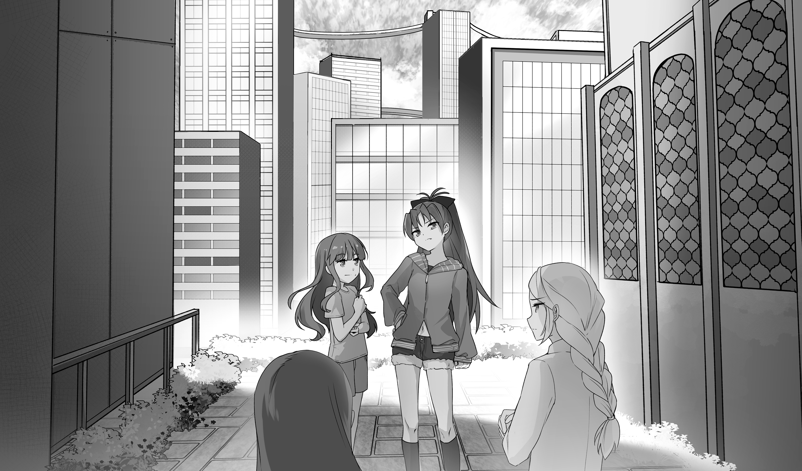
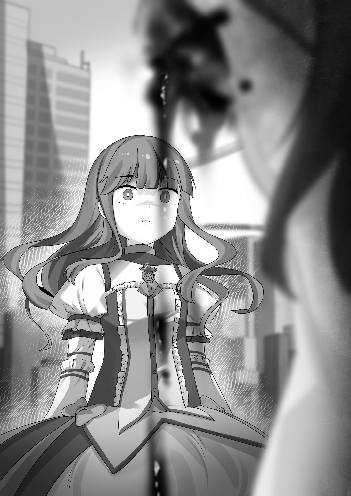

# 第十二章 狩猎魔兽的人

“行会对整个魔法少女系统进行的改进中最有价值的一个就是魔兽狩猎过程的专业化。行会对此进行的合理化改造是有史以来魔法少女生活质量的最大飞跃，彻底颠覆了原有的体系。原本一座城市里众多的魔法少女小队累死累活才能收获到一小部分悲叹立方，但现在只需要很少的力量就可以轻易达到‘产能上限’。死亡率直线下降，而悲叹立方的供给也由原本的持久不足转变成了现在的持久盈余。行会的大多数成员因而得以从狩猎魔兽的一线工作之中解脱出来，转而从事赚钱、科研之类的其它工作，或者干脆只是享受着相对平凡的幸福生活。”

“行会设计狩猎战术的时候有两个核心思想：效率和安全。而达成它们的关键则是针对整个‘收割’流程的严格管控。就连最小的细节都不能遗漏，每个现象都必须进行严格的分析。”

“首先，探索瘴气的巡逻排班遵循着严格的统计规律。巡逻队经过每个区域的频率都和该地区的历史出现率保持着正比关系。所有的概率值都会根据多种因素随时调整，比如最近哪里出现过瘴气，当天是周几，附近有何重要人士居住，等等等等。每种因素的影响权重都来自于几个世纪的经验总结。”

“其次，行会的战术设计千锤百炼，细致入微，简直都已经不能说是一种科学或者艺术，只能说是在照章办事。精挑细选的人员们组成了最优化的队伍，不厌其烦地整理使用着各种模板化的战术，并且每个人都严格遵循着既定的任务分配。她们的作战指南早已形成了固定条文，大家平时也都会有针对性地锻炼自己的魔力控制。这甚至已经成为了魔法少女文化里不可或缺的一个部分。”

“最后，出于伦理方面的考虑，虽然这对行会本身并无直接好处，狩猎过程中的平民救援也还是被放到了一个很重要的位置上。当然她们也规定了不准因为救援他人而将自身暴露于危险之中 —— 虽然在实践中遵守得并不好。”

“完全可以说，行会的收割指南就是针对一种特殊基本物资的理性化生产，和二十世纪整个社会的理性化过程不无共通之处。而正如工业的理性化改变了人类社会，悲叹立方收割的理性化也彻底改变了魔法少女的隐秘世界。从这个角度来说，行会的成功完全可以说是资本主义经济学的又一次伟大胜利。”

—— 摘自《经济学杂志》公开文章《魔法少女行会 —— 理性社会的伟大胜利》

---

第二天，首批分配的悲叹立方就发到了良子手里。不同于昨天那支看似危险的手枪，这次的‘货物’可不是普通物流系统能够经手的。相反，那天凌晨小睡起床之后，战术电脑就通知她说，‘配送员’已经在门口等着她了。

她远程指挥打开房门，走了出去，然后在半路上碰见了那个配送机器人。

这一只和平时常见的打包机器人略有不同，不过看上去也差不太多。它个头很小，直径只有十五厘米，高度勉强够到良子的脚踝。圆滚滚的表面和擦地机器人颇有些类似，不过真用来擦地的话它的个头就显得太大了。

见到她过来，它借助轮子滚到了她的脚边。

**需要悲叹立方吗～？** 它问道。现在良子已经可以下意识地辨认出这种来自植入体的精神通信了。它讲着‘一口’滑稽的高音，虽然这种设计似乎并无必要。

说罢，它抬起了唯一的一只光学传感器盯着良子。

**现在还不用，** 她说。**不过东西我先收下了。**

**不用劳您大驾～** 机器人答道。**告诉我放哪儿，我会放过去的。**

**那就放我桌子上？** 她略带疑问地指示着，不知道它怎么才能把东西放到那么高的地方。

**好的，** 它说罢，滑向了她的卧室。看着它的步态，良子几乎就要说出‘俏皮’两字，但她也很清楚这样的简单机器不可能拥有那种高级感情。

良子不无好奇地跟着它走进了卧室。它在桌前停了下来，然后径直浮起升空，把良子吓了一跳。她只得提醒自己，没错，反重力技术还是存在的 —— 只是比较罕见，一般只会用在飞船或者飞机上，要么就是超级昂贵的玩具。

它稳稳地在桌上降落，然后从侧面滑出来一个大铁盒，梆当一声落在了旁边。铁盒大约三寸见方，两寸来高。良子一下子感应到了盒子里面的内容。

一般的打包机器人和这比起来还是相差甚远的，她在心里纠正了自己的判断。

不用看戒指的状态，良子就知道自己差不多还是 “充满” 的。不过她还是走到了盒子那里，盒盖在命令下自行弹开。里面的三颗悲叹立方正静静躺在某种不明材质制成的软垫上。三颗明显是多了，不过正如她们所说，大家对待新人总是相当谨慎的。

她伸手拿起一颗，对着窗外的阳光端详了起来。不知怎么，它们的感觉和她原有的印象不太一样。三天前，她们在大楼墙角发现的那一堆里渗出的是犹如实质的恶意，但手里这几颗却相当平静，几乎可以用安分来形容。

不过前几天那些都是 “充满” 的，而现在这些是空的。这就说得通了。

这还是让她不太自在。

无论如何，现在这些肯定是空的。她能感觉出来。

她把手上那颗放回桌子上，然后召出了灵魂宝石放在一旁。宝石里流出来一股黑气，无光的粒子向着那颗小方块纷纷涌去。整个过程持续了大约十秒钟，然后一切重归寂静。

良子不禁呼出了一口长气。这种感觉很难形容 —— 就好象是心里的某些压力已经在无形之间消散无踪。

然后宝石重新在她手上凝成戒指。她把小方块放回了盒子里。

一旁的运送机器人大睁着那颗圆乎乎的光学传感器，目不转睛地观看着整个过程。

**很好，** 它说。**要是用完一颗的话，随便放在桌上或者盒里就可以了，我会负责收拾的。如果你不在家的话可以另叫一个浮空机器人，保证随叫随到。**

**你会负责收拾？** 良子问。**也就是说你以后就留在这里了？**

**没错，** 机器人说。**我会留在这里照看这堆悲叹立方的。这有好几个目的。除了给您提供便利以外，我也会警告民间人士不要接触那堆东西。盒子本身也会在悲叹立方孵化成魔兽的时候发出警告。考虑到它们现在都是空的，发生这种事的可能性非常低，但理论上还是有的。如果你执意要求的话我也可以离开，要不然我就会一直呆在这个家里，直到你离开为止。**

**等等，盒子是怎么做到监控的？** 良子问。**它应该看不见魔兽的吧。**

**没错，但它能看见悲叹立方。如果突然间少了一个，它就会直接报警的。**

**噢，没错。好吧，呃，算了。你就留下吧。**

机器人把轮子收回体内，“坐” 在了桌上，看起来就像是一个圆滚滚的摆设。光学传感器一眨不眨地盯着那个盒子。

良子躺回了床上，静静地盯着天花板。今天她并没有什么安排。

也许我应该学习学习，她想。

---

“当前通行的地面战思想着重强调机动性、灵活性、还有存续性，” 战术电脑念了起来。“来自统一战争的教训是，一旦每一位底层士兵都获得了前所未有的战场观察力，在对手面前隐藏弱点就变成了一种不可完成的任务。双方都可以轻易绕过重点强化的防御据点，让它们变得毫无用处。而在其余战场上，胜利都属于最先打中对手弱点的那一方。由于双方都可以轻易使用轨道炮火毁灭大片的土地，真正意义上的纵深防御通常也是无法建立的。面对敌人进攻时的正确反应是抢先打回去，而应付奇袭的正确反应也是伺机反击。此外，消灭指挥系统或者破坏敌人通讯都远比简单地摧毁物资更加有效。”

它用远远超过任何人类的飞快语速向良子念着课文：这甚至已经超过了她的阅读速度，所有信息都直接通过植入体塞进了她的思考。

她躺在床上，两眼向天，但眼前映出的不是天花板，而是课题相关的视觉材料。里面有辅助解释用的图表和视频，和信息本身一样在她眼前飞快闪过。一般来说这也就足够清楚了，但有时音频部分会刻意放慢，以便留出时间让她看完附带的影像：视频的接收速度没法加速到音频那种程度。

在文字流过的间隙，她也能够感知到大量存在的分歧点，每一处都可以进入子课题纵深阅读或者转入相关的其它课题。纵横交错的分支形成了一个可以无尽游览的知识迷宫，就像是每次打开一个话匣子都会冒出来几百个小匣子一样。

为了让整个过程显得更加清晰有序，她的内部 “屏幕” 也显示了一个课题列表。列表内容每时每刻都在流动变化，但她记上等会再看的内容总会出现在显眼的位置。

电脑停了下来，等待着她的选择。良子想了想，最后选了 “作战指挥”。

“和过去相比，现在的作战指挥已经演化成了一个高度分布式的系统。士兵和军官们的自由度已经比从前高了很多，上级完全相信，他们都能对当前状况进行独立分析，并且永远会做出正确的判断。因此，真正的命令往往只是一个简要的作战目标。这个设计同时改善了指挥系统的三大功能 —— 之后会讲到 —— 也提高了部队的机动性和灵活性，顺便也保障了指挥系统在斩首行动之下的存续性。尽管如此，无论是对人类还是对外星人来说，指挥体系的存在依然都是至关重要的，因为信息的及时性就是生命。”

“即便是在人人都有战术电脑而且每件装备都拥有一定智能性的现在，士兵们还是会被需要处理的大量情报轻易淹没。比如，现在的一般步兵都需要对附近所有其它部队的当前位置保持关注，包括部队之中的每一位人类成员，以及所有半知能体及以上的无人机。后者往往还需要他们加以指挥才能作战。”

良子想着要不要进一步看看作战无人机或者陆军战斗的内容，尤其是看着那些引人入胜的画面在眼前飞过 —— 比如各种常见装备和无人机的图解。不过最后她还是决定继续听下去。

“考虑到这些因素，指挥系统就拥有三个不可替代的作用。它的首要职责就是信息分发，决定谁需要收到什么信息。指挥 AI 会负责完成这一任务，并由高级军官进行监督。”

“第二个则是经典的指挥作用。单一士兵或单一部队的主要任务是保障自身的生存，以及达成局部性的作战目标。他们根本没有足以分析整体战局的处理能力，一般也不会愿意把精力放在这种事情上。因此就需要一个上层指挥系统来提供高层次的作战目标。他们会从更高的视野俯瞰整个战场，也会拥有难以想象的处理能力 —— 通常是一整个地下计算集群或者一艘战列舰的全部处理内核。这些目标会逐级分解，通过层层军官进行细化，直到军队的最底层。”

“第三个作用是统一意见。人们常常需要在缺乏足够信息和足够时间的状况下作出决定。过多的变量往往让指挥综合体无法得出一个明显的正确选择，甚至连大概的判断都得不到。尽管如此，这种情况下人们还是需要做出一个统一判断，并且共同执行。”

“这三个作用的重要性也在指挥体系本身的设计中得到了体现。整个设计的核心思想就是确保抗打击性，无论战况如何，指挥权和处理能力总会被自动分配到正确的人选手里，具体是谁取决于每个人的军阶和位置。上至元帅，下至普通中士，从无例外。指挥体系的设计目标是在任何情况下都能继续运作，已经有过好几次战例证明，在最高百分之六十的减员之下，军队仍然可能保留完整的建制。”

“要真正摧毁任何一方的军队建制，单单摧毁指挥系统是不够的，还必须彻底破坏部队的通讯。作战通讯可以说是军事行动的生命线。士兵需要用它和班里排里的其它士兵保持配合。旅级和师级的部队需要借助它来观察彼此的动向，同时也用来观察敌情。指挥官要靠着它才能正确掌握战场情况，从而做出正确的指挥。损失人手的指挥系统可以通过通讯网络在其他成员之中重建，丧失通讯的指挥系统也可以依靠现场指挥继续作战，但同时失去两者就相当危险了。地面作战的核心思想就是要同时破坏敌人部队的两个要素，从而确保胜利。”

良子再次得到了一大堆选项，比如通讯网络和作战指挥方面的深度阅读，关于指挥链的具体运作，等等等等。最终她选择了一个更加贴近自己的课题。

“军队里的魔法少女属于军官团的一个特殊组成部分，每一位成员既在指挥体系里分担了一部分责任，自身的力量也足以成为一支强力小队。虽然魔力类型和火力大小各有不同，但每一名魔法少女的作战能力都至少相当于一支连队，也有很多施法者达到过营级乃至团级的作战表现。考虑到现代军队的巨大火力，这是相当了不起的。”

“作为人类能够与外星军队打到势均力敌的唯一原因，魔法的效果和威力对人类的军事思想产生了巨大影响，地面战和太空战都是如此。这场战争早期的教训表明，落单的施法者容易被敌人各个击破。章鱼们很快就发现了，在一个人身上集中足够火力往往就可以把她干掉。但另一方面，集中在同一位置的大量施法者则会变成超级武器的良好目标，这方面也有过几次惨痛教训。”

“这些教训最终证实，给予魔法少女军官身份这个政治决定其实是相当英明的。通过经验教训的总结，人们总结了这样的一个原则：除非绝对必要，否则魔法少女决不能单独作战。战场上的施法者们担任着排长或连长，依靠着手下士兵的火力支援和掩护，并且要和同一师团的其它少女紧密配合。就算是在先头部队里，也很少会出现五人以下的魔法少女分组 —— 一般都要十二人左右一起行动，偶尔甚至会有一整个团的五十来人一起组队的情况。一队魔法少女带头冲锋陷阵的景象也还算常见，她们往往一边冲锋一边还要向自己的部队传达命令。”

“这种战术除了改善生存率以外，集中的魔法力量也大大改善了作战效果，尤其是在进攻战里。魔法少女天生就适合进攻，输出的火力可以远远超过对方的还击。对她们来说快速推进显得尤为重要 —— 这是悲叹立方造成的后勤限制。整个地面战的战术都是围绕她们设计的：看似激进的战斗方式其实就是效果最佳的战法。”

“最为接近的类比是二战早期的装甲部队，虽说这样的类比也不完全精确。早期纳粹军发动的闪电战让所有的参战国都吸纳了同样的战术，采用集中的装甲部队作为进攻矛头。同样道理，现在的人类军队也会把魔法少女集中到专门的魔女师里，就像过去的装甲师。当然现在的魔女师里依然不会缺少装甲部队的身影。在进攻部队的最尖端，常常可以看到故意和其余部队脱节的魔女突击兵，牺牲防御力换取着突击的冲力。”

“但这也并不意味着其它部队里就没有魔法少女了。几乎每个师都配有几个技术法师，在量身定做的职务上最大限度地发挥着她们的专长。通常都会要求她们避开激烈战斗。”

到这里，良子的战术电脑再次停了下来，给她提供了一大堆选项。她可以选择魔法少女师团配属的详细讲解，关于魔女优先政策的详细描述 —— 牺牲普通人优先保护魔法少女的政策，或者继续刚才的内容进入太空战的作战思想。

**之后我想听听太空战，但现在能先解释一下魔女优先政策吗？** 带着略显阴暗的好奇，她这么回答。

“作为一个简单事实，一名魔法少女的生命价值远远高于一般士兵，自然也远远高于任何车辆装备，甚至超过了一个普通连队的整体价值。因此，基础训练最为严酷的一部分就是教会少女们放弃英雄主义，哪怕要把手下的整个连队派去送死，也得优先保全自己的性命。这是最常违反也是执行力度最差的一条军规，但这毕竟也是一条军规，而且对魔法少女的生存率也确实产生了直接可见的提高。”

“同样的思想也被灌输到了天平的另一端。相关的作战部队总会不停地受教育说，为魔法少女长官而自我牺牲不仅道义上正确，而且是为赢得战争做贡献。每个人都要把少女长官当作战旗一样拼命保护。像他们这样的百岁壮年决不能在年轻女生的牺牲之下苟且偷生 —— 那是极端可耻的（虽说大多数情况下，少女长官其实早就超过了中学生的年纪）。总之，虽然军规的这一端并没有什么强制力，但还是得到了绝大多数人的自觉遵守。这样的光荣典型也是数不胜数，无数的士兵和连队不惜违背命令，自发地牺牲着自己的生命，只为了让他们的少女长官能够最后活下来。对于这种行为甚至还设有一系列的特殊奖章，中间过程的军纪违反则往往会被一带而过。这也是军旅文化最为微妙的侧面之一。”

战术电脑再次停了下来，但良子已经倒了下去，倚着墙面消化着刚才的内容。没错，这么做的确很有道理，但是…… 这感觉也真的很残忍。难怪魔法少女们经常违反这条军规。

而另一方面，她也实在难以想象被当成军旗高高捧起是一种什么感觉。

大概很快就会知道了吧，她想。

她准备继续听下去，但回答她的却是收到新邮件的那一声 “叮！”。准确来说，现在这个声音的含义已经进化成了 “收到了必须亲自阅读的重要邮件”。现在她收到的邮件比以前多出不少，但她也得到了一个专业过滤邮件的私人助手。

这样啊，她想。杏子叫我也加入今天的魔兽狩猎。也没有理由拒绝吧，大概。反正我也没什么别的计划。

她起身出门，然后才想起来转手带上那盒悲叹立方。在她视野之外，一只苍蝇大小的监控机器人钉在她的头发上，隐去了身形。

---

这一次，良子不再是跟着杏子一个人，而是加入了一支规模不小的狩猎队。邮件里说的集合地点是教团的 “后花园”，所以她就去了那里。下车看到一座完整复现的欧式教堂后她还是小吃了一惊。她所在的那一面正处于午后阳光的反对侧，显得相当阴暗。

不过现在想来，在这么底下还能照到阳光就已经很了不起了。

她不禁产生了一股询问汽车有没有把自己送对地方的冲动，不过她最后还是注意到了一些熟悉的景色，放心地下了车。她其实也知道大概方向。到了现在，她已经基本算是认识路了。

良子欣赏了一会面前的玫瑰园，深吸了一口浓郁的玫瑰香 —— 经过鼻部植入体强化之后的气味显得有点呛人 —— 然后钻进了几排玫瑰藤的缝隙里和理沙搭起了话。这就是昨天碰到的那位女孩，正在花园里和帕特里西亚聊天。在这里碰到她俩让良子感到很意外，她也直接把这一点说了出来。

“我可不是整天泡在实验室里的，你明白吧，” 帕特里西亚理着头发说，故意表现的有点受伤。“偶尔我也会做些别的事情的。”

理沙只是耸了耸肩。

“我是这支巡逻队的领队，” 她说。“帕特里西亚只是顺便过来看看。昨天我没说起过吗？”

良子摇头否认，然后仔细打量着面前的女孩。这有点说不太通，但她看起来似乎有点…… 紧张？

理沙转身走开，示意良子跟上。

她们在其他女孩和扎人的玫瑰藤之间的缝隙里来回穿梭，逛着教团总部的后花园。良子环顾四周，微微侧头。从这里看来，整栋建筑显得是如此不同，简直就像是走错了地方一样。足以刺痛鼻腔的玫瑰味儿更是加重了这一观感。至今为止，嗅觉增强带来的效果全都是负面的。虽然征兵指南里赌咒发誓说这对作战有点什么好处。

她突然发现自己已经来到了杏子身边。她两手叉腰，扫视着其余的人，似乎有些生气。不过良子觉得她这个姿势意外地颇为母性，也许是某种肢体语言的效果吧。

“浅香申请加入麻美的参谋部，” 杏子撕咬着手里的（合成）牛肉干，没等良子搭话就主动解释。“很快就要走了。她让我转达她的问候，并且为提前离开你表示歉意。”

杏子用一只眼斜瞥着她，观察着她的反应。而理沙静静地看着她们，视线在两人之间游移。说起来，为什么今天她这么安静？

“你看起来不怎么吃惊嘛，” 杏子评论着，显得有些生气。

“啊，那个，她昨天提到这事，” 良子说着，紧张地扭动了一下。“后来我问过她了。”

“嗯。”

杏子似乎没把心思放在对话上。良子也没有主动接茬，但杏子还是继续说：

“帕特里西亚是个重要的科学家，但她也脑袋发热地想要跟去。就是温习一下战斗技能 —— 起码她自己是这么说的。我想要劝她别去，但她就是不听。还有 ——”

她摇了摇头，然后猛地咬下了一大块牛肉。

“总之，” 杏子说。“今天这次和上回不同。你需要和更多人合作。很明显，你不应该再去一线作战，不过考虑到你的魔力类型，应该会有一个刚好适合你的位置。你会明白的。这是你的第一次，所以别太勉强。噢，还有注意随机应变，别跟个机器似的。”

说出最后一句的时候杏子脸上诡异地笑了一下。良子不由得感到有些紧张，因为这个表情不像是她平常的样子。除此之外，杏子似乎也显得有点着急。

“总之，这次我不能一起去了，” 杏子说着，一边下意识地玩着自己绑头发的蝴蝶结。“理沙和帕特里西亚会陪你的。帕特里西亚近战很脆弱，跟你一样，所以你可以帮助她随时改变位置。说起来她跑哪儿去了？我说过要她和理沙跟着你的！”

良子还没来得及说什么，杏子就转了个身，直接看向了盯着一朵花发呆的帕特里西亚。过了一会，帕特里西亚似乎猛地一抖，然后转身走了过来。

“噢，对不起，” 她道歉说。“我有点心事。”

“宝石探知，” 杏子说，又一次抢在了良子提问之前 —— 她的表情甚至都没来得及发生变化。“练熟了很有用，尤其是用来找认识的人。不过谁都没有指望你这样的新人可以不变身就追踪谁。然后就是念话。要习惯。你俩，看好她。给她介绍一下其他人，别放她一个人单干。”

说完，杏子转身走回了教堂内部。她的样子简直像是恨不得马上冲回去一样，但是她的地位不允许她这么做。她可能真的很着急。

良子瞥了帕特里西亚一眼，发现她也一脸不安。

“她怎么了？” 良子觉得自己还是应该问问。

帕特里西亚低下了头。

“你，呃，应该知道我和浅香要走了，对吧？” 过了一会，她说，一边玩弄着自己的马尾。“但不光是这样。不知怎么，我们提出离开之后好像麻希也受到影响，说自己也要去。杏子就有点闹别扭了。”

“啊，所以她就是不愿意你们都走？” 良子说。“这也是人之常情吧，我想。”

她以前就觉得杏子不高兴的时候会更加冲动，而且说话也会变得比较跳跃。看来她猜得没错。

帕特里西亚看着她的表情让她有些捉摸不透。

“没错，差不多就是那样吧，” 帕特里西亚说。

良子还想接着问下去，但是空气中的尴尬已经浓得让人喘不过气。她本来觉得那个问题应该不至于造成这种气氛，但不知怎么大家都是这种反应。

她不太舒服地扭动着，想要换个话题，但理沙已经拽着胳膊把她拉到了另一群女孩身边，让她做个自我介绍。良子也会意地跟了上去，好让帕特里西亚能够先静一静。

---

**如果瘴气没有这么狡猾就好办了，** 一边在高楼之中跳跃穿梭，理沙一边对良子做着解释。**那样我们只要监测哪里有行人的信号突然消失，然后过去解决就行了。但显然没这么简单，瘴气是可以伪造行人的数字签名的。摄像头的情况也是一样。不过我们还是找了些半知能体监测街上的影像，因为有的画面一看就知道是假的。平常一般不会有一群路人突然停下脚步，然后连续十分钟都在同一条空中走道里呆站着。虽说以前也出过类似的假警报吧。**

**我还不知道瘴气的原理有这么复杂，** 良子说。

**它几乎可以说是一种特别的生物了，** 帕特里西亚说。**要不然也不可能瞒住一般人几个世纪之久。有足够的证据表明随着时间的经过，魔兽瘴气会不断进化，发展出更加复杂的手段逃避监控。这是一个严峻的问题，但恐怕也不是最近才出现的 —— 至少我们是这么认为。据说以前，甚至在同一个星球上都会出现地域性的不同。不过到了现在，瘴气种类的多样性基本只能在跨星球的尺度上才能观察到了。**

大概是为了省些力气，帕特里西亚正站在一架无人机上让它带着飞。周围还有一小队同样的飞机跟随护卫，架架面目狰狞，装着一大堆炮塔。作为训练一环只能徒步前进的良子看在眼里，感到微微有点嫉妒。

**上个月有一次，监控上甚至出现了酒吧散场的画面，用来解释街上逗留的人群。** 理沙说。**当然，最后我们还是发现了，因为刚刚还是素不相识的一帮路人不太可能突然一块儿喝起酒来。但这已经能够证明瘴气的进步了。不过这个过程非常缓慢就是了，所以我们还算走运。**

**这些容易抓住的突发瘴气只能算是少数，** 帕特里西亚说。**大部分瘴气都是靠老办法发现的，也就是基于统计的预报和仔细设计的巡逻路线。在巡逻的时候碰到一个其实也算是好事，因为这种瘴气的规模一般都不大，多半还没有抓住什么人。这种做法的坏处就是一旦在低概率区域出现瘴气，可能很久都不会有人注意到。就像你那次一样。**

意识到自己谈论的内容已经不再属于自然现象，帕特里西亚脸色一变，赶忙刹住了话头。

良子在仿佛无穷无尽的都市丛林里来回穿梭，一边在管道、屋顶和阳台之间跳上跳下，一边前进。周围的大多数人都用着和她一样的老办法跳来跳去。而另一些人则会使用魔法辅助，让郁闷的良子勾起了传送的欲望 —— 她觉得那样肯定会轻松很多。就在她眼前，一位少女对着远处一个平台高高跃起，但她的力度明显不够跨过整个距离，本该会提前落地 —— 但在最后关头，她冲天而起，在毫无借力的空中一跃而上。又是一次违反物理规律的空中变向。

“臭拽，” 良子听见有人低声说道 —— 不过听不出来是谁。

**我们所有人都能做出一点简单的空中变向，** 帕特里西亚说，**虽然看起来没有那么帅。主要是在落地过程中修正方向或者提高跳跃高度之类的。不过有些人可以得到特殊属性或者特殊技能。如果魔力类型合适再加以充分练习的话，学会飞行也不是不可能的，不过很困难。要想连续飞行一两分钟而不马上耗尽宝石的话就更是如此了。如果情势所逼的话，老祖宗她们倒是基本都能飞起来，因为大家或多或少都有这样的憧憬。但除非你下过很大功夫，否则飞行在性价比上根本没有意义。真正的飞行少女是很罕见的。**

**当然，晓美小姐刚契约就能飞，** 理沙说。**这只是她的特殊能力之一。不过趁你还没有产生错误认识，我也得先纠正一下。洛尔小姐说的是在瘴气之外的飞行能力。不知怎么，在里面飞行会容易很多，虽然还是需要一点练习。不管怎么说，对付外星人的时候派不上用场就是了。**

良子回想着上次和杏子一起狩猎的经历。当时杏子从空中落下的轨迹显得异乎寻常的准确，她也感到有些违和，觉得她的抛物线有些奇怪 ——

**但你说的练习又是什么意思？** 她问。**我们的魔法不都是与生俱来的吗？**

**没错，** 帕特里西亚说。**而且最初的魔力一般也不会中途消失。但构成魔法的本质还是我们的想象力。只要足够努力，学会什么都有可能 —— 至少我们是这么认为的。只不过和你现有法术没有直接关联的东西学起来会很困难，这也是为什么几乎所有人都选择在天生技能的基础之上就近发展。比如说，透视眼一般不会去学闪电。**

**不过麻美小姐不一样，** 理沙说。**你知道吗？她的火绳枪完全是用缎带一点一点模拟出来的[^1]。杏子的很多能力也不是她原来那些枪术里面过来的。而浅香就更奇怪了。**

[^1]: 译注：麻美 “学会” 火绳枪的过程是来自 PSP 游戏的

**怎么个怪法？** 良子问。

**先等等，** 理沙说，眼睛的焦距散了开来。

趁着这段停顿，良子重新留意起了队里其它人的交谈。刚才她光顾着自己这边三个人说话，但其实她的思维边缘始终回响着组里其他人的闲聊。内容比她想象的要轻松很多，充斥着笑声和八卦，只有偶尔会插进来几句军队黑话，通常是某人看到了一个地标，或者是告诉大家已经通过了巡逻路线上的 “4B 位置” 什么的。其实这些都没有什么必要，良子视野下方的角落里早就开好了一个小地图，只要她想，随时都可以看。

如同杏子所说，这和上一次已经不一样了。这一次，她始终能够感受到周围灵魂宝石散发出来的微弱波动。这很难形容：良子只能联想到那种有人站在身后的感觉，只不过现在的感觉要强大许多倍，也多出了好几个重复的来源。比如说右面隔两栋楼再往后隔一栋的那个人，比如头顶两层楼上面的那个人，比如前面隔着三栋楼的那个人。精确程度令人发指，而且感觉从不间断，就像是一个搔不到的痒处。

**怎么了？** 看到理沙的眼睛重新聚焦，帕特里西亚问道。整个过程中理沙虽然明显分了心，但脚下却一直没停。

**没什么，** 理沙说。**总之，浅香 ——**

某种内部信号命令良子**停下！** 她照办了，在一个小型无人机降落平台上半蹲了下来。

直到这时她才来得及思考自己为什么会这么做，还有为什么所有其他人也齐刷刷地停了下来。

**队里有人感应到了瘴气，** 战术电脑说。**所以发出了这个信号。**

它说得没错。视野里的小地图上出现了一个闪动的圆点，标记着那处可疑位置。但其他人的念话声早已转到了那个方向。**不大，** 念话里评论说。**还没有发育完成。**

突然她也感到了那处瘴气，仍然微弱，但已在不断成长。瘴气沿着一条空中走道扩散开来，旁边就是几处商业设施。队员们摆好了战斗姿势，动作不大，但毫无滞碍。随兴的闲聊销声匿迹，众人的运动方向也开始微微偏转。

**由于这是您第一次使用本设备作战，** 战术电脑说，**按规定我需要提醒您，请留意您的团队界面，以便最大化协作效率。**

**了解，** 她答道。

良子觉得她说的应该是那个小地图。现在上面已经打出了无数信息，魔兽的数量大小，等等等等，大概是从她和其它队员的思维里顺出来的。这对她其实完全没用，因为所有这些信息都是她可以本能地感知到的，不过对远程的人大概会有些用吧。

**好了，** 理沙说，声音在队员之间回荡。**虽然瘴气规模不大，但我们已经在里面发现了四处平民回波。单靠这个要想准确定位显然也是不太可能了。孝利，他们在哪儿？**

**离你们还很远，** 透视眼孝利一边回答，一边在小地图上标出了那几个人类的位置。**我们来晚了，他们都已经被控制住了。**

**干。算了，今天我们有个传送者，那就使用标准传送营救法吧。剩下的人，各就各位。**

**结界师协防，你把他们拉出来，** 帕特里西亚在良子提问之前就开始对她解释。**至少是这样。最好再加上一个隐形师，一个透视眼，还有一个读心者。今天队里没有隐形师 —— 这种人才比较稀缺 —— 不过 ——**

她没有说完，因为那几个人都已经过来了。最先出现的女孩一身戎装，银蓝相间，活脱脱是一个中世纪欧洲的重甲剑士，只差了一顶头盔。在良子的注视下，她用持剑的那只手缓缓摩挲着一块巨大三角盾的外沿。高出身高的双手大剑在被她单手提起，直如无物。看到良子的眼神，她开怀大笑，用另一只手挥开了遮住视线的金发。

透视眼孝利随即在身旁落下，黑白花纹的服装显得相对保守。

一身红衣的理沙早已手持大斧等在那里，见状走了过来。

“大部分传送者指定目标的时候都不必依赖视觉想象，” 她说教着，“我知道你也是。不过大家也公认说，利用透视进行精确制导可以提高安全性。毕竟现在到处都是魔兽，而且情况随时可能出现难以预料的变化。我们几个将就一下吧。她要依靠身体接触才能传送：你俩靠近点儿。”

最后一句是对另外两个人说的，她们尽职尽责地向她靠了过来，各自抓住了她的一个肩膀。

“闭眼，” 理沙说着，也握住了她的一只手。“这样我会方便些。”

良子照做了，不过还是不理解她要干什么。

然后她就看到眼前的黑暗变成了其中一名受害者的影像。清晰异常的画面里显示出一个人正浑浑噩噩地站在大楼入口，周围环绕着一群魔兽。然后她才意识到，那就是透视者所看到的画面，不知怎么经过读心传了过来。这办法还真挺将就的。

**越快越好，** 理沙说。**从图像里找到安全落点之后马上传送到被害者身边，依次救出每一个人，最后传送回来。动作尽可能利索一点，结界一架起来我们就出发。**

“结界开启，” 一瞬之后，盔甲少女低声说道。

良子集中精神，驱动魔力向远方伸展开去 ——

然后她们就到了那里。她睁开眼睛，发现那位受害者就在自己身边。那是一个打扮好参加晚会的女人，一身轻飘飘的黑裙子。周围的结界闪烁着通透的蓝光，将恰在附近的两只魔兽切成了四半。

它们的尸体开始气化，四周的其它魔兽开始转身，孝利抓住了女人的手臂。

良子闭上眼睛，开始观察下一个人的位置 ——

---

整个过程迅速得令人目不暇接。四十秒后，良子重新出现了在平台顶端，带着全部四个受害者。结界消失，其他人解除了身体接触，而救出来的四个人类像是突然间活了过来，一边眨着眼一边打量着周围的环境。

**好了，人救出来了，** 理沙说。**但我们已经没有奇袭的突然性了。近战队员，把它们圈起来，控制密度。远程队员，开火。所有人开始行动。帕特里西亚，让你那些飞机派上点用场，给我们提供几个制高点。**

**明白，** 帕特里西亚略带自嘲地说。**大家都只会让我干这个。**

良子眨了眨眼，感到周围的女孩们开始变换位置。随着魔力的释放，“信号” 一下子强了起来。

“我知道你还剩下不少传送次数，” 理沙对良子说，但没有解释她是怎么知道的。“所以你要参加轰炸编队。帕特里西亚，跟着她。杏子也告诉过你了吧。”

说完，理沙直接跳到了帕特里西亚的一架无人机上，骑着它飞向高空，连句再见都没有说。

**‘轰炸编队’**，良子的战术电脑有些好为人师地说，虽然语速丝毫没有放慢。**是传送打击编队的俗称。一组拥有范围魔法的人在战场之上快速来回，用打了就跑的方式打击敌人。魔兽狩猎指南里建议，只要同时拥有传送者和结界师，就应该组织一个这样的队伍。传送者负责提供机动性，结界师负责防御来自敌我双方的流弹。如果可能的话，最好再加上透视读心的传送辅助，不过这不是必需的。拥有传送辅助的话也可以选择性地放弃结界师，不过一般不建议这么做。**

**现场指挥会提供瞄准辅助。另外，编队成员需要注意，除非情况极端特殊，否则一旦有其它女孩处境危险，救援工作的优先级就要高于打击任务。此类情况下的标准对应是立刻带领整个编队撤到安全地带，然后再展开救援。**

几乎没等它说完，其他队员就已经到了身边。具体说的话，一共来了三个人：暗黄，天青，和亮绿。这几个人一开始就知道状况，一过来就抓住了她或彼此的身体。两个人明显已经开始为了某种目的聚集魔力。银蓝相间的盔甲少女再次展开结界，不过那位透视者倒是走了。

她眼前的小地图上出现了一个瞄准圆，标出了打击目标，其它的备选目标也用不那么突出的方式标在了上面。一幅渐变图像标出了已知的魔兽分布，不过良子看过去的时候出现了一个警告，说是因为没有直接的视频音频情报，这幅图像的精度并无保障。图上也不时出现几坨空白 —— 表示对应的区域还没有情报。

**出发吧，** 帕特里西亚说。

良子点了点头，重新驱散了内心的杂念，体验着那种她所渴求的扭曲感和穿刺感 ——

然后，她再一次出现在目标地点，站在了大街上。魔兽们或是还在忙着赶往外围和近战女孩肉搏，或是在抬头瞄准天上飞来飞去的那些人。队友们趁机聚集着攻击的能量。瘴气周围的整片区域已经空无一人，附近的行人都得到提示避开，车辆交通也被疏导到了别处。附近的办公楼也完成了疏散 —— 严格来说这其实并无必要，因为瘴气会隔离她们攻击的物理效果。但这也的确是个好习惯，瘴气可能会扩散，魔兽也可能穿墙进入大楼。它们总喜欢偶尔这么来一手。

在良子的注视下，更多魔兽开始在空气中浮现。瘴气还没有发育完全。

**有流弹，** 盔甲女孩说。

什么东西猛地撞上了结界顶部，原本透亮的蓝色密实起来，迸出火花，发出了尖锐的摩擦声。

**对不起，** 远处传来念话。**我没能及时取消。**

**所以才要带上我嘛，** 盔甲少女愉快地回答。

接着她伸手虚虚一推，结界向外猛撞，推开了近处站着的几只魔兽，其中大多数就此气化消灭。

黄衣女孩微微浮空，在周身聚起了一个闪电球。球体慢慢变大，将另外几人也包在了里面。虽然看样子好像自己也会受到攻击，但良子不知怎么就是知道，自己没有躲闪的必要。果然，电流直接穿过了她的身体，没有造成任何影响。接着就是突如其来的爆炸，球体向外扩散形成了剧烈的冲击波，把周围的魔兽群烧成了飞灰，好像还让更远处的几只陷入了麻痹。

天青少女静立原地，似乎正在集中精神。良子看不出来她在做什么，直到周围地上突然伸出来无数青色的鬼手，向魔兽群抓了过去。

最后，绿色的那位召出了一圈样子颇有古风的大炮。良子还没来得及为在住宅区开炮的事情感到担心，震耳欲聋的发射声就响作了一片。不过周围的建筑没有受到伤害，依然完好无损。

对了，瘴气。良子想。

然后几个人重新回到了她的身边。看到幸存的魔兽开始向她们瞄准，良子也伸手相迎。一群新召唤出来的机器人从她们脚下爬出，发射着激光，即使帕特里西亚整个过程都没有放开良子的手。况且一般的机器人不可能在瘴气里面正常运转，更不用说伤害到魔兽了。

**就是现在！下一个目标！** 帕特里西亚说。

良子咬牙把恐惧感吞进了肚里，抬起左臂，对着魔兽的大概方向胡乱发射了一通连着细线的弩箭 —— 然后传送离开。

杏子说过要随机应变。她们来到了下一个目标地点，连带着几只魔兽的身体碎片。它们随后崩解成了小方块。

**不错！** 理沙在远处夸奖道。

她们只发动了两次进攻。第二次结束之后，理沙就宣布魔兽已经消灭得差不多了，进入收尾阶段。这也就意味着重火力需要停止开火，比较脆弱的女孩们要先行撤离 —— 良子也是其中一员 —— 而原本细密的包围圈则解散开来，让近战女孩可以自行选择攻击目标。

良子和帕特里西亚一起看着残余的瘴气崩溃消散。有些女孩子已经开始到处捡悲叹立方了。她们靠着天生的感知力和魔兽死亡位置的内部记录四下寻找。甚至还有人用念力收集着那些小方块。无论如何，组织严密的集团行动已经结束。虽然现场有一些小团队仍在协同作战，近战女孩把魔兽圈起来给远程攻击提供目标。

一个长矛女孩申请陪四位受害平民回家。理沙批准了，因为人员上的确有这个富余。

**说实话，这还挺简单的，** 随着几人再次开始巡逻，良子说道，一边把念话锁在了和帕特里西亚的私人信道里。**我几乎没有用到那些悲叹立方。**

**大多数遭遇战都没有差点害死你的那一次那么严重，** 帕特里西亚说。**大部分都是这种程度。跟着大规模队伍会很轻松，但你可以想象一下过去的狩猎是什么样的。基本上只有三个人一队，而且透视读心这样的脆弱能力者也要亲自作战。**

按她说的，良子想象了一下。她以前其实就对这类知识有所了解。举例来说，在那些活下来的老一辈女孩里，擅长综合实战的人要远远多于那些相对脆弱的类型 —— 比如治愈能力者 —— 但作为知识的了解和实际的体验还是相去甚远，尽管就连体验本身也是间接的。

总之，她觉得她能活在这个时代而非过去真是相当幸运。但要是这么说的话理由就多了去了。

---

下一次遭遇的规模就大了很多，瘴气扩散的范围更广，被害者也多了不少。这一次，当良子终于带着多达十来人的被害者成功撤离之后，她已经开始感觉到了连续传送带来的疲劳，于是独自站在附近一栋楼顶休息了一会，感觉自己恢复过来之后才示意说，可以再尝试一次 “轰炸编队” 了。

良子终于得到了几次机会，再次尝试了她初次狩猎时想要试验的那个技巧 —— 把弩箭射进魔兽群中间的地上，然后借助地面引导传送，将魔兽撕成两半。

效果很好。她很喜欢。

这一次她们没能形成一个完整的包围圈，在良子感知的边缘，地上的少女们正在跑来跑去地阻止瘴气扩张。还有两次，在轰炸行动之后，理沙要她把一个近战女孩顺便捎到某个地点。她照做了，两次都是带着结界师一起出现，摸上要带走的那个人，传送，最后撤离。

行动总是那么地冰冷、迅速、而有效，几乎可以用照章办事来形容，但效果也是显著的。她们绞杀着难以计数的魔兽，而良子只看到过一次危险情况。这种战术能够迅速解决问题，但她再也没有体验到初次狩猎时的那种兴奋感了。

那天唯一的一次计划外状况发生在第五次 “轰炸” 的途中。最初的征兆是念话里直贯入脑的一大通污言秽语。但那绝对是值得铭记的一次经历。

**—— 丫祖宗，我需要救援！** 念话声乞求着。**救援！那帮杂种直接跑到我头顶上来了！我撑不住了！我 ——**

**马上过去！** 理沙直接对良子命令道。

不待下令，良子一队的女孩早已聚拢过来，重新和她建立了肢体接触。

带着众人撤离瘴气范围，她刚想立马传送到地图上新标出来的那个位置，就感到一只硬邦邦的铁手套拍上了自己肩头。那是萨拉·凯森，结界师 —— 她的结界师，她已经开始这么看待她了。

“盲目传送不安全，” 她严肃地告诫着，日语微带口音。“尤其是在没有保护的情况下。你会收到教训的。”

良子点了点头，感到有些害臊，然后开始等待结界出现。

这一次，两人刚一现身，萨拉就毫不迟疑地将结界爆开，发动了瞬间的强力冲击。良子胡乱抓住了求援女孩的某个身体部位，在传送前只来得及看到结界无害地穿过她的身体。

那位女孩的身影深深印在了她的脑海里。一身精悍的黑色紧身衣，背后挂着一挺巨大的老式火药狙击枪。她一边狂奔，一边咬牙切齿地发射着右手上的突击步枪，一边还躲避着射来的魔兽激光。手上那把枪明显不是魔法召唤的，而是现代产物。

但真正让良子难以忘怀的还是她那齐肘而断的左臂，滴落的血液飙得到处都是。而当这位狙击手抬起头对上了良子的眼神之后，她才发现她已经少了一只眼睛，连带着脸上也缺了好大一块。破碎眼眶的裸露白色和皮开肉绽的凄惨伤口形成了鲜明的对比。

在那个疯狂的瞬间，良子想的是，真不明白她为什么还能保持站立。

---

“我自己的问题，” 几人撤离后女孩说道。“它们偷袭了我的射击地点。我知道它们可以在建筑内部上下运动，但还是没有注意周围。我太热衷于眼前的杀戮了 —— 噢天啊，又要被心理医生唠叨一顿了。我还觉得我已经不会再犯了呢。”

她抱住自己的身体，微微发抖。剩下的人一边安慰，一边拿悲叹立方贴上了她那块汹涌翻腾的黑色宝石。

但良子根本没有在听。她只是站在一旁，盯着一栋大楼发呆。她的反应本该会是俯下身来强忍着呕吐，但在这个未来时代，类似的生理反应都会遭到自动压制。所以她只是发着呆。

“别愣着了，” 帕特里西亚说着出现在她的身边。

良子抬头看着她，脸上一片惨白。

“现在看到总比以后强，” 她温柔地说，但语气里也透着坚定，“可是现在没有这个时间。她需要马上送医院，而只有你才有两百公里的传送范围。如果实在受不了的话，就让战术电脑压制一下你的感情。那会大大削弱你的魔力，但那个功能就是为了这种场合设计的。”

良子摇了摇头，一言未发，只是抖抖索索地走了回来，抓住了受伤女孩的肩头，视野里的文字明确写出了要她前往的目的地。

---

“她会没事吗？” 回到了军火库里的地下医院，她向前来迎接的职员询问道。

“会好起来的，” 护士笑着回答。“对你们来说，这根本不算什么。”

现在想来感觉已经过了很久，不过这就是良子前几天见到的那个护士。当时她来这里升级植入体，看到她陪着担架走过。那是良子记忆里的第一次医院见闻。

良子点了点头，但动作很小。她开始对整个事件产生出一种奇特的疏离感，仿佛这一切和她毫无关系。也许只是心理应变吧。她甚至还有心情评价自己的状态。

她们已经在叫她回去参加狩猎了。

她跟着担架上的女孩走了一会，心里一片空白，直到她确信自己已经恢复过来，能够重新完成返程那五六公里的传送。她紧紧握了握担架上垂下来的那只手 —— 两人一到，受伤女孩就给自己施加了麻醉。然后她在走廊正中停下脚步，无视了四周投来的奇特目光。

她努力集中精神，传回了瘴气里。

---

那天良子看到了很多东西，不少魔法战术的灵活运用都是她以前连想都没有想过的。她看到了帕特里西亚的无人机的战术价值，在瘴气里自由飞行，带着女孩们翱翔天空，让她们得以自由轰炸。她看到一个人直直跃起，空中转身，绕过一栋大楼落在了另一栋的楼顶，只为了给背上的女孩找到一个更好的火力点。

她看见理沙借助无人机站在高空，用灼灼的目光俯视着下方的一切，远程操控着念力大斧斩向魔兽群。最后良子才意识到，她一直在读取着魔兽的思考，读取着它们下一步的行动，还有它们的射击目标，并据此指挥着整场狩猎。当时她就觉得自己很傻：找个读心者做领队还能是为什么呢？

她看到在她离开的那段时间，用闪电和用鬼手的那两个女孩一直都在限制魔兽们的行动。这样，只需要一次准确计算的轰炸或者找个剑手砍几刀，就能把它们统统撕成碎片。她看见萨拉布下墙壁一般的结界，把魔兽们一撮撮地圈了起来，也是为了一样的目的。

她看见地上的女孩们时不时地呼叫着火力支援和空中打击。指定地点几秒之后，就会降下疾风骤雨般的火焰、箭矢，抑或是紫色的魔力光。

良子终于明白了，为什么行会的效率会有那么高。

---

尽管如此，那天夜里，在她盯着天花板发呆的时候，她想起的却是护士的那句话。

**对你们来说，这根本不算什么。**

没错，这说得很对，不是吗？

---

**附录：“魔法少女至上主义”**

下文中〈〉代表保密内容，〈〉后的数字代表相应的密级。

〈“在魔法少女行会存在的第二个世纪之际，认为自身和常人有别，与众不同，甚至高人一等的观念似乎不可避免地兴起了。彼时，行会已经精熟于商业与金融业，有能力为其即使在最贫困地区的成员提供相当于最富裕国家里中产阶级的生活水平。而对于许多成员，尤其是那些积极参与行会高层运营的人来说，组织为她们提供的远不只如此，她们完全可以十足奢靡地生活。这情境与其大多数成员曾经历的贫苦可谓天壤之别，新得的财富使行会成员开始与那些同她们一起走在街上的大众渐行渐远。”〉③

〈“同样，行会在操纵政府方面也愈加熟练，时常通过立法，修改法律以及其安插的代理人来干涉事务，在有些地区，行会甚至已经彻底掌握了当地的警力和安保部队。这些原本是为了在警察眼下保护自己，以及在更有利的政策下做生意的行为，在经历了超过一个世纪的使命偏离后，已经彻头彻尾地异变了 。从最贫苦偏远的地区，到最有影响力的政府的立法厅，行会的触须无处不在。”〉③

〈“随着时间的推移，行会的作风逐渐显得家长主义，其为了世界的福祉承担起了越来越多的责任。最初是粉碎亚洲的性犯罪集团——并且随后将有组织犯罪集团重塑为行会的手套——这一作风的极致体现在新成立的暗之心的首个行动，精心策划的朝鲜半岛统一。行会吸收的权力越来越大，也自揽下了更多的责任，最后规章委员会的政客已经习惯性地将行会描绘为世界的守护者，而领导委员会在秘密会议上商议煽动革命已是例常。”〉③

〈“在战争爆发的地方，虽然行会曾经只是满足于维持隐密，但彼时行会台面上的慈善组织开始向民众提供食物与教育，行会的代理人试图改革政府，行会的特种部队则狩猎起了军阀与恐怖分子，虽然这些行动起初是以保护其在当地的成员为名义进行的，但到后来逐渐变成受一种身具高位必承其重的义务感驱使而行，而这种高尚的义务感的代价则是巨大的，同时体现在资源和人员伤亡两方面上。”〉③

〈“独立，不为人知的力量与不朽，正是这些特性使得所谓的魔法少女至上运动得以发展。其没有任何形式的官方组织和领导者，只是一场社会运动，理念与行动也在不断变化，并且直到该运动的晚期才被行会自己的一位学者命名。尽管如此，这场运动的长久影响在行会的文化中将持续数百年之久，甚至直到今天仍有存续。这种思潮从未真正离开过我们。”〉③

〈“行会的魔法少女们越来越感到自己比之其余人类更加优越。看看她们的力量与不朽，看看她们的财富与遍布世界的影响力，看看她们道义上的优越性吧，这一点难道不是很显然的吗?在各国政府为了琐事争吵之时，是她们煞费苦心向穷人们伸出援手，而这些人却根本不感激她们的辛苦。

难道她们不该主宰一切吗?

与其为了那些甚至都不知道她们的存在，而且终将死去的人浪费资源和拿自己的生命冒险，她们为什么不去更加关心自己，关心行会的同胞们呢？这些人终究活不过短短的一个百年，而她们的生命将无尽地延续。是时候采取更理智的措施了。从那些人们罹难受苦的区域撤出来，只留下狩猎魔兽的队伍会更节省资源。

至于贫困地区的契约者们，可以将她们迁居到富足的地区，或者将她们和其家人安置到设防的宅邸里，以从外界的暴力与贫困中保护她们。拯救整个世界是不可能的，所以她们不应该至少去努力拯救自己吗?”〉③

〈“这种观点震惊了年长的魔法少女们，她们大多知晓早些年魔法少女生活的穷困与劳苦，对那些处境艰苦，以及不是生来就生活优渥和享有权力的魔法少女们抱有同情。她们还记得时常有朋友陷入绝望以及死去的感觉，也很清楚她们是人类，而不是超人。位于行会高层的她们约束着下属的行为，同时拉拢从贫困地区加入的魔法少女们作为盟友，这些魔法少女大多可不乐见他人争论行会是否该将她们的家乡任凭天启四骑士践踏。”〉③

〈“尽管如此，魔法少女至上主义的观念仍然会对行会接下来一个世纪的举措有着显著的影响，令其无力应对人类有史以来最可怕的灾难。在就业率真正降至灾难性的低迷以及世界开始分裂为两极后，行会只是作壁上观，其作为一个整体，无法下决心摆脱窝在超产阶级舒适安全的豪宅里的惰性进行干预。燎原之势，只待星火……”〉③

**—节选于“魔法少女：她们的世界和历史”，作者朱利安·布拉迪修**
