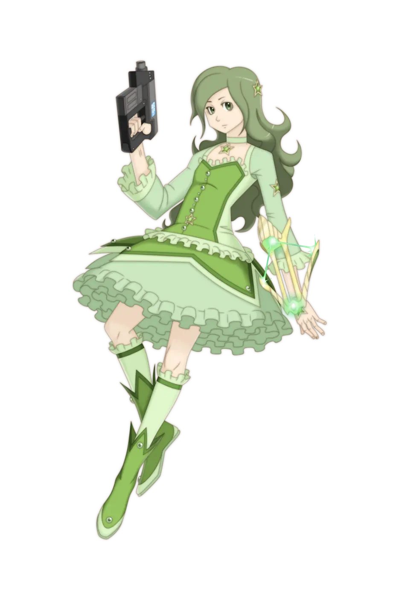
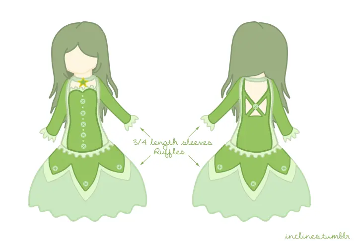

# 角色设定 1

Character Post 1: 志筑良子

女士们先生们，请欢迎我们的主人公！一个普通家庭的普通孩子…至少看上去如此。这里没必要展开太多细节，除非你们对她的外貌描写（或没描写的地方）有些疑问。其实我都有写！只是分散在这14个章节里了…

转述我自己以前的帖子：

不知道为什么大家都觉得她的头发和眼睛是绿色的，我对此没有异议。她有长长的波浪卷发（想想仁美的头发），但是有些“触手化”（如果这么说合理的话）。记住，这些头发能轻柔地自主运动（有纳米机器人在驱动它们）。

她的脸很像仁美（这点从来没有明确说过），但稍微显得更有棱角些。这是因为她不会像仁美那样全天候戴着那副大小姐表情，而是总显得不苟言笑。同样，她的脸比起仁美显得更孩子气一点（比如，像小圆那样）。

至于她的身材，她又矮又平胸，但除此之外还挺健康的（托那些植入体的福，健康是再自然不过的）。平时穿着方面，她喜欢那种你可能会在派对上看见的衣服（白色连衣裙，上身套一件朴素的衬衫）。如果她觉得场合没那么正式，或许会穿裤子。变身服方面，她的变身服装是绿色的，带着褶边，衣服上还有纽扣。如果你读过相关描述，或许会发现它其实有点像小圆的变身服，但没有那么女孩子气。除此之外，她的裙子远没有小圆的那么蓬松，也更加实用。她的灵魂宝石是五角星型，位于锁骨正中。当她不变身的时候，相应的手指上会有一颗五角星（如果第五章可信的话，是在左手中指）。当然，她的武器是一把固定在手臂上的钢弩，另外她是一名传送者。

（她变身服的绿色和外星人的绿色非常相似。）

## 性格

我们的主角志筑良子看起来是一个普通的女孩。 她比一般人矮，经常担心她的同学不把她当回事，因此她学会了在愤世嫉俗的外表下隐藏自己的任何少女心，担心自己在大局中的微不足道，并渴望证明自己。 她对地球上看似平庸的生活感到沮丧，希望环游宇宙，在那里进行一场有意义的冒险，就像她童年的英雄克莱丽丝·凡·罗萨姆那样。

她比自己承认的更情绪化，尽管她尽可能地保持理性，但不是每次都能成功，然而，她是一个善于思考的人，当她被某事吸引的时候，就会异乎寻常地专注，以至于完全无视其他事，当她无所事事的时候，她的思维总是会飘得很远，使她对周围的环境放松注意力。 她对谈恋爱没什么兴趣，仅仅是因为它不属于她目前的目标。

即使处在严重的危机中，她也不太可能失去控制，甚至可能看起来头脑极为冷静，甚至冷漠; 但这并不表示她缺乏同情心，即使在最极端的情况下也是如此。 在某些情况下，她说话的直率令人震惊。 只有当她的世界观受到打击时，她才会真正感到不适，但她的恢复能力极强。 对于一个魔法少女来说，这些都是优秀的品质。

## 能力

“我想要离开地球，去探索这个世界。我想去往没有任何人到达过的地方，在这个宇宙中找到自己的所在。”

良子的主要能力是通过虫洞进行瞬间移动。 在正常情况下，她的最大传送距离为200公里(打破纪录)——足以让她进入近地轨道——根据情况，理论上可能有更远的距离。 她传送能力的一个弱点是她必须和目标一起被传送。

## 勋章

**千岁由真勋章**

（奖励给“表现出超越年龄和训练水平”的人）

在领导防御了外星战斗机针对拉普拉斯号的突袭后获得.

**晓美焰勋章**

（奖励给“解决了一个看似不可能的局面”的人）

在第二次虫洞突袭中用虫洞扔回了巨大的隐形外星舰队，并安全带回了突袭小组后获得.

---

接下来是一些同人画作（不是作者画的）

